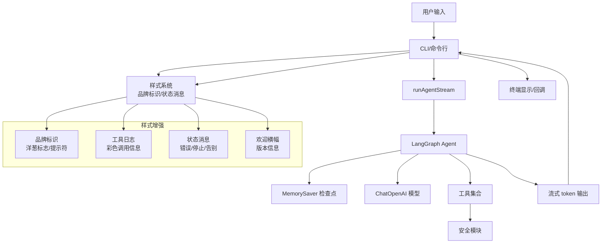
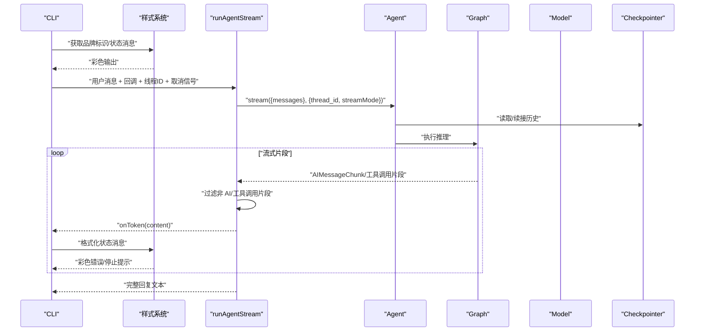
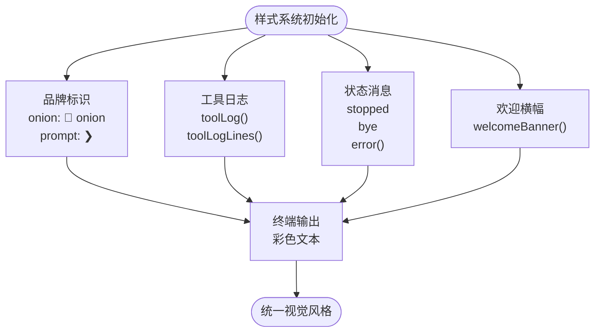
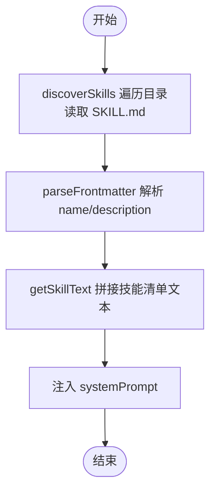
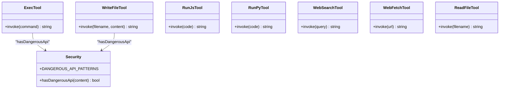
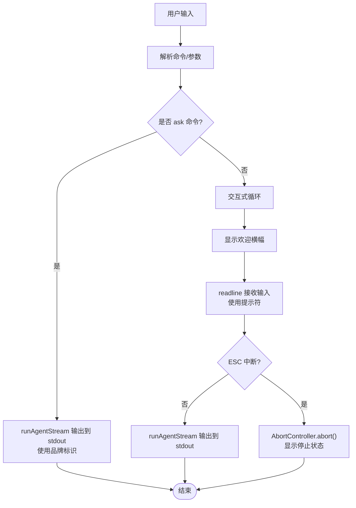
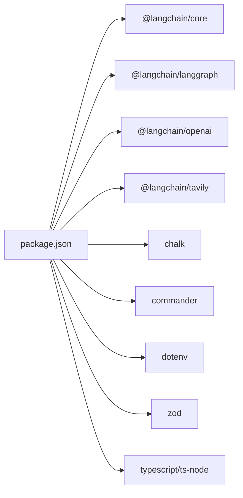

# 核心代理系统

<cite>
**本文引用的文件**
- [src/agent/agent.ts](file://src/agent/agent.ts)
- [src/agent/tools.ts](file://src/agent/tools.ts)
- [src/agent/skills.ts](file://src/agent/skills.ts)
- [src/agent/cli.ts](file://src/agent/cli.ts)
- [src/agent/style.ts](file://src/agent/style.ts)
- [src/agent/tools/search.ts](file://src/agent/tools/search.ts)
- [src/agent/tools/read_file.ts](file://src/agent/tools/read_file.ts)
- [src/agent/tools/write_file.ts](file://src/agent/tools/write_file.ts)
- [src/agent/tools/exec.ts](file://src/agent/tools/exec.ts)
- [src/agent/tools/run_js.ts](file://src/agent/tools/run_js.ts)
- [src/agent/tools/run_py.ts](file://src/agent/tools/run_py.ts)
- [src/agent/tools/web_search.ts](file://src/agent/tools/web_search.ts)
- [src/agent/tools/web_fetch.ts](file://src/agent/tools/web_fetch.ts)
- [src/agent/tools/security.ts](file://src/agent/tools/security.ts)
- [bin/onionCode.js](file://bin/onionCode.js)
- [package.json](file://package.json)
</cite>

## 目录
1. [简介](#简介)
2. [项目结构](#项目结构)
3. [核心组件](#核心组件)
4. [架构总览](#架构总览)
5. [详细组件分析](#详细组件分析)
6. [依赖关系分析](#依赖关系分析)
7. [性能考虑](#性能考虑)
8. [故障排查指南](#故障排查指南)
9. [结论](#结论)
10. [附录](#附录)

## 简介
本文件面向 Onion Code 的核心代理系统，聚焦于基于 LangGraph 的 AI 代理架构、会话管理与流式响应处理。文档解释代理如何集成 LangChain 框架、处理用户输入、管理对话历史、生成响应，并涵盖代理生命周期管理、错误处理策略与性能优化技巧。同时提供与工具系统和技能模块的交互机制说明及使用模式参考。

**更新** 新增样式系统集成，包括品牌标识、工具调用日志格式化、状态消息美化和欢迎横幅设计。

## 项目结构
Onion Code 的核心代理位于 src/agent 目录，主要文件包括：
- 代理定义与流式运行：agent.ts
- 样式系统与视觉增强：style.ts
- 工具聚合导出：tools.ts
- 技能发现与注入：skills.ts
- 命令行入口与交互：cli.ts
- 工具实现：search、read_file、write_file、exec、run_js、run_py、web_search、web_fetch、security
- 构建与二进制入口：package.json、bin/onionCode.js

```mermaid
graph TB
subgraph "代理层"
AG["agent.ts<br/>创建代理/流式运行"]
SK["skills.ts<br/>技能发现与注入"]
end
subgraph "样式系统"
ST["style.ts<br/>品牌标识/工具日志/状态消息"]
end
subgraph "工具层"
T["tools.ts<br/>工具聚合导出"]
S["search.ts"]
RF["read_file.ts"]
WF["write_file.ts"]
EX["exec.ts"]
RJ["run_js.ts"]
RP["run_py.ts"]
WS["web_search.ts"]
WFE["web_fetch.ts"]
SEC["security.ts"]
end
subgraph "CLI"
CLI["cli.ts<br/>命令行交互/错误格式化"]
BIN["bin/onionCode.js<br/>二进制入口"]
end
subgraph "配置与依赖"
PKG["package.json"]
end
CLI --> ST
CLI --> AG
BIN --> CLI
AG --> T
T --> S
T --> RF
T --> WF
T --> EX
T --> RJ
T --> RP
T --> WS
T --> WFE
EX --> SEC
WF --> SEC
AG --> SK
PKG -.-> BIN
```

**图表来源**
- [src/agent/agent.ts:1-129](file://src/agent/agent.ts#L1-L129)
- [src/agent/style.ts:1-50](file://src/agent/style.ts#L1-L50)
- [src/agent/tools.ts:1-10](file://src/agent/tools.ts#L1-L10)
- [src/agent/skills.ts:1-138](file://src/agent/skills.ts#L1-L138)
- [src/agent/cli.ts:1-127](file://src/agent/cli.ts#L1-L127)
- [src/agent/tools/search.ts:1-24](file://src/agent/tools/search.ts#L1-L24)
- [src/agent/tools/read_file.ts:1-41](file://src/agent/tools/read_file.ts#L1-L41)
- [src/agent/tools/write_file.ts:1-55](file://src/agent/tools/write_file.ts#L1-L55)
- [src/agent/tools/exec.ts:1-143](file://src/agent/tools/exec.ts#L1-L143)
- [src/agent/tools/run_js.ts:1-90](file://src/agent/tools/run_js.ts#L1-L90)
- [src/agent/tools/run_py.ts:1-90](file://src/agent/tools/run_py.ts#L1-L90)
- [src/agent/tools/web_search.ts:1-41](file://src/agent/tools/web_search.ts#L1-L41)
- [src/agent/tools/web_fetch.ts:1-83](file://src/agent/tools/web_fetch.ts#L1-L83)
- [src/agent/tools/security.ts:1-27](file://src/agent/tools/security.ts#L1-L27)
- [bin/onionCode.js:1-3](file://bin/onionCode.js#L1-L3)
- [package.json:1-39](file://package.json#L1-L39)

**章节来源**
- [src/agent/agent.ts:1-129](file://src/agent/agent.ts#L1-L129)
- [src/agent/style.ts:1-50](file://src/agent/style.ts#L1-L50)
- [src/agent/tools.ts:1-10](file://src/agent/tools.ts#L1-L10)
- [src/agent/skills.ts:1-138](file://src/agent/skills.ts#L1-L138)
- [src/agent/cli.ts:1-127](file://src/agent/cli.ts#L1-L127)
- [package.json:1-39](file://package.json#L1-L39)

## 核心组件
- 代理创建与配置
  - 使用 LangGraph 的 createAgent 创建代理，绑定模型 ChatOpenAI（支持自定义 base URL、模型名、API Key）与 MemorySaver 检查点（内存持久化）。
  - 注入工具数组，包含本地文件读写、命令执行、JS/Python 代码执行、网页检索与抓取、以及技能加载工具。
  - 系统提示词动态注入：通过 skills.ts 发现并拼接可用技能清单，注入到 systemPrompt 中，使代理具备"技能"能力。
- 流式运行接口
  - runAgentStream 接受用户消息、token 回调函数、会话线程 ID 与可选的 AbortSignal，返回完整回复文本。
  - 通过 agent.stream 以 messages 模式消费流式输出，过滤非 AI 消息与工具调用片段，仅将纯文本 token 传回调用方。
- 样式系统与视觉增强
  - 品牌标识：提供洋葱标志和用户输入提示符的彩色显示。
  - 工具调用日志：生成带颜色的工具调用日志，包含工具名称、调用状态和详细信息。
  - 状态消息：统一的错误、停止和告别消息格式化。
  - 欢迎横幅：版本信息和使用提示的美观展示。
- 技能系统
  - skills.ts 支持发现 skills 目录下的技能清单（解析 SKILL.md 的 YAML frontmatter），并将技能列表注入系统提示词；同时提供按名称加载完整技能内容的能力。
- 工具系统
  - tools.ts 聚合导出各工具，便于统一引入。
  - 各工具均采用 LangChain 工具包装器，声明参数 Schema 并进行安全校验（exec、write_file 引入安全模块）。
- CLI 与错误处理
  - cli.ts 提供 ask 命令与交互式聊天，支持 ESC 中断、格式化错误信息（如内容安全拦截、API Key 无效、额度不足、超时等）。

**章节来源**
- [src/agent/agent.ts:1-129](file://src/agent/agent.ts#L1-L129)
- [src/agent/style.ts:1-50](file://src/agent/style.ts#L1-L50)
- [src/agent/skills.ts:1-138](file://src/agent/skills.ts#L1-L138)
- [src/agent/tools.ts:1-10](file://src/agent/tools.ts#L1-L10)
- [src/agent/cli.ts:1-127](file://src/agent/cli.ts#L1-L127)

## 架构总览
Onion Code 的代理系统围绕 LangGraph 的 AgentGraph 构建，结合 LangChain 的工具调用与内存检查点，形成"思考-行动-观察-反思"的循环。系统通过流式接口将 token 逐步返回给调用方，实现即时响应；通过 thread_id 实现多会话隔离与历史续接。样式系统为整个 CLI 交互提供了统一的视觉风格。



**图表来源**
- [src/agent/agent.ts:67-82](file://src/agent/agent.ts#L67-L82)
- [src/agent/style.ts:4-41](file://src/agent/style.ts#L4-L41)
- [src/agent/tools.ts:1-10](file://src/agent/tools.ts#L1-L10)
- [src/agent/tools/security.ts:1-27](file://src/agent/tools/security.ts#L1-L27)
- [src/agent/cli.ts:47-58](file://src/agent/cli.ts#L47-L58)

## 详细组件分析

### 代理与会话管理
- 代理创建
  - 模型：ChatOpenAI，支持自定义 baseURL、模型名与 API Key；启用 streaming。
  - 工具：search、read_file、write_file、exec、runJs、runPy、webSearch、webFetch、loadSkill。
  - 系统提示：将 skills.ts 发现的技能清单注入 systemPrompt，增强代理对技能的认知。
  - 检查点：MemorySaver 内存持久化，用于保存与续接对话历史。
- 会话线程
  - runAgentStream 通过 configurable.thread_id 控制会话线程，相同 thread_id 自动续接历史。
  - CLI 默认线程 ID 为 user-session-1，支持交互式连续对话。
- 流式响应
  - 通过 agent.stream(messages) 获取流式片段，过滤非 AI 消息与工具调用片段，仅传递 content 文本 token。
  - 支持 AbortSignal，监听 ESC 中断，立即终止流式生成。



**图表来源**
- [src/agent/agent.ts:92-128](file://src/agent/agent.ts#L92-L128)
- [src/agent/cli.ts:79-107](file://src/agent/cli.ts#L79-L107)
- [src/agent/style.ts:34-41](file://src/agent/style.ts#L34-L41)

**章节来源**
- [src/agent/agent.ts:67-82](file://src/agent/agent.ts#L67-L82)
- [src/agent/agent.ts:92-128](file://src/agent/agent.ts#L92-L128)
- [src/agent/cli.ts:79-107](file://src/agent/cli.ts#L79-L107)

### 样式系统与视觉增强
- 品牌标识
  - onion 标识：粗体品红色的🧅 onion 符号，用于 CLI 输出的醒目标识。
  - prompt 提示符：绿色的❯符号，为用户输入提供清晰的视觉引导。
- 工具调用日志
  - toolLog 函数：生成带颜色的工具调用日志，格式为"⚙ [工具名] called："，其中工具名加粗，调用状态半透明显示。
  - toolLogLines 函数：专门用于 run_js/run_py 等代码执行工具，显示代码行数信息。
- 状态消息
  - stopped：黄色的⏹已停止图标，用于 ESC 中断时的优雅提示。
  - bye：品红色的👋 再见！，用于程序退出时的友好告别。
  - error：红色的⚠ 错误消息，提供统一的错误格式化。
- 欢迎横幅
  - welcomeBanner 函数：生成包含项目名称、版本号和使用提示的美观横幅，使用不同颜色区分各个元素。



**图表来源**
- [src/agent/style.ts:4-49](file://src/agent/style.ts#L4-L49)

**章节来源**
- [src/agent/style.ts:1-50](file://src/agent/style.ts#L1-L50)

### 技能系统与注入机制
- 技能发现
  - discoverSkills 遍历 skills 目录，读取每个子目录下的 SKILL.md，解析 YAML frontmatter（name/description），返回 SkillInfo 列表。
  - getSkillsDir 支持开发环境与构建后目录的兼容定位。
- 技能注入
  - getSkillText 将技能清单拼接为系统提示文本，注入到 systemPrompt，告知代理可用技能及其描述。
  - loadSkill 支持按名称加载完整 SKILL.md 内容，供工具调用或后续扩展使用。
- 与代理集成
  - agent.ts 在 systemPrompt 中拼接 getSkillText()，使代理具备"技能"能力；load_skill 工具用于按需加载具体技能内容。



**图表来源**
- [src/agent/skills.ts:53-83](file://src/agent/skills.ts#L53-L83)
- [src/agent/skills.ts:126-137](file://src/agent/skills.ts#L126-L137)
- [src/agent/agent.ts:20-48](file://src/agent/agent.ts#L20-L48)

**章节来源**
- [src/agent/skills.ts:13-28](file://src/agent/skills.ts#L13-L28)
- [src/agent/skills.ts:53-83](file://src/agent/skills.ts#L53-L83)
- [src/agent/skills.ts:126-137](file://src/agent/skills.ts#L126-L137)
- [src/agent/agent.ts:20-48](file://src/agent/agent.ts#L20-L48)

### 工具系统与安全机制
- 工具聚合
  - tools.ts 统一导出各工具，便于 agent.ts 引入。
- 安全模块
  - security.ts 定义危险 API 模式（Node fs、child_process、Python shutil/os/subprocess 等），提供 hasDangerousApi 检测。
- 关键工具
  - exec：危险命令黑名单、eval 注入模式检测、危险 API 检测；限制超时与缓冲区大小。
  - write_file：路径安全检查（防止目录穿越）、危险内容阻断、文件存在性与类型判断。
  - run_js/run_py：Node/python 可用性检查、临时文件执行、危险 API 阻断、超时与缓冲区限制。
  - web_search：Tavily 客户端封装，需要 TAVILY_API_KEY。
  - web_fetch：URL 校验、超时控制、最大响应大小限制、常见网络错误映射。
  - read_file：路径安全检查、文件存在性与类型判断、异常捕获。
  - search：演示工具，返回天气示例。



**图表来源**
- [src/agent/tools/exec.ts:94-142](file://src/agent/tools/exec.ts#L94-L142)
- [src/agent/tools/write_file.ts:7-54](file://src/agent/tools/write_file.ts#L7-L54)
- [src/agent/tools/run_js.ts:22-89](file://src/agent/tools/run_js.ts#L22-L89)
- [src/agent/tools/run_py.ts:22-89](file://src/agent/tools/run_py.ts#L22-L89)
- [src/agent/tools/web_search.ts:16-40](file://src/agent/tools/web_search.ts#L16-L40)
- [src/agent/tools/web_fetch.ts:20-82](file://src/agent/tools/web_fetch.ts#L20-L82)
- [src/agent/tools/read_file.ts:6-40](file://src/agent/tools/read_file.ts#L6-L40)
- [src/agent/tools/security.ts:1-27](file://src/agent/tools/security.ts#L1-L27)

**章节来源**
- [src/agent/tools.ts:1-10](file://src/agent/tools.ts#L1-L10)
- [src/agent/tools/exec.ts:6-142](file://src/agent/tools/exec.ts#L6-L142)
- [src/agent/tools/write_file.ts:1-55](file://src/agent/tools/write_file.ts#L1-L55)
- [src/agent/tools/run_js.ts:1-90](file://src/agent/tools/run_js.ts#L1-L90)
- [src/agent/tools/run_py.ts:1-90](file://src/agent/tools/run_py.ts#L1-L90)
- [src/agent/tools/web_search.ts:1-41](file://src/agent/tools/web_search.ts#L1-L41)
- [src/agent/tools/web_fetch.ts:1-83](file://src/agent/tools/web_fetch.ts#L1-L83)
- [src/agent/tools/read_file.ts:1-41](file://src/agent/tools/read_file.ts#L1-L41)
- [src/agent/tools/security.ts:1-27](file://src/agent/tools/security.ts#L1-L27)

### CLI 与错误处理
- ask 命令
  - 将输入消息交给 runAgentStream，逐 token 输出到标准输出。
  - 使用品牌标识和状态消息提供一致的视觉体验。
- 交互式聊天
  - 使用 readline 循环接收用户输入，ESC 触发 AbortController 中断当前流式生成。
  - 显示欢迎横幅和用户提示符，提供友好的交互界面。
- 错误格式化
  - 针对内容安全拦截、API Key 无效、额度不足、网络超时等常见错误，给出友好提示并退出码 1。
  - 使用样式系统统一错误消息的颜色和格式。



**图表来源**
- [src/agent/cli.ts:47-58](file://src/agent/cli.ts#L47-L58)
- [src/agent/cli.ts:79-126](file://src/agent/cli.ts#L79-L126)
- [src/agent/style.ts:44-49](file://src/agent/style.ts#L44-L49)

**章节来源**
- [src/agent/cli.ts:11-39](file://src/agent/cli.ts#L11-L39)
- [src/agent/cli.ts:47-58](file://src/agent/cli.ts#L47-L58)
- [src/agent/cli.ts:79-126](file://src/agent/cli.ts#L79-L126)

## 依赖关系分析
- LangChain 生态
  - @langchain/core、@langchain/langgraph、@langchain/openai、langchain、@langchain/tavily 提供模型、图编排、工具与搜索能力。
- 运行时与构建
  - package.json 定义二进制入口 onionCode -> bin/onionCode.js -> dist/agent/cli.js。
  - 构建脚本复制 skills 目录至 dist，保证运行时技能资源可用。
  - 新增 chalk 依赖用于 CLI 界面的彩色输出。
- 外部服务
  - OpenAI 兼容服务（DeepSeek）作为 LLM；Tavily 作为网页搜索服务。



**图表来源**
- [package.json:20-30](file://package.json#L20-L30)

**章节来源**
- [package.json:1-39](file://package.json#L1-L39)

## 性能考虑
- 流式输出
  - 启用模型 streaming，runAgentStream 逐 token 回调，降低首 Token 延迟，提升感知速度。
- 资源限制
  - exec、run_js、run_py 设置超时与缓冲区上限，避免长时间阻塞与内存膨胀。
  - web_fetch 限制最大响应大小与超时，防止大体积响应导致内存压力。
- I/O 与安全
  - 文件读写与命令执行均进行路径与内容安全检查，减少无效调用与潜在风险。
- 会话复用
  - MemorySaver 持久化对话历史，减少重复上下文传输，提高长对话效率。
- 样式系统开销
  - 样式系统使用轻量级的 chalk 库，对性能影响微乎其微，提供显著的用户体验改善。

## 故障排查指南
- 内容安全拦截
  - 现象：请求被拦截并提示内容风险。
  - 处理：换一种问法或简化查询，避免触发敏感内容过滤。
  - **更新**：错误消息现在使用样式系统进行格式化，提供更清晰的视觉提示。
- API Key 无效
  - 现象：401 或 Incorrect API key。
  - 处理：检查 .env 中 OPENAI_API_KEY 是否正确配置。
- 额度不足
  - 现象：429 insufficient_quota。
  - 处理：检查账户余额与配额状态。
- 网络超时
  - 现象：ETIMEDOUT 或 timeout。
  - 处理：检查网络连通性，稍后重试。
- 文件/路径错误
  - 现象：文件不存在、目录类型错误、越界访问。
  - 处理：确认文件名与相对路径，避免 ../ 等越界。
- 危险操作阻断
  - 现象：exec/write_file/rum_js/run_py 返回危险操作阻断。
  - 处理：移除危险 API 调用或命令，改用安全替代方案。
- 网页抓取失败
  - 现象：HTTP 错误、DNS 失败、连接被拒、响应过大。
  - 处理：检查 URL 协议与可达性，减小目标页面复杂度。
- 样式显示问题
  - 现象：CLI 输出缺少颜色或格式异常。
  - 处理：确保终端支持 ANSI 颜色，检查 chalk 依赖安装。

**章节来源**
- [src/agent/cli.ts:11-39](file://src/agent/cli.ts#L11-L39)
- [src/agent/tools/exec.ts:94-142](file://src/agent/tools/exec.ts#L94-L142)
- [src/agent/tools/write_file.ts:7-54](file://src/agent/tools/write_file.ts#L7-L54)
- [src/agent/tools/run_js.ts:22-89](file://src/agent/tools/run_js.ts#L22-L89)
- [src/agent/tools/run_py.ts:22-89](file://src/agent/tools/run_py.ts#L22-L89)
- [src/agent/tools/web_fetch.ts:20-82](file://src/agent/tools/web_fetch.ts#L20-L82)

## 结论
Onion Code 的核心代理系统以 LangGraph 为基础，结合 LangChain 工具链与内存检查点，实现了具备技能认知与工具调用能力的智能体。通过流式响应与会话线程管理，系统在交互体验与性能之间取得平衡。内置多层次安全防护与完善的错误处理，保障了运行稳定性与安全性。

**更新** 新集成的样式系统显著提升了 CLI 的视觉体验，包括品牌标识、工具调用日志格式化、状态消息美化和欢迎横幅设计。这些视觉增强不仅改善了用户体验，还提供了更清晰的信息层次和更好的可读性。样式系统与现有功能无缝集成，在不增加性能负担的情况下提供了专业的外观。

未来可在以下方向持续优化：更细粒度的会话切分、缓存策略、并发流控与可观测性增强，以及进一步丰富样式系统的视觉效果。

## 附录
- 使用模式参考
  - 初始化与配置：参考代理创建与系统提示注入逻辑。
  - 流式运行：参考 runAgentStream 的调用方式与中断处理。
  - 样式应用：参考 CLI 中样式系统的集成方式，包括品牌标识、状态消息和错误格式化。
  - 技能集成：参考 skills.ts 的发现与注入流程。
  - 工具扩展：新增工具时遵循 LangChain 工具包装器规范与安全校验。
- 二进制入口
  - 通过 onionCode 命令启动 CLI，底层指向 dist/agent/cli.js。

**章节来源**
- [src/agent/agent.ts:67-82](file://src/agent/agent.ts#L67-L82)
- [src/agent/agent.ts:92-128](file://src/agent/agent.ts#L92-L128)
- [src/agent/style.ts:16-41](file://src/agent/style.ts#L16-L41)
- [src/agent/skills.ts:126-137](file://src/agent/skills.ts#L126-L137)
- [bin/onionCode.js:1-3](file://bin/onionCode.js#L1-L3)
- [package.json:11-16](file://package.json#L11-L16)