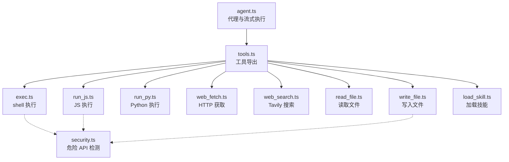
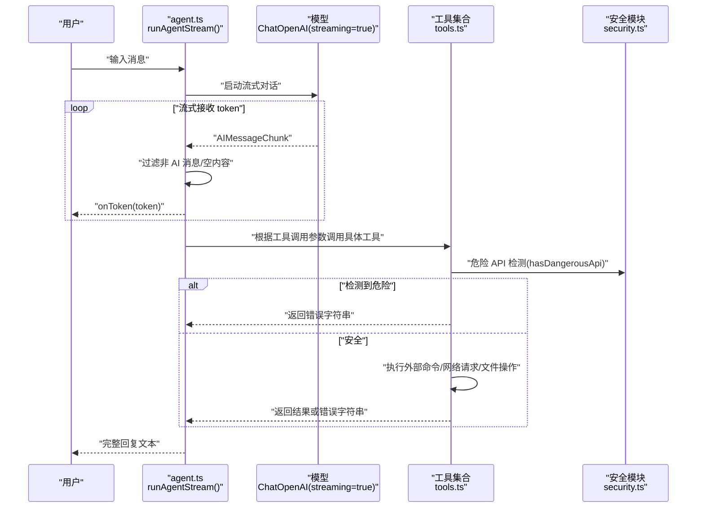
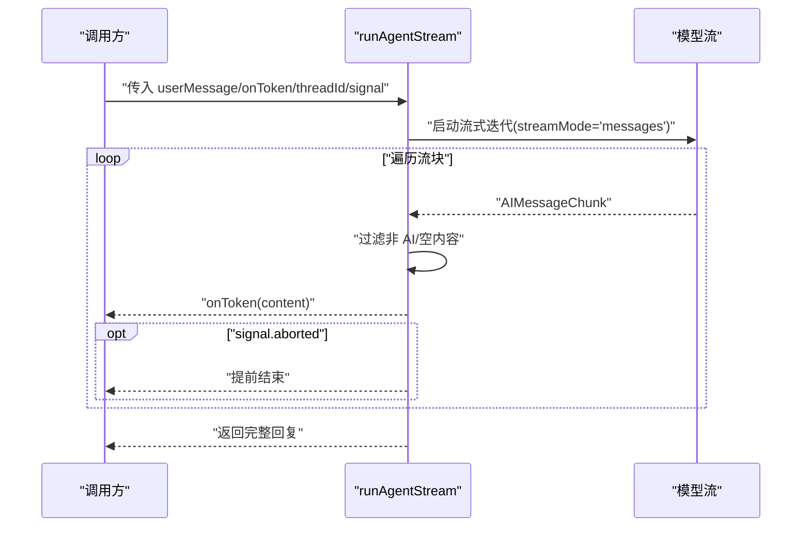
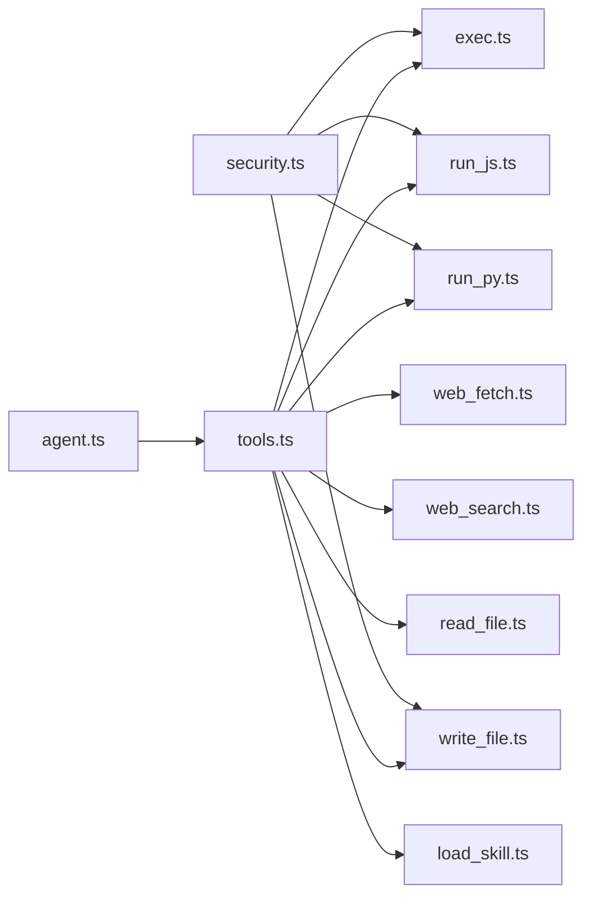

# 错误处理策略

<cite>
**本文引用的文件**
- [src/agent/tools/exec.ts](file://src/agent/tools/exec.ts)
- [src/agent/tools/run_js.ts](file://src/agent/tools/run_js.ts)
- [src/agent/tools/run_py.ts](file://src/agent/tools/run_py.ts)
- [src/agent/tools/web_fetch.ts](file://src/agent/tools/web_fetch.ts)
- [src/agent/tools/web_search.ts](file://src/agent/tools/web_search.ts)
- [src/agent/tools/read_file.ts](file://src/agent/tools/read_file.ts)
- [src/agent/tools/write_file.ts](file://src/agent/tools/write_file.ts)
- [src/agent/tools/load_skill.ts](file://src/agent/tools/load_skill.ts)
- [src/agent/tools/security.ts](file://src/agent/tools/security.ts)
- [src/agent/agent.ts](file://src/agent/agent.ts)
- [src/agent/tools.ts](file://src/agent/tools.ts)
- [src/agent/tools/exec.test.ts](file://src/agent/tools/exec.test.ts)
- [src/agent/tools/run_js.test.ts](file://src/agent/tools/run_js.test.ts)
- [src/agent/tools/run_py.test.ts](file://src/agent/tools/run_py.test.ts)
- [src/agent/tools/web_fetch.test.ts](file://src/agent/tools/web_fetch.test.ts)
- [src/agent/tools/web_search.test.ts](file://src/agent/tools/web_search.test.ts)
- [src/agent/tools/read_file.test.ts](file://src/agent/tools/read_file.test.ts)
</cite>

## 目录
1. [简介](#简介)
2. [项目结构](#项目结构)
3. [核心组件](#核心组件)
4. [架构总览](#架构总览)
5. [详细组件分析](#详细组件分析)
6. [依赖关系分析](#依赖关系分析)
7. [性能考量](#性能考量)
8. [故障排查指南](#故障排查指南)
9. [结论](#结论)
10. [附录](#附录)

## 简介
本文件系统性梳理 Onion Code 在代理执行过程中实现的错误处理策略，重点覆盖以下方面：
- 异常类型与错误传播机制
- 工具调用失败、模型响应异常与流式处理中断的处理方式
- 如何区分可恢复错误与致命错误、实施重试机制与提供用户友好的错误信息
- 错误日志记录、调试支持与监控指标建议
- 具体代码示例路径，展示错误捕获、处理与报告的最佳实践

## 项目结构
Onion Code 的代理与工具位于 src/agent 目录下，核心包括：
- 代理入口与流式执行：agent.ts
- 工具集合导出：tools.ts
- 各类工具实现：exec.ts、run_js.ts、run_py.ts、web_fetch.ts、web_search.ts、read_file.ts、write_file.ts、load_skill.ts
- 安全扫描共享模块：security.ts

图表来源
- [src/agent/agent.ts:1-98](file://src/agent/agent.ts#L1-L98)
- [src/agent/tools.ts:1-10](file://src/agent/tools.ts#L1-L10)
- [src/agent/tools/exec.ts:1-143](file://src/agent/tools/exec.ts#L1-L143)
- [src/agent/tools/run_js.ts:1-90](file://src/agent/tools/run_js.ts#L1-L90)
- [src/agent/tools/run_py.ts:1-90](file://src/agent/tools/run_py.ts#L1-L90)
- [src/agent/tools/web_fetch.ts:1-83](file://src/agent/tools/web_fetch.ts#L1-L83)
- [src/agent/tools/web_search.ts:1-41](file://src/agent/tools/web_search.ts#L1-L41)
- [src/agent/tools/read_file.ts:1-41](file://src/agent/tools/read_file.ts#L1-L41)
- [src/agent/tools/write_file.ts:1-55](file://src/agent/tools/write_file.ts#L1-L55)
- [src/agent/tools/load_skill.ts:1-34](file://src/agent/tools/load_skill.ts#L1-L34)
- [src/agent/tools/security.ts:1-27](file://src/agent/tools/security.ts#L1-L27)

章节来源
- [src/agent/agent.ts:1-98](file://src/agent/agent.ts#L1-L98)
- [src/agent/tools.ts:1-10](file://src/agent/tools.ts#L1-L10)

## 核心组件
- 代理与流式执行：在 agent.ts 中创建 ChatOpenAI 模型实例并启用 streaming，通过 runAgentStream 将模型输出以 token 流形式回调给调用方；对 AbortSignal 提供中断支持。
- 工具集合：tools.ts 统一导出所有工具，便于 agent.ts 注入。
- 安全扫描：security.ts 提供危险 API 模式匹配，供多个工具共享使用。

章节来源
- [src/agent/agent.ts:25-51](file://src/agent/agent.ts#L25-L51)
- [src/agent/tools.ts:1-10](file://src/agent/tools.ts#L1-L10)
- [src/agent/tools/security.ts:1-27](file://src/agent/tools/security.ts#L1-L27)

## 架构总览
代理执行流程（含错误处理）概览：

图表来源
- [src/agent/agent.ts:61-97](file://src/agent/agent.ts#L61-L97)
- [src/agent/tools.ts:1-10](file://src/agent/tools.ts#L1-L10)
- [src/agent/tools/security.ts:24-26](file://src/agent/tools/security.ts#L24-L26)

## 详细组件分析

### 工具调用失败处理
- exec 工具
  - 安全检查：危险命令名黑名单、eval 风险模式、危险 API 检测
  - 执行限制：超时 30 秒、最大缓冲 1MB
  - 错误映射：stderr/stdout 优先、超时 ETIMEDOUT、其他错误消息
  - 返回格式：统一返回字符串，便于上游消费
  - 参考路径：[src/agent/tools/exec.ts:94-143](file://src/agent/tools/exec.ts#L94-L143)，测试覆盖：[src/agent/tools/exec.test.ts:1-150](file://src/agent/tools/exec.test.ts#L1-L150)

- run_js 工具
  - 环境前置：检测 Node.js 可用性
  - 安全检查：危险 API 检测
  - 执行策略：写入临时文件后执行，避免命令行转义问题
  - 执行限制：超时 15 秒、最大缓冲 512KB
  - 错误映射：stderr/stdout/超时/ECONNRESET 等网络错误
  - 清理策略：finally 中删除临时文件
  - 参考路径：[src/agent/tools/run_js.ts:22-90](file://src/agent/tools/run_js.ts#L22-L90)，测试覆盖：[src/agent/tools/run_js.test.ts:1-85](file://src/agent/tools/run_js.test.ts#L1-L85)

- run_py 工具
  - 环境前置：检测 python3 可用性
  - 安全检查：危险 API 检测
  - 执行策略：写入临时文件后执行
  - 执行限制：超时 15 秒、最大缓冲 512KB
  - 错误映射：stderr/stdout/超时
  - 清理策略：finally 中删除临时文件
  - 参考路径：[src/agent/tools/run_py.ts:22-90](file://src/agent/tools/run_py.ts#L22-L90)，测试覆盖：[src/agent/tools/run_py.test.ts:1-85](file://src/agent/tools/run_py.test.ts#L1-L85)

- read_file 工具
  - 安全检查：路径不得逃逸当前目录
  - 错误映射：ENOENT、目录访问、其他读取错误
  - 参考路径：[src/agent/tools/read_file.ts:6-41](file://src/agent/tools/read_file.ts#L6-L41)，测试覆盖：[src/agent/tools/read_file.test.ts:1-47](file://src/agent/tools/read_file.test.ts#L1-L47)

- write_file 工具
  - 安全检查：路径不得逃逸当前目录、内容危险 API 检测
  - 错误映射：stat 检查异常、写入异常
  - 参考路径：[src/agent/tools/write_file.ts:7-55](file://src/agent/tools/write_file.ts#L7-L55)

- load_skill 工具
  - 功能：按名称发现并加载技能内容
  - 错误映射：未找到技能、加载失败
  - 参考路径：[src/agent/tools/load_skill.ts:5-34](file://src/agent/tools/load_skill.ts#L5-L34)

- web_fetch 工具
  - URL 校验：仅允许 http/https
  - 超时控制：AbortController 控制 15 秒
  - 错误映射：HTTP 非 OK、响应过大、AbortError、DNS/ECONNREFUSED/ECONNRESET 等
  - 参考路径：[src/agent/tools/web_fetch.ts:20-83](file://src/agent/tools/web_fetch.ts#L20-L83)，测试覆盖：[src/agent/tools/web_fetch.test.ts:1-145](file://src/agent/tools/web_fetch.test.ts#L1-L145)

- web_search 工具
  - 初始化：TavilySearch 客户端构造可能因缺少 API Key 抛错
  - 错误映射：客户端构造异常、invoke 调用异常
  - 参考路径：[src/agent/tools/web_search.ts:16-41](file://src/agent/tools/web_search.ts#L16-L41)，测试覆盖：[src/agent/tools/web_search.test.ts:1-95](file://src/agent/tools/web_search.test.ts#L1-L95)

章节来源
- [src/agent/tools/exec.ts:94-143](file://src/agent/tools/exec.ts#L94-L143)
- [src/agent/tools/run_js.ts:22-90](file://src/agent/tools/run_js.ts#L22-L90)
- [src/agent/tools/run_py.ts:22-90](file://src/agent/tools/run_py.ts#L22-L90)
- [src/agent/tools/read_file.ts:6-41](file://src/agent/tools/read_file.ts#L6-L41)
- [src/agent/tools/write_file.ts:7-55](file://src/agent/tools/write_file.ts#L7-L55)
- [src/agent/tools/load_skill.ts:5-34](file://src/agent/tools/load_skill.ts#L5-L34)
- [src/agent/tools/web_fetch.ts:20-83](file://src/agent/tools/web_fetch.ts#L20-L83)
- [src/agent/tools/web_search.ts:16-41](file://src/agent/tools/web_search.ts#L16-L41)

### 模型响应异常与流式处理中断
- 流式处理：runAgentStream 使用模型的 streaming 接口，逐个 token 回调 onToken，并在循环中跳过非 AI 消息，最终聚合完整回复文本。
- 中断支持：若传入 AbortSignal 并触发中止，则提前退出循环。
- 错误传播：模型侧异常通常在流式迭代中以异常形式抛出，调用方可基于此进行重试或降级处理。
- 参考路径：[src/agent/agent.ts:61-97](file://src/agent/agent.ts#L61-L97)

图表来源
- [src/agent/agent.ts:61-97](file://src/agent/agent.ts#L61-L97)

章节来源
- [src/agent/agent.ts:61-97](file://src/agent/agent.ts#L61-L97)

### 错误分类与恢复策略
- 可恢复错误
  - 网络/超时：web_fetch 的 AbortError、DNS/ECONNREFUSED/ECONNRESET；web_search 的网络异常；exec/run_js/run_py 的 ETIMEDOUT
  - 行为建议：对可重试的网络错误进行指数退避重试，设置最大重试次数与总超时上限
  - 参考路径：[src/agent/tools/web_fetch.ts:56-72](file://src/agent/tools/web_fetch.ts#L56-L72)，[src/agent/tools/exec.ts:120-132](file://src/agent/tools/exec.ts#L120-L132)，[src/agent/tools/run_js.ts:55-75](file://src/agent/tools/run_js.ts#L55-L75)，[src/agent/tools/run_py.ts:55-75](file://src/agent/tools/run_py.ts#L55-L75)，[src/agent/tools/web_search.ts:28-30](file://src/agent/tools/web_search.ts#L28-L30)

- 致命错误
  - 安全拦截：exec/run_js/run_py 的危险命令/eval 风险；write_file 的内容危险 API；read_file 的路径逃逸
  - 环境缺失：Node.js/python3 不可用；Tavily API Key 缺失
  - 行为建议：直接返回用户可理解的提示，不进行重试；引导用户修正输入或环境配置
  - 参考路径：[src/agent/tools/exec.ts:94-109](file://src/agent/tools/exec.ts#L94-L109)，[src/agent/tools/run_js.ts:28-35](file://src/agent/tools/run_js.ts#L28-L35)，[src/agent/tools/run_py.ts:28-35](file://src/agent/tools/run_py.ts#L28-L35)，[src/agent/tools/write_file.ts:12-33](file://src/agent/tools/write_file.ts#L12-L33)，[src/agent/tools/read_file.ts:11-15](file://src/agent/tools/read_file.ts#L11-L15)，[src/agent/tools/web_search.ts:21-23](file://src/agent/tools/web_search.ts#L21-L23)

- 用户友好错误信息
  - 统一以“Error: …”开头，包含明确原因与上下文（如超时秒数、URL、文件名等）
  - 对于安全拦截，给出阻断原因（eval 风险、危险 API 等）
  - 参考路径：多处工具均采用该风格，如 [src/agent/tools/web_fetch.ts:45-69](file://src/agent/tools/web_fetch.ts#L45-L69)，[src/agent/tools/exec.ts:105-131](file://src/agent/tools/exec.ts#L105-L131)

### 错误日志记录、调试支持与监控指标
- 日志记录
  - 工具内部使用 console.log 记录调用信息（如命令、URL、文件名等），便于快速定位问题
  - 参考路径：[src/agent/tools/exec.ts:118-119](file://src/agent/tools/exec.ts#L118-L119)，[src/agent/tools/run_js.ts:53-54](file://src/agent/tools/run_js.ts#L53-L54)，[src/agent/tools/run_py.ts:53-54](file://src/agent/tools/run_py.ts#L53-L54)，[src/agent/tools/web_fetch.ts:34-35](file://src/agent/tools/web_fetch.ts#L34-L35)，[src/agent/tools/read_file.ts:24-25](file://src/agent/tools/read_file.ts#L24-L25)，[src/agent/tools/load_skill.ts:16-16](file://src/agent/tools/load_skill.ts#L16-L16)

- 调试支持
  - 测试用例覆盖典型错误场景（语法错误、运行时异常、安全拦截、超时、DNS 失败等），便于回归与定位
  - 参考路径：[src/agent/tools/exec.test.ts:1-150](file://src/agent/tools/exec.test.ts#L1-L150)，[src/agent/tools/run_js.test.ts:1-85](file://src/agent/tools/run_js.test.ts#L1-L85)，[src/agent/tools/run_py.test.ts:1-85](file://src/agent/tools/run_py.test.ts#L1-L85)，[src/agent/tools/web_fetch.test.ts:1-145](file://src/agent/tools/web_fetch.test.ts#L1-L145)，[src/agent/tools/web_search.test.ts:1-95](file://src/agent/tools/web_search.test.ts#L1-L95)，[src/agent/tools/read_file.test.ts:1-47](file://src/agent/tools/read_file.test.ts#L1-L47)

- 监控指标建议
  - 工具成功率、平均耗时、错误分布（超时/网络/安全拦截/环境缺失）、流式中断率
  - 建议在工具包装层增加计数器与直方图，结合日志与 APM 平台进行可视化

### 重试机制与最佳实践
- 适用场景：网络超时、DNS 解析失败、连接被拒等瞬时性错误
- 实施要点：
  - 指数退避（如 1s, 2s, 4s…，上限 15–30s）
  - 最大重试次数（如 2–3 次）
  - 区分可重试与不可重试错误，避免对安全拦截与环境缺失进行无意义重试
  - 在调用方层面对 runAgentStream 的 AbortSignal 提供用户中断能力
- 参考路径：[src/agent/tools/web_fetch.ts:30-72](file://src/agent/tools/web_fetch.ts#L30-L72)，[src/agent/tools/exec.ts:120-132](file://src/agent/tools/exec.ts#L120-L132)，[src/agent/agent.ts:61-97](file://src/agent/agent.ts#L61-L97)

## 依赖关系分析
- 工具与安全模块
  - exec/run_js/run_py/write_file 共享危险 API 检测逻辑
- 代理与工具
  - agent.ts 通过 tools.ts 导入全部工具，形成统一的工具集
- 外部依赖
  - OpenAI 模型（streaming）
  - TavilySearch（可选，需 API Key）

图表来源
- [src/agent/tools/security.ts:1-27](file://src/agent/tools/security.ts#L1-L27)
- [src/agent/tools.ts:1-10](file://src/agent/tools.ts#L1-L10)
- [src/agent/agent.ts:1-98](file://src/agent/agent.ts#L1-L98)

章节来源
- [src/agent/tools/security.ts:1-27](file://src/agent/tools/security.ts#L1-L27)
- [src/agent/tools.ts:1-10](file://src/agent/tools.ts#L1-L10)
- [src/agent/agent.ts:1-98](file://src/agent/agent.ts#L1-L98)

## 性能考量
- 超时与缓冲限制：各工具对执行设置了合理超时与输出缓冲上限，防止资源耗尽
- 流式输出：模型侧 streaming 降低首 Token 延迟，提升交互体验
- 临时文件清理：JS/Python 执行工具在 finally 中清理临时文件，避免磁盘占用
- 建议：对外部网络请求增加连接池与并发限制，对频繁调用的工具引入本地缓存

## 故障排查指南
- 安全拦截
  - 症状：返回“危险操作/eval 风险/禁止的 API”等提示
  - 排查：检查命令/代码是否包含危险 API 模式；必要时改用安全替代方案
  - 参考路径：[src/agent/tools/exec.ts:100-109](file://src/agent/tools/exec.ts#L100-L109)，[src/agent/tools/security.ts:24-26](file://src/agent/tools/security.ts#L24-L26)

- 环境缺失
  - 症状：Node.js/python3 不可用；Tavily API Key 未配置
  - 排查：确认 PATH 与版本；设置环境变量
  - 参考路径：[src/agent/tools/run_js.ts:33-35](file://src/agent/tools/run_js.ts#L33-L35)，[src/agent/tools/run_py.ts:33-35](file://src/agent/tools/run_py.ts#L33-L35)，[src/agent/tools/web_search.ts:21-23](file://src/agent/tools/web_search.ts#L21-L23)

- 网络与超时
  - 症状：HTTP 非 OK、超时、DNS 失败、连接被拒
  - 排查：检查 URL、网络连通性、防火墙；必要时开启重试
  - 参考路径：[src/agent/tools/web_fetch.ts:45-69](file://src/agent/tools/web_fetch.ts#L45-L69)，[src/agent/tools/web_fetch.test.ts:78-138](file://src/agent/tools/web_fetch.test.ts#L78-L138)

- 文件访问
  - 症状：路径逃逸、目录访问、文件不存在
  - 排查：确认相对路径与当前工作目录；避免使用 “..”
  - 参考路径：[src/agent/tools/read_file.ts:11-15](file://src/agent/tools/read_file.ts#L11-L15)，[src/agent/tools/read_file.test.ts:22-41](file://src/agent/tools/read_file.test.ts#L22-L41)

- 代码执行
  - 症状：语法错误、运行时异常、超时
  - 排查：精简最小可复现样例；检查第三方库可用性
  - 参考路径：[src/agent/tools/run_js.test.ts:34-46](file://src/agent/tools/run_js.test.ts#L34-L46)，[src/agent/tools/run_py.test.ts:34-46](file://src/agent/tools/run_py.test.ts#L34-L46)

章节来源
- [src/agent/tools/exec.ts:100-109](file://src/agent/tools/exec.ts#L100-L109)
- [src/agent/tools/security.ts:24-26](file://src/agent/tools/security.ts#L24-L26)
- [src/agent/tools/run_js.ts:33-35](file://src/agent/tools/run_js.ts#L33-L35)
- [src/agent/tools/run_py.ts:33-35](file://src/agent/tools/run_py.ts#L33-L35)
- [src/agent/tools/web_search.ts:21-23](file://src/agent/tools/web_search.ts#L21-L23)
- [src/agent/tools/web_fetch.ts:45-69](file://src/agent/tools/web_fetch.ts#L45-L69)
- [src/agent/tools/read_file.ts:11-15](file://src/agent/tools/read_file.ts#L11-L15)
- [src/agent/tools/exec.test.ts:1-150](file://src/agent/tools/exec.test.ts#L1-L150)
- [src/agent/tools/run_js.test.ts:1-85](file://src/agent/tools/run_js.test.ts#L1-L85)
- [src/agent/tools/run_py.test.ts:1-85](file://src/agent/tools/run_py.test.ts#L1-L85)
- [src/agent/tools/web_fetch.test.ts:1-145](file://src/agent/tools/web_fetch.test.ts#L1-L145)
- [src/agent/tools/read_file.test.ts:1-47](file://src/agent/tools/read_file.test.ts#L1-L47)

## 结论
Onion Code 的错误处理策略围绕“安全前置、明确报错、可控超时、流式中断”展开，既保证了代理执行的安全性与稳定性，又提供了清晰的用户反馈与可观测性基础。针对不同类型的错误，建议在调用方层面对可恢复错误实施指数退避重试，并持续完善监控与告警体系，以进一步提升系统的鲁棒性与用户体验。

## 附录
- 最佳实践清单
  - 对外部调用统一设置超时与最大重试次数
  - 对安全拦截与环境缺失错误，直接返回用户可理解的提示
  - 在工具包装层增加日志与指标埋点
  - 对流式处理提供 AbortSignal 支持，允许用户中断
  - 使用测试用例覆盖常见错误分支，保障回归质量