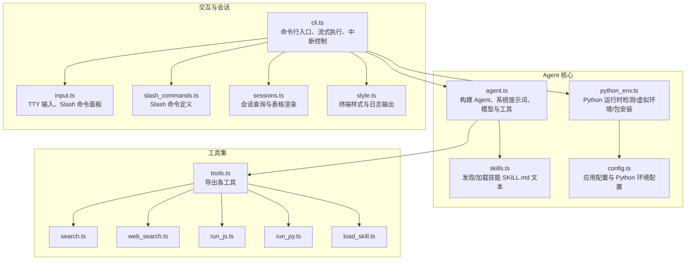
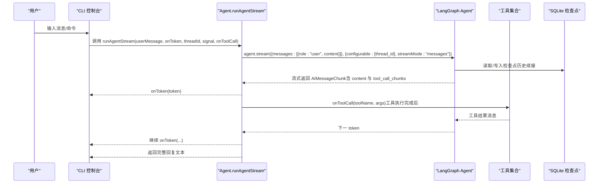
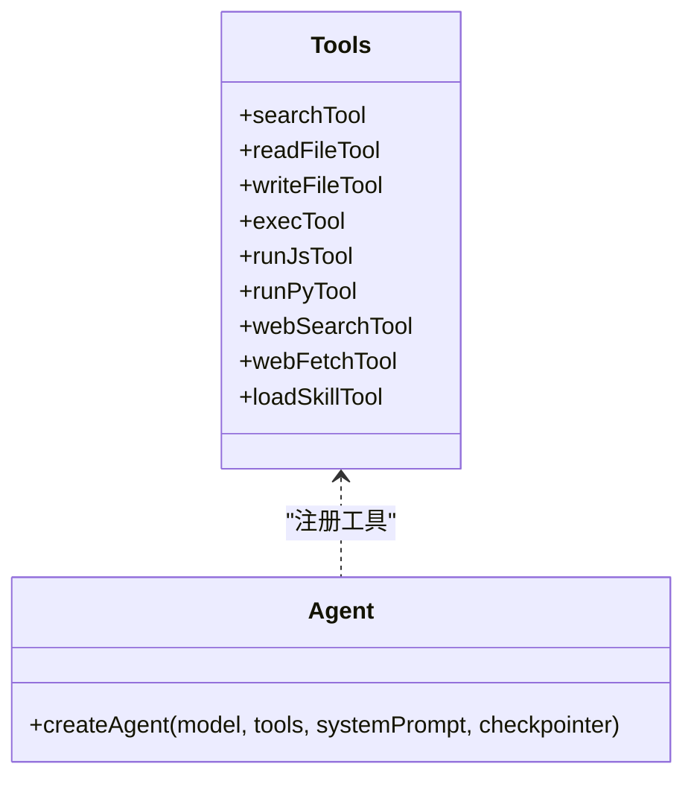
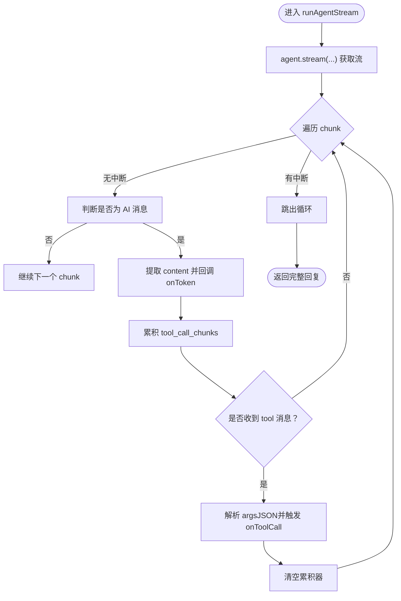
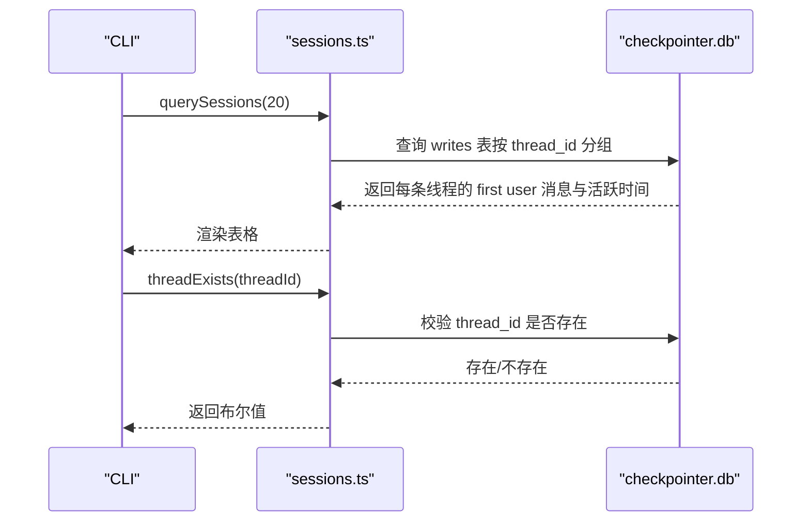
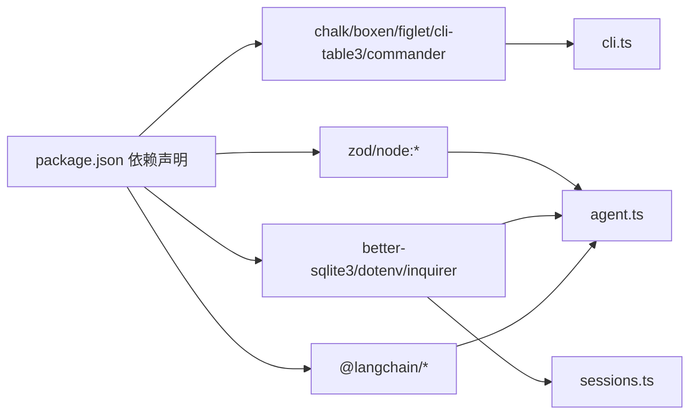

# Agent 核心系统

<cite>
**本文引用的文件**
- [agent.ts](file://src/agent/agent.ts)
- [cli.ts](file://src/agent/cli.ts)
- [input.ts](file://src/agent/input.ts)
- [slash_commands.ts](file://src/agent/slash_commands.ts)
- [sessions.ts](file://src/agent/sessions.ts)
- [config.ts](file://src/agent/config.ts)
- [python_env.ts](file://src/agent/python_env.ts)
- [style.ts](file://src/agent/style.ts)
- [tools.ts](file://src/agent/tools.ts)
- [search.ts](file://src/agent/tools/search.ts)
- [web_search.ts](file://src/agent/tools/web_search.ts)
- [run_js.ts](file://src/agent/tools/run_js.ts)
- [run_py.ts](file://src/agent/tools/run_py.ts)
- [load_skill.ts](file://src/agent/tools/load_skill.ts)
- [skills.ts](file://src/agent/skills.ts)
- [package.json](file://package.json)
</cite>

## 更新摘要
**变更内容**
- 增强会话管理系统：支持 UUIDv7 时间戳提取、相对时间格式化和更智能的会话查询
- 改进技能系统：优化技能发现算法、增强技能加载机制和更好的错误处理
- 优化 Slash 命令系统：增强命令匹配、补全和交互体验
- 改进输入系统：优化 TTY 输入处理、增强命令面板和状态显示
- 增强配置管理：改进 Python 环境配置和镜像源管理

## 目录
1. [引言](#引言)
2. [项目结构](#项目结构)
3. [核心组件](#核心组件)
4. [架构总览](#架构总览)
5. [详细组件分析](#详细组件分析)
6. [依赖关系分析](#依赖关系分析)
7. [性能考量](#性能考量)
8. [故障排查指南](#故障排查指南)
9. [结论](#结论)
10. [附录](#附录)

## 引言
本文件面向开发者与高级用户，系统性阐述 Onion Code 的 Agent 核心系统。重点覆盖以下方面：
- 基于 LangChain 的 Agent 创建流程：系统提示词构建、模型配置与工具注册机制
- 流式响应实现原理：消息流处理、token 回调机制与中断控制
- 会话管理策略：thread_id 管理、历史记录续接与状态持久化
- 使用 runAgentStream 的实践：错误处理与性能优化建议
- Agent 扩展与定制：新增工具、技能与模型配置的最佳实践

## 项目结构
Agent 子系统围绕"提示词构建 → 模型与检查点 → 工具注册 → 流式执行 → 会话管理"展开，CLI 提供交互入口与命令面板。

**图表来源**
- [agent.ts:1-181](file://src/agent/agent.ts#L1-L181)
- [tools.ts:1-10](file://src/agent/tools.ts#L1-L10)
- [cli.ts:1-245](file://src/agent/cli.ts#L1-L245)
- [input.ts:1-330](file://src/agent/input.ts#L1-L330)
- [slash_commands.ts:1-92](file://src/agent/slash_commands.ts#L1-L92)
- [sessions.ts:1-172](file://src/agent/sessions.ts#L1-L172)
- [config.ts:1-146](file://src/agent/config.ts#L1-L146)
- [python_env.ts:1-223](file://src/agent/python_env.ts#L1-L223)
- [style.ts:1-217](file://src/agent/style.ts#L1-L217)

**章节来源**
- [agent.ts:1-181](file://src/agent/agent.ts#L1-L181)
- [cli.ts:1-245](file://src/agent/cli.ts#L1-L245)
- [input.ts:1-330](file://src/agent/input.ts#L1-L330)
- [slash_commands.ts:1-92](file://src/agent/slash_commands.ts#L1-L92)
- [sessions.ts:1-172](file://src/agent/sessions.ts#L1-L172)
- [config.ts:1-146](file://src/agent/config.ts#L1-L146)
- [python_env.ts:1-223](file://src/agent/python_env.ts#L1-L223)
- [style.ts:1-217](file://src/agent/style.ts#L1-L217)

## 核心组件
- Agent 构建与系统提示词
  - 系统提示词通过拼接"人物设定 + 技能清单"，确保 Agent 明确自身角色与能力边界，并以中文默认输出。
  - 模型采用流式配置，便于实时 token 回调；默认模型与 API Base 可通过环境变量覆盖。
  - 使用 SQLite 检查点（checkpointer）实现状态持久化与历史续接。
- 工具注册
  - 注册搜索、文件读写、命令执行、JS/Python 代码运行、网页检索与技能加载等工具，统一通过工具集合导出。
- 流式执行与中断
  - runAgentStream 支持按 token 回调、工具调用回调、AbortSignal 中断与递归深度限制。
- 会话管理
  - 通过 thread_id 维持多轮对话历史；CLI 提供新建会话、切换会话、查看历史等命令。

**章节来源**
- [agent.ts:24-95](file://src/agent/agent.ts#L24-L95)
- [agent.ts:106-181](file://src/agent/agent.ts#L106-L181)
- [tools.ts:1-10](file://src/agent/tools.ts#L1-L10)
- [cli.ts:80-224](file://src/agent/cli.ts#L80-L224)

## 架构总览
Agent 的运行链路如下：CLI 接收用户输入，构造消息并调用 Agent 流式执行；Agent 在 LangGraph 中按消息流迭代，遇到工具调用时触发工具执行；工具执行结果回写至图中，Agent 继续生成回复；所有状态通过 SQLite 检查点持久化，支持 thread_id 续接。

**图表来源**
- [agent.ts:106-181](file://src/agent/agent.ts#L106-L181)
- [cli.ts:122-178](file://src/agent/cli.ts#L122-L178)

**章节来源**
- [agent.ts:106-181](file://src/agent/agent.ts#L106-L181)
- [cli.ts:122-178](file://src/agent/cli.ts#L122-L178)

## 详细组件分析

### Agent 构建与系统提示词
- 系统提示词由"人物设定 + 技能清单"组成，强调简洁、幽默与可靠，且默认中文输出。
- 技能清单通过扫描 skills 目录下的 SKILL.md 提取 name/description 并注入提示词，指导 Agent 在合适时机调用 load_skill 工具加载完整技能内容。
- 模型配置启用 streaming，便于实时 token 回调；同时设置递归上限防止无限循环。
- 检查点使用 SQLite，数据目录位于 .data/checkpointer.db，支持跨进程/重启续接。

**章节来源**
- [agent.ts:24-57](file://src/agent/agent.ts#L24-L57)
- [agent.ts:59-77](file://src/agent/agent.ts#L59-L77)
- [agent.ts:80-95](file://src/agent/agent.ts#L80-L95)
- [skills.ts:127-141](file://src/agent/skills.ts#L127-L141)

### 工具注册与扩展
- 工具集合集中导出，便于 Agent 创建时统一注册。
- 工具类型与约束通过 Zod schema 定义，确保 LangGraph 调用时参数校验。
- 新增工具建议遵循现有模式：定义 tool(..., { name, description, schema })，并在 tools.ts 导出。

**图表来源**
- [tools.ts:1-10](file://src/agent/tools.ts#L1-L10)
- [agent.ts:80-95](file://src/agent/agent.ts#L80-L95)

**章节来源**
- [tools.ts:1-10](file://src/agent/tools.ts#L1-L10)
- [search.ts:4-21](file://src/agent/tools/search.ts#L4-L21)
- [web_search.ts:16-38](file://src/agent/tools/web_search.ts#L16-L38)
- [run_js.ts:22-88](file://src/agent/tools/run_js.ts#L22-L88)
- [run_py.ts:11-93](file://src/agent/tools/run_py.ts#L11-L93)
- [load_skill.ts:5-31](file://src/agent/tools/load_skill.ts#L5-L31)

### 流式响应与中断控制
- runAgentStream 以 streamMode="messages" 拉取 AIMessageChunk，逐 token 回调 onToken。
- 工具调用通过 tool_call_chunks 累积，待工具执行完成的消息到达后再统一触发 onToolCall。
- 支持 AbortSignal，用户按 ESC 触发中断，立即结束流式输出。
- 递归限制与错误处理保障稳定性。

**图表来源**
- [agent.ts:106-181](file://src/agent/agent.ts#L106-L181)

**章节来源**
- [agent.ts:106-181](file://src/agent/agent.ts#L106-L181)
- [cli.ts:122-178](file://src/agent/cli.ts#L122-L178)

### 会话管理与历史续接
- thread_id 作为会话标识，相同 thread_id 自动续接历史记录。
- sessions 查询最近 20 条会话，基于 SQLite 检查点中的第一条 user 消息与最近活跃时间排序。
- CLI 提供 /sessions、/rewind、/new、/help 等命令，支持新建/切换/查看会话。

**图表来源**
- [sessions.ts:60-135](file://src/agent/sessions.ts#L60-L135)
- [cli.ts:86-120](file://src/agent/cli.ts#L86-L120)

**章节来源**
- [sessions.ts:1-172](file://src/agent/sessions.ts#L1-L172)
- [cli.ts:80-120](file://src/agent/cli.ts#L80-L120)

### Python 环境与包管理
- 自动检测系统 Python3，创建/缓存虚拟环境，按需安装 pandas/numpy/openpyxl 等常用数据分析包。
- run_py 工具根据代码内容动态识别所需包，确保执行前环境就绪。
- 支持镜像源与自动安装开关，可通过配置中心调整。

**章节来源**
- [python_env.ts:161-170](file://src/agent/python_env.ts#L161-L170)
- [python_env.ts:189-222](file://src/agent/python_env.ts#L189-L222)
- [run_py.ts:22-25](file://src/agent/tools/run_py.ts#L22-L25)
- [config.ts:71-145](file://src/agent/config.ts#L71-L145)

### CLI 交互与样式
- CLI 提供 ask 单轮问答与交互式聊天，默认流式输出，支持 ESC 中断。
- 输入面板支持 Slash 命令补全与高亮，状态行显示模型、thread_id、消息计数与耗时。
- 工具调用日志以彩色图标与详情输出，提升可观测性。

**章节来源**
- [cli.ts:53-76](file://src/agent/cli.ts#L53-L76)
- [cli.ts:80-224](file://src/agent/cli.ts#L80-L224)
- [input.ts:190-329](file://src/agent/input.ts#L190-L329)
- [style.ts:85-134](file://src/agent/style.ts#L85-L134)

### 增强的会话管理系统
**更新** 新增了 UUIDv7 时间戳提取和相对时间格式化功能，提升了会话查询的智能化程度。

- **UUIDv7 时间戳提取**：实现了 UUIDv7 格式的解析，从 48 位时间戳中提取毫秒级时间戳
- **相对时间格式化**：提供人性化的时间显示，支持"刚刚"、"分钟前"、"小时前"、"天前"等格式
- **智能会话查询**：通过 SQL 查询获取每个 thread 的第一条 user 消息和最近活跃时间
- **表格渲染优化**：使用 cli-table3 提供美观的会话列表显示

**章节来源**
- [sessions.ts:8-34](file://src/agent/sessions.ts#L8-L34)
- [sessions.ts:60-135](file://src/agent/sessions.ts#L60-L135)
- [sessions.ts:137-171](file://src/agent/sessions.ts#L137-L171)

### 改进的技能系统
**更新** 优化了技能发现和加载机制，增强了错误处理和目录结构支持。

- **多目录结构支持**：支持多种部署场景，包括开发环境和构建后的 dist 目录
- **增强的错误处理**：在技能读取失败时优雅降级，不影响主流程
- **智能目录检测**：自动检测 skills 目录的正确位置，确保在不同环境下都能正常工作
- **更好的技能加载**：提供更详细的错误信息，帮助用户了解技能加载失败的原因

**章节来源**
- [skills.ts:33-50](file://src/agent/skills.ts#L33-L50)
- [skills.ts:56-86](file://src/agent/skills.ts#L56-L86)
- [skills.ts:93-121](file://src/agent/skills.ts#L93-L121)
- [skills.ts:127-141](file://src/agent/skills.ts#L127-L141)

### 优化的 Slash 命令系统
**更新** 增强了命令匹配、补全和交互体验，提供了更丰富的命令面板功能。

- **智能命令匹配**：支持模糊匹配和别名匹配，提供更灵活的命令输入体验
- **增强的命令面板**：支持上下键导航、Tab 补全和命令描述显示
- **更好的错误处理**：对无效命令提供友好的错误提示和使用指导
- **状态行集成**：在输入面板下方显示详细的系统状态信息

**章节来源**
- [slash_commands.ts:21-77](file://src/agent/slash_commands.ts#L21-L77)
- [slash_commands.ts:79-92](file://src/agent/slash_commands.ts#L79-L92)
- [input.ts:51-100](file://src/agent/input.ts#L51-L100)
- [input.ts:239-329](file://src/agent/input.ts#L239-L329)

### 改进的输入系统
**更新** 优化了 TTY 输入处理，增强了命令面板和状态显示功能。

- **智能输入面板**：根据输入内容动态显示命令建议，支持 Tab 补全
- **增强的状态显示**：在输入面板下方显示模型、thread_id、消息计数和响应时间
- **更好的键盘事件处理**：支持更多键盘快捷键，包括 Ctrl+C 退出、Ctrl+U 清空等
- **流畅的渲染机制**：采用快速路径和全量重绘相结合的方式，确保界面更新流畅

**章节来源**
- [input.ts:15-22](file://src/agent/input.ts#L15-L22)
- [input.ts:117-174](file://src/agent/input.ts#L117-L174)
- [input.ts:190-329](file://src/agent/input.ts#L190-L329)
- [style.ts:46-65](file://src/agent/style.ts#L46-L65)

### 增强的配置管理
**更新** 改进了 Python 环境配置和镜像源管理，提供了更直观的配置界面。

- **图形化配置界面**：使用 inquirer 提供交互式配置对话框
- **灵活的镜像源配置**：支持自定义 pip 镜像源和可信主机
- **自动环境初始化**：支持一键初始化 Python 环境并安装常用包
- **配置持久化**：配置信息保存在 .data/config.json 中，支持下次启动时自动加载

**章节来源**
- [config.ts:71-145](file://src/agent/config.ts#L71-L145)
- [python_env.ts:161-170](file://src/agent/python_env.ts#L161-L170)
- [python_env.ts:189-222](file://src/agent/python_env.ts#L189-L222)

## 依赖关系分析
- LangChain 生态：@langchain/core、@langchain/openai、@langchain/langgraph、@langchain/langgraph-checkpoint-sqlite、@langchain/tavily
- 终端与可视化：chalk、boxen、figlet、cli-table3、commander
- 数据库与配置：better-sqlite3、dotenv、inquirer
- 类型与工具：zod、node:* 模块

**图表来源**
- [package.json:21-36](file://package.json#L21-L36)
- [agent.ts:1-20](file://src/agent/agent.ts#L1-L20)
- [cli.ts:1-10](file://src/agent/cli.ts#L1-L10)
- [sessions.ts:1-6](file://src/agent/sessions.ts#L1-L6)

**章节来源**
- [package.json:1-54](file://package.json#L1-L54)

## 性能考量
- 流式输出：开启模型 streaming，降低首 token 延迟；在 onToken 中避免阻塞 I/O。
- 工具执行：run_js/run_py 设置合理超时（约 15 秒），避免长时间阻塞；必要时拆分子任务。
- 递归限制：默认 recursionLimit=100，复杂任务建议拆解为多轮对话。
- 检查点存储：SQLite 写入在流式过程中频繁发生，建议保持磁盘空间充足与良好权限。
- Python 环境：首次创建虚拟环境与安装包耗时较长，可在空闲时预热；镜像源可显著提升安装速度。
- **新增** UUIDv7 时间戳处理：会话查询优化了时间戳提取算法，提升查询性能。

## 故障排查指南
- 内容安全拦截（DeepSeek）：当工具返回内容触发安全策略时，提示"内容风险"，建议简化查询或改述问题。
- API Key/认证失败：出现 401 或 Incorrect API key，检查 .env 中 OPENAI_API_KEY。
- 额度不足/429：检查账户余额与配额；适当降级模型或减少并发。
- 递归限制：超过 recursionLimit 时，建议将复杂任务拆分为多个子任务。
- 网络超时：检查网络连通性与代理设置；重试或稍后执行。
- ESC 中断：按 ESC 触发 AbortSignal，流式输出立即停止；再次发起新请求继续。
- **新增** 会话查询失败：检查 .data/checkpointer.db 文件是否存在且可读。
- **新增** 技能加载失败：确认 SKILL.md 文件格式正确，包含有效的 YAML frontmatter。

**章节来源**
- [cli.ts:15-63](file://src/agent/cli.ts#L15-L63)

## 结论
Onion Code 的 Agent 核心系统以 LangChain 为基础，结合 SQLite 检查点实现稳定的历史续接，通过流式接口提供低延迟的交互体验。系统通过完善的工具集、技能注入与 Python 环境管理，满足从简单问答到复杂任务编排的需求。最新的增强包括智能会话管理、改进的技能系统、优化的命令面板和更友好的配置界面，进一步提升了用户体验和开发效率。开发者可按本文档的扩展与优化建议，快速定制 Agent 的提示词、工具与会话策略。

## 附录

### 如何使用 runAgentStream（实践指引）
- 基本调用
  - 参数：userMessage、onToken、threadId、AbortSignal、onToolCall
  - 返回：完整回复文本
  - 示例路径：[runAgentStream 定义:106-181](file://src/agent/agent.ts#L106-L181)
- 错误处理
  - 在 CLI 中已内置常见错误格式化与提示，参考：[错误格式化:15-63](file://src/agent/cli.ts#L15-L63)
- 中断控制
  - 在 CLI 中监听 ESC 触发中断，参考：[中断逻辑:122-137](file://src/agent/cli.ts#L122-L137)
- 性能优化建议
  - 降低首 token 延迟：保持模型 streaming 开启
  - 控制工具执行时间：合理设置超时与拆分任务
  - 合理使用 thread_id：同一话题复用会话，减少重复上下文

**章节来源**
- [agent.ts:106-181](file://src/agent/agent.ts#L106-L181)
- [cli.ts:122-178](file://src/agent/cli.ts#L122-L178)

### Agent 扩展与定制最佳实践
- 新增工具
  - 定义工具函数与 Zod schema，参考现有工具：[search:4-21](file://src/agent/tools/search.ts#L4-L21)、[web_search:16-38](file://src/agent/tools/web_search.ts#L16-L38)、[run_js:22-88](file://src/agent/tools/run_js.ts#L22-L88)、[run_py:11-93](file://src/agent/tools/run_py.ts#L11-L93)、[load_skill:5-31](file://src/agent/tools/load_skill.ts#L5-L31)
  - 在 tools.ts 中导出并在 agent.ts 注册
- 新增技能
  - 在 skills 目录下创建子目录并添加 SKILL.md，参考：[技能发现与注入:56-141](file://src/agent/skills.ts#L56-L141)
- 模型与检查点
  - 修改模型名称与 base URL：[模型配置:69-77](file://src/agent/agent.ts#L69-L77)
  - 更改检查点存储位置：[检查点初始化:62-67](file://src/agent/agent.ts#L62-L67)
- Python 环境
  - 通过配置中心调整镜像源与自动安装策略：[配置中心:71-145](file://src/agent/config.ts#L71-L145)，[Python 环境管理:161-170](file://src/agent/python_env.ts#L161-L170)

**章节来源**
- [tools.ts:1-10](file://src/agent/tools.ts#L1-L10)
- [skills.ts:56-141](file://src/agent/skills.ts#L56-L141)
- [agent.ts:62-77](file://src/agent/agent.ts#L62-L77)
- [config.ts:71-145](file://src/agent/config.ts#L71-L145)
- [python_env.ts:161-170](file://src/agent/python_env.ts#L161-L170)

### 新增功能使用指南

#### 会话管理增强功能
- **UUIDv7 时间戳提取**：系统自动从 thread_id 中提取创建时间，提供更准确的历史记录排序
- **相对时间显示**：支持"刚刚"、"几分钟前"、"几小时前"等人性化时间显示
- **智能会话查询**：自动获取每个会话的第一条用户消息作为标题显示

**章节来源**
- [sessions.ts:8-34](file://src/agent/sessions.ts#L8-L34)
- [sessions.ts:60-135](file://src/agent/sessions.ts#L60-L135)

#### 技能系统增强功能
- **多环境支持**：自动检测开发环境和生产环境的 skills 目录位置
- **增强的错误处理**：提供详细的技能加载失败原因
- **更好的目录结构**：支持嵌套的技能目录结构

**章节来源**
- [skills.ts:33-50](file://src/agent/skills.ts#L33-L50)
- [skills.ts:56-86](file://src/agent/skills.ts#L56-L86)

#### Slash 命令系统增强功能
- **智能命令匹配**：支持模糊匹配和别名匹配
- **增强的命令面板**：支持上下键导航和 Tab 补全
- **更好的用户体验**：提供更直观的命令输入和执行体验

**章节来源**
- [slash_commands.ts:21-77](file://src/agent/slash_commands.ts#L21-L77)
- [input.ts:51-100](file://src/agent/input.ts#L51-L100)

#### 配置管理增强功能
- **图形化配置界面**：使用 inquirer 提供交互式配置对话框
- **灵活的镜像源配置**：支持自定义 pip 镜像源
- **自动环境初始化**：支持一键初始化 Python 环境

**章节来源**
- [config.ts:71-145](file://src/agent/config.ts#L71-L145)