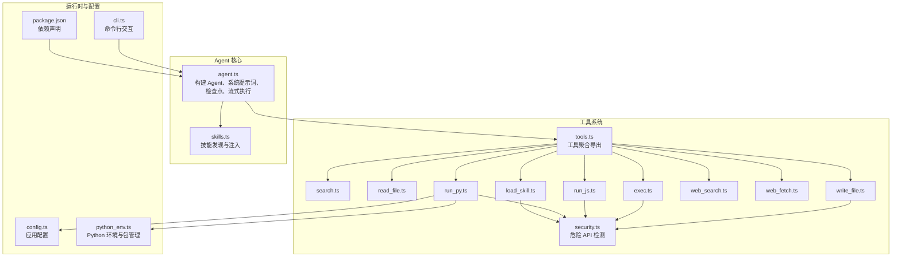
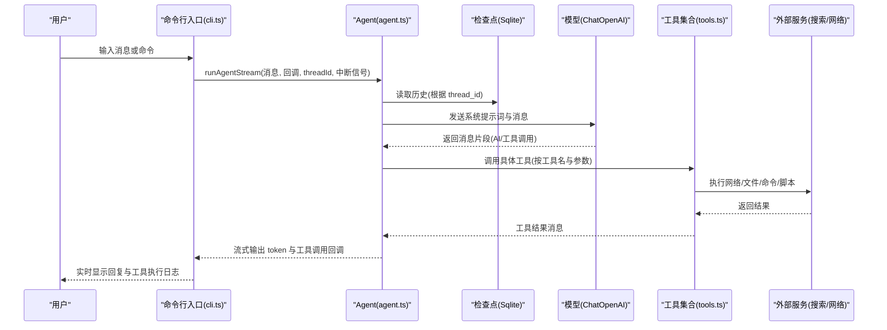
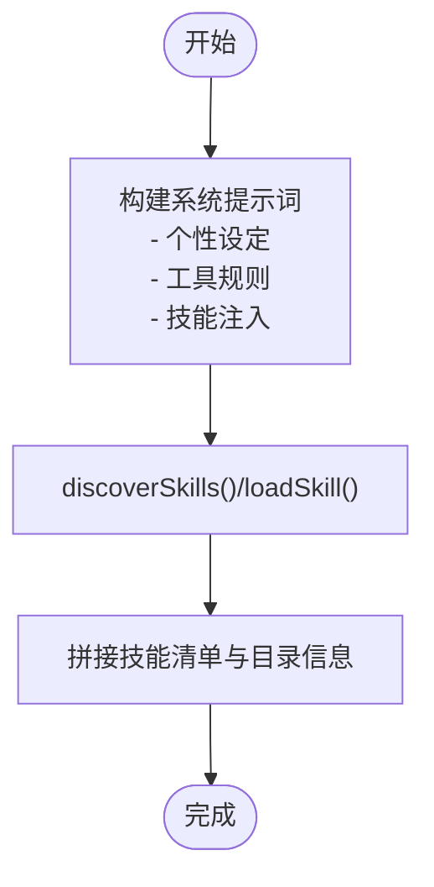
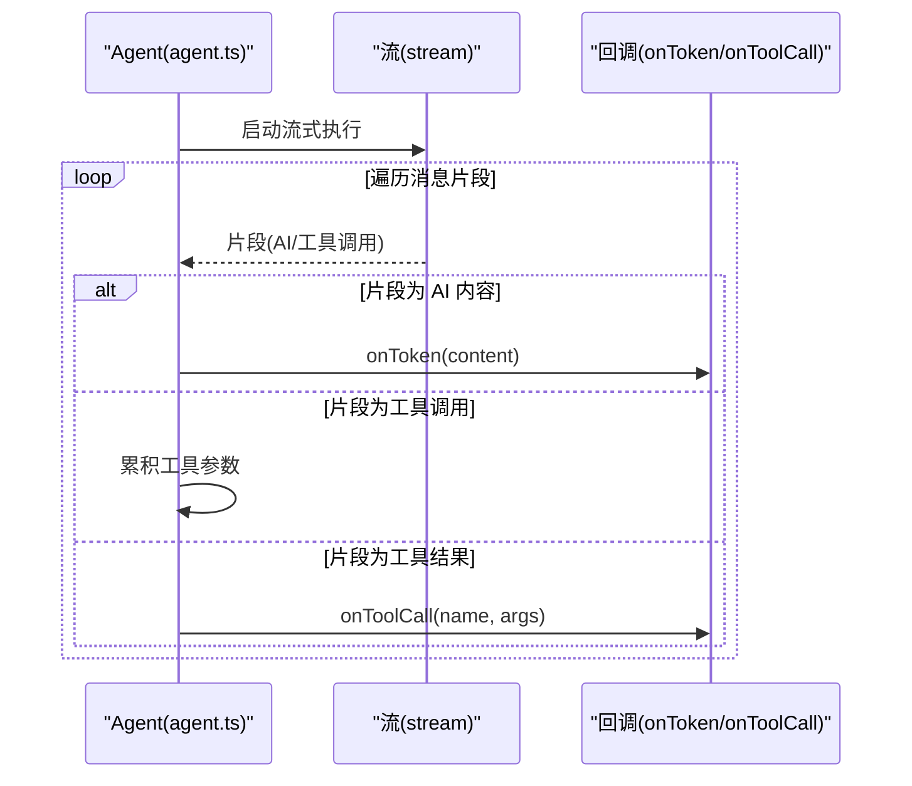
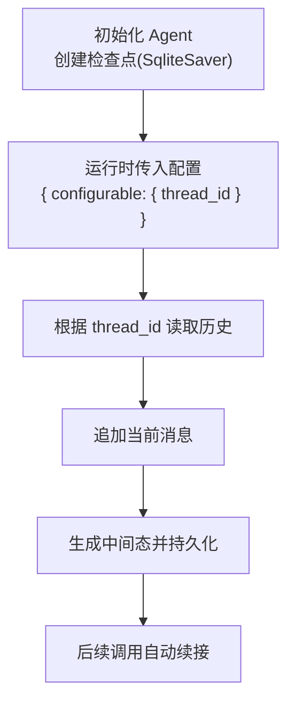
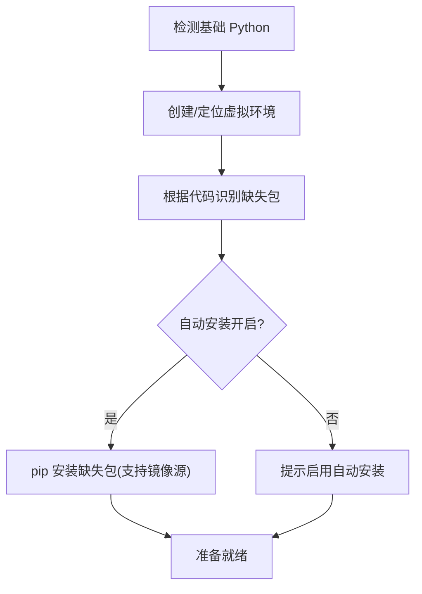
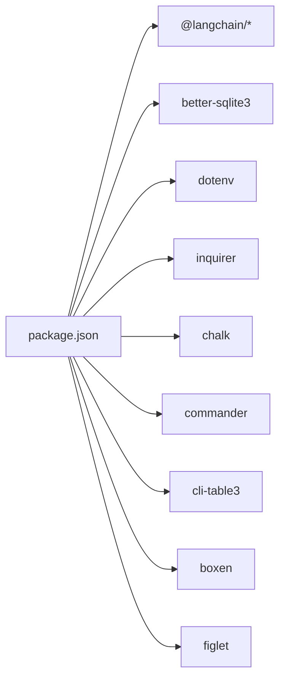

# LangChain 集成架构

<cite>
**本文引用的文件**
- [agent.ts](file://src/agent/agent.ts)
- [tools.ts](file://src/agent/tools.ts)
- [search.ts](file://src/agent/tools/search.ts)
- [read_file.ts](file://src/agent/tools/read_file.ts)
- [write_file.ts](file://src/agent/tools/write_file.ts)
- [exec.ts](file://src/agent/tools/exec.ts)
- [run_js.ts](file://src/agent/tools/run_js.ts)
- [run_py.ts](file://src/agent/tools/run_py.ts)
- [web_search.ts](file://src/agent/tools/web_search.ts)
- [web_fetch.ts](file://src/agent/tools/web_fetch.ts)
- [load_skill.ts](file://src/agent/tools/load_skill.ts)
- [security.ts](file://src/agent/tools/security.ts)
- [skills.ts](file://src/agent/skills.ts)
- [config.ts](file://src/agent/config.ts)
- [python_env.ts](file://src/agent/python_env.ts)
- [cli.ts](file://src/agent/cli.ts)
- [package.json](file://package.json)
</cite>

## 目录
1. [简介](#简介)
2. [项目结构](#项目结构)
3. [核心组件](#核心组件)
4. [架构总览](#架构总览)
5. [组件详解](#组件详解)
6. [依赖关系分析](#依赖关系分析)
7. [性能与配置优化](#性能与配置优化)
8. [故障排查指南](#故障排查指南)
9. [结论](#结论)
10. [附录](#附录)

## 简介
本文件面向高级开发者，系统性阐述 Onion Code 的 LangChain 集成架构，重点覆盖以下方面：
- LangChain 核心组件使用：ChatOpenAI 配置、工具系统集成、消息流处理
- LangGraph 检查点机制：状态管理、消息路由与条件判断
- 系统提示词构建策略：技能注入、个性设定与工具使用规则
- LangChain 配置优化：模型选择、参数调优与性能监控
- 与其他 LangChain 组件的集成模式与扩展开发建议

## 项目结构
Onion Code 的 Agent 与工具体系位于 src/agent 目录，采用“按功能域划分”的模块化组织方式：
- agent.ts：Agent 构建、系统提示词、检查点与流式执行
- tools/*.ts：各类工具封装，统一导出于 tools.ts
- skills.ts：技能清单与注入逻辑
- config.ts / python_env.ts：Python 环境与配置管理
- cli.ts：命令行入口与交互式对话流程



图表来源
- [agent.ts:1-181](file://src/agent/agent.ts#L1-L181)
- [tools.ts:1-10](file://src/agent/tools.ts#L1-L10)
- [skills.ts:1-142](file://src/agent/skills.ts#L1-L142)
- [config.ts:1-146](file://src/agent/config.ts#L1-L146)
- [python_env.ts:1-223](file://src/agent/python_env.ts#L1-L223)
- [cli.ts:1-225](file://src/agent/cli.ts#L1-L225)
- [package.json:1-54](file://package.json#L1-L54)

章节来源
- [agent.ts:1-181](file://src/agent/agent.ts#L1-L181)
- [tools.ts:1-10](file://src/agent/tools.ts#L1-L10)
- [skills.ts:1-142](file://src/agent/skills.ts#L1-L142)
- [config.ts:1-146](file://src/agent/config.ts#L1-L146)
- [python_env.ts:1-223](file://src/agent/python_env.ts#L1-L223)
- [cli.ts:1-225](file://src/agent/cli.ts#L1-L225)
- [package.json:1-54](file://package.json#L1-L54)

## 核心组件
- ChatOpenAI 与模型配置
  - 使用 ChatOpenAI 并通过环境变量指定模型与 API 基地址，启用流式输出
  - 支持通过环境变量覆盖模型名称与密钥
- 工具系统
  - 统一通过工具装饰器定义，具备 Zod Schema 校验与安全扫描
  - 工具包括文件读写、命令执行、脚本运行（JS/Python）、网页检索与抓取、技能加载等
- 检查点与会话
  - 使用 SQLite 检查点持久化，支持多会话（thread_id）与历史续接
- 流式消息处理
  - 通过 LangGraph 的流式接口接收消息片段，区分 AI 回复与工具调用，支持中断与回调

章节来源
- [agent.ts:69-95](file://src/agent/agent.ts#L69-L95)
- [agent.ts:106-181](file://src/agent/agent.ts#L106-L181)
- [tools.ts:1-10](file://src/agent/tools.ts#L1-L10)

## 架构总览
下图展示从 CLI 到 Agent、工具与外部服务的端到端调用链路。



图表来源
- [cli.ts:122-178](file://src/agent/cli.ts#L122-L178)
- [agent.ts:106-181](file://src/agent/agent.ts#L106-L181)
- [tools.ts:1-10](file://src/agent/tools.ts#L1-L10)
- [web_search.ts:16-38](file://src/agent/tools/web_search.ts#L16-L38)
- [web_fetch.ts:20-81](file://src/agent/tools/web_fetch.ts#L20-L81)
- [exec.ts:94-142](file://src/agent/tools/exec.ts#L94-L142)
- [run_js.ts:22-89](file://src/agent/tools/run_js.ts#L22-L89)
- [run_py.ts:11-94](file://src/agent/tools/run_py.ts#L11-L94)
- [read_file.ts:6-40](file://src/agent/tools/read_file.ts#L6-L40)
- [write_file.ts:7-54](file://src/agent/tools/write_file.ts#L7-L54)
- [load_skill.ts:5-32](file://src/agent/tools/load_skill.ts#L5-L32)

## 组件详解

### Agent 构建与系统提示词
- 系统提示词由“角色与个性”“说话风格”“示例互动”“工具使用规则”四部分组成，并动态注入可用技能列表
- 通过工具函数加载技能目录下的 SKILL.md，提取 name/description 并拼接为提示词片段
- 检查点使用 SQLite 持久化，基于 thread_id 实现多会话历史续接



图表来源
- [agent.ts:24-57](file://src/agent/agent.ts#L24-L57)
- [skills.ts:56-141](file://src/agent/skills.ts#L56-L141)

章节来源
- [agent.ts:24-57](file://src/agent/agent.ts#L24-L57)
- [skills.ts:56-141](file://src/agent/skills.ts#L56-L141)

### 工具系统与安全策略
- 工具统一使用 LangChain 工具装饰器与 Zod Schema 校验，保证输入合法性
- 危险操作检测集中于共享模块，覆盖 Node/Python 的高危 API 与常见破坏性命令
- 各工具对异常进行格式化返回，便于模型感知与重试

```mermaid
classDiagram
class Tool {
+name : string
+description : string
+schema : ZodSchema
+invoke(args) : Promise<any>
}
class Security {
+DANGEROUS_API_PATTERNS : RegExp[]
+hasDangerousApi(content) : boolean
}
class ReadFileTool {
+invoke({filename}) : Promise<string>
}
class WriteFileTool {
+invoke({filename, content}) : Promise<string>
}
class ExecTool {
+invoke({command}) : Promise<string>
}
class RunJsTool {
+invoke({code}) : Promise<string>
}
class RunPyTool {
+invoke({code}) : Promise<string>
}
class WebSearchTool {
+invoke({query}) : Promise<any>
}
class WebFetchTool {
+invoke({url}) : Promise<string>
}
class LoadSkillTool {
+invoke({skillName}) : Promise<string>
}
Tool <|-- ReadFileTool
Tool <|-- WriteFileTool
Tool <|-- ExecTool
Tool <|-- RunJsTool
Tool <|-- RunPyTool
Tool <|-- WebSearchTool
Tool <|-- WebFetchTool
Tool <|-- LoadSkillTool
WriteFileTool --> Security : "hasDangerousApi()"
ExecTool --> Security : "hasDangerousApi()"
RunJsTool --> Security : "hasDangerousApi()"
RunPyTool --> Security : "hasDangerousApi()"
```

图表来源
- [tools.ts:1-10](file://src/agent/tools.ts#L1-L10)
- [read_file.ts:6-40](file://src/agent/tools/read_file.ts#L6-L40)
- [write_file.ts:7-54](file://src/agent/tools/write_file.ts#L7-L54)
- [exec.ts:94-142](file://src/agent/tools/exec.ts#L94-L142)
- [run_js.ts:22-89](file://src/agent/tools/run_js.ts#L22-L89)
- [run_py.ts:11-94](file://src/agent/tools/run_py.ts#L11-L94)
- [web_search.ts:16-38](file://src/agent/tools/web_search.ts#L16-L38)
- [web_fetch.ts:20-81](file://src/agent/tools/web_fetch.ts#L20-L81)
- [load_skill.ts:5-32](file://src/agent/tools/load_skill.ts#L5-L32)
- [security.ts:24-27](file://src/agent/tools/security.ts#L24-L27)

章节来源
- [tools.ts:1-10](file://src/agent/tools.ts#L1-L10)
- [security.ts:24-27](file://src/agent/tools/security.ts#L24-L27)
- [read_file.ts:6-40](file://src/agent/tools/read_file.ts#L6-L40)
- [write_file.ts:7-54](file://src/agent/tools/write_file.ts#L7-L54)
- [exec.ts:94-142](file://src/agent/tools/exec.ts#L94-L142)
- [run_js.ts:22-89](file://src/agent/tools/run_js.ts#L22-L89)
- [run_py.ts:11-94](file://src/agent/tools/run_py.ts#L11-L94)
- [web_search.ts:16-38](file://src/agent/tools/web_search.ts#L16-L38)
- [web_fetch.ts:20-81](file://src/agent/tools/web_fetch.ts#L20-L81)
- [load_skill.ts:5-32](file://src/agent/tools/load_skill.ts#L5-L32)

### 流式消息处理与工具调用
- Agent 通过流式接口接收消息片段，区分 AI 回复与工具调用
- 对工具调用参数进行累积与解析，在工具执行完成后触发回调
- 支持中断信号，允许用户通过 ESC 中断长耗时执行



图表来源
- [agent.ts:118-178](file://src/agent/agent.ts#L118-L178)

章节来源
- [agent.ts:118-178](file://src/agent/agent.ts#L118-L178)

### 检查点机制与状态管理
- 使用 SQLite 检查点持久化，基于 thread_id 维护多会话历史
- Agent 初始化时创建检查点实例并传入，运行时自动续接历史消息
- CLI 支持新建会话与切换历史会话，实现会话间隔离与复用



图表来源
- [agent.ts:62-67](file://src/agent/agent.ts#L62-L67)
- [agent.ts:113-116](file://src/agent/agent.ts#L113-L116)
- [cli.ts:80-108](file://src/agent/cli.ts#L80-L108)

章节来源
- [agent.ts:62-67](file://src/agent/agent.ts#L62-L67)
- [agent.ts:113-116](file://src/agent/agent.ts#L113-L116)
- [cli.ts:80-108](file://src/agent/cli.ts#L80-L108)

### Python 环境与包管理
- 自动检测与创建虚拟环境，按需安装 pandas/numpy/openpyxl 等常用数据包
- 代码中出现相关导入时动态识别所需包并安装
- 支持镜像源与自动安装开关，便于内网部署



图表来源
- [python_env.ts:58-107](file://src/agent/python_env.ts#L58-L107)
- [python_env.ts:161-170](file://src/agent/python_env.ts#L161-L170)
- [python_env.ts:189-222](file://src/agent/python_env.ts#L189-L222)
- [config.ts:54-69](file://src/agent/config.ts#L54-L69)

章节来源
- [python_env.ts:58-107](file://src/agent/python_env.ts#L58-L107)
- [python_env.ts:161-170](file://src/agent/python_env.ts#L161-L170)
- [python_env.ts:189-222](file://src/agent/python_env.ts#L189-L222)
- [config.ts:54-69](file://src/agent/config.ts#L54-L69)

## 依赖关系分析
- LangChain 生态
  - @langchain/core：工具装饰器、消息类型与核心能力
  - @langchain/openai：ChatOpenAI 模型适配
  - @langchain/langgraph：Agent 与流式执行
  - @langchain/langgraph-checkpoint-sqlite：SQLite 检查点
  - @langchain/tavily：网页搜索工具
- 运行时依赖
  - better-sqlite3：SQLite 引擎
  - dotenv：环境变量加载
  - inquirer/chalk/cli-table3/boxen/figlet：CLI 与终端渲染
- 项目脚本
  - dev/start/build/test：开发、启动、打包与测试



图表来源
- [package.json:21-36](file://package.json#L21-L36)
- [package.json:38-52](file://package.json#L38-L52)

章节来源
- [package.json:21-36](file://package.json#L21-L36)
- [package.json:38-52](file://package.json#L38-L52)

## 性能与配置优化
- 模型选择与基座
  - 通过环境变量设置模型名称与 API 基地址，支持多供应商接入
  - 建议在生产环境固定模型版本并开启流式输出以提升交互体验
- 参数调优
  - 流式模式：保持 streamMode="messages"，减少前端渲染压力
  - 递归限制：根据任务复杂度调整 recursionLimit，避免无限循环
  - 检查点：合理设置 thread_id，避免并发写冲突
- 性能监控
  - CLI 中统计首 token 时间与消息计数，便于评估响应延迟
  - 工具侧设置超时与缓冲区上限，防止阻塞与内存溢出
- 安全与稳定性
  - 工具调用前进行危险 API 检测与命令白名单校验
  - Python 环境隔离与按需安装，降低依赖冲突风险

章节来源
- [agent.ts:69-77](file://src/agent/agent.ts#L69-L77)
- [agent.ts:113-116](file://src/agent/agent.ts#L113-L116)
- [cli.ts:140-172](file://src/agent/cli.ts#L140-L172)
- [exec.ts:111-131](file://src/agent/tools/exec.ts#L111-L131)
- [run_js.ts:46-74](file://src/agent/tools/run_js.ts#L46-L74)
- [run_py.ts:36-81](file://src/agent/tools/run_py.ts#L36-L81)
- [security.ts:24-27](file://src/agent/tools/security.ts#L24-L27)

## 故障排查指南
- 内容安全拦截
  - 现象：模型返回“内容存在风险”
  - 处理：更换问法或简化查询；检查工具返回内容是否触发过滤
- 认证失败
  - 现象：401/Incorrect API key
  - 处理：确认 OPENAI_API_KEY 与模型基地址配置正确
- 额度不足/限流
  - 现象：429/insufficient_quota
  - 处理：检查账户余额与配额；降低并发或等待重试
- 递归限制
  - 现象：超过 recursionLimit
  - 处理：拆分复杂任务为多个步骤；优化提示词与工具调用策略
- 超时与网络异常
  - 现象：ETIMEDOUT/timeout/DNS/ECONN 等
  - 处理：检查网络连通性；缩短超时时间或增加重试；验证 URL 与协议
- 工具调用失败
  - 现象：文件读写/命令执行/脚本运行报错
  - 处理：确认路径安全、权限与沙箱限制；检查危险 API 检测误判

章节来源
- [cli.ts:15-51](file://src/agent/cli.ts#L15-L51)
- [exec.ts:94-142](file://src/agent/tools/exec.ts#L94-L142)
- [run_js.ts:22-89](file://src/agent/tools/run_js.ts#L22-L89)
- [run_py.ts:11-94](file://src/agent/tools/run_py.ts#L11-L94)
- [web_fetch.ts:20-81](file://src/agent/tools/web_fetch.ts#L20-L81)

## 结论
Onion Code 以 LangChain 为核心，结合 SQLite 检查点与丰富的工具集，构建了可扩展、可观测且安全的智能体系统。通过系统化的提示词注入、严格的工具安全策略与流式消息处理，实现了高效稳定的交互体验。建议在生产环境中进一步完善监控告警、缓存与限流策略，并持续优化工具生态与技能库。

## 附录
- 扩展开发建议
  - 新增工具：遵循现有装饰器与 Schema 模式，加入安全扫描与异常处理
  - 新增技能：在 skills 目录下创建子目录并编写 SKILL.md，Agent 将自动注入
  - 多 Agent 协作：利用 LangGraph 的节点与边定义协作流程，配合检查点实现跨 Agent 的状态传递
  - 外部集成：优先使用官方适配器（如 @langchain/tavily），确保错误码与超时策略一致