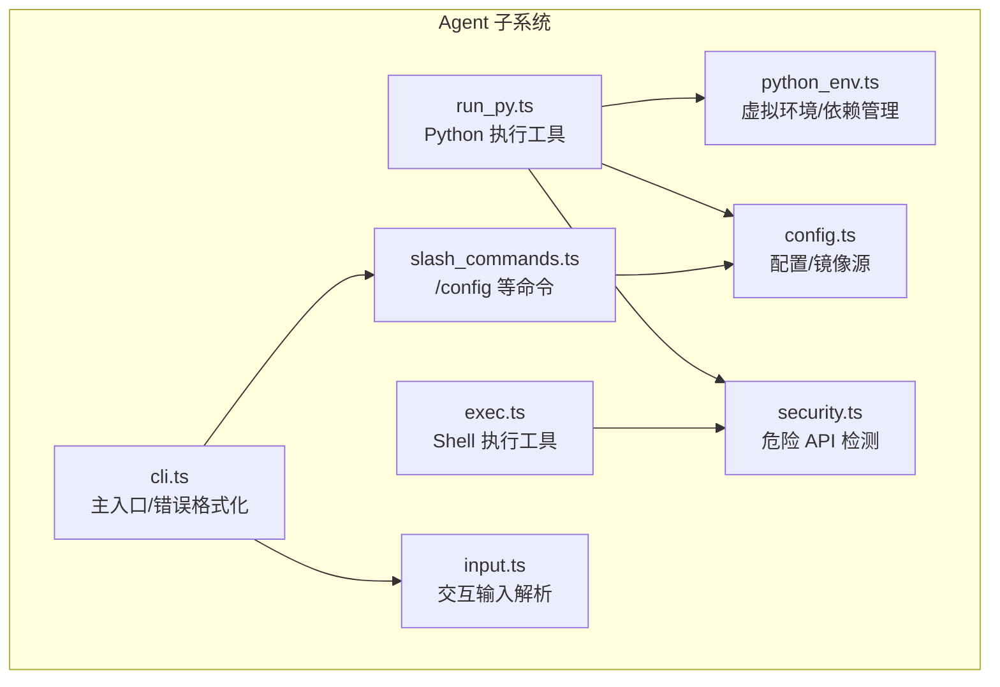
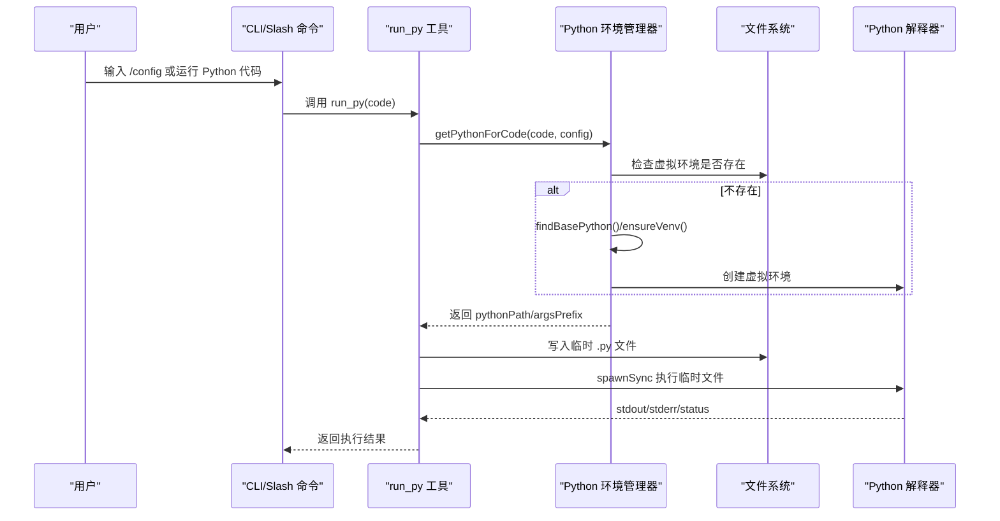
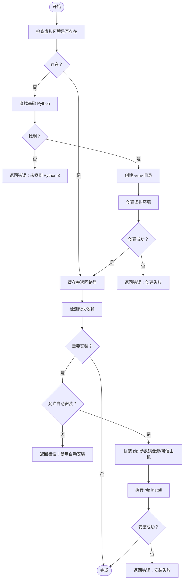
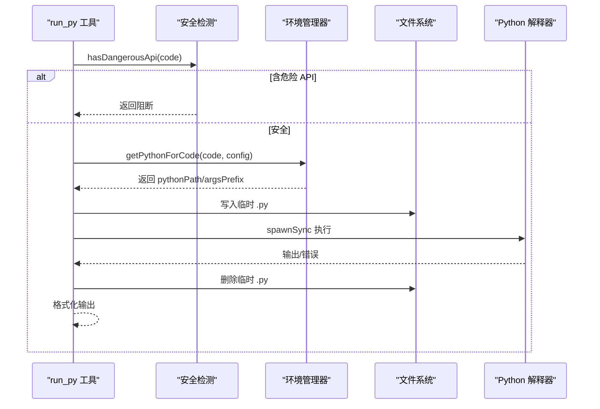
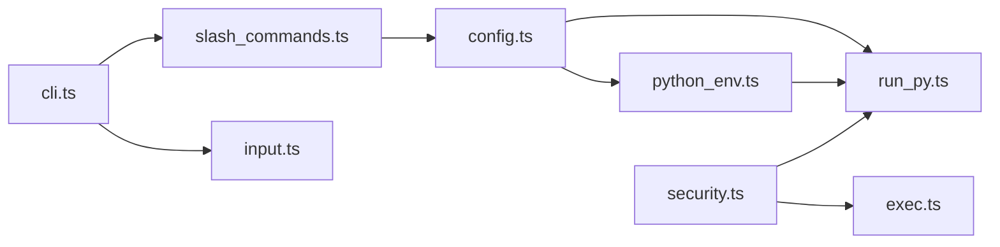

# Python 环境管理

<cite>
**本文引用的文件**
- [python_env.ts](file://src/agent/python_env.ts)
- [run_py.ts](file://src/agent/tools/run_py.ts)
- [exec.ts](file://src/agent/tools/exec.ts)
- [config.ts](file://src/agent/config.ts)
- [security.ts](file://src/agent/tools/security.ts)
- [cli.ts](file://src/agent/cli.ts)
- [slash_commands.ts](file://src/agent/slash_commands.ts)
- [input.ts](file://src/agent/input.ts)
- [run_py.test.ts](file://src/agent/tools/run_py.test.ts)
- [exec.test.ts](file://src/agent/tools/exec.test.ts)
- [package.json](file://package.json)
</cite>

## 目录
1. [简介](#简介)
2. [项目结构](#项目结构)
3. [核心组件](#核心组件)
4. [架构总览](#架构总览)
5. [详细组件分析](#详细组件分析)
6. [依赖关系分析](#依赖关系分析)
7. [性能考量](#性能考量)
8. [故障排除指南](#故障排除指南)
9. [结论](#结论)
10. [附录](#附录)

## 简介
本文件面向 Onion Code 的 Python 环境管理系统，系统性阐述以下方面：
- 虚拟环境创建流程与环境隔离策略
- 依赖包自动安装机制与镜像源配置
- Python 版本管理与包管理器配置
- 环境诊断与常见问题排查
- 与主程序的集成方式（进程管理、资源分配、错误处理）
- 最佳实践（安全性、性能调优、自定义配置）

## 项目结构
Onion Code 将 Python 环境管理能力集中在 Agent 子系统中，关键文件如下：
- 环境管理：python_env.ts
- Python 工具封装：run_py.ts
- Shell 执行工具与安全策略：exec.ts、security.ts
- 配置与镜像源：config.ts
- CLI 与 slash 命令集成：cli.ts、slash_commands.ts、input.ts
- 测试：run_py.test.ts、exec.test.ts
- 依赖声明：package.json

图表来源
- [python_env.ts:1-223](file://src/agent/python_env.ts#L1-L223)
- [run_py.ts:1-94](file://src/agent/tools/run_py.ts#L1-L94)
- [exec.ts:1-142](file://src/agent/tools/exec.ts#L1-L142)
- [security.ts:1-27](file://src/agent/tools/security.ts#L1-L27)
- [config.ts:1-146](file://src/agent/config.ts#L1-L146)
- [slash_commands.ts:1-91](file://src/agent/slash_commands.ts#L1-L91)
- [input.ts:1-329](file://src/agent/input.ts#L1-L329)
- [cli.ts:1-225](file://src/agent/cli.ts#L1-L225)

章节来源
- [python_env.ts:1-223](file://src/agent/python_env.ts#L1-L223)
- [config.ts:1-146](file://src/agent/config.ts#L1-L146)
- [run_py.ts:1-94](file://src/agent/tools/run_py.ts#L1-L94)
- [exec.ts:1-142](file://src/agent/tools/exec.ts#L1-L142)
- [security.ts:1-27](file://src/agent/tools/security.ts#L1-L27)
- [slash_commands.ts:1-91](file://src/agent/slash_commands.ts#L1-L91)
- [input.ts:1-329](file://src/agent/input.ts#L1-L329)
- [cli.ts:1-225](file://src/agent/cli.ts#L1-L225)

## 核心组件
- Python 环境管理器：负责查找基础 Python、创建/复用虚拟环境、检测缺失依赖、按需安装依赖，并缓存路径。
- Python 执行工具：在安全扫描后，将代码写入临时文件并调用 Python 执行，返回标准输出。
- Shell 执行工具与安全策略：对危险命令名、eval 注入、危险 API 调用进行多层阻断。
- 配置中心：提供镜像源、自动安装开关、初始化引导等交互式配置。
- CLI 与 slash 命令：提供 /config 等命令入口，统一错误格式化与用户交互。

章节来源
- [python_env.ts:161-170](file://src/agent/python_env.ts#L161-L170)
- [run_py.ts:11-94](file://src/agent/tools/run_py.ts#L11-L94)
- [exec.ts:94-142](file://src/agent/tools/exec.ts#L94-L142)
- [config.ts:71-145](file://src/agent/config.ts#L71-L145)
- [slash_commands.ts:21-77](file://src/agent/slash_commands.ts#L21-L77)

## 架构总览
下图展示 Python 环境管理在系统中的位置与调用链路。

图表来源
- [run_py.ts:22-38](file://src/agent/tools/run_py.ts#L22-L38)
- [python_env.ts:161-170](file://src/agent/python_env.ts#L161-L170)
- [python_env.ts:76-107](file://src/agent/python_env.ts#L76-L107)

## 详细组件分析

### 组件一：Python 环境管理器（虚拟环境与依赖）
- 功能要点
  - 基础 Python 发现：跨平台候选命令与版本校验。
  - 虚拟环境创建：若不存在则基于基础 Python 创建 venv；成功后缓存路径。
  - 缺失依赖检测：通过 importlib.spec 检测所需包。
  - 自动安装：根据配置决定是否自动安装，支持镜像源与可信主机。
  - 包探测：根据代码中的 import 模式推断 pandas/numpy/openpyxl 等依赖。
- 关键流程（创建与安装）

图表来源
- [python_env.ts:58-107](file://src/agent/python_env.ts#L58-L107)
- [python_env.ts:109-159](file://src/agent/python_env.ts#L109-L159)
- [python_env.ts:172-187](file://src/agent/python_env.ts#L172-L187)

章节来源
- [python_env.ts:1-223](file://src/agent/python_env.ts#L1-L223)

### 组件二：Python 执行工具（安全沙箱）
- 安全策略
  - 禁止危险 API：fs.rmSync、child_process、shutil.rmtree、os.remove 等。
  - 禁止 eval 注入：node -e、python -c 等。
  - 临时文件执行：避免命令行转义问题，执行后清理。
- 资源与超时
  - 执行超时 15 秒，stdout/stderr 缓冲上限。
- 错误处理
  - ETIMEDOUT、非零退出码、异常均转换为可读错误信息。

图表来源
- [run_py.ts:17-21](file://src/agent/tools/run_py.ts#L17-L21)
- [run_py.ts:22-38](file://src/agent/tools/run_py.ts#L22-L38)
- [run_py.ts:36-81](file://src/agent/tools/run_py.ts#L36-L81)
- [security.ts:24-26](file://src/agent/tools/security.ts#L24-L26)

章节来源
- [run_py.ts:1-94](file://src/agent/tools/run_py.ts#L1-L94)
- [security.ts:1-27](file://src/agent/tools/security.ts#L1-L27)

### 组件三：Shell 执行工具与安全策略
- 危险命令黑名单：rm、mv、cp、sudo、chmod、kill、格式化磁盘等。
- Eval 注入检测：node -e/--eval/-p、python -c 等。
- 危险 API 检测：来自共享模块的安全规则。
- 超时与缓冲：30 秒超时，最大缓冲 1MB。

章节来源
- [exec.ts:6-84](file://src/agent/tools/exec.ts#L6-L84)
- [exec.ts:94-142](file://src/agent/tools/exec.ts#L94-L142)
- [security.ts:1-27](file://src/agent/tools/security.ts#L1-L27)

### 组件四：配置中心与镜像源
- 配置项
  - venvPath：虚拟环境目录（默认位于 .data/python-venv）。
  - autoInstall：是否允许自动安装缺失依赖。
  - pip.indexUrl/trustedHost：pip 镜像源与可信主机。
- 交互式配置
  - 支持修改镜像源、自动安装开关、立即初始化并安装常用数据分析依赖。
- 默认镜像源
  - 使用清华 TUNA 镜像源，兼顾国内网络稳定性。

章节来源
- [config.ts:7-31](file://src/agent/config.ts#L7-L31)
- [config.ts:71-145](file://src/agent/config.ts#L71-L145)

### 组件五：CLI 与 slash 命令集成
- slash 命令
  - /config：打开配置对话框，支持立即初始化。
  - /sessions、/rewind、/new、/help、/exit 等。
- 错误格式化
  - 对 API Key、额度不足、超时、LangGraph 递归限制等进行友好提示。
- 交互输入
  - 支持 / 命令面板、上下选择、Tab 补全等。

章节来源
- [slash_commands.ts:21-77](file://src/agent/slash_commands.ts#L21-L77)
- [cli.ts:15-51](file://src/agent/cli.ts#L15-L51)
- [input.ts:65-91](file://src/agent/input.ts#L65-L91)

## 依赖关系分析
- python_env.ts 依赖 Node child_process/fs/path，以及 config.ts 的配置。
- run_py.ts 依赖 python_env.ts、config.ts、security.ts。
- exec.ts 依赖 security.ts。
- config.ts 依赖 fs/path，提供默认配置与合并逻辑。
- CLI 与 slash 命令通过工具调用与配置联动。

图表来源
- [python_env.ts:1-6](file://src/agent/python_env.ts#L1-L6)
- [run_py.ts:8-9](file://src/agent/tools/run_py.ts#L8-L9)
- [exec.ts:4-7](file://src/agent/tools/exec.ts#L4-L7)
- [config.ts:5-6](file://src/agent/config.ts#L5-L6)
- [slash_commands.ts:2-2](file://src/agent/slash_commands.ts#L2-L2)
- [cli.ts:6-8](file://src/agent/cli.ts#L6-L8)

章节来源
- [python_env.ts:1-223](file://src/agent/python_env.ts#L1-L223)
- [run_py.ts:1-94](file://src/agent/tools/run_py.ts#L1-L94)
- [exec.ts:1-142](file://src/agent/tools/exec.ts#L1-L142)
- [config.ts:1-146](file://src/agent/config.ts#L1-L146)
- [slash_commands.ts:1-91](file://src/agent/slash_commands.ts#L1-L91)
- [cli.ts:1-225](file://src/agent/cli.ts#L1-L225)

## 性能考量
- 虚拟环境创建
  - 超时 120 秒，确保在受限网络环境下不会无限等待。
  - 成功后缓存路径，后续调用直接复用，减少重复创建开销。
- 依赖安装
  - 超时 180 秒，镜像源可显著提升下载速度。
  - 仅安装缺失依赖，避免重复安装。
- Python 执行
  - 超时 15 秒，缓冲上限 512KB，防止大输出阻塞。
  - 临时文件执行避免命令行转义与跨平台差异。
- Shell 执行
  - 超时 30 秒，缓冲上限 1MB，兼顾稳定性与可观测性。
- 配置与 I/O
  - 配置文件位于 .data 目录，初始化时自动创建父目录，避免多次 I/O。

章节来源
- [python_env.ts:92-96](file://src/agent/python_env.ts#L92-L96)
- [python_env.ts:149-156](file://src/agent/python_env.ts#L149-L156)
- [run_py.ts:36-46](file://src/agent/tools/run_py.ts#L36-L46)
- [exec.ts:112-117](file://src/agent/tools/exec.ts#L112-L117)
- [config.ts:33-39](file://src/agent/config.ts#L33-L39)

## 故障排除指南
- 无法找到 Python 3
  - 现象：返回“未安装或不在 PATH”。
  - 排查：确认系统已安装 Python 3；Windows 使用 py -3；类 Unix 使用 python3 或绝对路径。
  - 参考
    - [python_env.ts:32-40](file://src/agent/python_env.ts#L32-L40)
    - [python_env.ts:58-63](file://src/agent/python_env.ts#L58-L63)
- 虚拟环境创建失败
  - 现象：stderr/stdout 或“创建失败”。
  - 排查：检查 venvPath 权限、磁盘空间、网络访问；确认基础 Python 可用。
  - 参考
    - [python_env.ts:92-103](file://src/agent/python_env.ts#L92-L103)
- 依赖安装失败
  - 现象：返回“安装失败”。
  - 排查：检查 autoInstall 开关、镜像源配置、网络连通性；必要时手动 pip install。
  - 参考
    - [python_env.ts:134-139](file://src/agent/python_env.ts#L134-L139)
    - [python_env.ts:142-147](file://src/agent/python_env.ts#L142-L147)
- Python 执行超时
  - 现象：返回“执行超时”。
  - 排查：缩短代码、避免长时间循环；检查系统负载。
  - 参考
    - [run_py.ts:48-54](file://src/agent/tools/run_py.ts#L48-L54)
- Shell 执行被阻断
  - 现象：返回“危险操作/eval 注入被阻断”。
  - 排查：避免使用黑名单命令与 eval 注入；改用安全替代方案。
  - 参考
    - [exec.ts:100-109](file://src/agent/tools/exec.ts#L100-L109)
    - [exec.ts:81-84](file://src/agent/tools/exec.ts#L81-L84)
- 危险 API 被阻断
  - 现象：Python 代码被阻断。
  - 排查：移除危险 API；改用安全接口。
  - 参考
    - [security.ts:24-26](file://src/agent/tools/security.ts#L24-L26)
    - [run_py.ts:17-21](file://src/agent/tools/run_py.ts#L17-L21)
- 配置未生效
  - 现象：镜像源或自动安装未按预期工作。
  - 排查：确认 .data/config.json 是否正确保存；重新运行 /config 初始化。
  - 参考
    - [config.ts:66-69](file://src/agent/config.ts#L66-L69)
    - [config.ts:137-144](file://src/agent/config.ts#L137-L144)

章节来源
- [python_env.ts:32-40](file://src/agent/python_env.ts#L32-L40)
- [python_env.ts:58-63](file://src/agent/python_env.ts#L58-L63)
- [python_env.ts:92-103](file://src/agent/python_env.ts#L92-L103)
- [python_env.ts:134-139](file://src/agent/python_env.ts#L134-L139)
- [python_env.ts:142-147](file://src/agent/python_env.ts#L142-L147)
- [run_py.ts:48-54](file://src/agent/tools/run_py.ts#L48-L54)
- [exec.ts:100-109](file://src/agent/tools/exec.ts#L100-L109)
- [exec.ts:81-84](file://src/agent/tools/exec.ts#L81-L84)
- [security.ts:24-26](file://src/agent/tools/security.ts#L24-L26)
- [config.ts:66-69](file://src/agent/config.ts#L66-L69)
- [config.ts:137-144](file://src/agent/config.ts#L137-L144)

## 结论
Onion Code 的 Python 环境管理以“安全、隔离、自动化”为核心设计原则：
- 通过虚拟环境实现强隔离，避免污染宿主环境。
- 自动发现基础 Python、自动创建 venv、按需安装依赖，降低使用门槛。
- 多层安全策略阻断危险操作，保障系统稳定与数据安全。
- 交互式配置中心便于快速定制镜像源与安装策略。
- CLI 与 slash 命令提供一致的用户体验与错误提示。

## 附录

### 环境隔离策略
- 虚拟环境路径：默认位于项目根目录下的 .data/python-venv。
- 平台差异：Windows 使用 Scripts/python.exe，类 Unix 使用 bin/python。
- 缓存机制：创建成功后缓存路径，避免重复创建。

章节来源
- [config.ts:22-31](file://src/agent/config.ts#L22-L31)
- [python_env.ts:65-74](file://src/agent/python_env.ts#L65-L74)
- [python_env.ts:76-107](file://src/agent/python_env.ts#L76-L107)

### Python 版本管理与包管理器配置
- 基础 Python 候选：python3、/usr/bin/python3、/opt/homebrew/bin/python3、/usr/local/bin/python3（类 Unix）；python、py -3（Windows）。
- pip 配置：支持 index-url 与 trusted-host，优先使用配置值。
- 自动安装：由配置控制，未启用时返回明确错误提示。

章节来源
- [python_env.ts:42-56](file://src/agent/python_env.ts#L42-L56)
- [python_env.ts:141-147](file://src/agent/python_env.ts#L141-L147)
- [python_env.ts:134-139](file://src/agent/python_env.ts#L134-L139)

### 镜像源设置与最佳实践
- 默认镜像源：清华 TUNA 镜像，适合国内网络。
- 自定义镜像源：通过 /config 修改 indexUrl/trustedHost。
- 最佳实践：
  - 在企业内网部署私有镜像源，提高稳定性与安全性。
  - 为不同地区选择就近镜像，减少延迟。
  - 保持 autoInstall 与镜像源配置一致，避免安装失败。

章节来源
- [config.ts:22-31](file://src/agent/config.ts#L22-L31)
- [config.ts:90-132](file://src/agent/config.ts#L90-L132)

### 环境诊断与自定义配置
- 诊断步骤
  - 检查基础 Python：确保 python3 或 python 可用。
  - 检查 venvPath：确认目录可写且空间充足。
  - 检查镜像源：curl/pip 测试 indexUrl 可达性。
  - 手动初始化：运行 /config 并勾选“立即初始化”。
- 自定义配置
  - 修改 .data/config.json 或通过 /config 交互式调整。
  - 如需安装常用数据分析依赖，可在初始化时勾选。

章节来源
- [python_env.ts:58-63](file://src/agent/python_env.ts#L58-L63)
- [python_env.ts:92-103](file://src/agent/python_env.ts#L92-L103)
- [config.ts:137-144](file://src/agent/config.ts#L137-L144)

### 与主程序的集成方式
- 进程管理
  - run_py 使用 spawnSync 启动子进程，避免阻塞主线程。
  - exec 使用 execSync，超时与缓冲限制明确。
- 资源分配
  - Python 执行：15 秒超时、512KB 缓冲；Shell 执行：30 秒超时、1MB 缓冲。
- 错误处理
  - CLI 统一格式化错误消息，区分网络、认证、额度、超时等场景。
  - 工具层捕获 ETIMEDOUT、非零退出码与异常，返回可读错误。

章节来源
- [run_py.ts:36-46](file://src/agent/tools/run_py.ts#L36-L46)
- [exec.ts:112-117](file://src/agent/tools/exec.ts#L112-L117)
- [cli.ts:15-51](file://src/agent/cli.ts#L15-L51)

### 安全性考虑与性能调优
- 安全性
  - 多层阻断：黑名单命令、eval 注入、危险 API。
  - 临时文件执行：避免命令行注入与跨平台差异。
  - 隔离执行：虚拟环境与独立进程。
- 性能调优
  - 合理设置超时与缓冲，避免资源占用过高。
  - 使用镜像源加速依赖安装。
  - 首次初始化后复用缓存路径，减少重复创建。

章节来源
- [exec.ts:6-84](file://src/agent/tools/exec.ts#L6-L84)
- [exec.ts:81-84](file://src/agent/tools/exec.ts#L81-L84)
- [security.ts:24-26](file://src/agent/tools/security.ts#L24-L26)
- [run_py.ts:36-46](file://src/agent/tools/run_py.ts#L36-L46)
- [python_env.ts:92-96](file://src/agent/python_env.ts#L92-L96)

### 测试参考
- run_py 测试覆盖：正常执行、语法错误、运行时异常、危险 API 阻断、空代码等边界情况。
- exec 测试覆盖：正常命令、危险命令、eval 注入、危险 API、空命令等。

章节来源
- [run_py.test.ts:4-84](file://src/agent/tools/run_py.test.ts#L4-L84)
- [exec.test.ts:5-149](file://src/agent/tools/exec.test.ts#L5-L149)