# React 终端 UI 组件

<cite>
**本文档引用的文件**
- [package.json](file://package.json)
- [src/agent/ui/App.tsx](file://src/agent/ui/App.tsx)
- [src/agent/ui/Thread.tsx](file://src/agent/ui/Thread.tsx)
- [src/agent/ui/adapter.ts](file://src/agent/ui/adapter.ts)
- [src/agent/ui/ConfigPanel.tsx](file://src/agent/ui/ConfigPanel.tsx)
- [src/agent/slash_commands.ts](file://src/agent/slash_commands.ts)
- [src/agent/agent.ts](file://src/agent/agent.ts)
- [src/agent/style.ts](file://src/agent/style.ts)
- [src/agent/ui/theme.ts](file://src/agent/ui/theme.ts)
- [src/agent/sessions.ts](file://src/agent/sessions.ts)
- [src/agent/config.ts](file://src/agent/config.ts)
</cite>

## 更新摘要
**变更内容**
- SlashPanel 组件仍存在并被集成到 Thread 组件中
- Thread 组件进行了重大重构，包括底部状态栏的重新设计和 slash 命令处理逻辑的改进
- 新Slash命令系统：重构 Slash 命令处理逻辑，支持上下文绑定和命令执行
- 适配器工厂函数：引入 createLangchainAdapter 工厂函数，支持动态 threadId 注入
- 动态线程ID管理：实现基于 Ref 的动态线程ID获取机制，支持会话切换和重放
- 会话管理增强：完善会话查询、重放和验证功能
- 配置中心集成：新增配置对话框和 Python 环境管理

## 目录
1. [简介](#简介)
2. [项目结构](#项目结构)
3. [核心组件](#核心组件)
4. [架构概览](#架构概览)
5. [详细组件分析](#详细组件分析)
6. [视觉设计系统](#视觉设计系统)
7. [依赖关系分析](#依赖关系分析)
8. [性能考虑](#性能考虑)
9. [故障排除指南](#故障排除指南)
10. [结论](#结论)

## 简介

onionCode 是一个基于 React 和 Ink 的 CLI AI 助手终端 UI 组件。该项目提供了一个现代化的终端界面，支持流式响应、Slash 命令面板、主题化显示等功能。系统集成了 LangChain 和 OpenAI 模型，提供了完整的 AI 助手功能。

**更新** 项目已从简单的文本界面升级为复杂的图形界面，包含 figlet 标题、渐变色彩系统和新的状态栏设计等重大视觉重构。**新增** 基于工厂函数的适配器架构、动态线程ID管理和增强的 Slash 命令系统。

该组件的核心特点包括：
- 基于 React Ink 的终端 UI 渲染
- 流式 AI 响应处理
- Slash 命令系统
- 会话管理和持久化
- **动态线程ID管理**
- **适配器工厂函数**
- **增强的 Slash 命令系统**
- **会话查询和重放**
- **配置中心集成**
- **全新的图形界面设计**
- **渐变色彩系统**
- **figlet 字体支持**
- **OpenCode 风格视觉设计**
- **语义化主题系统**
- **自动主题适配**
- **Markdown 流式输出优化**

## 项目结构

项目采用模块化的组织结构，主要分为以下几个核心部分：

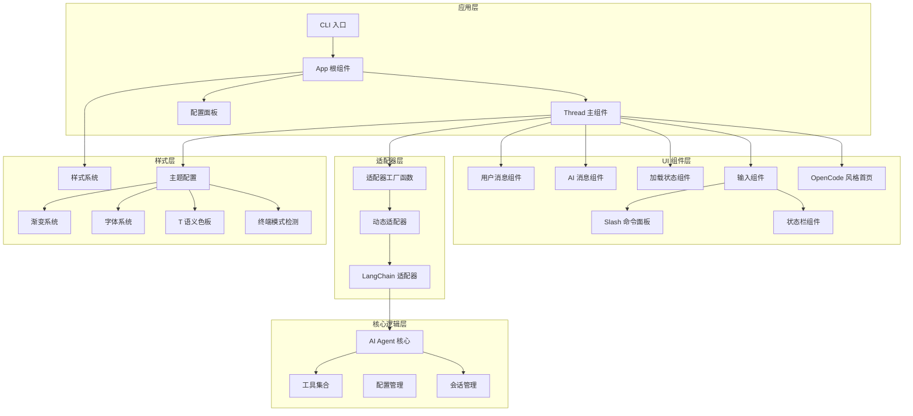

**图表来源**
- [src/agent/ui/App.tsx:1-75](file://src/agent/ui/App.tsx#L1-L75)
- [src/agent/ui/Thread.tsx:1-532](file://src/agent/ui/Thread.tsx#L1-L532)
- [src/agent/ui/adapter.ts:1-84](file://src/agent/ui/adapter.ts#L1-L84)
- [src/agent/ui/theme.ts:1-85](file://src/agent/ui/theme.ts#L1-L85)

**章节来源**
- [package.json:1-61](file://package.json#L1-L61)
- [src/agent/ui/App.tsx:1-75](file://src/agent/ui/App.tsx#L1-L75)

## 核心组件

### 应用入口组件

App 组件是整个应用的根组件，负责初始化 AI 运行时环境和处理退出事件。

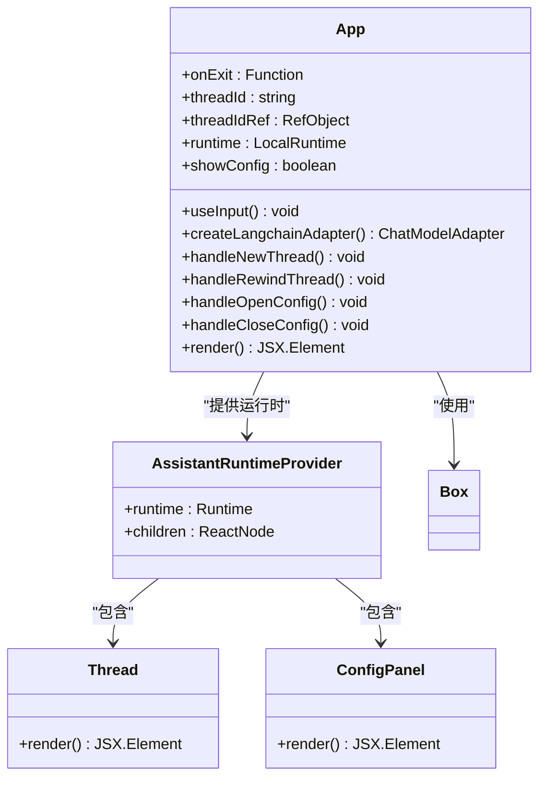

**图表来源**
- [src/agent/ui/App.tsx:18-75](file://src/agent/ui/App.tsx#L18-L75)

### 线程管理组件

**更新** Thread 组件经过重大重构，现在包含完整的图形界面系统和语义化主题系统，并且 SlashPanel 组件的功能被集成到其中。

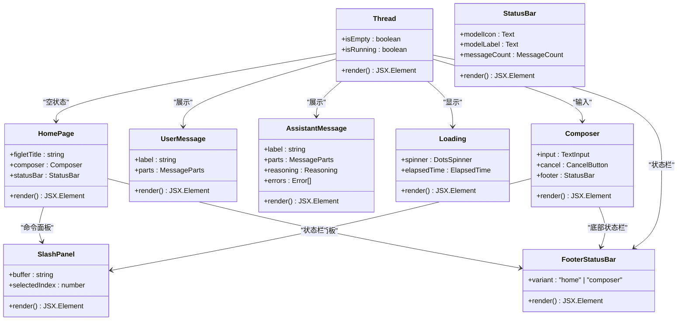

**图表来源**
- [src/agent/ui/Thread.tsx:163-207](file://src/agent/ui/Thread.tsx#L163-L207)
- [src/agent/ui/Thread.tsx:209-242](file://src/agent/ui/Thread.tsx#L209-L242)
- [src/agent/ui/Thread.tsx:504-532](file://src/agent/ui/Thread.tsx#L504-L532)

**章节来源**
- [src/agent/ui/App.tsx:18-75](file://src/agent/ui/App.tsx#L18-L75)
- [src/agent/ui/Thread.tsx:163-207](file://src/agent/ui/Thread.tsx#L163-L207)
- [src/agent/ui/Thread.tsx:209-242](file://src/agent/ui/Thread.tsx#L209-L242)
- [src/agent/ui/Thread.tsx:504-532](file://src/agent/ui/Thread.tsx#L504-L532)

## 架构概览

系统采用分层架构设计，各层职责清晰分离：

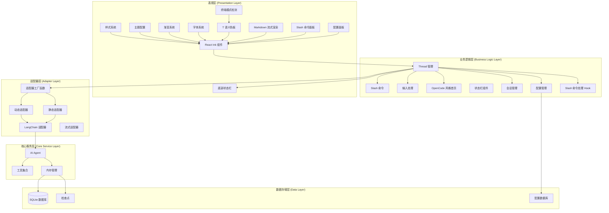

**图表来源**
- [src/agent/ui/adapter.ts:13-84](file://src/agent/ui/adapter.ts#L13-L84)
- [src/agent/agent.ts:80-181](file://src/agent/agent.ts#L80-L181)
- [src/agent/ui/theme.ts:14-85](file://src/agent/ui/theme.ts#L14-L85)
- [src/agent/ui/Thread.tsx:244-371](file://src/agent/ui/Thread.tsx#L244-L371)

## 详细组件分析

### 适配器工厂函数

**更新** 引入了 createLangchainAdapter 工厂函数，支持动态 threadId 注入和更好的会话管理。

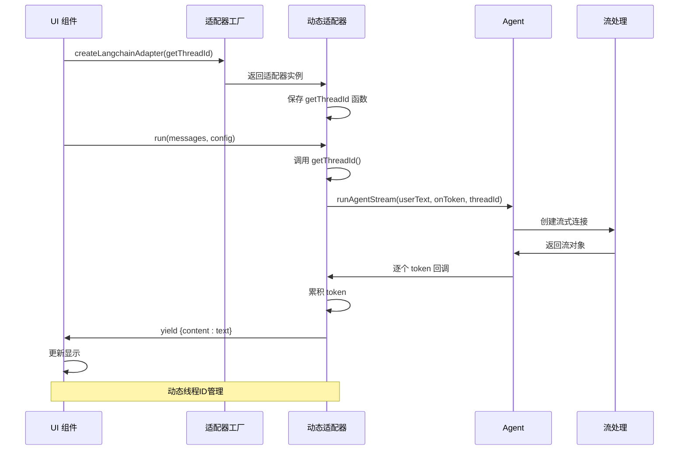

**图表来源**
- [src/agent/ui/adapter.ts:13-84](file://src/agent/ui/adapter.ts#L13-L84)
- [src/agent/agent.ts:106-181](file://src/agent/agent.ts#L106-L181)

### 动态线程ID管理

**更新** 实现了基于 Ref 的动态线程ID获取机制，支持会话切换和重放功能。

```mermaid
flowchart TD
Start[开始] --> GenerateId[生成初始 threadId]
GenerateId --> CreateRef[创建 threadIdRef]
CreateRef --> CreateAdapter[创建适配器]
CreateAdapter --> Run[运行会话]
Run --> UserInput[用户输入]
UserInput --> GetId[getThreadId() 调用]
GetId --> GetCurrent[读取 threadIdRef.current]
GetCurrent --> UseId[使用当前 threadId]
UseId --> UpdateId[用户触发新会话]
UpdateId --> SetId[setThreadId(newId)]
SetId --> ResetRuntime[runtime.thread.reset()]
ResetRuntime --> CreateRef
```

**图表来源**
- [src/agent/ui/App.tsx:18-49](file://src/agent/ui/App.tsx#L18-L49)
- [src/agent/ui/adapter.ts:17-18](file://src/agent/ui/adapter.ts#L17-L18)

### Slash 命令系统

**更新** 重构了 Slash 命令处理逻辑，支持上下文绑定和命令执行，并且 SlashPanel 组件的功能被集成到 Thread 组件中。

```mermaid
flowchart TD
Input[用户输入 "/"] --> Parse[解析命令]
Parse --> Match[匹配命令]
Match --> Found{找到匹配?}
Found --> |是| ShowPanel[显示命令面板]
Found --> |否| HidePanel[隐藏面板]
ShowPanel --> Navigate[导航选择]
Navigate --> Tab[Tab 补全]
Navigate --> Enter[Enter 执行]
Navigate --> Esc[Esc 关闭]
Tab --> Insert[插入命令]
Enter --> Execute[执行命令]
Esc --> Close[关闭面板]
Insert --> Clear[清空选择]
Execute --> Process[处理命令]
Process --> ContextBind[绑定上下文]
ContextBind --> Action[执行动作]
Action --> Update[更新状态]
Update --> Clear
Clear --> Wait[等待新输入]
```

**图表来源**
- [src/agent/slash_commands.ts:79-92](file://src/agent/slash_commands.ts#L79-L92)
- [src/agent/ui/Thread.tsx:163-207](file://src/agent/ui/Thread.tsx#L163-L207)
- [src/agent/ui/Thread.tsx:244-371](file://src/agent/ui/Thread.tsx#L244-L371)

### 底部状态栏设计

**更新** Thread 组件包含了全新的底部状态栏设计，支持不同的变体（home/composer）以适应不同的界面状态。

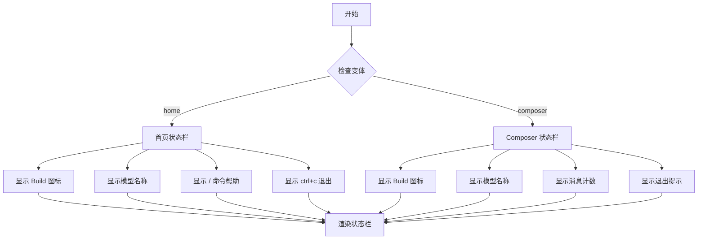

**图表来源**
- [src/agent/ui/Thread.tsx:209-242](file://src/agent/ui/Thread.tsx#L209-L242)

### 会话管理增强

**更新** 完善了会话查询、重放和验证功能。

```mermaid
flowchart TD
Start[开始会话管理] --> Query[querySessions(limit)]
Query --> Filter[过滤用户消息]
Filter --> Sort[按活跃度排序]
Sort --> Limit[限制数量]
Limit --> Format[格式化输出]
Format --> Display[显示表格]
Display --> Rewind[rewindThread(threadId)]
Rewind --> Validate[threadExists(threadId)]
Validate --> Exists{存在?}
Exists --> |是| Switch[切换会话]
Exists --> |否| Error[显示错误]
Switch --> Reset[runtime.thread.reset()]
Reset --> Success[成功]
Error --> End[结束]
Success --> End
```

**图表来源**
- [src/agent/sessions.ts:60-135](file://src/agent/sessions.ts#L60-L135)
- [src/agent/ui/Thread.tsx:259-262](file://src/agent/ui/Thread.tsx#L259-L262)

### 配置中心集成

**更新** 新增配置对话框和 Python 环境管理功能。

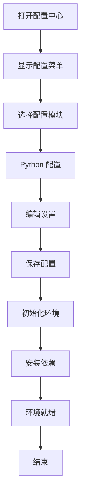

**图表来源**
- [src/agent/config.ts:71-146](file://src/agent/config.ts#L71-L146)

**章节来源**
- [src/agent/ui/adapter.ts:13-84](file://src/agent/ui/adapter.ts#L13-L84)
- [src/agent/slash_commands.ts:21-77](file://src/agent/slash_commands.ts#L21-L77)
- [src/agent/ui/Thread.tsx:163-207](file://src/agent/ui/Thread.tsx#L163-L207)
- [src/agent/ui/Thread.tsx:209-242](file://src/agent/ui/Thread.tsx#L209-L242)
- [src/agent/ui/Thread.tsx:244-371](file://src/agent/ui/Thread.tsx#L244-L371)
- [src/agent/sessions.ts:44-57](file://src/agent/sessions.ts#L44-L57)
- [src/agent/config.ts:71-146](file://src/agent/config.ts#L71-L146)

## 视ual Design System

**新增** 系统引入了完整的视觉设计系统，包含图形界面、渐变色彩和字体支持。

### 自动主题适配系统

**新增** 实现了完整的自动主题适配系统，根据终端背景自动切换 light/dark 色板：

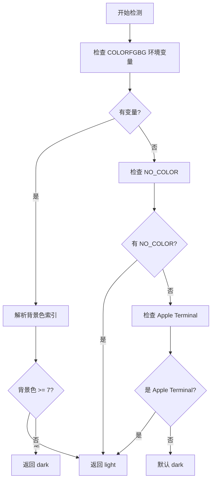

**图表来源**
- [src/agent/ui/theme.ts:14-46](file://src/agent/ui/theme.ts#L14-L46)

### 语义化主题系统

**新增** 实现了完整的语义化主题系统，使用 T 令牌统一管理所有颜色变量：

```mermaid
graph TB
subgraph "语义色板 T"
Primary[primary - 主强调色]
Accent[accent - 次强调色]
Cancel[cancel - 中断/错误]
TextBold[textBold - 高对比文本]
TextMuted[textMuted - 辅助文本]
TextSubtle[textSubtle - 极弱对比]
InputBg[inputBg - 输入区背景]
HomeBg[homeBg - 首页输入区背景]
Border[border - 边框]
SlashBg[slashBg - slash 高亮背景]
SlashFg[slashFg - slash 高亮前景]
FigletFrom[figletFrom - figlet 渐变起点]
FigletTo[figletTo - figlet 渐变终点]
end
subgraph "深色主题 DARK"
DarkPrimary[深蓝 #3b82f6]
DarkAccent[深橙 #f59e0b]
DarkCancel[深红 #f87171]
DarkTextBold[白色]
DarkTextMuted[灰色 #6b7280]
DarkTextSubtle[深灰 #4b5563]
DarkInputBg[深灰 #272626]
DarkBorder[暗灰 #3b3b3b]
DarkSlashBg[深蓝 #1e3a5f]
DarkSlashFg[白色]
DarkFigletFrom[浅蓝 #60a5fa]
DarkFigletTo[橙 #f59e0b]
end
subgraph "浅色主题 LIGHT"
LightPrimary[深蓝 #2563eb]
LightAccent[深橙 #d97706]
LightCancel[深红 #dc2626]
LightTextBold[近黑 #1f2937]
LightTextMuted[暖灰 #78716c]
LightTextSubtle[浅灰 #9ca3af]
LightInputBg[浅灰 #f5f5f5]
LightBorder[浅灰 #d4d4d4]
LightSlashBg[淡蓝 #dbeafe]
LightSlashFg[深蓝 #1e40af]
LightFigletFrom[深蓝 #1d4ed8]
LightFigletTo[深褐橙 #92400e]
end
T --> Primary
T --> Accent
T --> Cancel
T --> TextBold
T --> TextMuted
T --> TextSubtle
T --> InputBg
T --> HomeBg
T --> Border
T --> SlashBg
T --> SlashFg
T --> FigletFrom
T --> FigletTo
DARK --> DarkPrimary
DARK --> DarkAccent
DARK --> DarkCancel
DARK --> DarkTextBold
DARK --> DarkTextMuted
DARK --> DarkTextSubtle
DARK --> DarkInputBg
DARK --> DarkBorder
DARK --> DarkSlashBg
DARK --> DarkSlashFg
DARK --> DarkFigletFrom
DARK --> DarkFigletTo
LIGHT --> LightPrimary
LIGHT --> LightAccent
LIGHT --> LightCancel
LIGHT --> LightTextBold
LIGHT --> LightTextMuted
LIGHT --> LightTextSubtle
LIGHT --> LightInputBg
LIGHT --> LightBorder
LIGHT --> LightSlashBg
LIGHT --> LightSlashFg
LIGHT --> LightFigletFrom
LIGHT --> LightFigletTo
```

**图表来源**
- [src/agent/ui/theme.ts:52-85](file://src/agent/ui/theme.ts#L52-L85)

### Markdown 流式输出优化

**更新** 改进了 Markdown 流式渲染的预处理逻辑，确保未闭合语法的完整性：

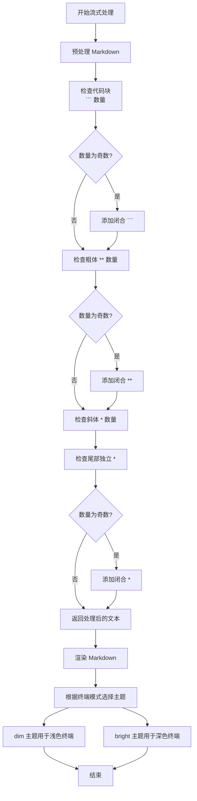

**图表来源**
- [src/agent/ui/Thread.tsx:29-44](file://src/agent/ui/Thread.tsx#L29-L44)
- [src/agent/ui/Thread.tsx:46-50](file://src/agent/ui/Thread.tsx#L46-L50)

### 色彩令牌系统

**新增** 定义了完整的色彩令牌系统，采用语义化命名和自动主题适配：

| 语义令牌 | 深色主题值 | 浅色主题值 | 用途 | 示例 |
|---------|-----------|-----------|------|------|
| primary | #3b82f6 | #2563eb | 主强调色（竖线/标签/图标） | `用户标签` |
| accent | #f59e0b | #d97706 | 次强调色（Tip/high/spinner） | `推理内容` |
| cancel | #f87171 | #dc2626 | 中断/错误 | `ESC 中断` |
| textBold | white | #1f2937 | 高对比文本（快捷键/模型名） | `模型状态` |
| textMuted | #6b7280 | #78716c | 辅助文本（说明/分隔） | `说明文字` |
| textSubtle | #4b5563 | #9ca3af | 极弱对比（版本号） | `版本号` |
| inputBg | #272626 | #f5f5f5 | 输入区背景 | `输入框背景` |
| homeBg | #272626 | #f5f5f5 | 首页输入区背景 | `首页输入区` |
| border | #3b3b3b | #d4d4d4 | 边框 | `边框颜色` |
| slashBg | #1e3a5f | #dbeafe | slash 高亮背景 | `命令面板` |
| slashFg | white | #1e40af | slash 高亮文字 | `命令名称` |
| figletFrom | #60a5fa | #1d4ed8 | figlet 渐变起点 | `大标题渐变` |
| figletTo | #f59e0b | #92400e | figlet 渐变终点 | `大标题渐变` |

### 配置面板设计

**新增** 系统包含了完整的配置面板设计，支持多步骤配置流程：

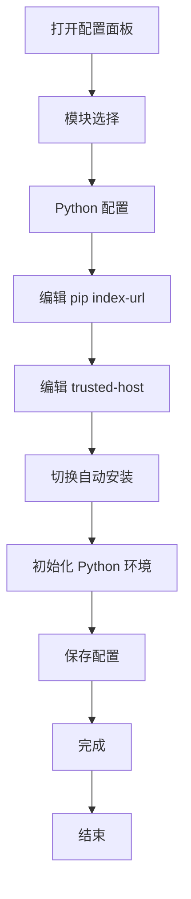

**图表来源**
- [src/agent/ui/ConfigPanel.tsx:33-203](file://src/agent/ui/ConfigPanel.tsx#L33-L203)

**章节来源**
- [src/agent/ui/theme.ts:52-85](file://src/agent/ui/theme.ts#L52-L85)
- [src/agent/ui/Thread.tsx:84-88](file://src/agent/ui/Thread.tsx#L84-L88)
- [src/agent/ui/Thread.tsx:204-226](file://src/agent/ui/Thread.tsx#L204-L226)
- [src/agent/ui/ConfigPanel.tsx:33-203](file://src/agent/ui/ConfigPanel.tsx#L33-L203)

## 依赖关系分析

项目依赖关系复杂但结构清晰，主要依赖包括：

```mermaid
graph TB
subgraph "核心依赖"
React[React ^19.2.7]
Ink[Ink ^7.1.0]
AssistantUI[@assistant-ui/react-ink ^0.0.29]
Markdown[@assistant-ui/react-ink-markdown ^0.0.28]
ConfigPanel[@inkjs/ui ^2.0.0]
end
subgraph "AI/LLM 依赖"
LangChain[LangChain ^1.4.4]
OpenAI[@langchain/openai ^1.4.7]
LangGraph[@langchain/langgraph ^1.3.7]
Checkpoint[@langchain/langgraph-checkpoint-sqlite ^1.0.3]
end
subgraph "工具类依赖"
Commander[commander ^15.0.0]
Chalk[chalk ^4.1.2]
Figlet[figlet ^1.11.0]
Boxen[boxen ^8.0.1]
CLI[cli-table3 ^0.6.5]
BetterSQLite3[better-sqlite3 ^12.11.1]
Inquirer[inquirer ^14.0.2]
end
subgraph "开发依赖"
Typescript[TypeScript ^6.0.3]
TSX[TSX ^4.22.4]
Vitest[Vitest ^4.1.8]
InkJS[@inkjs/ui ^2.0.0]
end
App --> React
App --> Ink
App --> AssistantUI
App --> Markdown
App --> ConfigPanel
App --> LangChain
App --> OpenAI
App --> LangGraph
App --> Checkpoint
App --> Commander
App --> Chalk
App --> Figlet
App --> Boxen
App --> BetterSQLite3
App --> Inquirer
```

**图表来源**
- [package.json:21-42](file://package.json#L21-L42)

**章节来源**
- [package.json:21-54](file://package.json#L21-L54)

## 性能考虑

### 流式处理优化

系统采用了高效的流式处理机制来提升用户体验：

1. **增量渲染**：AI 响应以 token 为单位实时显示
2. **背压控制**：通过队列机制防止内存溢出
3. **中断处理**：支持 ESC 键中断长耗时操作
4. **资源清理**：确保流式连接正确关闭
5. **Markdown 预处理**：优化未闭合语法的处理效率
6. **动态适配器**：避免频繁重建适配器实例
7. **Ref 缓存**：使用 Ref 对象缓存最新 threadId
8. **Slash 命令缓存**：命令匹配结果的缓存机制
9. **状态栏优化**：底部状态栏的高效渲染
10. **配置面板异步处理**：Python 环境初始化的异步处理

### 内存管理

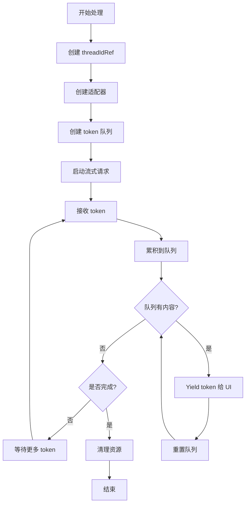

**图表来源**
- [src/agent/ui/adapter.ts:35-78](file://src/agent/ui/adapter.ts#L35-L78)

### 缓存策略

- **会话缓存**：使用 SQLite 存储会话历史
- **字体缓存**：预加载 figlet 字体避免重复加载
- **样式缓存**：颜色和主题配置的内存缓存
- **渐变缓存**：计算结果的临时缓存
- **主题缓存**：终端模式检测结果的缓存
- **适配器缓存**：动态适配器实例的缓存
- **命令缓存**：Slash 命令匹配结果的缓存
- **配置缓存**：用户配置的内存缓存
- **状态栏缓存**：底部状态栏的渲染缓存

## 故障排除指南

### 常见错误及解决方案

| 错误类型 | 错误信息 | 可能原因 | 解决方案 |
|---------|---------|---------|---------|
| 认证错误 | Content Exists Risk | 内容安全审查拦截 | 更换表述方式或简化查询 |
| API 错误 | 401 Incorrect API key | API 密钥无效 | 检查 .env 文件中的 OPENAI_API_KEY |
| 配额错误 | insufficient_quota 429 | API 额度不足 | 检查账户余额和使用情况 |
| 超时错误 | ETIMEDOUT timeout | 网络连接问题 | 检查网络连接后重试 |
| 递归限制 | Recursion limit | Agent 执行步数超限 | 将复杂任务分解为多个小步骤 |
| 字体加载失败 | figlet font error | Doom 字体不可用 | 系统自动回退到 Standard 字体 |
| 渐变渲染异常 | color interpolation error | 颜色值格式错误 | 检查色彩令牌配置 |
| 主题适配错误 | terminal mode detection | 环境变量解析失败 | 检查 COLORFGBG 和 NO_COLOR 设置 |
| Markdown 渲染异常 | markdown parsing error | 未闭合语法导致 | 使用预处理函数修复 |
| 适配器错误 | adapter creation failed | 工厂函数参数错误 | 检查 getThreadId 函数实现 |
| 线程ID错误 | threadId invalid | threadId 格式不正确 | 确保 threadId 符合 UUID 格式 |
| 会话查询失败 | database connection error | SQLite 连接问题 | 检查 .data/checkpointer.db 文件权限 |
| Slash 命令执行失败 | command execution error | 命令上下文错误 | 检查 Slash 命令处理器实现 |
| 配置面板错误 | config panel error | 配置文件损坏 | 检查配置文件格式和权限 |
| 状态栏渲染异常 | status bar rendering | 终端宽度检测失败 | 检查终端环境变量设置 |

### 调试技巧

1. **启用详细日志**：检查工具调用日志输出
2. **验证环境变量**：确认 OPENAI_API_KEY 和 OPENAI_MODEL 设置正确
3. **检查数据库连接**：验证 .data/checkpointer.db 文件可访问性
4. **测试网络连接**：确保能够访问 API 端点
5. **验证字体加载**：检查 figlet 字体是否正确加载
6. **调试渐变效果**：验证色彩令牌和插值算法
7. **检查主题适配**：验证终端模式检测逻辑
8. **测试 Markdown 流式**：验证预处理函数的修复效果
9. **调试适配器工厂**：验证动态 threadId 获取机制
10. **检查 Slash 命令**：验证命令匹配和执行逻辑
11. **调试配置面板**：验证配置文件的读写操作
12. **检查状态栏**：验证底部状态栏的渲染和布局
13. **测试动态线程ID**：验证 Ref 缓存和线程切换功能

**章节来源**
- [src/agent/ui/Thread.tsx:244-371](file://src/agent/ui/Thread.tsx#L244-L371)
- [src/agent/ui/ConfigPanel.tsx:33-203](file://src/agent/ui/ConfigPanel.tsx#L33-L203)

## 结论

onionCode 的 React 终端 UI 组件展现了现代 CLI 应用的最佳实践。通过精心设计的架构和丰富的功能特性，该组件为用户提供了流畅的 AI 助手体验。

**更新** 经过重大视觉重构和主题系统升级，系统现已具备完整的图形界面能力和智能化主题适配，SlashPanel 组件的功能也被成功集成到 Thread 组件中：

### 主要优势

1. **现代化界面**：基于 React Ink 的优雅终端界面
2. **高效性能**：流式处理和增量渲染提升响应速度
3. **丰富功能**：完整的 Slash 命令系统和会话管理
4. **全新视觉设计**：OpenCode 风格的图形界面
5. **语义化主题系统**：集中式颜色管理和自动主题适配
6. **智能 Markdown 处理**：优化的语法预处理和渲染
7. **figlet 字体支持**：大标题和品牌标识
8. **动态线程ID管理**：支持会话切换和重放
9. **适配器工厂函数**：灵活的适配器创建机制
10. **增强的 Slash 命令系统**：上下文绑定和命令执行
11. **会话查询和重放**：完善的会话管理功能
12. **配置中心集成**：Python 环境和工具配置管理
13. **底部状态栏设计**：StatusBarPrimitive 实现的现代化底部状态行
14. **SlashPanel 集成**：命令面板功能的无缝集成
15. **良好的扩展性**：模块化设计便于功能扩展
16. **稳定可靠**：完善的错误处理和资源管理
17. **跨平台兼容**：支持多种终端环境和主题模式

### 技术亮点

- **流式架构**：实现了真正的流式 AI 响应
- **语义化主题系统**：灵活的颜色配置和自动主题适配
- **智能 Markdown 处理**：优化的语法预处理和渲染
- **工具集成**：丰富的工具调用能力和安全性保障
- **会话持久化**：基于 SQLite 的智能会话管理
- **字体系统**：figlet 字体支持和自动回退机制
- **终端模式检测**：根据环境变量自动适配主题
- **动态适配器**：基于工厂函数的适配器创建机制
- **Ref 缓存**：高效的 threadId 管理和缓存策略
- **命令上下文**：Slash 命令的上下文绑定和执行机制
- **会话查询**：基于 SQLite 的会话管理和重放功能
- **配置管理**：完整的配置中心和环境管理
- **底部状态栏**：现代化的状态栏设计和布局
- **SlashPanel 集成**：命令面板功能的无缝集成
- **配置面板**：多步骤配置流程的设计和实现

该组件为构建高质量的 CLI AI 应用提供了优秀的参考实现，其设计理念和架构模式值得在类似项目中借鉴和学习。