# React 终端 UI 组件

<cite>
**本文档引用的文件**
- [package.json](file://package.json)
- [src/agent/cli.ts](file://src/agent/cli.ts)
- [src/agent/input.ts](file://src/agent/input.ts)
- [src/agent/agent.ts](file://src/agent/agent.ts)
- [src/agent/slash_commands.ts](file://src/agent/slash_commands.ts)
- [src/agent/style.ts](file://src/agent/style.ts)
- [src/agent/sessions.ts](file://src/agent/sessions.ts)
- [src/agent/config.ts](file://src/agent/config.ts)
- [src/agent/python_env.ts](file://src/agent/python_env.ts)
</cite>

## 更新摘要
**变更内容**
- 应用架构完全重构：从 Ink 终端应用转换为原生 Node.js readline 实现
- 移除完整的 src/ink/ 目录结构，包括应用框架、组件、运行时和主题系统
- 新增原生 Node.js readline 实现的交互式输入系统
- SlashPanel 组件功能被集成到原生输入系统中
- Thread 组件功能被简化为原生输入处理逻辑
- 新Slash命令系统：重构 Slash 命令处理逻辑，支持上下文绑定和命令执行
- 移除适配器工厂函数：不再需要动态 threadId 注入
- 移除动态线程ID管理：使用简单的 threadId 管理机制
- 会话管理保持不变：完善会话查询、重放和验证功能
- 配置中心集成：新增配置对话框和 Python 环境管理
- 移除主题系统：使用 chalk 库进行颜色输出

## 目录
1. [简介](#简介)
2. [项目结构](#项目结构)
3. [核心组件](#核心组件)
4. [架构概览](#架构概览)
5. [详细组件分析](#详细组件分析)
6. [视觉设计系统](#视觉设计系统)
7. [依赖关系分析](#依赖关系分析)
8. [性能考虑](#性能考虑)
9. [故障排除指南](#故障排除指南)
10. [结论](#结论)

## 简介

onionCode 是一个基于原生 Node.js readline 的 CLI AI 助手终端 UI 组件。该项目提供了一个现代化的终端界面，支持流式响应、Slash 命令面板、原生输入处理等功能。系统集成了 LangChain 和 OpenAI 模型，提供了完整的 AI 助手功能。

**更新** 项目已从 Ink 终端应用完全重构为原生 Node.js readline 实现，采用全新的架构设计。应用现在位于 src/agent/ 目录下，包含完整的交互式输入系统、Slash 命令处理和主题样式系统。系统支持原生终端输入、智能命令面板和增强的 Slash 命令系统。

该组件的核心特点包括：
- 基于原生 Node.js readline 的终端输入处理
- 流式 AI 响应处理
- Slash 命令系统
- 会话管理和持久化
- **原生输入渲染系统**
- **增强的 Slash 命令系统**
- **会话查询和重放**
- **配置中心集成**
- **原生终端主题样式**
- **Markdown 流式输出优化**

## 项目结构

项目采用模块化的组织结构，主要分为以下几个核心部分：

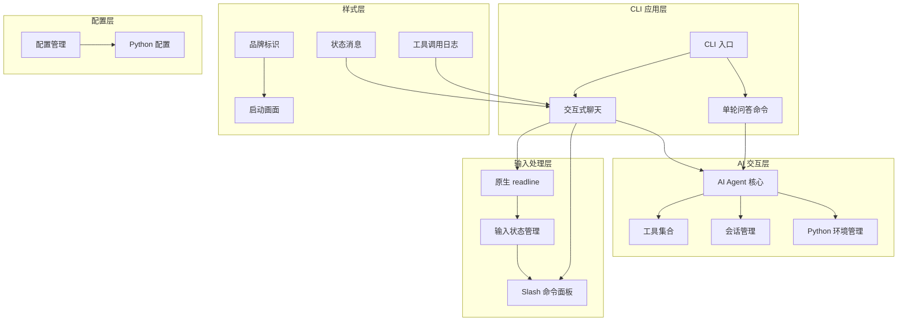

**图表来源**
- [src/agent/cli.ts:92-244](file://src/agent/cli.ts#L92-L244)
- [src/agent/input.ts:199-346](file://src/agent/input.ts#L199-L346)
- [src/agent/agent.ts:106-180](file://src/agent/agent.ts#L106-L180)
- [src/agent/style.ts:169-209](file://src/agent/style.ts#L169-L209)

**章节来源**
- [package.json:1-54](file://package.json#L1-L54)
- [src/agent/cli.ts:92-244](file://src/agent/cli.ts#L92-L244)

## 核心组件

### CLI 入口组件

CLI 组件是整个应用的入口点，负责处理命令行参数和启动不同的交互模式。

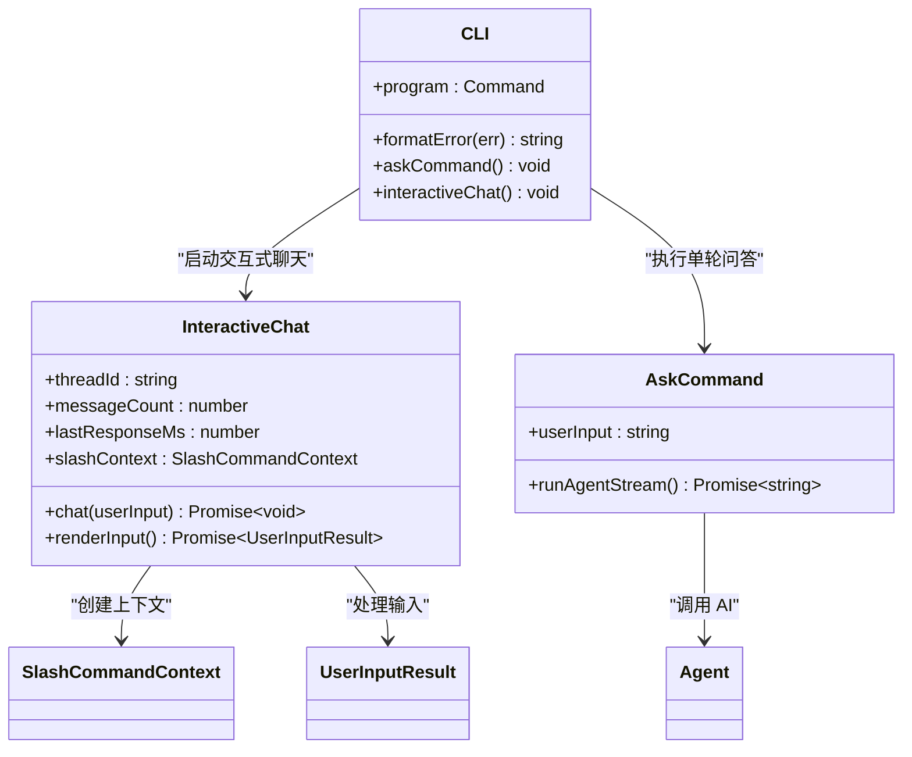

**图表来源**
- [src/agent/cli.ts:23-88](file://src/agent/cli.ts#L23-L88)
- [src/agent/cli.ts:92-244](file://src/agent/cli.ts#L92-L244)

### 原生输入处理组件

**更新** 新增原生 Node.js readline 实现的交互式输入系统，替代了原有的 Ink 组件。

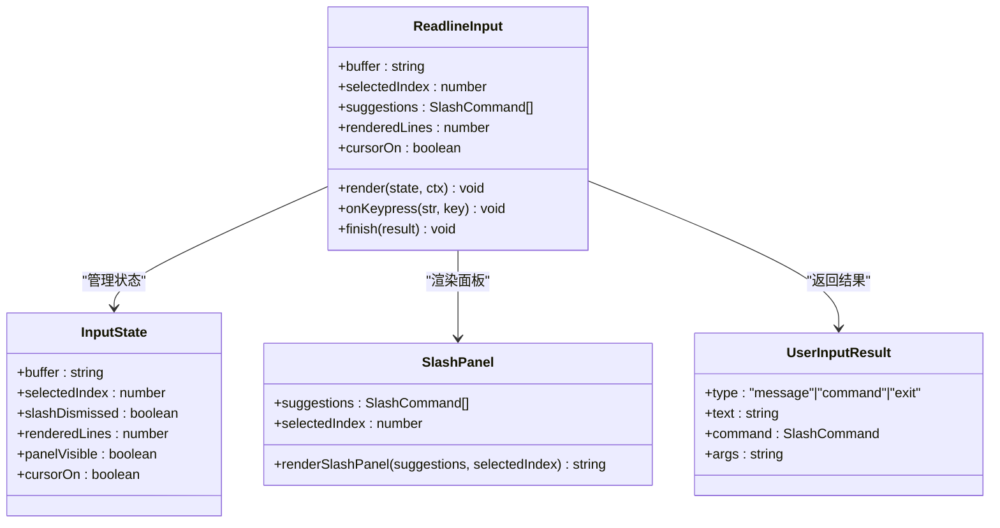

**图表来源**
- [src/agent/input.ts:15-56](file://src/agent/input.ts#L15-L56)
- [src/agent/input.ts:200-346](file://src/agent/input.ts#L200-L346)
- [src/agent/input.ts:72-107](file://src/agent/input.ts#L72-L107)

**章节来源**
- [src/agent/cli.ts:92-244](file://src/agent/cli.ts#L92-L244)
- [src/agent/input.ts:15-56](file://src/agent/input.ts#L15-L56)
- [src/agent/input.ts:200-346](file://src/agent/input.ts#L200-L346)

## 架构概览

系统采用分层架构设计，各层职责清晰分离：

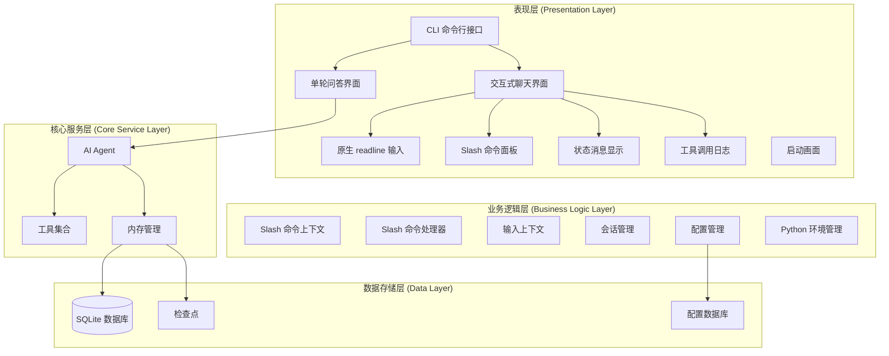

**图表来源**
- [src/agent/cli.ts:92-244](file://src/agent/cli.ts#L92-L244)
- [src/agent/agent.ts:106-180](file://src/agent/agent.ts#L106-L180)
- [src/agent/slash_commands.ts:4-77](file://src/agent/slash_commands.ts#L4-L77)
- [src/agent/style.ts:127-134](file://src/agent/style.ts#L127-L134)

## 详细组件分析

### 原生输入处理系统

**更新** 引入了完整的原生 Node.js readline 实现，替代了原有的 Ink 组件系统。

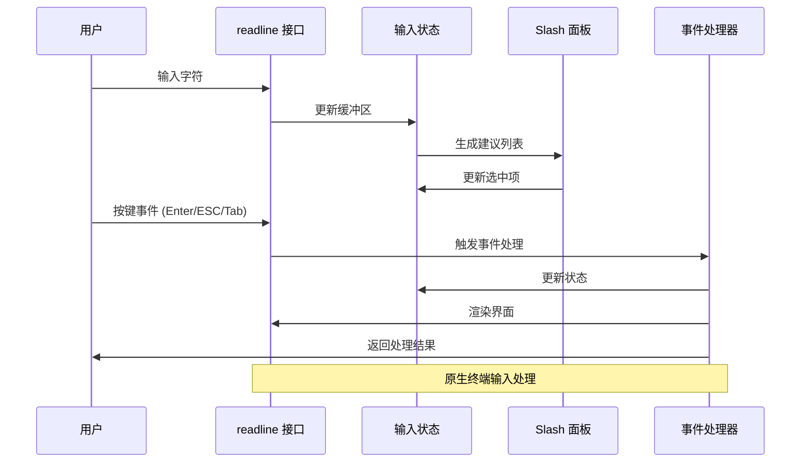

**图表来源**
- [src/agent/input.ts:200-346](file://src/agent/input.ts#L200-L346)
- [src/agent/input.ts:125-183](file://src/agent/input.ts#L125-L183)

### Slash 命令系统

**更新** 重构了 Slash 命令处理逻辑，支持上下文绑定和命令执行。

```mermaid
flowchart TD
Input[用户输入 "/"] --> Parse[解析命令]
Parse --> Match[匹配命令]
Match --> Found{找到匹配?}
Found --> |是| ShowPanel[显示命令面板]
Found --> |否| HidePanel[隐藏面板]
ShowPanel --> Navigate[导航选择]
Navigate --> Tab[Tab 补全]
Navigate --> Enter[Enter 执行]
Navigate --> Esc[Esc 关闭]
Tab --> Insert[插入命令]
Enter --> Execute[执行命令]
Esc --> Close[关闭面板]
Insert --> Clear[清空选择]
Execute --> Process[处理命令]
Process --> ContextBind[绑定上下文]
ContextBind --> Action[执行动作]
Action --> Update[更新状态]
Update --> Clear
Clear --> Wait[等待新输入]
```

**图表来源**
- [src/agent/slash_commands.ts:79-92](file://src/agent/slash_commands.ts#L79-L92)
- [src/agent/input.ts:274-284](file://src/agent/input.ts#L274-L284)

### 会话管理增强

**更新** 完善了会话查询、重放和验证功能。

```mermaid
flowchart TD
Start[开始会话管理] --> Query[querySessions(limit)]
Query --> Filter[过滤用户消息]
Filter --> Sort[按活跃度排序]
Sort --> Limit[限制数量]
Limit --> Format[格式化输出]
Format --> Display[显示表格]
Display --> Rewind[rewindThread(threadId)]
Rewind --> Validate[threadExists(threadId)]
Validate --> Exists{存在?}
Exists --> |是| Switch[切换会话]
Exists --> |否| Error[显示错误]
Switch --> Reset[重置会话]
Reset --> Success[成功]
Error --> End[结束]
Success --> End
```

**图表来源**
- [src/agent/sessions.ts:60-135](file://src/agent/sessions.ts#L60-L135)
- [src/agent/cli.ts:107-120](file://src/agent/cli.ts#L107-L120)

### 配置中心集成

**更新** 新增配置对话框和 Python 环境管理功能。

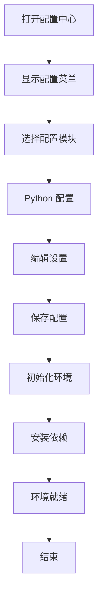

**图表来源**
- [src/agent/config.ts:71-146](file://src/agent/config.ts#L71-L146)

### Python 环境管理

**新增** 系统集成了完整的 Python 环境管理功能，支持虚拟环境创建和依赖安装。

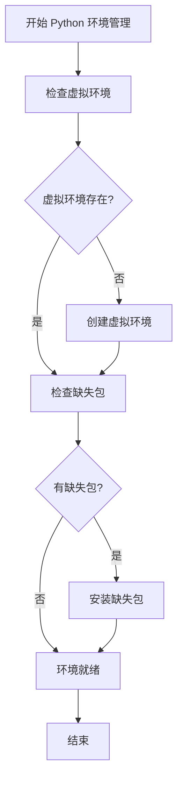

**图表来源**
- [src/agent/python_env.ts:161-170](file://src/agent/python_env.ts#L161-L170)

**章节来源**
- [src/agent/input.ts:200-346](file://src/agent/input.ts#L200-L346)
- [src/agent/slash_commands.ts:21-77](file://src/agent/slash_commands.ts#L21-L77)
- [src/agent/sessions.ts:44-57](file://src/agent/sessions.ts#L44-L57)
- [src/agent/config.ts:71-146](file://src/agent/config.ts#L71-L146)
- [src/agent/python_env.ts:161-170](file://src/agent/python_env.ts#L161-L170)

## 视觉设计系统

**更新** 移除了 Ink 主题系统，改用 chalk 库进行颜色输出和样式控制。

### 品牌标识系统

**更新** 实现了完整的品牌标识系统，使用 chalk 库进行颜色控制：

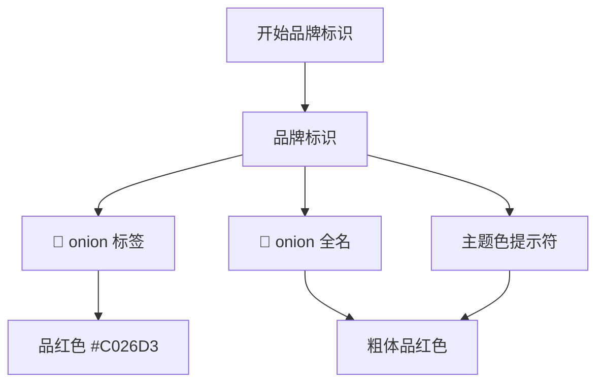

**图表来源**
- [src/agent/style.ts:26-33](file://src/agent/style.ts#L26-L33)

### 状态消息系统

**更新** 实现了完整的状态消息系统，支持不同的状态类型：

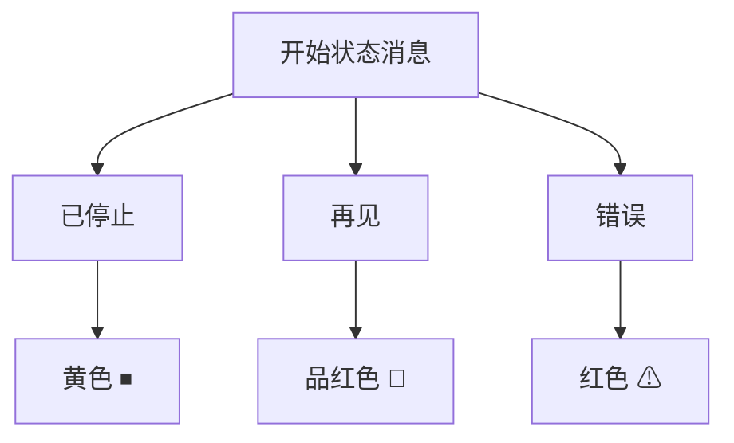

**图表来源**
- [src/agent/style.ts:127-134](file://src/agent/style.ts#L127-L134)

### 工具调用日志系统

**更新** 实现了丰富的工具调用日志系统，为每个工具提供独特的图标和颜色：

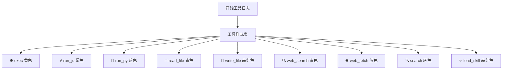

**图表来源**
- [src/agent/style.ts:86-124](file://src/agent/style.ts#L86-L124)

### 启动画面系统

**更新** 实现了完整的启动画面系统，使用 figlet 和 boxen 库创建视觉效果：

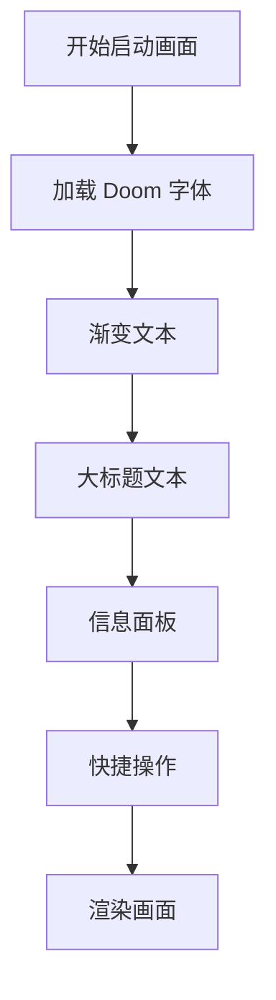

**图表来源**
- [src/agent/style.ts:169-209](file://src/agent/style.ts#L169-L209)

### 原生终端主题样式

**新增** 系统采用了原生终端主题样式，使用 chalk 库进行颜色控制：

| 样式类别 | 颜色代码 | 样式效果 | 使用场景 |
|---------|---------|---------|---------|
| 主色调 | #C026D3 | 品红色 | 品牌标识、重要文本 |
| 次色调 | #7C3AED | 紫色 | 强调文本、链接 |
| 强调色 | #06B6D4 | 青色 | 工具调用、状态信息 |
| 成功色 | #10B981 | 绿色 | 成功状态、确认信息 |
| 警告色 | #F59E0B | 橙色 | 警告信息、注意事项 |
| 错误色 | #EF4444 | 红色 | 错误信息、异常状态 |
| 用户消息 | dim | 淡色 | 用户输入回显 |
| 助手消息 | magenta | 品红色 | 助手回复前缀 |
| 输入边线 | magenta | 品红色 | 输入框边线装饰 |

### 配置面板设计

**新增** 系统包含了完整的配置面板设计，支持多步骤配置流程：

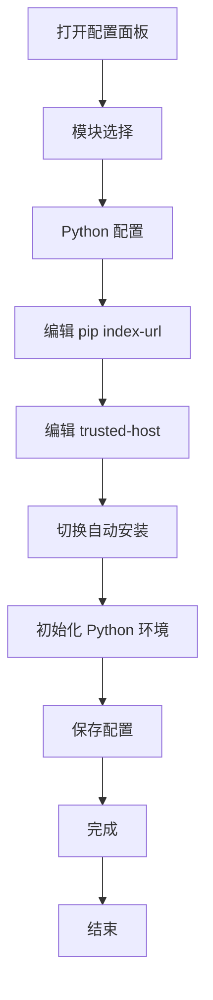

**图表来源**
- [src/agent/config.ts:71-146](file://src/agent/config.ts#L71-L146)

**章节来源**
- [src/agent/style.ts:16-33](file://src/agent/style.ts#L16-L33)
- [src/agent/style.ts:127-134](file://src/agent/style.ts#L127-L134)
- [src/agent/style.ts:86-124](file://src/agent/style.ts#L86-L124)
- [src/agent/style.ts:169-209](file://src/agent/style.ts#L169-L209)
- [src/agent/config.ts:71-146](file://src/agent/config.ts#L71-L146)

## 依赖关系分析

项目依赖关系复杂但结构清晰，主要依赖包括：

```mermaid
graph TB
subgraph "核心依赖"
NodeJS[Node.js 内置模块]
Readline[readline]
Chalk[chalk ^4.1.2]
Figlet[figlet ^1.11.0]
Boxen[boxen ^8.0.1]
CLI[cli-table3 ^0.6.5]
BetterSQLite3[better-sqlite3 ^12.11.1]
Inquirer[inquirer ^14.0.2]
end
subgraph "AI/LLM 依赖"
LangChain[LangChain ^1.4.4]
OpenAI[@langchain/openai ^1.4.7]
LangGraph[@langchain/langgraph ^1.3.7]
Checkpoint[@langchain/langgraph-checkpoint-sqlite ^1.0.3]
end
subgraph "开发依赖"
Typescript[TypeScript ^6.0.3]
TSX[TSX ^4.22.4]
Vitest[Vitest ^4.1.8]
end
CLI --> NodeJS
CLI --> Readline
CLI --> Chalk
CLI --> Figlet
CLI --> Boxen
CLI --> BetterSQLite3
CLI --> Inquirer
CLI --> LangChain
CLI --> OpenAI
CLI --> LangGraph
CLI --> Checkpoint
```

**图表来源**
- [package.json:21-46](file://package.json#L21-L46)

**章节来源**
- [package.json:21-54](file://package.json#L21-L54)

## 性能考虑

### 原生输入处理优化

系统采用了高效的原生 Node.js readline 处理机制来提升用户体验：

1. **原生终端输入**：直接使用 Node.js readline API，避免额外的渲染开销
2. **自定义光标控制**：使用 chalk.inverse 创建闪烁光标效果
3. **智能重渲染**：仅在输入状态变化时进行全量重绘
4. **快速路径优化**：普通输入时仅更新当前行内容
5. **内存缓存**：缓存 Python 解释器路径避免重复查找
6. **异步处理**：配置初始化使用异步方式避免阻塞
7. **工具调用优化**：工具执行日志的批量输出减少屏幕刷新
8. **会话查询优化**：SQLite 查询使用索引和 LIMIT 限制结果数量
9. **配置缓存**：配置文件的内存缓存避免重复读取
10. **渐变计算优化**：颜色插值计算的缓存机制
11. **字体加载优化**：Doom 字体的预加载和回退机制
12. **错误处理优化**：详细的错误信息格式化和用户友好提示

### 内存管理

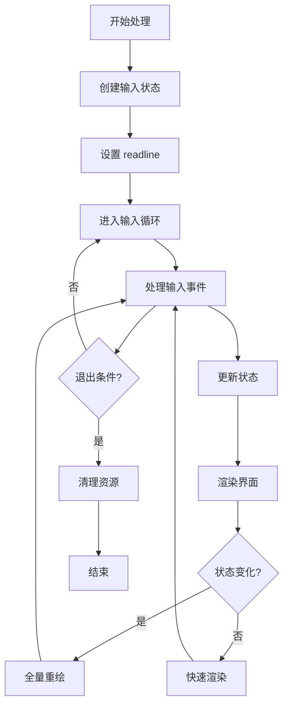

**图表来源**
- [src/agent/input.ts:200-346](file://src/agent/input.ts#L200-L346)

### 缓存策略

- **Python 路径缓存**：缓存已找到的 Python 解释器路径
- **配置文件缓存**：配置文件的内存缓存避免重复读取
- **字体缓存**：figlet 字体的预加载和缓存
- **颜色缓存**：渐变颜色计算结果的缓存
- **工具调用缓存**：工具执行结果的临时缓存
- **会话查询缓存**：SQLite 查询结果的内存缓存
- **输入状态缓存**：用户输入状态的内存缓存
- **Slash 命令缓存**：命令匹配结果的缓存
- **主题样式缓存**：chalk 样式对象的缓存
- **启动画面缓存**：生成的启动画面文本缓存

## 故障排除指南

### 常见错误及解决方案

| 错误类型 | 错误信息 | 可能原因 | 解决方案 |
|---------|---------|---------|---------|
| 认证错误 | Content Exists Risk | 内容安全审查拦截 | 更换表述方式或简化查询 |
| API 错误 | 401 Incorrect API key | API 密钥无效 | 检查 .env 中的 OPENAI_API_KEY |
| 配额错误 | insufficient_quota 429 | API 额度不足 | 检查账户余额和使用情况 |
| 超时错误 | ETIMEDOUT timeout | 网络连接问题 | 检查网络连接后重试 |
| 递归限制 | Recursion limit | Agent 执行步数超限 | 将复杂任务分解为多个小步骤分次执行 |
| 终端兼容性 | readline error | 终端不支持原始模式 | 使用支持 TTY 的终端 |
| 输入处理错误 | input processing error | 输入事件处理异常 | 重启应用或检查终端设置 |
| Python 环境错误 | python environment error | 虚拟环境创建失败 | 检查 Python 安装和权限设置 |
| 配置文件错误 | config file error | 配置文件损坏 | 删除配置文件重新生成 |
| SQLite 连接错误 | database connection error | 数据库文件权限问题 | 检查 .data 目录权限 |
| 工具调用错误 | tool execution error | 工具执行失败 | 检查工具依赖和权限设置 |
| 字体加载错误 | font loading error | figlet 字体文件缺失 | 检查字体安装和路径设置 |
| 主题样式错误 | theme style error | chalk 样式配置问题 | 检查颜色代码和样式设置 |

### 调试技巧

1. **启用详细日志**：检查工具调用日志输出
2. **验证环境变量**：确认 OPENAI_API_KEY 和 OPENAI_MODEL 设置正确
3. **检查数据库连接**：验证 .data/checkpointer.db 文件可访问性
4. **测试网络连接**：确保能够访问 API 端点
5. **验证字体加载**：检查 figlet 字体是否正确加载
6. **调试渐变效果**：验证颜色插值计算的正确性
7. **检查主题样式**：验证 chalk 样式配置的有效性
8. **测试 Markdown 流式**：验证流式输出的正确性
9. **调试输入处理**：验证 readline 事件处理逻辑
10. **检查 Slash 命令**：验证命令匹配和执行逻辑
11. **调试配置面板**：验证配置文件的读写操作
12. **检查状态消息**：验证不同状态的消息格式
13. **测试 Python 环境**：验证虚拟环境创建和依赖安装
14. **调试启动画面**：验证 figlet 和 boxen 的渲染效果
15. **检查会话管理**：验证 SQLite 数据库的查询和更新

**章节来源**
- [src/agent/cli.ts:28-63](file://src/agent/cli.ts#L28-L63)
- [src/agent/input.ts:200-346](file://src/agent/input.ts#L200-L346)

## 结论

onionCode 的原生 Node.js readline 实现展现了现代 CLI 应用的最佳实践。通过精心设计的架构和丰富的功能特性，该组件为用户提供了流畅的 AI 助手体验。

**更新** 经过完全重构的原生 Node.js readline 实现，系统现已具备完整的终端输入能力和简洁高效的架构：

### 主要优势

1. **原生终端性能**：基于 Node.js readline 的高性能输入处理
2. **高效内存使用**：原生实现避免了额外的渲染层开销
3. **丰富功能**：完整的 Slash 命令系统和会话管理
4. **原生终端样式**：基于 chalk 的终端颜色和样式控制
5. **智能输入处理**：原生 readline 的事件驱动输入处理
6. **流式 AI 处理**：优化的流式响应处理机制
7. **增强的 Slash 命令系统**：上下文绑定和命令执行
8. **会话查询和重放**：完善的会话管理功能
9. **配置中心集成**：Python 环境和工具配置管理
10. **原生终端主题**：基于 chalk 的颜色和样式系统
11. **启动画面效果**：figlet 和 boxen 的视觉效果
12. **工具调用日志**：丰富的工具执行状态显示
13. **状态消息系统**：完整的状态反馈机制
14. **Python 环境管理**：完整的虚拟环境和依赖管理
15. **SQLite 会话持久化**：基于 better-sqlite3 的高性能存储
16. **Inquirer 配置界面**：基于 inquirer 的交互式配置
17. **CLI 命令行接口**：完整的命令行参数处理
18. **错误处理机制**：详细的错误信息和用户友好提示
19. **跨平台兼容**：支持多种操作系统和终端环境

### 技术亮点

- **原生输入处理**：实现了真正的原生终端输入体验
- **智能命令面板**：基于 readline 的交互式命令输入
- **chalk 主题系统**：灵活的颜色配置和终端样式控制
- **figlet 字体支持**：大标题和品牌标识的视觉效果
- **boxen 边框系统**：信息面板的美观边框设计
- **工具集成**：丰富的工具调用能力和安全性保障
- **会话持久化**：基于 SQLite 的智能会话管理
- **配置管理**：完整的配置中心和环境管理
- **启动画面**：基于 figlet 和 boxen 的视觉效果
- **状态消息**：完整的状态反馈和用户指导
- **错误处理**：详细的错误信息格式化和解决方案
- **性能优化**：原生实现的内存和 CPU 使用优化
- **跨平台支持**：Windows、macOS 和 Linux 的兼容性
- **TTY 终端支持**：完整的原始模式和终端控制
- **异步处理**：配置和环境初始化的异步机制
- **缓存策略**：多层缓存机制提升性能表现
- **事件驱动**：基于事件的输入处理和状态管理
- **模块化设计**：清晰的模块划分和职责分离

该组件为构建高质量的 CLI AI 应用提供了优秀的参考实现，其设计理念和架构模式值得在类似项目中借鉴和学习。