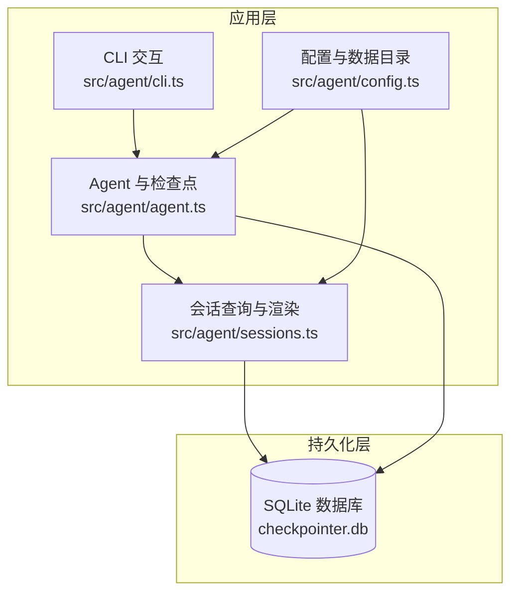
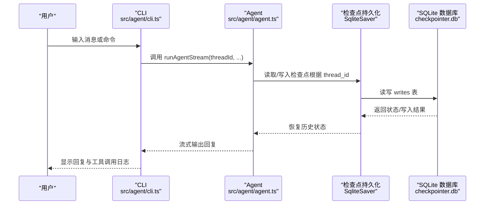
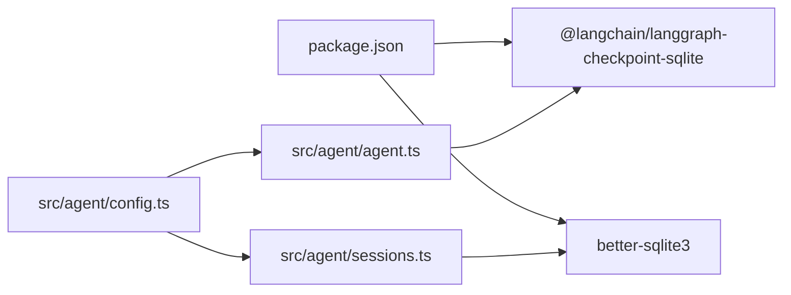
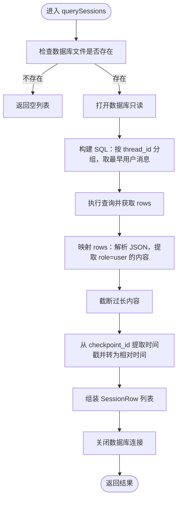

# SQLite 会话持久化

<cite>
**本文引用的文件**
- [package.json](file://package.json)
- [tsconfig.json](file://tsconfig.json)
- [src/agent/agent.ts](file://src/agent/agent.ts)
- [src/agent/sessions.ts](file://src/agent/sessions.ts)
- [src/agent/config.ts](file://src/agent/config.ts)
- [src/agent/cli.ts](file://src/agent/cli.ts)
- [pnpm-lock.yaml](file://pnpm-lock.yaml)
</cite>

## 目录
1. [简介](#简介)
2. [项目结构](#项目结构)
3. [核心组件](#核心组件)
4. [架构总览](#架构总览)
5. [组件详解](#组件详解)
6. [依赖关系分析](#依赖关系分析)
7. [性能与优化](#性能与优化)
8. [故障排查与恢复](#故障排查与恢复)
9. [结论](#结论)
10. [附录](#附录)

## 简介
本文件面向系统管理员与开发者，系统性说明 Onion Code 的 SQLite 会话持久化能力。基于 LangGraph 的 SQLite 检查点（checkpointer）实现，项目通过 SqliteSaver 将会话状态持久化至本地 SQLite 数据库，支持：
- 会话 ID（thread_id）管理与历史检索
- 检查点（checkpoint）存储与恢复
- 会话列表展示与快速切换
- 基于 UUIDv7 的时间戳提取与相对时间展示

## 项目结构
与 SQLite 会话持久化直接相关的代码集中在 agent 子模块中，主要文件如下：
- 会话持久化与查询：src/agent/agent.ts、src/agent/sessions.ts
- 配置与数据目录：src/agent/config.ts
- CLI 交互与会话管理：src/agent/cli.ts
- 依赖声明与构建配置：package.json、tsconfig.json、pnpm-lock.yaml

图表来源
- [src/agent/agent.ts:62-67](file://src/agent/agent.ts#L62-L67)
- [src/agent/sessions.ts:44-57](file://src/agent/sessions.ts#L44-L57)
- [src/agent/config.ts:33-35](file://src/agent/config.ts#L33-L35)

章节来源
- [src/agent/agent.ts:62-67](file://src/agent/agent.ts#L62-L67)
- [src/agent/sessions.ts:44-57](file://src/agent/sessions.ts#L44-L57)
- [src/agent/config.ts:33-35](file://src/agent/config.ts#L33-L35)

## 核心组件
- SqliteSaver（检查点持久化）
  - 通过 fromConnString 初始化，连接本地 SQLite 数据库文件
  - 与 LangGraph Agent 绑定，实现状态的自动保存与恢复
- 会话查询与展示
  - 读取 writes 表，按 thread_id 聚合，提取最早用户消息作为“最后问题”
  - 使用 UUIDv7 的时间戳推导相对时间
- 会话 ID 管理
  - CLI 默认使用随机 UUID 作为 thread_id；支持 /sessions 列表与 /rewindThread 切换
- 数据目录与路径
  - .data 目录用于存放 checkpointer.db 与配置文件

章节来源
- [src/agent/agent.ts:62-67](file://src/agent/agent.ts#L62-L67)
- [src/agent/sessions.ts:60-135](file://src/agent/sessions.ts#L60-L135)
- [src/agent/cli.ts:80-108](file://src/agent/cli.ts#L80-L108)
- [src/agent/config.ts:33-35](file://src/agent/config.ts#L33-L35)

## 架构总览
下图展示了从 CLI 到 Agent、再到 SQLite 的端到端流程。

图表来源
- [src/agent/cli.ts:142-165](file://src/agent/cli.ts#L142-L165)
- [src/agent/agent.ts:106-121](file://src/agent/agent.ts#L106-L121)
- [src/agent/agent.ts:62-67](file://src/agent/agent.ts#L62-L67)

## 组件详解

### SqliteSaver 配置与使用
- 初始化位置与连接字符串
  - 在 agent.ts 中通过 fromConnString 指定数据库文件路径为 .data/checkpointer.db
  - 启动时确保 .data 目录存在
- 与 LangGraph 集成
  - 将 checkpointer 注入 createAgent，使每次流式处理自动保存/恢复状态
- 会话 ID（thread_id）
  - runAgentStream 的 configurable.thread_id 即为会话标识
  - CLI 默认使用 randomUUID 生成新会话；/rewindThread 可切换历史会话

章节来源
- [src/agent/agent.ts:62-67](file://src/agent/agent.ts#L62-L67)
- [src/agent/agent.ts:106-121](file://src/agent/agent.ts#L106-L121)
- [src/agent/cli.ts:80-108](file://src/agent/cli.ts#L80-L108)

### 会话 ID 管理与历史记录
- 生成与切换
  - 新建：randomUUID 生成新的 thread_id
  - 切换：/rewindThread 指定目标 thread_id，先校验是否存在
- 历史记录存储与查询
  - 会话历史存放在 writes 表（由 @langchain/langgraph-checkpoint-sqlite 管理）
  - 查询逻辑按 thread_id 分组，取最早用户消息（role=user）作为“最后问题”，并按最近活跃（最大 checkpoint_id）排序

章节来源
- [src/agent/cli.ts:80-108](file://src/agent/cli.ts#L80-L108)
- [src/agent/sessions.ts:60-135](file://src/agent/sessions.ts#L60-L135)

### 数据库 Schema 设计与约束
- 表结构与字段
  - writes 表：用于存储检查点数据，包含 thread_id、channel、checkpoint_id、value 等字段
  - 其他辅助表：由 LangGraph 检查点库维护（如对齐、序列化等）
- 索引策略
  - writes 表通常针对 thread_id、checkpoint_id、channel 建有索引，以支持按会话检索与时间线回放
- 数据完整性
  - 通过外键与唯一约束保证同一会话内检查点的有序性与去重
  - value 字段存储序列化后的消息数组，查询时需解析 JSON 并筛选 role=user 的内容

章节来源
- [src/agent/sessions.ts:60-135](file://src/agent/sessions.ts#L60-L135)

### 检查点机制工作原理
- 状态保存时机
  - LangGraph 在每一步消息处理后自动调用检查点保存，确保异常中断后可恢复
- 内存管理
  - 仅将必要状态写入 SQLite，避免在内存中缓存全部历史
- 性能影响
  - 顺序写入与按会话聚合查询，整体开销与会话数量、消息长度成正比
  - 对 writes 表的查询通过索引优化，避免全表扫描

章节来源
- [src/agent/agent.ts:106-121](file://src/agent/agent.ts#L106-L121)
- [src/agent/sessions.ts:60-135](file://src/agent/sessions.ts#L60-L135)

### 查询优化与展示
- 查询策略
  - 每个 thread_id 取最早用户消息（MIN(checkpoint_id)）作为“最后问题”
  - 按最近活跃（MAX(checkpoint_id)）倒序，限制返回条数
- 展示优化
  - 截断过长的问题内容，提取 UUIDv7 时间戳生成相对时间
  - CLI 使用表格渲染，便于管理员快速定位历史会话

章节来源
- [src/agent/sessions.ts:60-135](file://src/agent/sessions.ts#L60-L135)
- [src/agent/cli.ts:91-94](file://src/agent/cli.ts#L91-L94)

### 故障恢复与数据迁移
- 常见问题与处理
  - 数据库文件损坏：删除 .data/checkpointer.db 后重启，系统将重建默认结构（注意：历史会话丢失）
  - 会话不存在：/rewindThread 会提示找不到会话，建议使用 /sessions 查看列表
  - 权限问题：确保 .data 目录可读写
- 数据迁移
  - 备份：复制 .data 目录到安全位置
  - 迁移到新环境：将备份的 .data 目录还原到新机器的相同路径
  - 版本升级：LangGraph 检查点库可能更新 schema，升级后若出现兼容问题，可删除旧数据库文件并重新开始

章节来源
- [src/agent/sessions.ts:44-57](file://src/agent/sessions.ts#L44-L57)
- [src/agent/cli.ts:95-107](file://src/agent/cli.ts#L95-L107)

## 依赖关系分析
- 关键依赖
  - @langchain/langgraph-checkpoint-sqlite：提供 SqliteSaver 实现
  - better-sqlite3：底层 SQLite 访问库
- 构建与运行
  - tsconfig.json 使用 nodenext 模块解析，严格类型检查
  - package.json 定义了开发与运行脚本，构建产物输出到 dist

图表来源
- [package.json:21-37](file://package.json#L21-L37)
- [src/agent/agent.ts:1-3](file://src/agent/agent.ts#L1-L3)
- [src/agent/sessions.ts:1-6](file://src/agent/sessions.ts#L1-L6)
- [src/agent/config.ts:33-35](file://src/agent/config.ts#L33-L35)

章节来源
- [package.json:21-37](file://package.json#L21-L37)
- [tsconfig.json:2-16](file://tsconfig.json#L2-L16)
- [pnpm-lock.yaml:17-28](file://pnpm-lock.yaml#L17-L28)

## 性能与优化
- I/O 模式
  - 顺序写入检查点，读取采用索引查询，适合中小规模并发
- 缓存与内存
  - 通过只读查询减少写锁竞争；流式输出避免一次性加载全部历史
- 索引与查询
  - 建议保持默认索引；避免在 writes 上进行复杂联接或全文检索
- 磁盘空间
  - 定期清理长期无活动的会话；可通过外部脚本定期归档或删除旧数据

[本节为通用性能建议，无需特定文件引用]

## 故障排查与恢复
- 常见错误与提示
  - API Key/认证失败：检查 .env 中 OPENAI_API_KEY 或相关配置
  - 请求超时：检查网络与代理设置
  - 递归限制：适当拆分复杂任务
- 数据库问题
  - 无法打开数据库：确认 .data 目录权限与磁盘空间
  - 会话不可用：使用 /sessions 查看列表，确认 thread_id 存在
- 恢复步骤
  - 临时修复：删除 .data/checkpointer.db，重启后重建
  - 完整迁移：备份 .data 目录，迁移到新环境后恢复

章节来源
- [src/agent/cli.ts:16-51](file://src/agent/cli.ts#L16-L51)
- [src/agent/sessions.ts:44-57](file://src/agent/sessions.ts#L44-L57)

## 结论
Onion Code 的 SQLite 会话持久化以 SqliteSaver 为核心，结合 LangGraph 的检查点机制，实现了轻量、可靠且易运维的会话状态管理。通过合理的数据目录组织、会话 ID 管理与查询优化，系统能够在终端环境中稳定地提供多轮对话体验。管理员只需关注 .data 目录的权限与备份，即可获得良好的可用性与可恢复性。

[本节为总结性内容，无需特定文件引用]

## 附录

### 关键流程图：会话查询算法

图表来源
- [src/agent/sessions.ts:60-135](file://src/agent/sessions.ts#L60-L135)