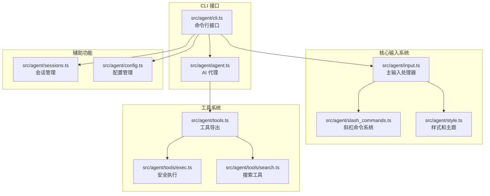
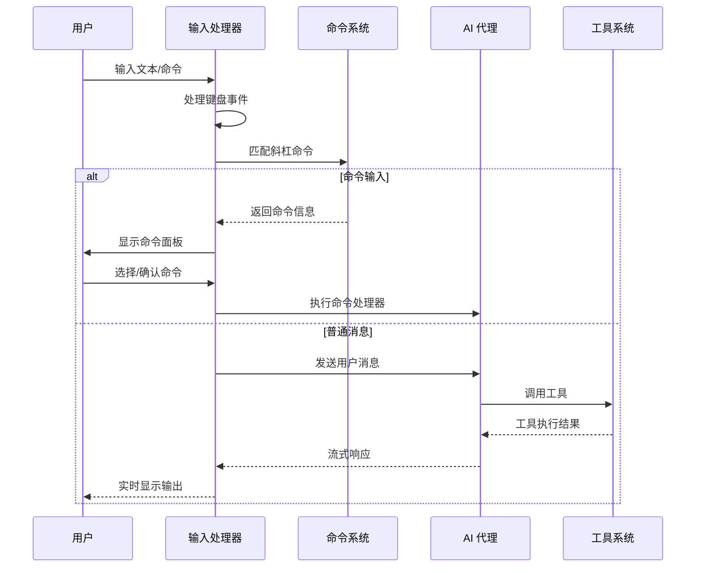
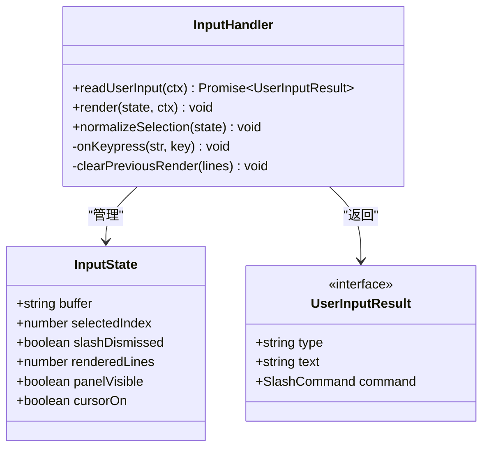
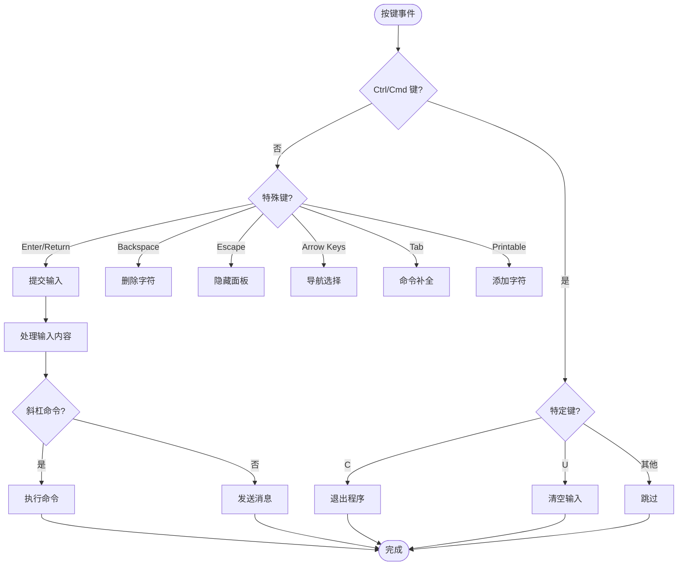
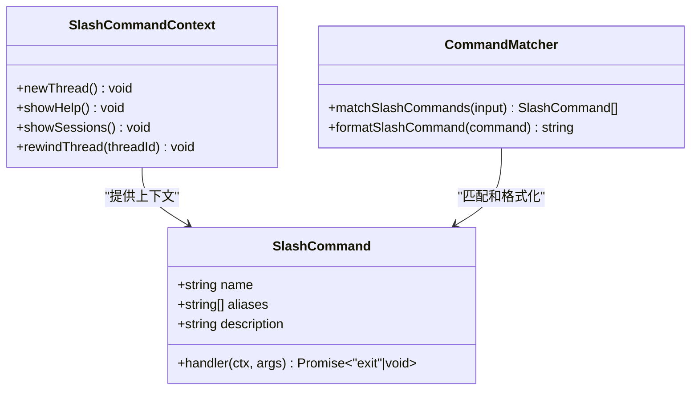
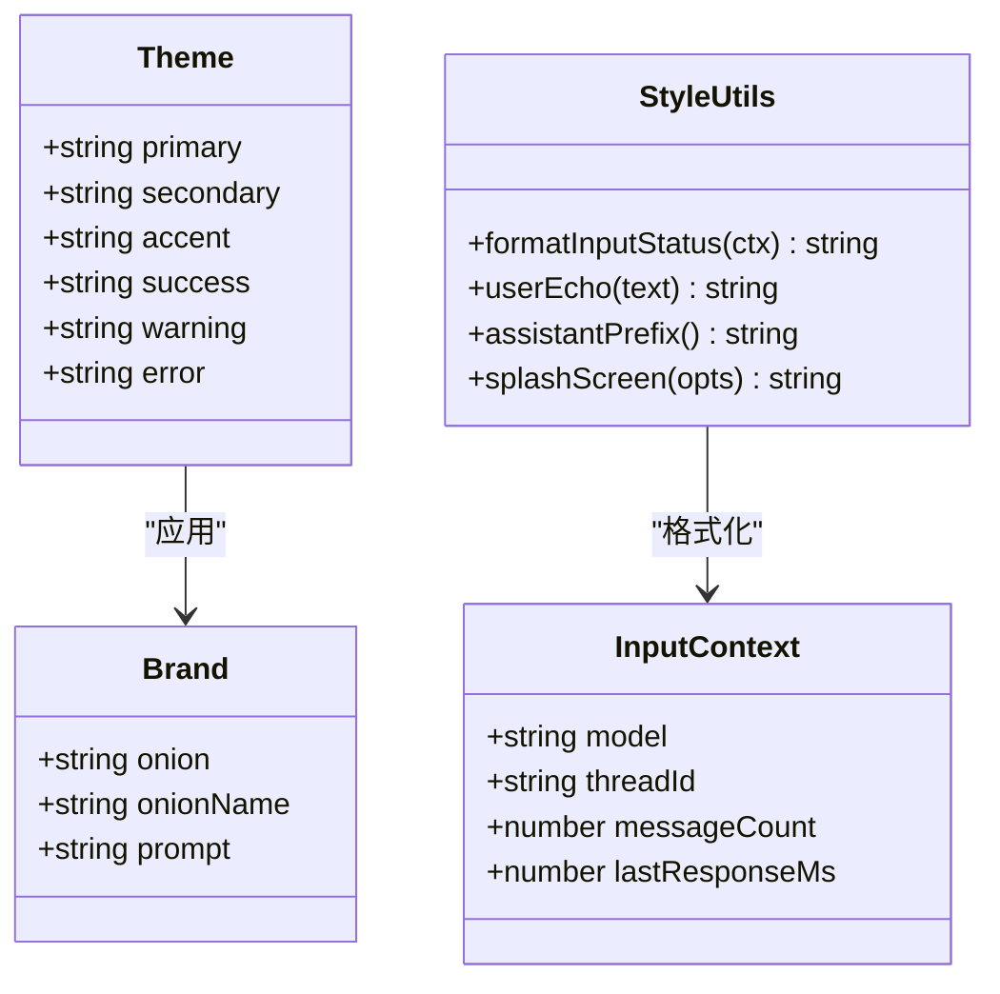
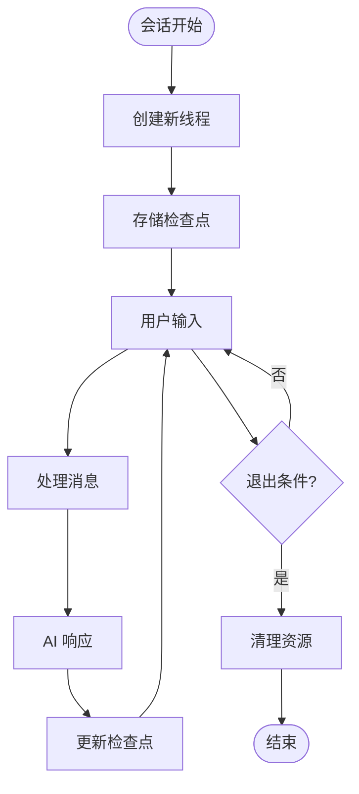
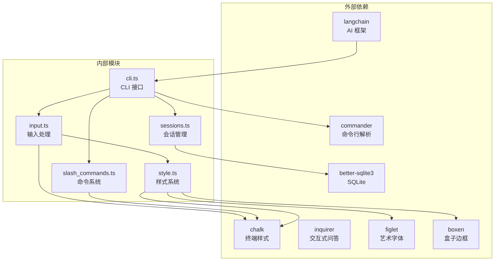
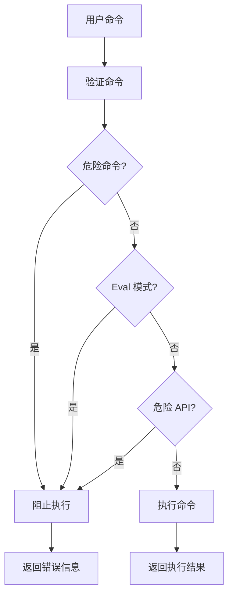

# 交互式输入系统

<cite>
**本文档引用的文件**
- [src/agent/input.ts](file://src/agent/input.ts)
- [src/agent/cli.ts](file://src/agent/cli.ts)
- [src/agent/slash_commands.ts](file://src/agent/slash_commands.ts)
- [src/agent/style.ts](file://src/agent/style.ts)
- [src/agent/sessions.ts](file://src/agent/sessions.ts)
- [src/agent/agent.ts](file://src/agent/agent.ts)
- [src/agent/config.ts](file://src/agent/config.ts)
- [src/agent/tools.ts](file://src/agent/tools.ts)
- [src/agent/tools/exec.ts](file://src/agent/tools/exec.ts)
- [src/agent/tools/search.ts](file://src/agent/tools/search.ts)
- [package.json](file://package.json)
</cite>

## 目录
1. [简介](#简介)
2. [项目结构](#项目结构)
3. [核心组件](#核心组件)
4. [架构概览](#架构概览)
5. [详细组件分析](#详细组件分析)
6. [依赖关系分析](#依赖关系分析)
7. [性能考虑](#性能考虑)
8. [故障排除指南](#故障排除指南)
9. [结论](#结论)

## 简介

交互式输入系统是 onionCode CLI AI 助手的核心组成部分，负责处理用户输入、提供智能补全、管理会话状态以及与 AI 代理进行交互。该系统采用现代化的终端界面设计，提供了类似前端输入框的用户体验，包括自定义光标、命令面板、状态显示等功能。

系统基于 Node.js 开发，集成了多种功能特性：
- 实时命令补全和面板显示
- 自定义闪烁光标效果
- 会话管理和历史记录
- 安全的命令执行机制
- 流式 AI 响应处理
- 主题化终端界面

## 项目结构

**图表来源**
- [src/agent/input.ts:1-347](file://src/agent/input.ts#L1-L347)
- [src/agent/cli.ts:1-268](file://src/agent/cli.ts#L1-L268)
- [src/agent/slash_commands.ts:1-92](file://src/agent/slash_commands.ts#L1-L92)

**章节来源**
- [package.json:1-55](file://package.json#L1-L55)
- [src/agent/input.ts:1-347](file://src/agent/input.ts#L1-L347)

## 核心组件

### 输入处理器 (Input Handler)

输入处理器是整个系统的核心，负责：
- 处理键盘事件和用户输入
- 管理输入缓冲区和光标状态
- 实现智能命令补全功能
- 控制终端渲染逻辑

主要特性包括：
- 自定义闪烁光标（█ 块状光标）
- 实时命令面板显示
- 支持多种键盘快捷键
- 全量重绘和快速路径渲染优化

### 斜杠命令系统

提供类似 IDE 的命令面板功能：
- 命令自动补全和高亮显示
- 支持别名和模糊匹配
- 实时过滤和选择
- 命令参数解析

### 样式和主题系统

统一的视觉设计：
- 品牌色彩方案（品红色、紫色、青色）
- 主题化终端输出
- 响应式布局适配
- 渐变色和装饰效果

**章节来源**
- [src/agent/input.ts:15-347](file://src/agent/input.ts#L15-L347)
- [src/agent/slash_commands.ts:11-92](file://src/agent/slash_commands.ts#L11-L92)
- [src/agent/style.ts:15-217](file://src/agent/style.ts#L15-L217)

## 架构概览

**图表来源**
- [src/agent/input.ts:199-347](file://src/agent/input.ts#L199-L347)
- [src/agent/cli.ts:240-267](file://src/agent/cli.ts#L240-L267)
- [src/agent/agent.ts:106-181](file://src/agent/agent.ts#L106-L181)

## 详细组件分析

### 输入处理器架构

**图表来源**
- [src/agent/input.ts:20-347](file://src/agent/input.ts#L20-L347)

#### 渲染系统设计

输入处理器实现了两种渲染模式：

1. **快速路径渲染**：仅更新输入行内容
   - 适用于普通文本输入
   - 性能最优，减少终端重绘开销

2. **全量重绘**：面板出现/消失时使用
   - 重新布局整个输入区域
   - 确保视觉一致性

#### 键盘事件处理

**图表来源**
- [src/agent/input.ts:256-342](file://src/agent/input.ts#L256-L342)

**章节来源**
- [src/agent/input.ts:116-183](file://src/agent/input.ts#L116-L183)
- [src/agent/input.ts:185-197](file://src/agent/input.ts#L185-L197)

### 命令系统分析

**图表来源**
- [src/agent/slash_commands.ts:4-92](file://src/agent/slash_commands.ts#L4-L92)

#### 命令面板功能

命令面板提供了丰富的交互体验：
- 实时命令过滤和高亮
- 方向键导航选择
- Tab 键快速补全
- Esc 键优雅关闭

**章节来源**
- [src/agent/slash_commands.ts:21-77](file://src/agent/slash_commands.ts#L21-L77)
- [src/agent/slash_commands.ts:79-92](file://src/agent/slash_commands.ts#L79-L92)

### 样式和主题系统

**图表来源**
- [src/agent/style.ts:16-65](file://src/agent/style.ts#L16-L65)
- [src/agent/style.ts:39-44](file://src/agent/style.ts#L39-L44)
- [src/agent/style.ts:50-83](file://src/agent/style.ts#L50-L83)

#### 启动画面设计

系统提供了美观的启动画面：
- 渐变色品牌标题
- 双线边框信息面板
- 快捷操作提示
- 响应式布局适配

**章节来源**
- [src/agent/style.ts:168-217](file://src/agent/style.ts#L168-L217)

### 会话管理系统

**图表来源**
- [src/agent/sessions.ts:60-135](file://src/agent/sessions.ts#L60-L135)

#### 会话持久化

系统使用 SQLite 数据库存储会话历史：
- UUIDv7 时间戳提取
- 相对时间格式化
- 会话列表查询和展示
- 历史记录恢复功能

**章节来源**
- [src/agent/sessions.ts:11-34](file://src/agent/sessions.ts#L11-L34)
- [src/agent/sessions.ts:138-172](file://src/agent/sessions.ts#L138-L172)

## 依赖关系分析

**图表来源**
- [package.json:21-37](file://package.json#L21-L37)
- [src/agent/input.ts:1-14](file://src/agent/input.ts#L1-L14)

### 安全执行机制

系统实现了多层次的安全防护：

**图表来源**
- [src/agent/tools/exec.ts:66-109](file://src/agent/tools/exec.ts#L66-L109)

**章节来源**
- [src/agent/tools/exec.ts:6-142](file://src/agent/tools/exec.ts#L6-L142)
- [src/agent/tools/search.ts:1-22](file://src/agent/tools/search.ts#L1-L22)

## 性能考虑

### 渲染优化策略

1. **增量渲染**：仅在必要时进行全量重绘
2. **光标闪烁优化**：530ms 定时器控制，平衡性能和用户体验
3. **终端缓冲区管理**：合理使用 `clearLine` 和 `clearScreenDown`
4. **字符串长度计算缓存**：避免重复的 ANSI 转义序列处理

### 内存管理

- 输入缓冲区大小限制
- 定时器资源及时清理
- 事件监听器的正确移除
- 大对象的及时释放

### 网络和 I/O 优化

- 流式 AI 响应处理
- 非阻塞文件操作
- 合理的超时设置
- 错误重试机制

## 故障排除指南

### 常见问题诊断

1. **输入无响应**
   - 检查 TTY 模式支持
   - 验证权限设置
   - 确认终端兼容性

2. **命令面板不显示**
   - 检查斜杠输入格式
   - 验证命令注册状态
   - 确认匹配算法正常

3. **渲染错乱**
   - 检查终端宽度检测
   - 验证 ANSI 转义序列
   - 确认光标状态同步

### 错误处理机制

系统提供了完善的错误处理：
- API 错误格式化
- 网络超时处理
- 权限错误提示
- 递归限制检测

**章节来源**
- [src/agent/cli.ts:29-64](file://src/agent/cli.ts#L29-L64)
- [src/agent/input.ts:31-56](file://src/agent/input.ts#L31-L56)

## 结论

交互式输入系统展现了现代 CLI 应用的设计理念，通过精心的架构设计和实现细节，为用户提供了接近桌面应用的终端体验。系统的主要优势包括：

1. **优秀的用户体验**：自定义光标、命令面板、状态显示等特性
2. **强大的扩展性**：模块化的组件设计，易于功能扩展
3. **安全性保障**：多层次的安全防护机制
4. **性能优化**：智能渲染策略和资源管理
5. **主题化设计**：统一的品牌视觉风格

该系统为构建复杂的 CLI AI 助手奠定了坚实的基础，其设计理念和实现模式可以作为其他终端应用开发的参考范例。