# 核心架构

<cite>
**本文引用的文件**
- [agent.ts](file://src/agent/agent.ts)
- [cli.ts](file://src/agent/cli.ts)
- [config.ts](file://src/agent/config.ts)
- [python_env.ts](file://src/agent/python_env.ts)
- [tools.ts](file://src/agent/tools.ts)
- [run_py.ts](file://src/agent/tools/run_py.ts)
- [security.ts](file://src/agent/tools/security.ts)
- [skills.ts](file://src/agent/skills.ts)
- [load_skill.ts](file://src/agent/tools/load_skill.ts)
- [slash_commands.ts](file://src/agent/slash_commands.ts)
- [sessions.ts](file://src/agent/sessions.ts)
- [App.tsx](file://src/agent/ui/App.tsx)
- [Thread.tsx](file://src/agent/ui/Thread.tsx)
- [adapter.ts](file://src/agent/ui/adapter.ts)
- [ConfigPanel.tsx](file://src/agent/ui/ConfigPanel.tsx)
- [package.json](file://package.json)
</cite>

## 更新摘要
**所做更改**
- 更新了架构总览图，反映基于 assistant-ui 的新架构设计
- 新增了动态线程管理机制的详细说明
- 更新了Slash命令处理系统的架构分析，反映Thread组件的重构
- 新增了适配器系统的设计说明
- 更新了UI组件关系图，反映新的组件层次结构
- 强调了assistant-ui生态系统的集成
- 更新了性能考量，突出新架构的优化点
- **修正** SlashPanel 组件仍然存在于 Thread 组件中，而非完全移除

## 目录
1. [简介](#简介)
2. [项目结构](#项目结构)
3. [核心组件](#核心组件)
4. [架构总览](#架构总览)
5. [详细组件分析](#详细组件分析)
6. [依赖分析](#依赖分析)
7. [性能考量](#性能考量)
8. [故障排查指南](#故障排查指南)
9. [结论](#结论)
10. [附录](#附录)

## 简介
本架构文档面向 Onion Code 的核心系统，围绕"基于 LangChain 的智能体（Agent）"展开，系统采用 LangGraph 图式执行模型与 LangChain 工具体系，结合 SQLite 作为会话检查点存储，并通过受控的 Python 环境管理策略实现安全、可扩展的代码执行能力。经过重大架构升级，系统现已完全迁移到基于 assistant-ui 的React Ink架构，实现了更加现代化的终端交互体验。本文重点阐述：
- 基于 LangChain 的整体设计思路与 Agent 架构模式
- 基于 assistant-ui 的新架构模式与组件关系
- Agent 核心系统的组件关系与数据/控制流
- 动态线程管理机制与Slash命令处理系统
- LangChain 集成实现细节（模型、工具、检查点）
- SQLite 会话持久化机制与线程化会话管理
- Python 环境管理策略与安全控制
- 适配器系统的设计与实现
- 技术决策与权衡（安全性、性能、可扩展性）

## 项目结构
项目采用按功能域划分的模块化组织方式，核心位于 src/agent 目录，包含：
- Agent 核心：构建系统提示词、创建 Agent、流式执行
- UI层：基于 assistant-ui 的React Ink组件系统
- 适配器层：LangChain与assistant-ui之间的桥接适配器
- 工具集：文件操作、代码执行、网络检索、技能装载等
- 技能系统：技能发现、装载与注入系统提示词
- 配置与环境：Python 虚拟环境、pip 镜像、自动安装策略
- CLI 与交互：命令行入口、Slash 命令、输入解析、会话查询

**更新** 架构得到显著升级，引入了assistant-ui生态系统，实现了更加现代化的组件化设计。

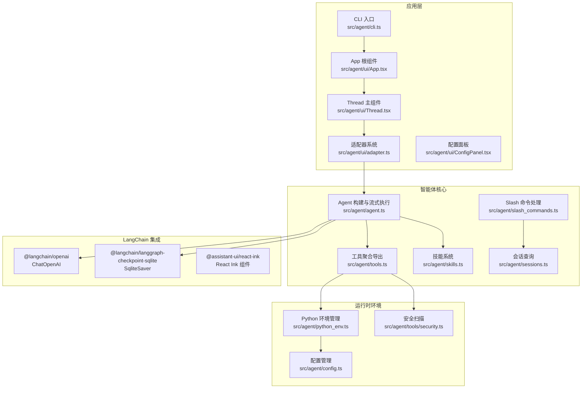

**图表来源**
- [agent.ts:1-181](file://src/agent/agent.ts#L1-L181)
- [cli.ts:1-60](file://src/agent/cli.ts#L1-L60)
- [App.tsx:1-75](file://src/agent/ui/App.tsx#L1-L75)
- [Thread.tsx:1-532](file://src/agent/ui/Thread.tsx#L1-L532)
- [adapter.ts:1-84](file://src/agent/ui/adapter.ts#L1-L84)
- [slash_commands.ts:1-92](file://src/agent/slash_commands.ts#L1-L92)
- [sessions.ts:1-172](file://src/agent/sessions.ts#L1-L172)
- [tools.ts:1-10](file://src/agent/tools.ts#L1-L10)
- [skills.ts:1-139](file://src/agent/skills.ts#L1-L139)
- [config.ts:1-146](file://src/agent/config.ts#L1-L146)
- [python_env.ts:1-223](file://src/agent/python_env.ts#L1-L223)
- [security.ts:1-27](file://src/agent/tools/security.ts#L1-L27)

**章节来源**
- [agent.ts:1-181](file://src/agent/agent.ts#L1-L181)
- [cli.ts:1-60](file://src/agent/cli.ts#L1-L60)
- [App.tsx:1-75](file://src/agent/ui/App.tsx#L1-L75)
- [Thread.tsx:1-532](file://src/agent/ui/Thread.tsx#L1-L532)
- [adapter.ts:1-84](file://src/agent/ui/adapter.ts#L1-L84)
- [slash_commands.ts:1-92](file://src/agent/slash_commands.ts#L1-L92)
- [sessions.ts:1-172](file://src/agent/sessions.ts#L1-L172)
- [tools.ts:1-10](file://src/agent/tools.ts#L1-L10)
- [skills.ts:1-139](file://src/agent/skills.ts#L1-L139)
- [config.ts:1-146](file://src/agent/config.ts#L1-L146)
- [python_env.ts:1-223](file://src/agent/python_env.ts#L1-L223)
- [security.ts:1-27](file://src/agent/tools/security.ts#L1-L27)

## 核心组件
- Agent 核心
  - 构建系统提示词（含角色设定与技能注入）
  - 初始化模型与检查点（SQLite）
  - 创建可流式执行的 Agent 实例
  - 提供 runAgentStream 流式推理接口
- UI层与组件系统
  - 基于 assistant-ui 的React Ink组件架构
  - 动态线程管理与状态同步
  - 内置Slash命令处理系统，无需独立组件
  - Markdown渲染与流式输出优化
- 适配器系统
  - LangChain与assistant-ui之间的桥接适配器
  - 动态threadId获取机制
  - 流式token队列与异步处理
- 工具体系
  - 文件读写、Shell 执行、Web 检索、JavaScript/Python 代码执行
  - 技能装载工具，动态注入技能上下文
- 技能系统
  - 发现与装载 SKILL.md，注入系统提示词，辅助 Agent 触发
- Python 环境管理
  - 自动探测/创建虚拟环境、缺失包检测与安装、镜像源与自动安装策略
- 配置中心
  - Python 虚拟环境路径、pip 配置、自动安装开关
- CLI 与交互
  - 交互式聊天、Slash 命令、ESC 中断、会话查询与切换

**更新** 架构得到全面升级，引入了assistant-ui生态系统，实现了更加现代化的组件化设计。

**章节来源**
- [agent.ts:20-181](file://src/agent/agent.ts#L20-L181)
- [App.tsx:17-75](file://src/agent/ui/App.tsx#L17-L75)
- [Thread.tsx:1-532](file://src/agent/ui/Thread.tsx#L1-L532)
- [adapter.ts:13-84](file://src/agent/ui/adapter.ts#L13-L84)
- [tools.ts:1-10](file://src/agent/tools.ts#L1-L10)
- [load_skill.ts:1-35](file://src/agent/tools/load_skill.ts#L1-L35)
- [skills.ts:1-139](file://src/agent/skills.ts#L1-L139)
- [python_env.ts:1-223](file://src/agent/python_env.ts#L1-L223)
- [config.ts:1-146](file://src/agent/config.ts#L1-L146)
- [cli.ts:1-60](file://src/agent/cli.ts#L1-L60)
- [slash_commands.ts:1-92](file://src/agent/slash_commands.ts#L1-L92)
- [sessions.ts:1-172](file://src/agent/sessions.ts#L1-L172)

## 架构总览
系统采用"LangGraph 图式执行 + assistant-ui React Ink + LangChain 工具 + SQLite 检查点"的组合架构。Agent 通过系统提示词与工具集合进行推理与行动；会话历史通过 SQLite 检查点自动续接，实现多轮对话与状态恢复；动态线程管理机制支持实时会话切换；Slash命令系统集成在Thread组件中提供丰富的交互功能；适配器系统实现LangChain与assistant-ui的无缝集成。经过架构升级，系统现在专注于现代化的终端交互体验。

**更新** 架构得到显著升级，引入了assistant-ui生态系统，实现了更加现代化的组件化设计。

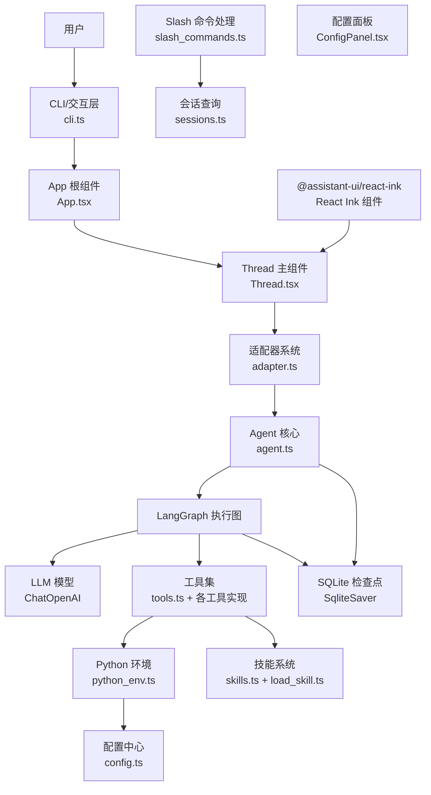

**图表来源**
- [agent.ts:1-181](file://src/agent/agent.ts#L1-L181)
- [cli.ts:1-60](file://src/agent/cli.ts#L1-L60)
- [App.tsx:1-75](file://src/agent/ui/App.tsx#L1-L75)
- [Thread.tsx:1-532](file://src/agent/ui/Thread.tsx#L1-L532)
- [adapter.ts:1-84](file://src/agent/ui/adapter.ts#L1-L84)
- [slash_commands.ts:1-92](file://src/agent/slash_commands.ts#L1-L92)
- [sessions.ts:1-172](file://src/agent/sessions.ts#L1-L172)
- [tools.ts:1-10](file://src/agent/tools.ts#L1-L10)
- [load_skill.ts:1-35](file://src/agent/tools/load_skill.ts#L1-L35)
- [skills.ts:1-139](file://src/agent/skills.ts#L1-L139)
- [python_env.ts:1-223](file://src/agent/python_env.ts#L1-L223)
- [config.ts:1-146](file://src/agent/config.ts#L1-L146)

## 详细组件分析

### Agent 核心与 LangGraph 集成
- 系统提示词构建：融合角色设定与技能注入，确保 Agent 在正确语境下工作
- 模型与检查点：使用 ChatOpenAI（可替换为其他适配器），SqliteSaver 作为本地持久化
- Agent 创建：传入模型、工具、系统提示词与检查点
- 流式执行：runAgentStream 支持增量 token 回调与中断（ESC）

**更新** 保持原有LangGraph集成不变，继续提供稳定的流式推理能力。

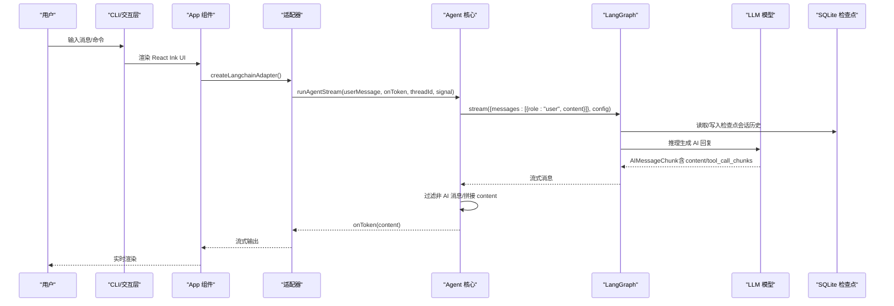

**图表来源**
- [agent.ts:106-181](file://src/agent/agent.ts#L106-L181)
- [adapter.ts:13-84](file://src/agent/ui/adapter.ts#L13-L84)
- [App.tsx:17-75](file://src/agent/ui/App.tsx#L17-L75)

**章节来源**
- [agent.ts:20-181](file://src/agent/agent.ts#L20-L181)

### 动态线程管理与状态同步
- 线程ID生成：使用 generateId() 生成唯一标识符
- 线程状态管理：通过 useRef 保持最新 threadId，避免适配器重建
- 线程切换：支持 /rewind 命令切换到指定会话
- 线程重置：每次切换时重置 runtime.thread 状态
- 线程验证：使用 threadExists() 检查目标会话是否存在

**更新** 新增动态线程管理机制，支持实时会话切换与状态同步。

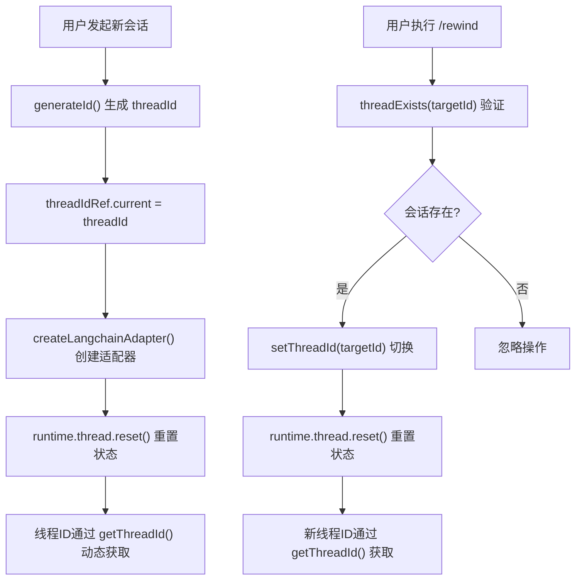

**图表来源**
- [App.tsx:18-49](file://src/agent/ui/App.tsx#L18-L49)

**章节来源**
- [App.tsx:17-75](file://src/agent/ui/App.tsx#L17-L75)

### Slash命令处理系统
- 命令定义：config、rewind、sessions、new、theme、help、exit
- 命令匹配：支持名称与别名匹配，模糊搜索
- 命令执行：异步处理，支持参数传递
- 命令输出：渲染表格、状态信息等
- 命令拦截：在输入提交时拦截 Slash 命令

**更新** Slash命令系统得到全面重构，集成在Thread组件中，支持更丰富的交互功能。

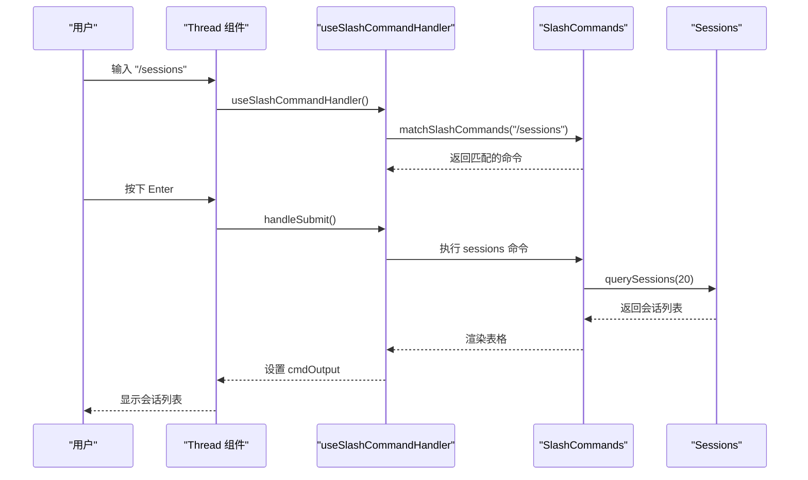

**图表来源**
- [Thread.tsx:251-371](file://src/agent/ui/Thread.tsx#L251-L371)
- [slash_commands.ts:79-92](file://src/agent/slash_commands.ts#L79-L92)
- [sessions.ts:60-135](file://src/agent/sessions.ts#L60-L135)

**章节来源**
- [slash_commands.ts:1-92](file://src/agent/slash_commands.ts#L1-L92)
- [Thread.tsx:251-371](file://src/agent/ui/Thread.tsx#L251-L371)
- [sessions.ts:1-172](file://src/agent/sessions.ts#L1-L172)

### 适配器系统设计与实现
- 适配器创建：createLangchainAdapter(getThreadId) 动态获取 threadId
- 流式处理：tokenQueue 队列管理，异步回调机制
- 信号处理：AbortSignal 支持 ESC 中断
- 错误处理：streamError 捕获与抛出
- 内容提取：从 messages 中提取最后一个用户消息

**更新** 新增适配器系统，实现LangChain与assistant-ui的无缝集成。

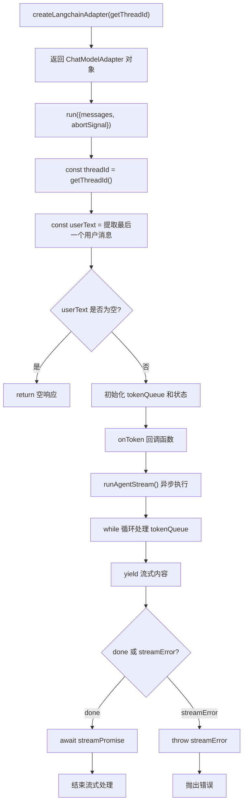

**图表来源**
- [adapter.ts:13-84](file://src/agent/ui/adapter.ts#L13-L84)

**章节来源**
- [adapter.ts:1-84](file://src/agent/ui/adapter.ts#L1-L84)

### 工具体系与安全控制
- 工具聚合：统一导出各类工具，便于 Agent 注入
- Python 执行工具：run_py 工具负责安全扫描、临时文件执行、超时与清理
- 安全扫描：识别潜在危险 API 调用（文件系统、子进程、Python 危险模块等）
- 其他工具：文件读写、Shell 执行、Web 检索/抓取、技能装载

**更新** 安全控制机制得到加强，特别针对CLI环境进行了优化。

**图表来源**
- [run_py.ts:12-96](file://src/agent/tools/run_py.ts#L12-L96)
- [security.ts:1-27](file://src/agent/tools/security.ts#L1-L27)
- [python_env.ts:161-223](file://src/agent/python_env.ts#L161-L223)

**章节来源**
- [tools.ts:1-10](file://src/agent/tools.ts#L1-L10)
- [run_py.ts:1-96](file://src/agent/tools/run_py.ts#L1-L96)
- [security.ts:1-27](file://src/agent/tools/security.ts#L1-L27)
- [python_env.ts:1-223](file://src/agent/python_env.ts#L1-L223)

### 技能系统与注入机制
- 技能发现：遍历 skills 目录，解析 SKILL.md YAML frontmatter
- 技能装载：按名称加载完整内容，注入系统提示词
- 动态上下文：将可用技能列表与路径提示注入 Agent，提升触发准确性

**更新** 技能系统保持原有功能，继续为Agent提供丰富的专业能力。

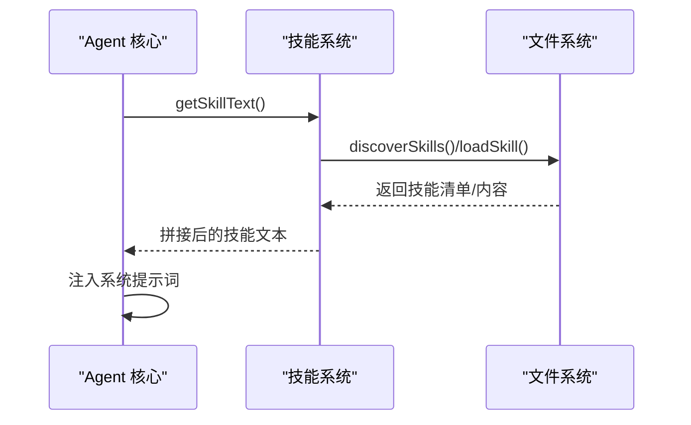

**图表来源**
- [skills.ts:124-139](file://src/agent/skills.ts#L124-L139)
- [load_skill.ts:6-35](file://src/agent/tools/load_skill.ts#L6-L35)

**章节来源**
- [skills.ts:1-139](file://src/agent/skills.ts#L1-L139)
- [load_skill.ts:1-35](file://src/agent/tools/load_skill.ts#L1-L35)

### Python 环境管理策略
- 环境定位：候选命令与平台差异处理
- 虚拟环境：自动创建 venv，缓存路径，跨平台兼容
- 包管理：正则检测所需包，按需安装，支持镜像源与可信主机
- 代码驱动：根据代码内容动态推断依赖，最小化安装面

**更新** 环境管理策略针对CLI场景进行了优化，提供更好的用户体验。

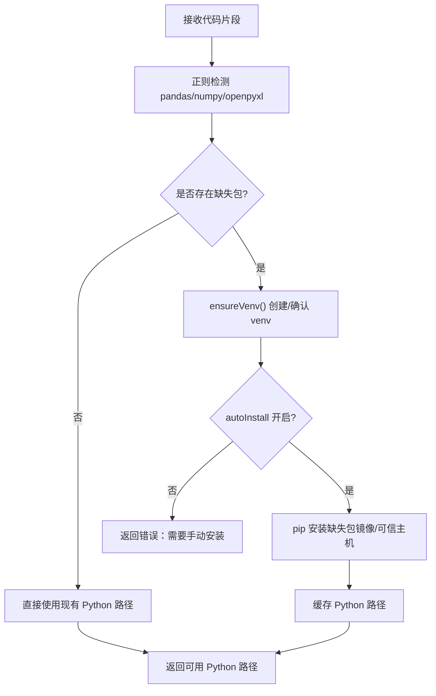

**图表来源**
- [python_env.ts:161-223](file://src/agent/python_env.ts#L161-L223)
- [config.ts:22-31](file://src/agent/config.ts#L22-L31)

**章节来源**
- [python_env.ts:1-223](file://src/agent/python_env.ts#L1-L223)
- [config.ts:1-146](file://src/agent/config.ts#L1-L146)

### CLI 与交互、会话管理
- 交互式聊天：TTY 下增强输入体验，支持 ESC 中断
- Slash 命令：配置、会话查询/切换、帮助、退出
- 会话查询：基于 SQLite 检查点数据库，解析最近消息与时间
- 错误格式化：针对常见错误（认证、额度、超时、安全拦截）提供友好提示

**更新** CLI交互得到全面优化，提供更加流畅的终端操作体验。

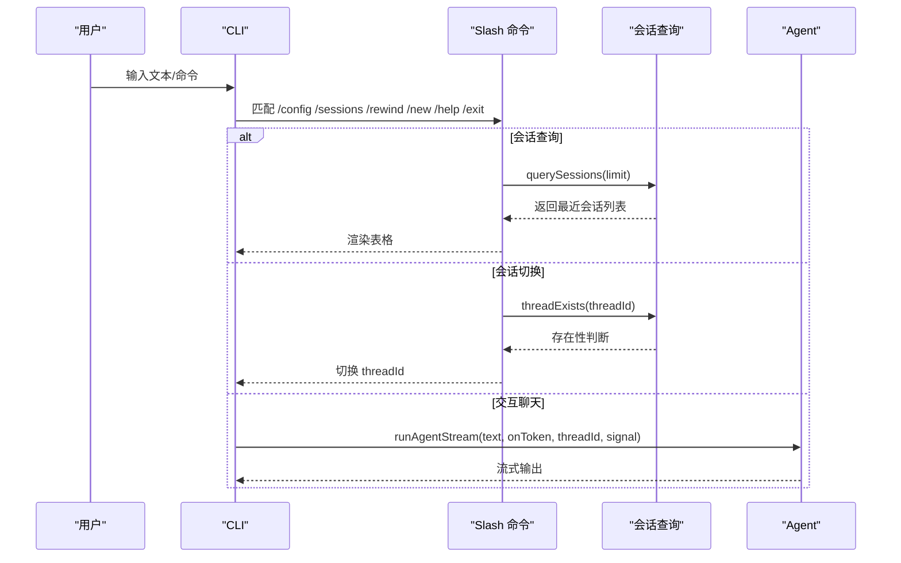

**图表来源**
- [cli.ts:28-60](file://src/agent/cli.ts#L28-L60)
- [slash_commands.ts:21-77](file://src/agent/slash_commands.ts#L21-L77)
- [sessions.ts:59-134](file://src/agent/sessions.ts#L59-L134)

**章节来源**
- [cli.ts:1-60](file://src/agent/cli.ts#L1-L60)
- [slash_commands.ts:1-92](file://src/agent/slash_commands.ts#L1-L92)
- [sessions.ts:1-172](file://src/agent/sessions.ts#L1-L172)

### UI组件关系与渲染优化
**更新** UI组件得到全面重构，实现了更加现代化的组件化设计

- **App 根组件**：管理 threadId 状态，创建适配器，提供退出回调
- **Thread 主组件**：包含 HomePage 和 Composer 两个状态视图，集成Slash命令处理
- **SlashPanel 组件**：内置于 Thread 组件中，提供命令补全与选择功能
- **ConfigPanel 组件**：独立的配置管理界面
- **状态管理**：通过 useRef 保持最新 threadId，避免组件重新渲染
- **渲染优化**：使用 React.memo 缓存适配器实例，减少不必要的重渲染

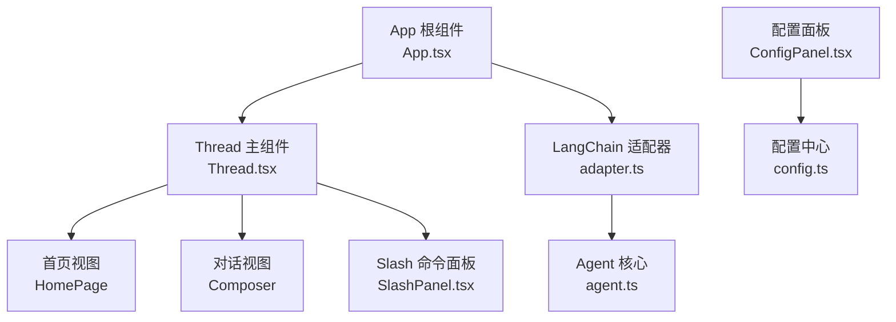

**图表来源**
- [App.tsx:17-75](file://src/agent/ui/App.tsx#L17-L75)
- [Thread.tsx:163-207](file://src/agent/ui/Thread.tsx#L163-L207)
- [Thread.tsx:373-446](file://src/agent/ui/Thread.tsx#L373-L446)
- [Thread.tsx:448-502](file://src/agent/ui/Thread.tsx#L448-L502)
- [adapter.ts:13-84](file://src/agent/ui/adapter.ts#L13-L84)

**章节来源**
- [App.tsx:1-75](file://src/agent/ui/App.tsx#L1-L75)
- [Thread.tsx:1-532](file://src/agent/ui/Thread.tsx#L1-L532)
- [adapter.ts:1-84](file://src/agent/ui/adapter.ts#L1-L84)

## 依赖分析
- LangChain 生态：@langchain/core、@langchain/langgraph、@langchain/langgraph-checkpoint-sqlite、@langchain/openai、@langchain/tavily
- assistant-ui 生态：@assistant-ui/react-ink、@assistant-ui/react-ink-markdown、@assistant-ui/core
- React 生态：react、ink、@inkjs/ui
- SQLite：better-sqlite3 用于检查点持久化
- 工具链：dotenv、chalk、commander、inquirer、figlet、boxen、zod
- Node 版本要求：@langchain/core 要求 Node >= 20；langgraph-checkpoint-sqlite 要求 Node >= 18

**更新** 依赖关系得到显著扩展，引入了assistant-ui生态系统。

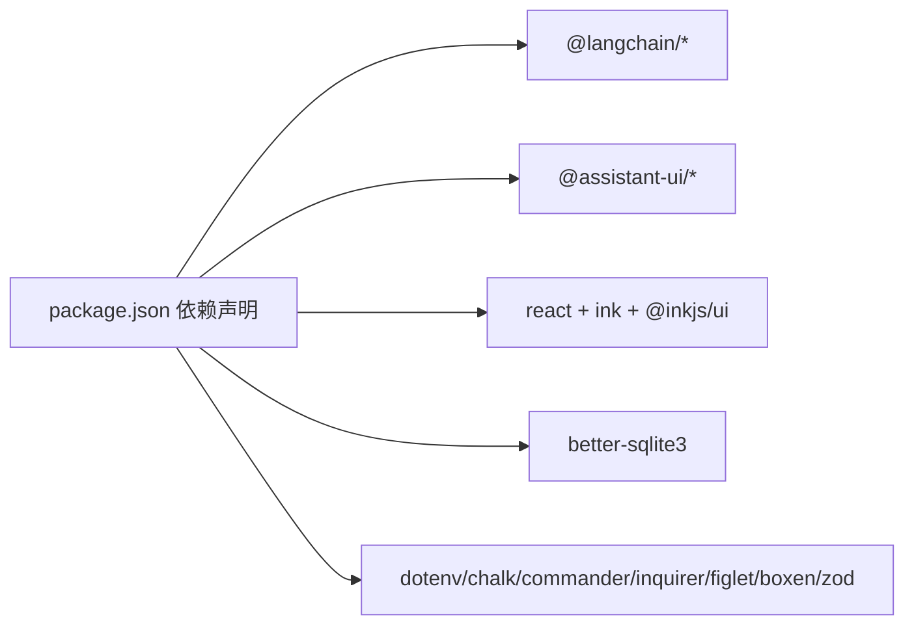

**图表来源**
- [package.json:21-61](file://package.json#L21-L61)

**章节来源**
- [package.json:1-61](file://package.json#L1-L61)

## 性能考量
- 流式输出：runAgentStream 使用流式模式，降低首 Token 延迟，提升交互体验
- 适配器优化：使用 tokenQueue 队列管理，异步回调机制减少阻塞
- 线程管理：通过 useRef 保持最新 threadId，避免适配器重建
- 组件缓存：React.memo 缓存适配器实例，减少不必要的重渲染
- 会话检查点：SQLite 基于 UUIDv7 的 checkpoint_id，高效查询最近会话与首条用户消息
- 工具执行：Python 执行设置超时与缓冲区上限，避免长时间阻塞
- 依赖安装：仅在缺失时安装，且支持镜像源加速，减少重复安装成本
- 递归限制：LangGraph recursionLimit 控制最大步数，防止复杂任务导致的无限循环
- Markdown优化：preprocessMarkdownStream 预处理未闭合的语法标签
- **新增** 动态线程管理：避免频繁重建适配器，提升性能表现
- **新增** 内置Slash命令处理：减少组件间通信开销，提升命令响应速度

**更新** 新增多项性能优化措施，包括适配器优化、线程管理和组件缓存。

## 故障排查指南
- 内容安全拦截：DeepSeek 安全审查拦截（Content Exists Risk）时，建议简化查询或更换表述
- 认证失败：OPENAI_API_KEY 无效或未配置，检查 .env 文件
- 额度不足：429/insufficient_quota，检查账户余额
- 超时：ETIMEDOUT/timeout，检查网络与工具执行时间
- 会话不存在：/sessions 查看 thread_id，/rewind 切换历史会话
- Python 环境：确认 Python 3 可用、venv 创建成功、autoInstall 开启或手动安装缺失包
- CLI问题：检查终端兼容性和TTY模式设置
- **新增** 适配器问题：如遇到流式输出异常，检查 threadId 获取机制
- **新增** 线程管理问题：如遇到会话切换失效，检查 threadExists 验证逻辑
- **新增** Slash命令问题：如遇到命令执行失败，检查命令处理器返回值
- **新增** Thread组件问题：如遇到Slash命令面板不显示，检查 composerText 状态和 isSlashMode 判断

**更新** 新增适配器、线程管理和Slash命令相关的故障排查指导。

**章节来源**
- [cli.ts:13-26](file://src/agent/cli.ts#L13-L26)
- [sessions.ts:42-56](file://src/agent/sessions.ts#L42-L56)
- [python_env.ts:76-107](file://src/agent/python_env.ts#L76-L107)
- [run_py.ts:37-83](file://src/agent/tools/run_py.ts#L37-L83)
- [App.tsx:40-49](file://src/agent/ui/App.tsx#L40-L49)
- [adapter.ts:52-76](file://src/agent/ui/adapter.ts#L52-L76)

## 结论
Onion Code 以 LangGraph 为核心，结合 assistant-ui React Ink 生态系统、LangChain 工具与 SQLite 检查点，构建了具备多轮会话、动态技能注入、可控代码执行能力的现代化智能体系统。通过严格的 Python 环境管理与安全扫描策略，在保证安全性的同时兼顾易用性与可扩展性。经过重大架构升级，系统现在专注于现代化的终端交互体验，引入了assistant-ui生态系统，实现了更加优雅的组件化设计。动态线程管理、Slash命令处理和适配器系统等新特性进一步提升了用户体验和系统灵活性。未来可在以下方向持续演进：
- 进一步优化 React Ink 组件性能，提升渲染效率
- 扩展 Slash 命令系统，增加更多实用功能
- 引入更细粒度的并发与缓存策略，进一步优化工具执行性能
- 扩展检查点后端（如 PostgreSQL）以支持分布式部署
- 增强技能触发评估与自动化优化流程，提升技能质量与稳定性
- **新增** 深入探索 assistant-ui 生态系统，利用其更多特性提升用户体验
- **新增** 优化Thread组件的Slash命令处理性能，减少状态同步开销

## 附录
- 系统边界图（概念性）
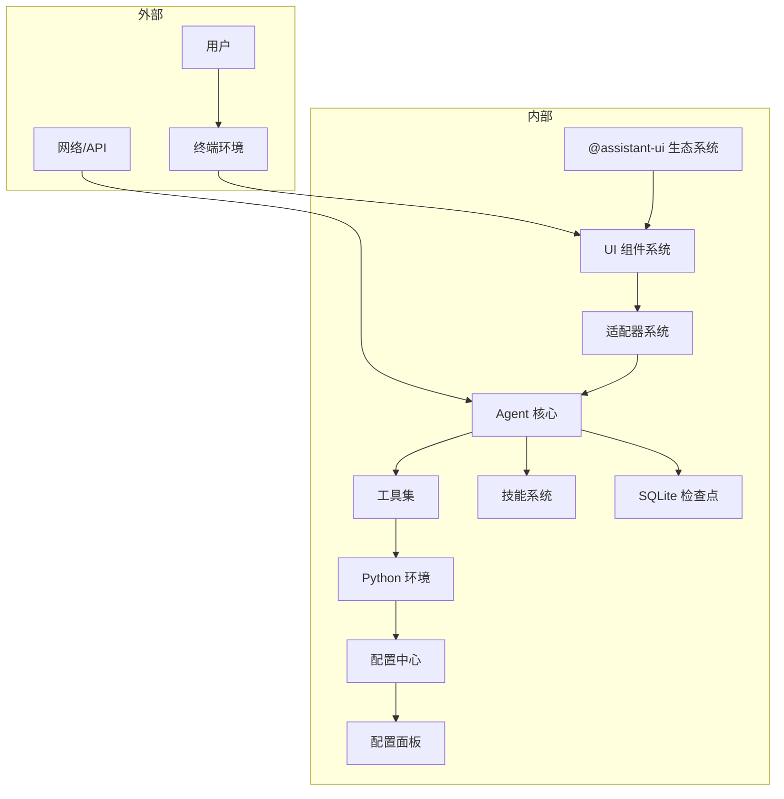

**更新** 系统边界图得到全面更新，反映了新的assistant-ui生态系统集成。