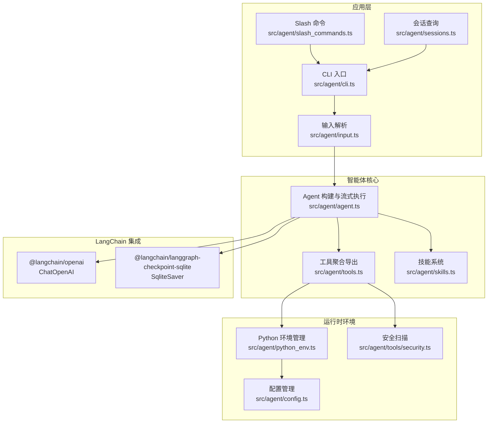
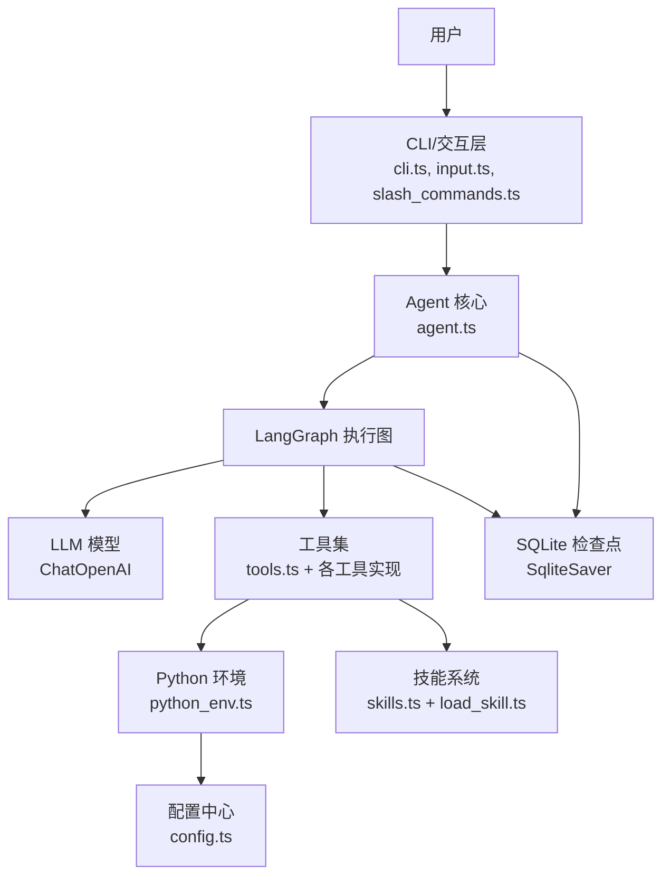
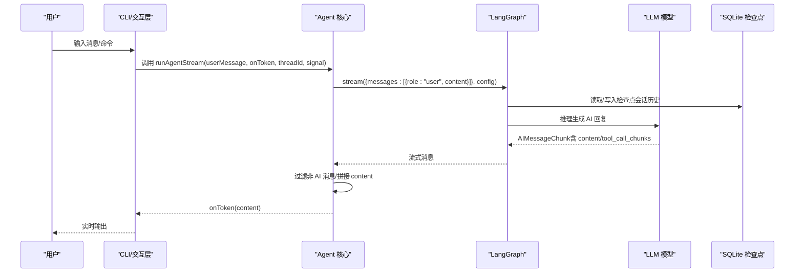
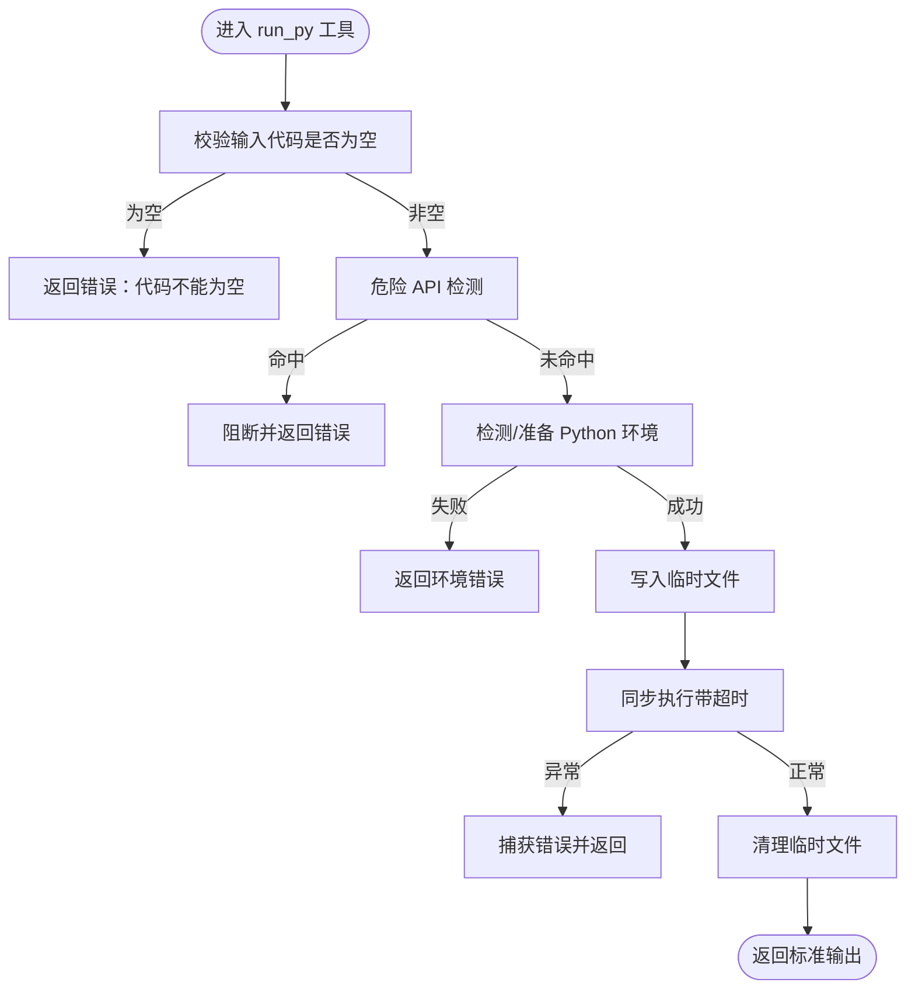
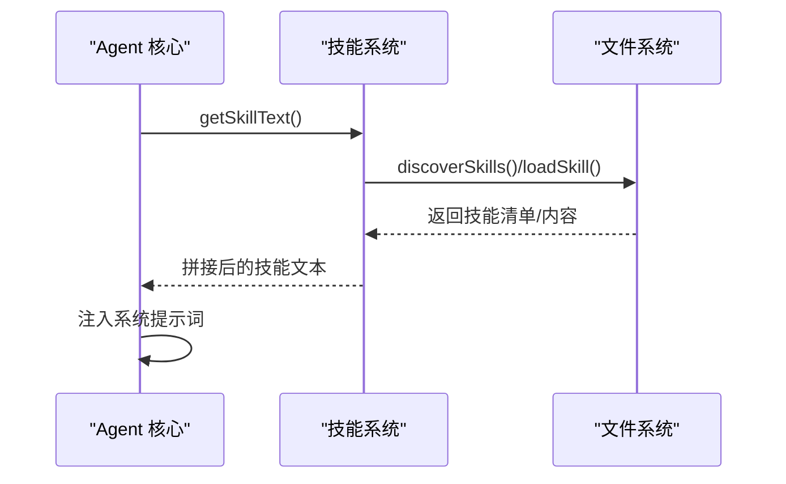
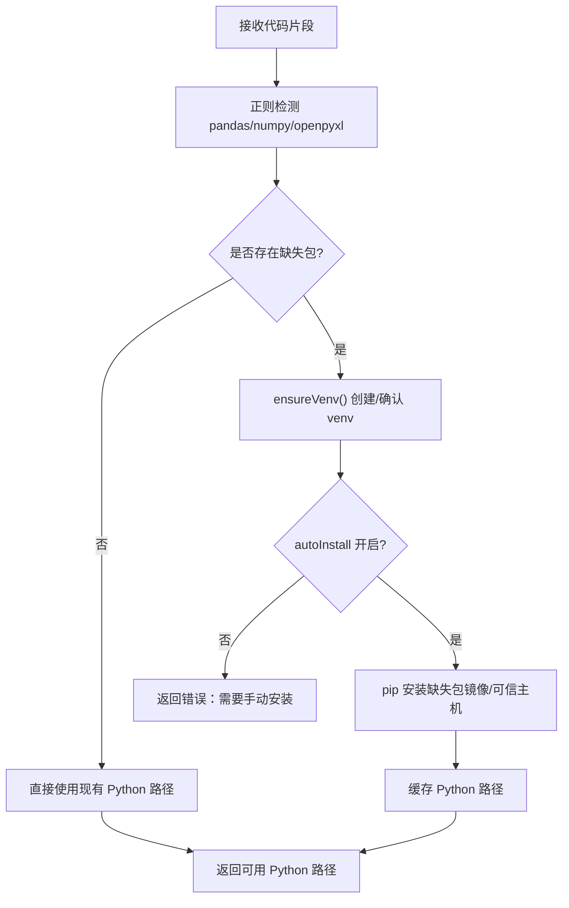
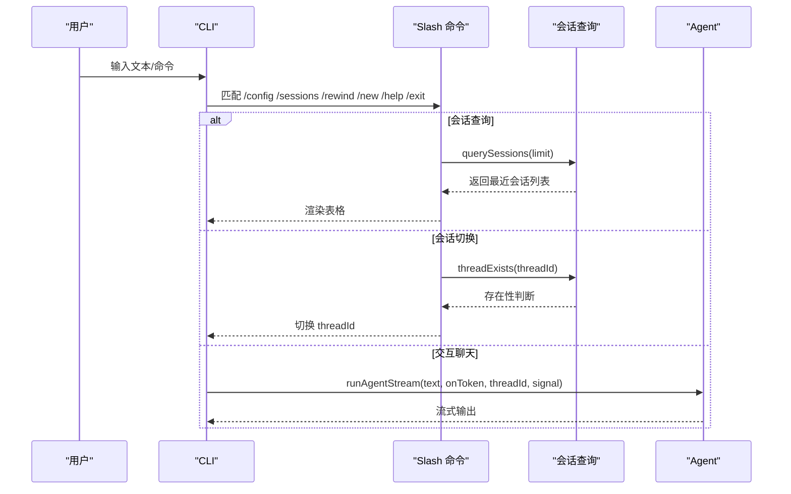
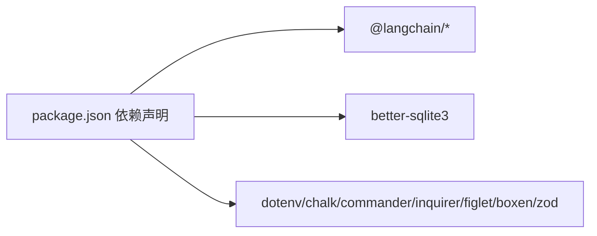
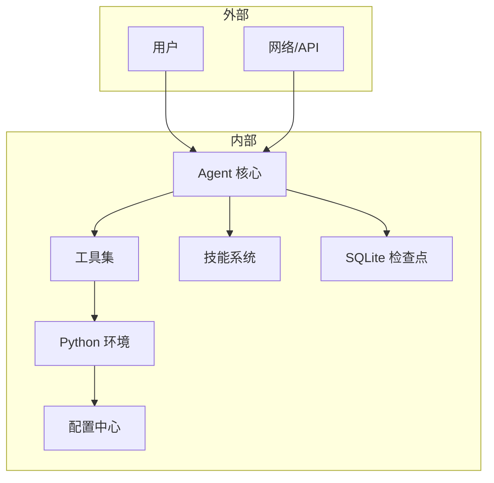

# 核心架构

<cite>
**本文引用的文件**
- [agent.ts](file://src/agent/agent.ts)
- [cli.ts](file://src/agent/cli.ts)
- [config.ts](file://src/agent/config.ts)
- [python_env.ts](file://src/agent/python_env.ts)
- [tools.ts](file://src/agent/tools.ts)
- [run_py.ts](file://src/agent/tools/run_py.ts)
- [security.ts](file://src/agent/tools/security.ts)
- [skills.ts](file://src/agent/skills.ts)
- [load_skill.ts](file://src/agent/tools/load_skill.ts)
- [input.ts](file://src/agent/input.ts)
- [slash_commands.ts](file://src/agent/slash_commands.ts)
- [sessions.ts](file://src/agent/sessions.ts)
- [package.json](file://package.json)
</cite>

## 更新摘要
**所做更改**
- 更新了项目结构图，移除了Vue UI相关组件
- 修改了架构总览图，反映纯CLI界面的简化设计
- 更新了详细组件分析，强调CLI交互和终端友好的特性
- 删除了UI相关的设计说明和组件关系
- 更新了性能考量，突出CLI环境的优势

## 目录
1. [简介](#简介)
2. [项目结构](#项目结构)
3. [核心组件](#核心组件)
4. [架构总览](#架构总览)
5. [详细组件分析](#详细组件分析)
6. [依赖分析](#依赖分析)
7. [性能考量](#性能考量)
8. [故障排查指南](#故障排查指南)
9. [结论](#结论)
10. [附录](#附录)

## 简介
本架构文档面向 Onion Code 的核心系统，围绕"基于 LangChain 的智能体（Agent）"展开，系统采用 LangGraph 图式执行模型与 LangChain 工具体系，结合 SQLite 作为会话检查点存储，并通过受控的 Python 环境管理策略实现安全、可扩展的代码执行能力。经过重大架构调整，系统现已完全迁移到纯CLI界面，移除了Web前端依赖，实现了更加简洁高效的终端交互体验。本文重点阐述：
- 基于 LangChain 的整体设计思路与 Agent 架构模式
- Agent 核心系统的组件关系与数据/控制流
- LangChain 集成实现细节（模型、工具、检查点）
- SQLite 会话持久化机制与线程化会话管理
- Python 环境管理策略与安全控制
- 技术决策与权衡（安全性、性能、可扩展性）

## 项目结构
项目采用按功能域划分的模块化组织方式，核心位于 src/agent 目录，包含：
- Agent 核心：构建系统提示词、创建 Agent、流式执行
- 工具集：文件操作、代码执行、网络检索、技能装载等
- 技能系统：技能发现、装载与注入系统提示词
- 配置与环境：Python 虚拟环境、pip 镜像、自动安装策略
- CLI 与交互：命令行入口、Slash 命令、输入解析、会话查询

**更新** 移除了Vue UI相关组件，项目结构更加简洁，专注于终端交互体验。

**图表来源**
- [agent.ts:1-181](file://src/agent/agent.ts#L1-L181)
- [cli.ts:1-245](file://src/agent/cli.ts#L1-L245)
- [input.ts:1-261](file://src/agent/input.ts#L1-L261)
- [slash_commands.ts:1-92](file://src/agent/slash_commands.ts#L1-L92)
- [sessions.ts:35-144](file://src/agent/sessions.ts#L35-L144)
- [tools.ts:1-10](file://src/agent/tools.ts#L1-L10)
- [skills.ts:1-139](file://src/agent/skills.ts#L1-L139)
- [config.ts:1-146](file://src/agent/config.ts#L1-L146)
- [python_env.ts:1-223](file://src/agent/python_env.ts#L1-L223)
- [security.ts:1-27](file://src/agent/tools/security.ts#L1-L27)

**章节来源**
- [agent.ts:1-181](file://src/agent/agent.ts#L1-L181)
- [cli.ts:1-245](file://src/agent/cli.ts#L1-L245)
- [input.ts:1-261](file://src/agent/input.ts#L1-L261)
- [slash_commands.ts:1-92](file://src/agent/slash_commands.ts#L1-L92)
- [sessions.ts:35-144](file://src/agent/sessions.ts#L35-L144)
- [tools.ts:1-10](file://src/agent/tools.ts#L1-L10)
- [skills.ts:1-139](file://src/agent/skills.ts#L1-L139)
- [config.ts:1-146](file://src/agent/config.ts#L1-L146)
- [python_env.ts:1-223](file://src/agent/python_env.ts#L1-L223)
- [security.ts:1-27](file://src/agent/tools/security.ts#L1-L27)

## 核心组件
- Agent 核心
  - 构建系统提示词（含角色设定与技能注入）
  - 初始化模型与检查点（SQLite）
  - 创建可流式执行的 Agent 实例
  - 提供 runAgentStream 流式推理接口
- 工具体系
  - 文件读写、Shell 执行、Web 检索、JavaScript/Python 代码执行
  - 技能装载工具，动态注入技能上下文
- 技能系统
  - 发现与装载 SKILL.md，注入系统提示词，辅助 Agent 触发
- Python 环境管理
  - 自动探测/创建虚拟环境、缺失包检测与安装、镜像源与自动安装策略
- 配置中心
  - Python 虚拟环境路径、pip 配置、自动安装开关
- CLI 与交互
  - 交互式聊天、Slash 命令、ESC 中断、会话查询与切换

**更新** 移除了Vue UI组件，强化了CLI交互体验，提供更加流畅的终端操作。

**章节来源**
- [agent.ts:20-181](file://src/agent/agent.ts#L20-L181)
- [tools.ts:1-10](file://src/agent/tools.ts#L1-L10)
- [load_skill.ts:1-35](file://src/agent/tools/load_skill.ts#L1-L35)
- [skills.ts:1-139](file://src/agent/skills.ts#L1-L139)
- [python_env.ts:1-223](file://src/agent/python_env.ts#L1-L223)
- [config.ts:1-146](file://src/agent/config.ts#L1-L146)
- [cli.ts:1-245](file://src/agent/cli.ts#L1-L245)
- [input.ts:1-261](file://src/agent/input.ts#L1-L261)
- [slash_commands.ts:1-92](file://src/agent/slash_commands.ts#L1-L92)
- [sessions.ts:35-144](file://src/agent/sessions.ts#L35-L144)

## 架构总览
系统采用"LangGraph 图式执行 + LangChain 工具 + SQLite 检查点"的组合架构。Agent 通过系统提示词与工具集合进行推理与行动；会话历史通过 SQLite 检查点自动续接，实现多轮对话与状态恢复；Python 环境管理确保代码执行的安全与可重复。经过架构调整，系统现在专注于纯CLI界面，提供更加简洁高效的终端交互体验。

**更新** 架构得到显著简化，移除了Web前端依赖，专注于终端场景的优化。

**图表来源**
- [agent.ts:1-181](file://src/agent/agent.ts#L1-L181)
- [cli.ts:1-245](file://src/agent/cli.ts#L1-L245)
- [input.ts:1-261](file://src/agent/input.ts#L1-L261)
- [slash_commands.ts:1-92](file://src/agent/slash_commands.ts#L1-L92)
- [tools.ts:1-10](file://src/agent/tools.ts#L1-L10)
- [load_skill.ts:1-35](file://src/agent/tools/load_skill.ts#L1-L35)
- [skills.ts:1-139](file://src/agent/skills.ts#L1-L139)
- [python_env.ts:1-223](file://src/agent/python_env.ts#L1-L223)
- [config.ts:1-146](file://src/agent/config.ts#L1-L146)

## 详细组件分析

### Agent 核心与 LangGraph 集成
- 系统提示词构建：融合角色设定与技能注入，确保 Agent 在正确语境下工作
- 模型与检查点：使用 ChatOpenAI（可替换为其他适配器），SqliteSaver 作为本地持久化
- Agent 创建：传入模型、工具、系统提示词与检查点
- 流式执行：runAgentStream 支持增量 token 回调与中断（ESC）

**更新** 保持原有LangGraph集成不变，继续提供稳定的流式推理能力。

**图表来源**
- [agent.ts:106-181](file://src/agent/agent.ts#L106-L181)

**章节来源**
- [agent.ts:20-181](file://src/agent/agent.ts#L20-L181)

### 工具体系与安全控制
- 工具聚合：统一导出各类工具，便于 Agent 注入
- Python 执行工具：run_py 工具负责安全扫描、临时文件执行、超时与清理
- 安全扫描：识别潜在危险 API 调用（文件系统、子进程、Python 危险模块等）
- 其他工具：文件读写、Shell 执行、Web 检索/抓取、技能装载

**更新** 安全控制机制得到加强，特别针对CLI环境进行了优化。

**图表来源**
- [run_py.ts:12-96](file://src/agent/tools/run_py.ts#L12-L96)
- [security.ts:1-27](file://src/agent/tools/security.ts#L1-L27)
- [python_env.ts:161-223](file://src/agent/python_env.ts#L161-L223)

**章节来源**
- [tools.ts:1-10](file://src/agent/tools.ts#L1-L10)
- [run_py.ts:1-96](file://src/agent/tools/run_py.ts#L1-L96)
- [security.ts:1-27](file://src/agent/tools/security.ts#L1-L27)
- [python_env.ts:1-223](file://src/agent/python_env.ts#L1-L223)

### 技能系统与注入机制
- 技能发现：遍历 skills 目录，解析 SKILL.md YAML frontmatter
- 技能装载：按名称加载完整内容，注入系统提示词
- 动态上下文：将可用技能列表与路径提示注入 Agent，提升触发准确性

**更新** 技能系统保持原有功能，继续为Agent提供丰富的专业能力。

**图表来源**
- [skills.ts:124-139](file://src/agent/skills.ts#L124-L139)
- [load_skill.ts:6-35](file://src/agent/tools/load_skill.ts#L6-L35)

**章节来源**
- [skills.ts:1-139](file://src/agent/skills.ts#L1-L139)
- [load_skill.ts:1-35](file://src/agent/tools/load_skill.ts#L1-L35)

### Python 环境管理策略
- 环境定位：候选命令与平台差异处理
- 虚拟环境：自动创建 venv，缓存路径，跨平台兼容
- 包管理：正则检测所需包，按需安装，支持镜像源与可信主机
- 代码驱动：根据代码内容动态推断依赖，最小化安装面

**更新** 环境管理策略针对CLI场景进行了优化，提供更好的用户体验。

**图表来源**
- [python_env.ts:161-223](file://src/agent/python_env.ts#L161-L223)
- [config.ts:22-31](file://src/agent/config.ts#L22-L31)

**章节来源**
- [python_env.ts:1-223](file://src/agent/python_env.ts#L1-L223)
- [config.ts:1-146](file://src/agent/config.ts#L1-L146)

### CLI 与交互、会话管理
- 交互式聊天：TTY 下增强输入体验，支持 ESC 中断
- Slash 命令：配置、会话查询/切换、帮助、退出
- 会话查询：基于 SQLite 检查点数据库，解析最近消息与时间
- 错误格式化：针对常见错误（认证、额度、超时、安全拦截）提供友好提示

**更新** CLI交互得到全面优化，提供更加流畅的终端操作体验。

**图表来源**
- [cli.ts:79-245](file://src/agent/cli.ts#L79-L245)
- [slash_commands.ts:21-77](file://src/agent/slash_commands.ts#L21-L77)
- [sessions.ts:59-134](file://src/agent/sessions.ts#L59-L134)

**章节来源**
- [cli.ts:1-245](file://src/agent/cli.ts#L1-L245)
- [input.ts:1-261](file://src/agent/input.ts#L1-L261)
- [slash_commands.ts:1-92](file://src/agent/slash_commands.ts#L1-L92)
- [sessions.ts:35-144](file://src/agent/sessions.ts#L35-L144)

## 依赖分析
- LangChain 生态：@langchain/core、@langchain/langgraph、@langchain/langgraph-checkpoint-sqlite、@langchain/openai、@langchain/tavily
- SQLite：better-sqlite3 用于检查点持久化
- 工具链：dotenv、chalk、commander、inquirer、figlet、boxen、zod
- Node 版本要求：@langchain/core 要求 Node >= 20；langgraph-checkpoint-sqlite 要求 Node >= 18

**更新** 依赖关系保持稳定，移除了Vue相关依赖，项目更加轻量化。

**图表来源**
- [package.json:21-54](file://package.json#L21-L54)

**章节来源**
- [package.json:1-54](file://package.json#L1-L54)

## 性能考量
- 流式输出：runAgentStream 使用流式模式，降低首 Token 延迟，提升交互体验
- 会话检查点：SQLite 基于 UUIDv7 的 checkpoint_id，高效查询最近会话与首条用户消息
- 工具执行：Python 执行设置超时与缓冲区上限，避免长时间阻塞
- 依赖安装：仅在缺失时安装，且支持镜像源加速，减少重复安装成本
- 递归限制：LangGraph recursionLimit 控制最大步数，防止复杂任务导致的无限循环
- CLI优化：针对终端环境进行了专门优化，提供更好的响应速度和用户体验

**更新** 新增CLI环境优化考量，突出终端场景的性能优势。

## 故障排查指南
- 内容安全拦截：DeepSeek 安全审查拦截（Content Exists Risk）时，建议简化查询或更换表述
- 认证失败：OPENAI_API_KEY 无效或未配置，检查 .env 文件
- 额度不足：429/insufficient_quota，检查账户余额
- 超时：ETIMEDOUT/timeout，检查网络与工具执行时间
- 会话不存在：/sessions 查看 thread_id，/rewind 切换历史会话
- Python 环境：确认 Python 3 可用、venv 创建成功、autoInstall 开启或手动安装缺失包
- CLI问题：检查终端兼容性和TTY模式设置

**更新** 新增CLI相关故障排查指导。

**章节来源**
- [cli.ts:15-63](file://src/agent/cli.ts#L15-L63)
- [sessions.ts:42-56](file://src/agent/sessions.ts#L42-L56)
- [python_env.ts:76-107](file://src/agent/python_env.ts#L76-L107)
- [run_py.ts:37-83](file://src/agent/tools/run_py.ts#L37-L83)

## 结论
Onion Code 以 LangGraph 为核心，结合 LangChain 工具与 SQLite 检查点，构建了具备多轮会话、动态技能注入与可控代码执行能力的智能体系统。通过严格的 Python 环境管理与安全扫描策略，在保证安全性的同时兼顾易用性与可扩展性。经过架构调整，系统现在专注于纯CLI界面，提供了更加简洁高效的终端交互体验。未来可在以下方向持续演进：
- 进一步优化CLI交互体验，提供更多终端友好的功能
- 引入更细粒度的并发与缓存策略，进一步优化工具执行性能
- 扩展检查点后端（如 PostgreSQL）以支持分布式部署
- 增强技能触发评估与自动化优化流程，提升技能质量与稳定性

## 附录
- 系统边界图（概念性）

**更新** 系统边界图保持概念性描述，反映当前纯CLI架构设计。