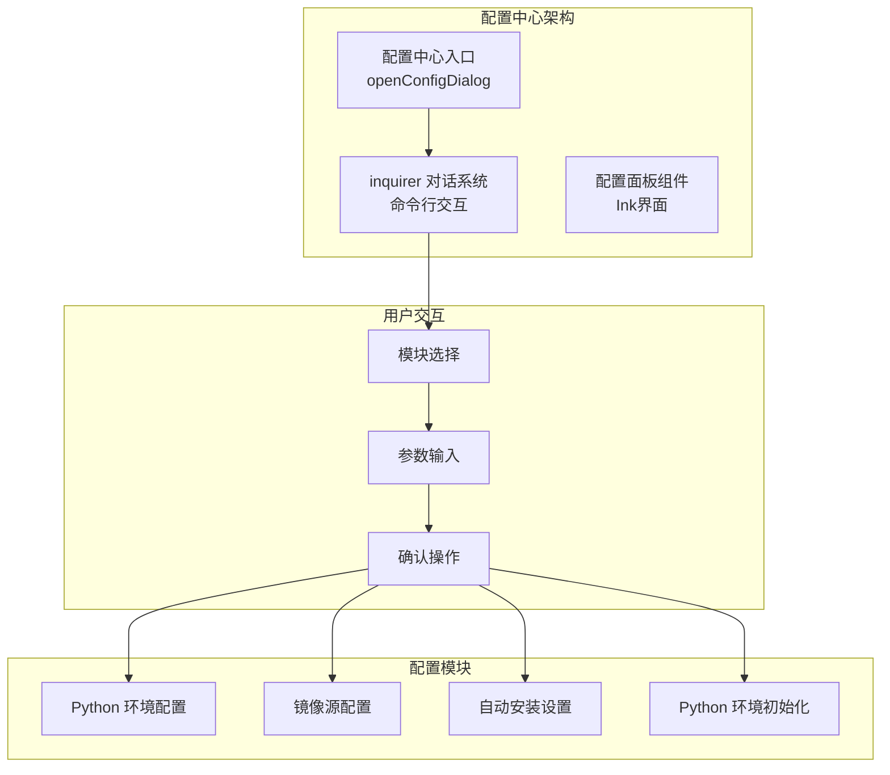
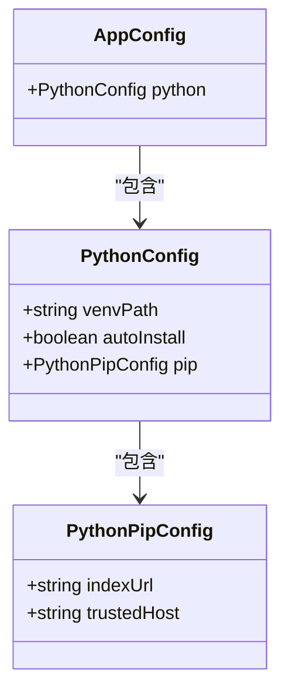
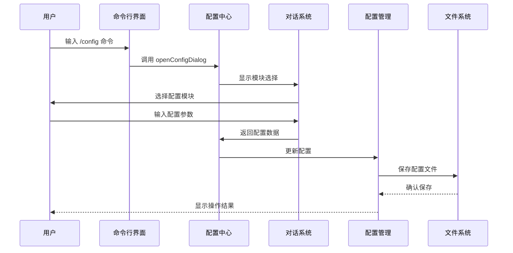
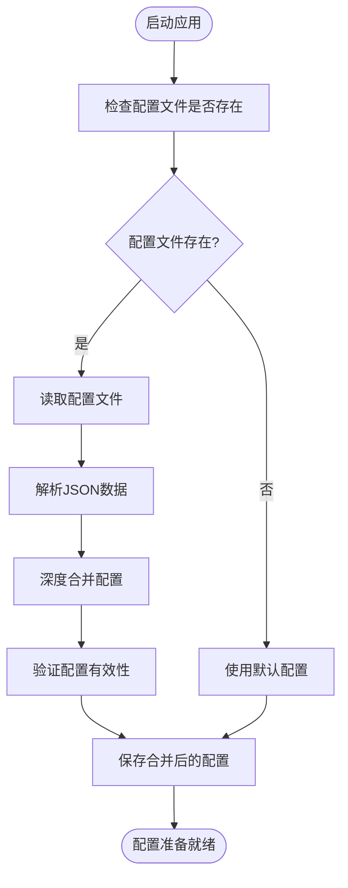
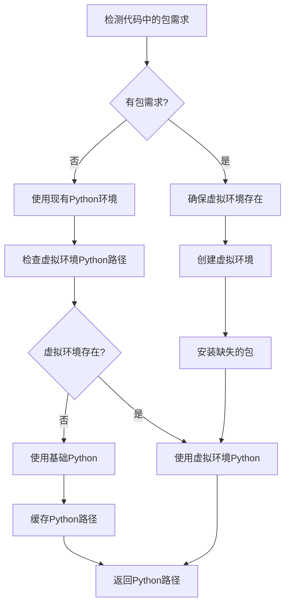
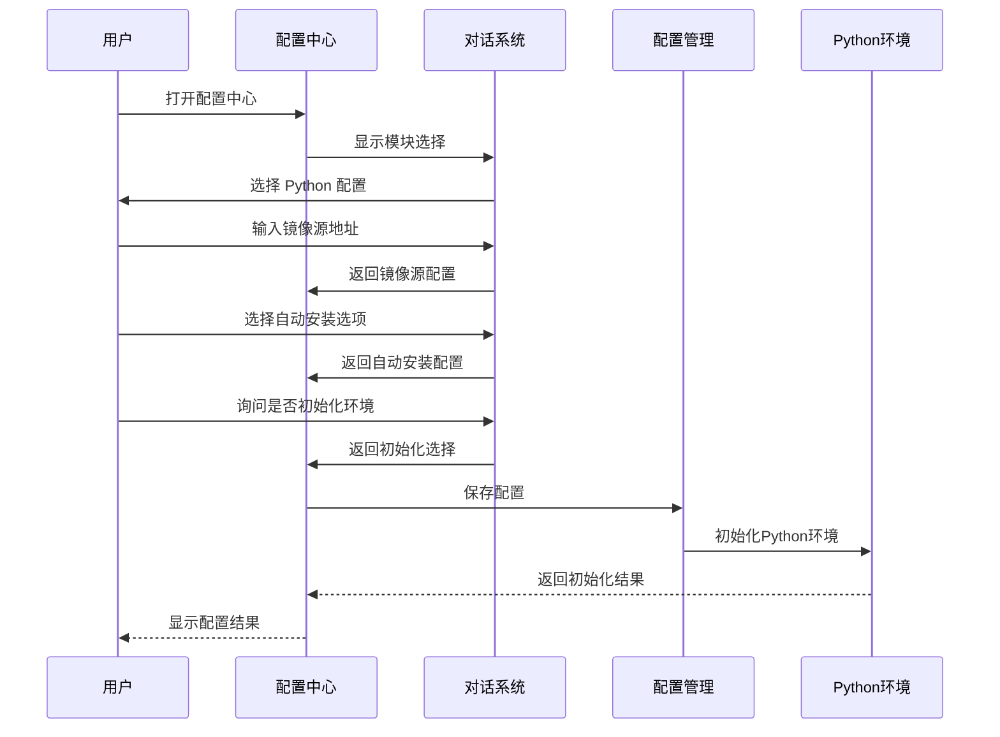
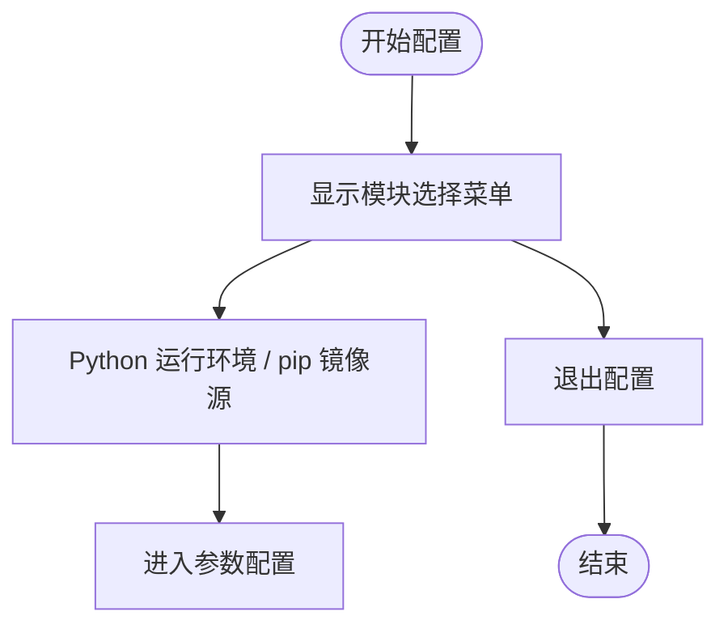
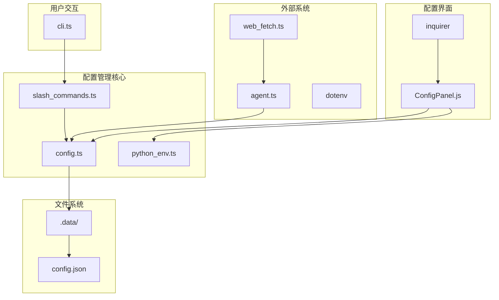

# 配置管理

<cite>
**本文档引用的文件**
- [config.ts](file://src/agent/config.ts)
- [python_env.ts](file://src/agent/python_env.ts)
- [ConfigPanel.js](file://dist/ink/screens/ConfigPanel.js)
- [ConfigPanel.js](file://dist/agent/ui/ConfigPanel.js)
- [slash_commands.ts](file://src/agent/slash_commands.ts)
- [cli.ts](file://src/agent/cli.ts)
- [agent.ts](file://src/agent/agent.ts)
- [web_fetch.ts](file://src/agent/tools/web_fetch.ts)
- [package.json](file://package.json)
</cite>

## 更新摘要
**变更内容**
- 新增了完整的配置中心系统，提供基于 inquirer 的交互式对话界面
- 配置中心支持 Python 环境配置、镜像源选择、自动安装偏好设置等功能
- 保留了原有的 Ink 界面配置面板，提供双模式配置体验
- 新增了完整的配置对话流程，包括模块选择、参数配置和即时初始化
- 增强了配置管理的用户友好性和可操作性

## 目录
1. [简介](#简介)
2. [配置中心系统](#配置中心系统)
3. [核心配置组件](#核心配置组件)
4. [架构概览](#架构概览)
5. [详细组件分析](#详细组件分析)
6. [配置对话流程](#配置对话流程)
7. [依赖关系分析](#依赖关系分析)
8. [性能考虑](#性能考虑)
9. [故障排除指南](#故障排除指南)
10. [结论](#结论)

## 简介

本项目提供了一个现代化的配置管理系统，专注于 Python 运行环境配置和代理配置。该系统采用层次化的配置结构，支持默认配置、用户配置和环境变量的智能合并策略。配置文件持久化到 `.data/config.json`，并通过全新的配置中心系统提供直观的用户体验。

**更新** 配置系统现已集成完整的配置中心，提供基于 inquirer 的交互式对话界面，支持 Python 环境配置、镜像源选择、自动安装偏好设置等功能，大大提升了用户的配置体验。

## 配置中心系统

配置中心是本次更新的核心功能，提供了完整的交互式配置界面：



**图表来源**
- [config.ts:71-145](file://src/agent/config.ts#L71-L145)
- [ConfigPanel.js:19-99](file://dist/ink/screens/ConfigPanel.js#L19-L99)

### 配置中心特性

1. **模块化设计**: 支持 Python 运行环境和 pip 镜像源配置
2. **交互式界面**: 基于 inquirer 的命令行对话系统
3. **即时反馈**: 配置修改后立即保存并提供状态反馈
4. **环境初始化**: 支持一键初始化 Python 环境和安装常用包
5. **双模式支持**: 同时支持命令行和 Ink 界面两种配置方式

**章节来源**
- [config.ts:71-145](file://src/agent/config.ts#L71-L145)
- [ConfigPanel.js:19-99](file://dist/ink/screens/ConfigPanel.js#L19-L99)

## 核心配置组件

### 配置数据结构

系统采用分层的数据结构设计，确保配置的清晰性和可扩展性：



**图表来源**
- [config.ts:7-20](file://src/agent/config.ts#L7-L20)

### 默认配置策略

系统提供完善的默认配置，确保在没有任何用户干预的情况下也能正常工作：

- **Python 虚拟环境路径**: `.data/python-venv`
- **自动安装**: 启用状态，便于新用户快速开始
- **镜像源**: 清华大学开源软件镜像站，提供稳定的下载服务
- **可信主机**: 对应的镜像站域名

**章节来源**
- [config.ts:22-31](file://src/agent/config.ts#L22-L31)

## 架构概览

配置管理系统采用现代化的混合架构，结合了命令行和图形界面的优势：



**图表来源**
- [slash_commands.ts:21-27](file://src/agent/slash_commands.ts#L21-L27)
- [config.ts:71-145](file://src/agent/config.ts#L71-L145)

## 详细组件分析

### 配置加载与合并机制

配置系统实现了智能的加载和合并策略：



**图表来源**
- [config.ts:54-64](file://src/agent/config.ts#L54-L64)
- [config.ts:41-52](file://src/agent/config.ts#L41-L52)

#### 合并策略详解

系统采用分层合并策略，确保配置的完整性和一致性：

1. **默认配置层**: 提供所有必需的默认值
2. **用户配置层**: 用户自定义的配置项
3. **环境变量层**: 系统环境中的配置覆盖

合并过程遵循以下规则：
- 深度合并嵌套对象
- 用户配置覆盖默认配置
- 缺失的字段使用默认值
- 空值不会覆盖已有配置

**章节来源**
- [config.ts:41-52](file://src/agent/config.ts#L41-L52)
- [config.ts:54-64](file://src/agent/config.ts#L54-L64)

### Python 环境管理

Python 环境管理是配置系统的核心功能之一：



**图表来源**
- [python_env.ts:161-170](file://src/agent/python_env.ts#L161-L170)
- [python_env.ts:189-222](file://src/agent/python_env.ts#L189-L222)

#### 包检测机制

系统能够智能检测 Python 代码中的包需求：

- **pandas**: 自动添加 `openpyxl` 支持
- **numpy**: 独立包需求
- **openpyxl**: 独立包需求

这种检测机制确保只安装必要的包，避免资源浪费。

**章节来源**
- [python_env.ts:172-187](file://src/agent/python_env.ts#L172-L187)

### 配置中心对话流程

**更新** 新增了完整的配置中心对话流程，提供用户友好的配置体验：



**图表来源**
- [config.ts:76-145](file://src/agent/config.ts#L76-L145)
- [ConfigPanel.js:54-132](file://dist/ink/screens/ConfigPanel.js#L54-L132)

**章节来源**
- [config.ts:71-145](file://src/agent/config.ts#L71-L145)
- [ConfigPanel.js:19-132](file://dist/ink/screens/ConfigPanel.js#L19-L132)

## 配置对话流程

配置中心提供了完整的多步骤对话流程：

### 步骤一：模块选择

用户首先需要选择要配置的模块：



**图表来源**
- [config.ts:76-86](file://src/agent/config.ts#L76-L86)
- [ConfigPanel.js:55-62](file://dist/ink/screens/ConfigPanel.js#L55-L62)

### 步骤二：参数配置

用户可以配置以下参数：

1. **pip index-url**: Python 包索引地址
2. **pip trusted-host**: 受信任的主机名
3. **自动安装**: 是否自动安装缺失的 Python 包
4. **立即初始化**: 是否立即初始化 Python 环境

### 步骤三：即时初始化

用户可以选择立即初始化 Python 环境，系统会自动安装常用的数据分析包。

**章节来源**
- [config.ts:90-145](file://src/agent/config.ts#L90-L145)
- [ConfigPanel.js:64-129](file://dist/ink/screens/ConfigPanel.js#L64-L129)

## 依赖关系分析

配置管理系统与其他组件的依赖关系如下：



**图表来源**
- [config.ts:1-6](file://src/agent/config.ts#L1-L6)
- [python_env.ts:1-5](file://src/agent/python_env.ts#L1-L5)
- [slash_commands.ts:1-3](file://src/agent/slash_commands.ts#L1-L3)

### 外部依赖

系统依赖以下关键包：

- **inquirer**: 命令行交互式对话系统
- **@inkjs/ui**: Ink 界面组件库，提供现代化的 UI 组件
- **ink**: React 的终端渲染库
- **chalk**: 控制台样式化输出
- **dotenv**: 环境变量管理
- **commander**: 命令行参数解析

**章节来源**
- [package.json:21-37](file://package.json#L21-L37)

## 性能考虑

### 配置缓存策略

系统实现了多层缓存机制以提升性能：

1. **Python 路径缓存**: 缓存已发现的 Python 可执行文件路径
2. **包检测缓存**: 避免重复的包检测操作
3. **配置文件缓存**: 减少频繁的文件 I/O 操作
4. **对话状态缓存**: 在配置中心中缓存用户的选择状态

### 异步操作优化

- **非阻塞 I/O**: 配置文件读写使用异步操作
- **超时控制**: 所有外部进程调用都有超时保护
- **并发处理**: 支持同时进行多个配置操作
- **即时反馈**: 配置修改后立即保存并提供状态反馈

## 故障排除指南

### 常见问题及解决方案

#### 配置文件损坏

**症状**: 应用启动时报错，显示配置解析失败

**解决方法**:
1. 备份当前配置文件
2. 删除损坏的配置文件
3. 重新启动应用，使用默认配置
4. 通过配置中心重新设置

#### Python 环境初始化失败

**症状**: Python 包安装过程中出现错误

**解决方法**:
1. 检查网络连接和代理设置
2. 验证 Python 解释器是否正确安装
3. 尝试手动创建虚拟环境
4. 检查磁盘空间和权限
5. 更换到其他镜像源

#### 配置中心对话异常

**症状**: 配置中心无法正常启动或响应

**解决方法**:
1. 确认 inquirer 依赖已正确安装
2. 检查终端对 ANSI 转义序列的支持
3. 尝试使用不同的终端模拟器
4. 重启应用后再次尝试

#### 镜像源访问问题

**症状**: pip 安装包时超时或失败

**解决方法**:
1. 更换到其他镜像源
2. 检查防火墙设置
3. 配置 HTTP 代理（如果需要）
4. 使用国内镜像源如清华、阿里等

### 调试技巧

#### 启用调试模式

可以通过以下方式启用更详细的日志输出：

1. 设置环境变量 `DEBUG=true`
2. 使用 `-v` 或 `--verbose` 参数启动应用
3. 检查 `.data/debug.log` 文件获取详细信息

#### 配置验证

使用以下命令验证配置的有效性：

```bash
# 检查配置文件语法
cat .data/config.json | jq .

# 验证 Python 环境
python --version
which python3
```

**章节来源**
- [config.ts:54-64](file://src/agent/config.ts#L54-L64)
- [python_env.ts:134-139](file://src/agent/python_env.ts#L134-L139)

## 结论

本配置管理系统提供了现代化的 Python 运行环境配置解决方案，具有以下特点：

1. **双重配置模式**: 同时支持命令行和 Ink 界面两种配置方式
2. **交互式配置中心**: 基于 inquirer 的完整对话系统，提供直观的配置体验
3. **层次化配置**: 支持默认、用户和环境变量的智能合并
4. **自动环境管理**: 智能检测和安装 Python 依赖
5. **健壮性**: 完善的错误处理和故障恢复机制
6. **可扩展性**: 模块化设计便于功能扩展

**更新** 配置系统已成功集成了完整的配置中心，提供了基于 inquirer 的交互式对话界面，大大提升了用户的配置体验。系统通过合理的架构设计和实现策略，为用户提供了一个稳定、可靠、易用的配置管理解决方案。无论是新用户还是高级用户，都能通过该系统轻松管理 Python 运行环境和相关配置。