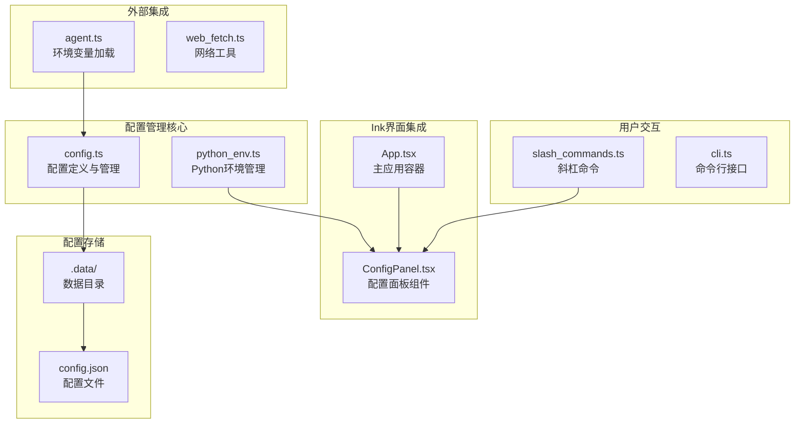
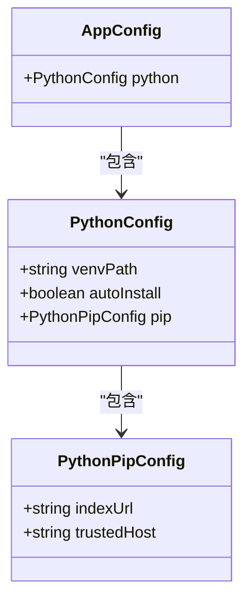
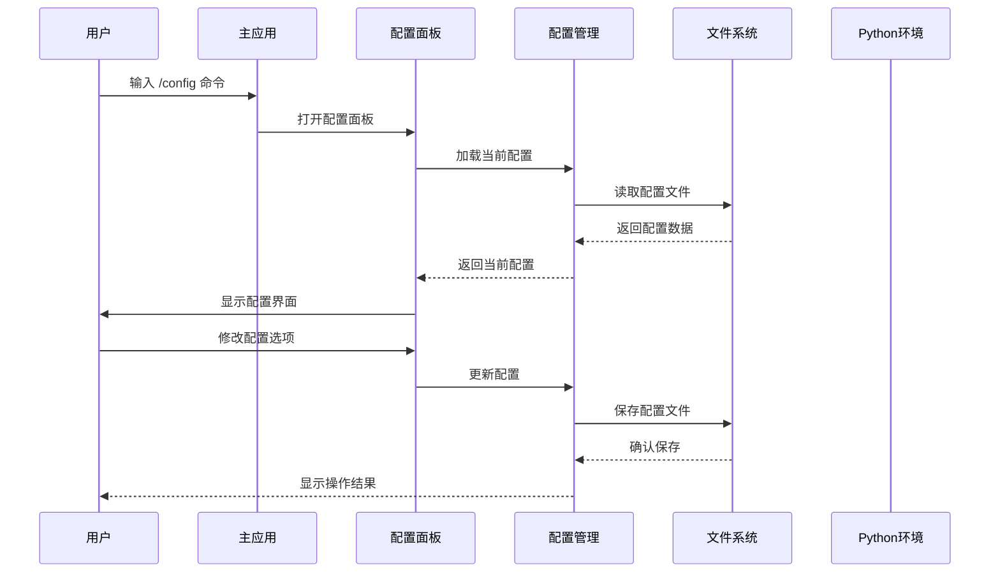
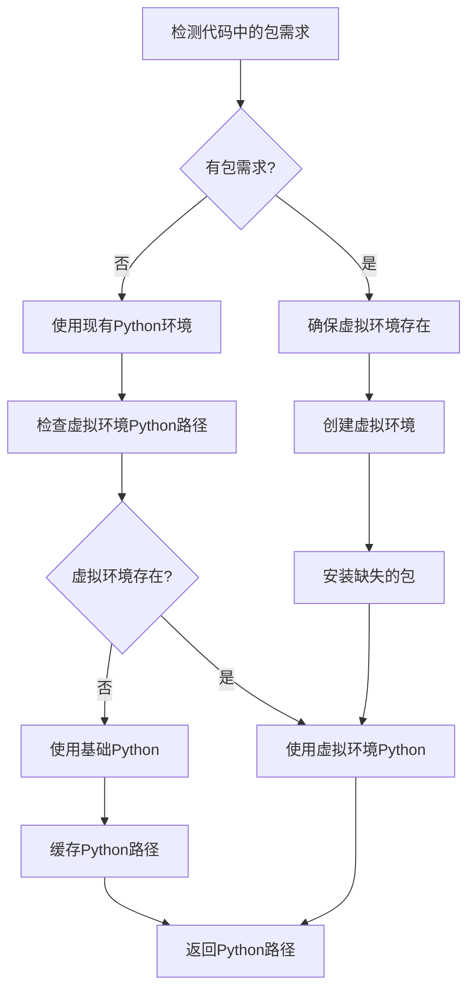
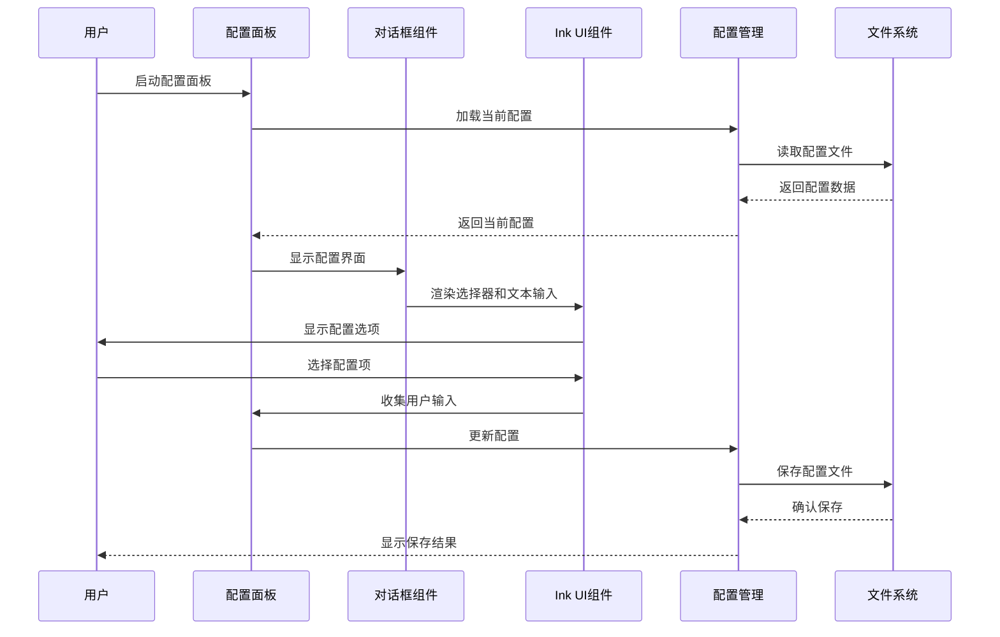
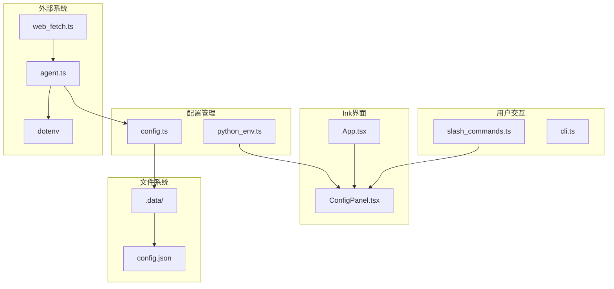

# 配置管理

<cite>
**本文档引用的文件**
- [config.ts](file://src/agent/config.ts)
- [python_env.ts](file://src/agent/python_env.ts)
- [ConfigPanel.tsx](file://src/ink/screens/ConfigPanel.tsx)
- [App.tsx](file://src/ink/App.tsx)
- [slash_commands.ts](file://src/agent/slash_commands.ts)
- [cli.ts](file://src/agent/cli.ts)
- [agent.ts](file://src/agent/agent.ts)
- [web_fetch.ts](file://src/agent/tools/web_fetch.ts)
- [package.json](file://package.json)
</cite>

## 更新摘要
**变更内容**
- 移除了复杂的inquirer基于对话框的交互式配置界面
- 新增了基于React Ink的ConfigPanel组件作为主要配置界面
- 简化了Python环境设置流程，移除了pip镜像源配置选项
- 将配置管理完全集成到Ink界面中，提供更好的用户体验
- 更新了配置加载和保存机制，保持向后兼容性

## 目录
1. [简介](#简介)
2. [项目结构](#项目结构)
3. [核心组件](#核心组件)
4. [架构概览](#架构概览)
5. [详细组件分析](#详细组件分析)
6. [依赖关系分析](#依赖关系分析)
7. [性能考虑](#性能考虑)
8. [故障排除指南](#故障排除指南)
9. [结论](#结论)

## 简介

本项目提供了一个现代化的配置管理系统，专注于Python运行环境配置和代理配置。该系统采用层次化的配置结构，支持默认配置、用户配置和环境变量的智能合并策略。配置文件持久化到`.data/config.json`，并通过全新的Ink界面中的ConfigPanel组件提供直观的用户体验。

**更新** 配置系统已从复杂的inquirer基于对话框简化为新的ConfigPanel组件，提供更流畅的用户体验和更好的集成度。

## 项目结构

配置管理系统主要分布在以下文件中：



**图表来源**
- [config.ts:1-68](file://src/agent/config.ts#L1-L68)
- [python_env.ts:1-223](file://src/agent/python_env.ts#L1-L223)
- [ConfigPanel.tsx:1-208](file://src/ink/screens/ConfigPanel.tsx#L1-L208)
- [App.tsx:1-100](file://src/ink/App.tsx#L1-L100)

**章节来源**
- [config.ts:1-68](file://src/agent/config.ts#L1-L68)
- [python_env.ts:1-223](file://src/agent/python_env.ts#L1-L223)
- [ConfigPanel.tsx:1-208](file://src/ink/screens/ConfigPanel.tsx#L1-L208)
- [App.tsx:1-100](file://src/ink/App.tsx#L1-L100)

## 核心组件

### 配置数据结构

系统采用分层的数据结构设计，确保配置的清晰性和可扩展性：



**图表来源**
- [config.ts:5-18](file://src/agent/config.ts#L5-L18)

### 默认配置策略

系统提供完善的默认配置，确保在没有任何用户干预的情况下也能正常工作：

- **Python虚拟环境路径**: `.data/python-venv`
- **自动安装**: 启用状态，便于新用户快速开始
- **镜像源**: 清华大学开源软件镜像站，提供稳定的下载服务
- **可信主机**: 对应的镜像站域名

**章节来源**
- [config.ts:20-29](file://src/agent/config.ts#L20-L29)

## 架构概览

配置管理系统采用现代化的Ink界面架构，ConfigPanel组件提供直观的配置体验：



**图表来源**
- [App.tsx:74-80](file://src/ink/App.tsx#L74-L80)
- [ConfigPanel.tsx:37-48](file://src/ink/screens/ConfigPanel.tsx#L37-L48)
- [config.ts:52-62](file://src/agent/config.ts#L52-L62)

## 详细组件分析

### 配置加载与合并机制

配置系统实现了智能的加载和合并策略：


**图表来源**
- [config.ts:52-62](file://src/agent/config.ts#L52-L62)
- [config.ts:39-50](file://src/agent/config.ts#L39-L50)

#### 合并策略详解

系统采用分层合并策略，确保配置的完整性和一致性：

1. **默认配置层**: 提供所有必需的默认值
2. **用户配置层**: 用户自定义的配置项
3. **环境变量层**: 系统环境中的配置覆盖

合并过程遵循以下规则：
- 深度合并嵌套对象
- 用户配置覆盖默认配置
- 缺失的字段使用默认值
- 空值不会覆盖已有配置

**章节来源**
- [config.ts:39-50](file://src/agent/config.ts#L39-L50)
- [config.ts:52-62](file://src/agent/config.ts#L52-L62)

### Python环境管理

Python环境管理是配置系统的核心功能之一：



**图表来源**
- [python_env.ts:161-170](file://src/agent/python_env.ts#L161-L170)
- [python_env.ts:189-222](file://src/agent/python_env.ts#L189-L222)

#### 包检测机制

系统能够智能检测Python代码中的包需求：

- **pandas**: 自动添加 `openpyxl` 支持
- **numpy**: 独立包需求
- **openpyxl**: 独立包需求

这种检测机制确保只安装必要的包，避免资源浪费。

**章节来源**
- [python_env.ts:172-187](file://src/agent/python_env.ts#L172-L187)

### Ink界面集成的ConfigPanel组件

**更新** 配置系统已完全集成到Ink界面中，提供现代化的配置体验：



**图表来源**
- [ConfigPanel.tsx:37-48](file://src/ink/screens/ConfigPanel.tsx#L37-L48)
- [ConfigPanel.tsx:80-186](file://src/ink/screens/ConfigPanel.tsx#L80-L186)
- [config.ts:52-62](file://src/agent/config.ts#L52-L62)

**章节来源**
- [ConfigPanel.tsx:1-208](file://src/ink/screens/ConfigPanel.tsx#L1-L208)

## 依赖关系分析

配置管理系统与其他组件的依赖关系如下：



**图表来源**
- [config.ts:1-5](file://src/agent/config.ts#L1-L5)
- [python_env.ts:1-4](file://src/agent/python_env.ts#L1-L4)
- [App.tsx:10](file://src/ink/App.tsx#L10)

### 外部依赖

系统依赖以下关键包：

- **@inkjs/ui**: Ink界面组件库，提供现代化的UI组件
- **ink**: React的终端渲染库
- **@assistant-ui/react-ink**: AI助手界面集成
- **chalk**: 控制台样式化输出
- **dotenv**: 环境变量管理
- **commander**: 命令行参数解析

**章节来源**
- [package.json:21-44](file://package.json#L21-L44)

## 性能考虑

### 配置缓存策略

系统实现了多层缓存机制以提升性能：

1. **Python路径缓存**: 缓存已发现的Python可执行文件路径
2. **包检测缓存**: 避免重复的包检测操作
3. **配置文件缓存**: 减少频繁的文件I/O操作

### 异步操作优化

- **非阻塞I/O**: 配置文件读写使用异步操作
- **超时控制**: 所有外部进程调用都有超时保护
- **并发处理**: 支持同时进行多个配置操作

## 故障排除指南

### 常见问题及解决方案

#### 配置文件损坏

**症状**: 应用启动时报错，显示配置解析失败

**解决方法**:
1. 备份当前配置文件
2. 删除损坏的配置文件
3. 重新启动应用，使用默认配置
4. 通过配置面板重新设置

#### Python环境初始化失败

**症状**: Python包安装过程中出现错误

**解决方法**:
1. 检查网络连接和代理设置
2. 验证Python解释器是否正确安装
3. 尝试手动创建虚拟环境
4. 检查磁盘空间和权限

#### 镜像源访问问题

**症状**: pip安装包时超时或失败

**解决方法**:
1. 更换到其他镜像源
2. 检查防火墙设置
3. 配置HTTP代理（如果需要）
4. 使用国内镜像源如清华、阿里等

### 调试技巧

#### 启用调试模式

可以通过以下方式启用更详细的日志输出：

1. 设置环境变量 `DEBUG=true`
2. 使用 `-v` 或 `--verbose` 参数启动应用
3. 检查 `.data/debug.log` 文件获取详细信息

#### 配置验证

使用以下命令验证配置的有效性：

```bash
# 检查配置文件语法
cat .data/config.json | jq .

# 验证Python环境
python --version
which python3
```

**章节来源**
- [config.ts:52-62](file://src/agent/config.ts#L52-L62)
- [python_env.ts:134-139](file://src/agent/python_env.ts#L134-L139)

## 结论

本配置管理系统提供了现代化的Python运行环境配置解决方案，具有以下特点：

1. **现代化界面**: 基于Ink的ConfigPanel组件提供直观的配置体验
2. **层次化配置**: 支持默认、用户和环境变量的智能合并
3. **自动环境管理**: 智能检测和安装Python依赖
4. **健壮性**: 完善的错误处理和故障恢复机制
5. **可扩展性**: 模块化设计便于功能扩展

**更新** 配置系统已成功从复杂的inquirer基于对话框简化为新的ConfigPanel组件，提供了更好的用户体验和更紧密的界面集成。系统通过合理的架构设计和实现策略，为用户提供了一个稳定、可靠的配置管理解决方案。无论是新用户还是高级用户，都能通过该系统轻松管理Python运行环境和相关配置。