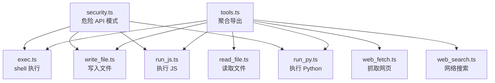
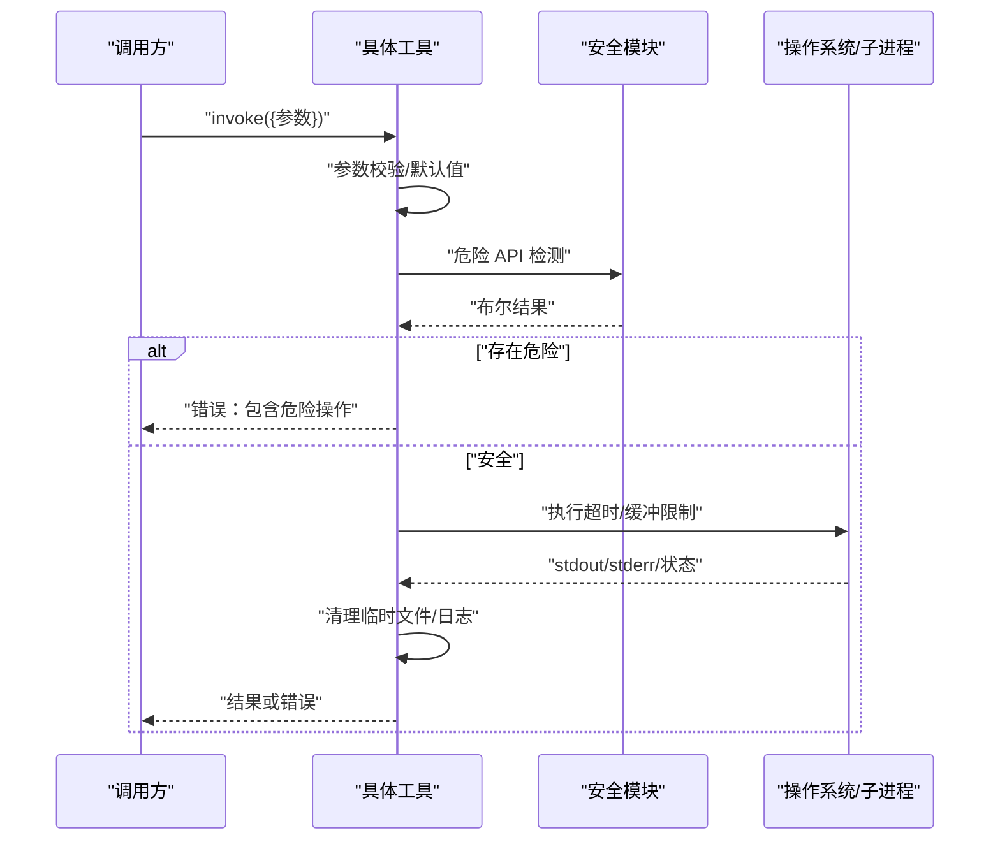
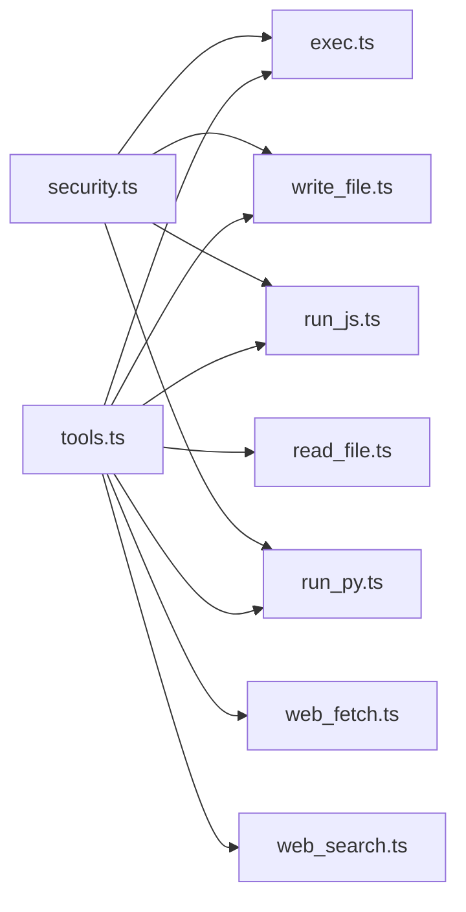

# 工具配置

<cite>
**本文引用的文件**
- [tools.ts](file://src/agent/tools.ts)
- [exec.ts](file://src/agent/tools/exec.ts)
- [security.ts](file://src/agent/tools/security.ts)
- [read_file.ts](file://src/agent/tools/read_file.ts)
- [write_file.ts](file://src/agent/tools/write_file.ts)
- [web_fetch.ts](file://src/agent/tools/web_fetch.ts)
- [web_search.ts](file://src/agent/tools/web_search.ts)
- [run_js.ts](file://src/agent/tools/run_js.ts)
- [run_py.ts](file://src/agent/tools/run_py.ts)
- [exec.test.ts](file://src/agent/tools/exec.test.ts)
- [read_file.test.ts](file://src/agent/tools/read_file.test.ts)
- [web_fetch.test.ts](file://src/agent/tools/web_fetch.test.ts)
- [web_search.test.ts](file://src/agent/tools/web_search.test.ts)
- [run_js.test.ts](file://src/agent/tools/run_js.test.ts)
- [run_py.test.ts](file://src/agent/tools/run_py.test.ts)
</cite>

## 目录
1. [简介](#简介)
2. [项目结构](#项目结构)
3. [核心组件](#核心组件)
4. [架构总览](#架构总览)
5. [详细组件分析](#详细组件分析)
6. [依赖关系分析](#依赖关系分析)
7. [性能与资源限制](#性能与资源限制)
8. [故障排查指南](#故障排查指南)
9. [结论](#结论)
10. [附录：配置示例与最佳实践](#附录配置示例与最佳实践)

## 简介
本文件系统性梳理了代码库中“工具配置”的实现与使用方式，覆盖以下方面：
- 工具分类与参数定义：文件操作工具、网络工具、代码执行工具
- 安全配置：命令/代码注入阻断、危险 API 检测、路径逃逸防护、超时与缓冲区限制
- 工具启用/禁用与配置优先级：基于环境变量与运行时可用性
- 参数校验与错误处理：输入校验、异常捕获、统一错误返回
- 性能监控与日志：超时、响应大小、输出缓冲、控制台日志
- 示例与最佳实践：结合测试用例提炼可复用配置建议

## 项目结构
工具模块集中于 src/agent/tools 目录，通过一个聚合导出文件统一对外暴露。

图示来源
- [tools.ts:1-10](file://src/agent/tools.ts#L1-L10)
- [exec.ts:1-143](file://src/agent/tools/exec.ts#L1-L143)
- [security.ts:1-27](file://src/agent/tools/security.ts#L1-L27)
- [read_file.ts:1-41](file://src/agent/tools/read_file.ts#L1-L41)
- [write_file.ts:1-55](file://src/agent/tools/write_file.ts#L1-L55)
- [web_fetch.ts:1-83](file://src/agent/tools/web_fetch.ts#L1-L83)
- [web_search.ts:1-41](file://src/agent/tools/web_search.ts#L1-L41)
- [run_js.ts:1-90](file://src/agent/tools/run_js.ts#L1-L90)
- [run_py.ts:1-90](file://src/agent/tools/run_py.ts#L1-L90)

章节来源
- [tools.ts:1-10](file://src/agent/tools.ts#L1-L10)

## 核心组件
- 文件操作工具
  - 读取文件：限制在当前工作目录内，禁止路径逃逸；对目录与不存在文件进行明确报错
  - 写入文件：同路径约束；禁止内容中包含危险 API 调用
- 网络工具
  - 抓取网页：仅支持 http/https；带超时与响应大小上限；统一错误码映射
  - 网络搜索：封装第三方搜索客户端，需配置 API Key
- 代码执行工具
  - 执行 JS：通过 Node.js 执行，临时文件落地；禁止危险 API；超时与缓冲限制
  - 执行 Python：通过 python3 执行，临时文件落地；禁止危险 API；超时与缓冲限制
- 安全模块
  - 统一危险 API 模式匹配，覆盖 Node.js fs/child_process、Python shutil/os/subprocess 等

章节来源
- [read_file.ts:6-41](file://src/agent/tools/read_file.ts#L6-L41)
- [write_file.ts:7-55](file://src/agent/tools/write_file.ts#L7-L55)
- [web_fetch.ts:20-83](file://src/agent/tools/web_fetch.ts#L20-L83)
- [web_search.ts:16-41](file://src/agent/tools/web_search.ts#L16-L41)
- [run_js.ts:22-90](file://src/agent/tools/run_js.ts#L22-L90)
- [run_py.ts:22-90](file://src/agent/tools/run_py.ts#L22-L90)
- [security.ts:1-27](file://src/agent/tools/security.ts#L1-L27)

## 架构总览
工具调用链路遵循统一模式：参数校验 → 安全检查 → 资源可用性检查 → 执行 → 清理/收尾 → 返回结果或错误信息。

图示来源
- [exec.ts:94-143](file://src/agent/tools/exec.ts#L94-L143)
- [security.ts:24-27](file://src/agent/tools/security.ts#L24-L27)
- [run_js.ts:22-90](file://src/agent/tools/run_js.ts#L22-L90)
- [run_py.ts:22-90](file://src/agent/tools/run_py.ts#L22-L90)
- [web_fetch.ts:20-83](file://src/agent/tools/web_fetch.ts#L20-L83)
- [read_file.ts:6-41](file://src/agent/tools/read_file.ts#L6-L41)
- [write_file.ts:7-55](file://src/agent/tools/write_file.ts#L7-L55)

## 详细组件分析

### 文件读取工具（read_file）
- 功能要点
  - 解析相对路径并限定在当前工作目录之内
  - 对目录与不存在文件进行明确报错
  - 读取 UTF-8 文本并记录调用日志
- 关键参数
  - filename：目标文件名
- 错误处理
  - 路径逃逸：禁止
  - 目录：禁止
  - 文件不存在：返回特定错误
- 性能与安全
  - 无超时/缓冲限制，但受底层文件系统影响

章节来源
- [read_file.ts:6-41](file://src/agent/tools/read_file.ts#L6-L41)

### 文件写入工具（write_file）
- 功能要点
  - 同路径约束；若目标存在且为目录则拒绝
  - 内容安全扫描：禁止危险 API 调用
  - 写入 UTF-8 文本并记录调用日志
- 关键参数
  - filename：目标文件名
  - content：写入内容
- 错误处理
  - 路径逃逸：禁止
  - 目录冲突：禁止
  - 危险内容：禁止
  - 其他 IO 错误：返回通用错误

章节来源
- [write_file.ts:7-55](file://src/agent/tools/write_file.ts#L7-L55)
- [security.ts:24-27](file://src/agent/tools/security.ts#L24-L27)

### Shell 执行工具（exec）
- 安全策略
  - 命令词典黑名单：删除/移动/复制/格式化/关机/提权/用户管理/进程管理/链接/下载/压缩等
  - Eval 注入检测：识别 node -e、python -c 等注入模式
  - 危险 API 检测：复用共享模块
- 超时与缓冲
  - 执行超时：固定 30 秒
  - 输出缓冲上限：固定 1MB
- 关键参数
  - command：待执行的 shell 命令
- 错误处理
  - 空命令：直接报错
  - 危险命令/注入/API：统一错误提示
  - 超时/IO/stderr/stdout：差异化返回

章节来源
- [exec.ts:94-143](file://src/agent/tools/exec.ts#L94-L143)
- [security.ts:24-27](file://src/agent/tools/security.ts#L24-L27)

### 网页抓取工具（web_fetch）
- 安全与协议
  - 仅允许 http/https
- 超时与大小
  - 请求超时：固定 15 秒
  - 响应大小上限：固定 512KB
- 关键参数
  - url：目标地址
- 错误处理
  - URL 校验失败：报错
  - HTTP 非 OK：报错
  - 超时/网络错误/DNS 失败/连接被拒/连接重置：统一错误映射

章节来源
- [web_fetch.ts:20-83](file://src/agent/tools/web_fetch.ts#L20-L83)

### 网络搜索工具（web_search）
- 依赖与配置
  - 使用第三方搜索客户端，需设置 API Key 环境变量
- 关键参数
  - query：搜索关键词
- 错误处理
  - 缺少 API Key：报错
  - 客户端异常：报错
  - 成功：返回结果文本

章节来源
- [web_search.ts:16-41](file://src/agent/tools/web_search.ts#L16-L41)

### JavaScript 执行工具（run_js）
- 可用性检查
  - 检测 Node.js 是否可用
- 安全策略
  - 禁止危险 API 调用
- 执行流程
  - 将代码写入临时文件，再通过 node 执行
  - 固定超时与输出缓冲上限
- 关键参数
  - code：待执行的 JS 代码
- 错误处理
  - 空代码：报错
  - 危险内容：报错
  - 超时/IO/stderr/stdout：差异化返回
  - 清理临时文件（忽略失败）

章节来源
- [run_js.ts:22-90](file://src/agent/tools/run_js.ts#L22-L90)
- [security.ts:24-27](file://src/agent/tools/security.ts#L24-L27)

### Python 执行工具（run_py）
- 可用性检查
  - 检测 python3 是否可用
- 安全策略
  - 禁止危险 API 调用
- 执行流程
  - 将代码写入临时文件，再通过 python3 执行
  - 固定超时与输出缓冲上限
- 关键参数
  - code：待执行的 Python 代码
- 错误处理
  - 空代码：报错
  - 危险内容：报错
  - 超时/IO/stderr/stdout：差异化返回
  - 清理临时文件（忽略失败）

章节来源
- [run_py.ts:22-90](file://src/agent/tools/run_py.ts#L22-L90)
- [security.ts:24-27](file://src/agent/tools/security.ts#L24-L27)

## 依赖关系分析
- 工具聚合导出
  - 通过单一入口统一导出各工具，便于上层按需引入
- 安全模块共享
  - exec、write_file、run_js、run_py 共用危险 API 检测逻辑
- 外部依赖
  - 网络搜索依赖第三方客户端与 API Key
  - 代码执行依赖系统可执行程序（node/python3）

图示来源
- [tools.ts:1-10](file://src/agent/tools.ts#L1-L10)
- [exec.ts:1-143](file://src/agent/tools/exec.ts#L1-L143)
- [security.ts:1-27](file://src/agent/tools/security.ts#L1-L27)
- [read_file.ts:1-41](file://src/agent/tools/read_file.ts#L1-L41)
- [write_file.ts:1-55](file://src/agent/tools/write_file.ts#L1-L55)
- [web_fetch.ts:1-83](file://src/agent/tools/web_fetch.ts#L1-L83)
- [web_search.ts:1-41](file://src/agent/tools/web_search.ts#L1-L41)
- [run_js.ts:1-90](file://src/agent/tools/run_js.ts#L1-L90)
- [run_py.ts:1-90](file://src/agent/tools/run_py.ts#L1-L90)

## 性能与资源限制
- 超时与缓冲
  - exec：命令执行超时 30 秒，输出缓冲上限 1MB
  - run_js/run_py：命令执行超时 15 秒，输出缓冲上限 512KB
  - web_fetch：请求超时 15 秒，响应大小上限 512KB
- 日志
  - 各工具在调用时打印控制台日志，便于审计与排障
- 资源清理
  - run_js/run_py 在 finally 中尝试清理临时文件（忽略失败）

章节来源
- [exec.ts:112-132](file://src/agent/tools/exec.ts#L112-L132)
- [run_js.ts:46-75](file://src/agent/tools/run_js.ts#L46-L75)
- [run_py.ts:46-75](file://src/agent/tools/run_py.ts#L46-L75)
- [web_fetch.ts:30-72](file://src/agent/tools/web_fetch.ts#L30-L72)

## 故障排查指南
- 文件读取
  - 症状：返回“路径逃逸”或“不是文件”
  - 排查：确认 filename 不含 “..”；确认目标为文件而非目录
- 文件写入
  - 症状：返回“危险内容”或“路径逃逸”
  - 排查：移除内容中的危险 API 调用；确认目标路径在当前目录内
- Shell 执行
  - 症状：返回“危险命令/注入/危险 API”
  - 排查：避免黑名单命令与 eval 注入；避免调用危险 API
  - 症状：返回“超时”
  - 排查：缩短命令执行时间或拆分任务
- 网络抓取
  - 症状：返回“URL 无效/协议不支持”
  - 排查：仅使用 http/https
  - 症状：返回“超时/DNS 失败/连接被拒”
  - 排查：检查网络连通性与目标可达性
  - 症状：返回“响应过大”
  - 排查：降低目标页面复杂度或改用更小资源
- 网络搜索
  - 症状：返回“缺少 API Key”
  - 排查：设置正确的 API Key 环境变量
- 代码执行
  - 症状：返回“空代码/空白代码”
  - 排查：确保传入有效代码
  - 症状：返回“危险内容”
  - 排查：移除危险 API 调用
  - 症状：返回“未安装 Node.js/python3”
  - 排查：安装并确保在 PATH 中可用
  - 症状：返回“超时”
  - 排查：优化代码逻辑，减少执行时间

章节来源
- [read_file.ts:11-31](file://src/agent/tools/read_file.ts#L11-L31)
- [write_file.ts:12-41](file://src/agent/tools/write_file.ts#L12-L41)
- [exec.ts:96-132](file://src/agent/tools/exec.ts#L96-L132)
- [web_fetch.ts:21-72](file://src/agent/tools/web_fetch.ts#L21-L72)
- [web_search.ts:20-30](file://src/agent/tools/web_search.ts#L20-L30)
- [run_js.ts:23-75](file://src/agent/tools/run_js.ts#L23-L75)
- [run_py.ts:23-75](file://src/agent/tools/run_py.ts#L23-L75)

## 结论
该工具集通过“参数校验 + 安全扫描 + 资源限制 + 统一错误处理”的设计，在保证易用性的同时强化了安全性与稳定性。建议在生产环境中：
- 明确各工具启用/禁用策略，并通过环境变量与部署配置控制
- 为网络搜索类工具配置稳定的 API Key 管理
- 为代码执行类工具提供独立的沙箱与资源隔离
- 建立统一的日志与告警体系，结合控制台日志进行审计

## 附录：配置示例与最佳实践
- 工具启用/禁用与优先级
  - 通过导入导出聚合文件按需启用工具
  - 运行时可用性（如 Node.js/python3）优先于配置项
  - 环境变量（如 API Key）优先于硬编码配置
- 参数校验与错误处理
  - 严格区分“输入为空/非法”与“执行失败”，前者快速失败，后者保留上下文
  - 对超时/缓冲溢出/网络错误进行明确分类与提示
- 安全最佳实践
  - 优先使用临时文件执行代码，避免命令行注入
  - 保持危险 API 模式库更新，覆盖新出现的高危调用
  - 限制执行超时与输出缓冲，防止资源耗尽
- 性能与日志
  - 为长耗时任务设置合理的超时阈值
  - 利用控制台日志定位问题，必要时接入结构化日志系统
- 示例参考（来自测试）
  - 文件读取：读取现有文件、目录与路径逃逸场景
  - 文件写入：危险内容拦截、路径逃逸拦截
  - Shell 执行：黑名单命令、eval 注入、危险 API 拦截
  - 网络抓取：HTTP 错误、超时、DNS/网络错误、协议校验
  - 网络搜索：API Key 缺失、客户端异常
  - 代码执行：语法/运行时错误、危险内容拦截、空代码

章节来源
- [read_file.test.ts:4-47](file://src/agent/tools/read_file.test.ts#L4-L47)
- [write_file.test.ts:1-55](file://src/agent/tools/write_file.test.ts#L1-L55)
- [exec.test.ts:5-150](file://src/agent/tools/exec.test.ts#L5-L150)
- [web_fetch.test.ts:6-145](file://src/agent/tools/web_fetch.test.ts#L6-L145)
- [web_search.test.ts:18-95](file://src/agent/tools/web_search.test.ts#L18-L95)
- [run_js.test.ts:4-85](file://src/agent/tools/run_js.test.ts#L4-L85)
- [run_py.test.ts:4-85](file://src/agent/tools/run_py.test.ts#L4-L85)