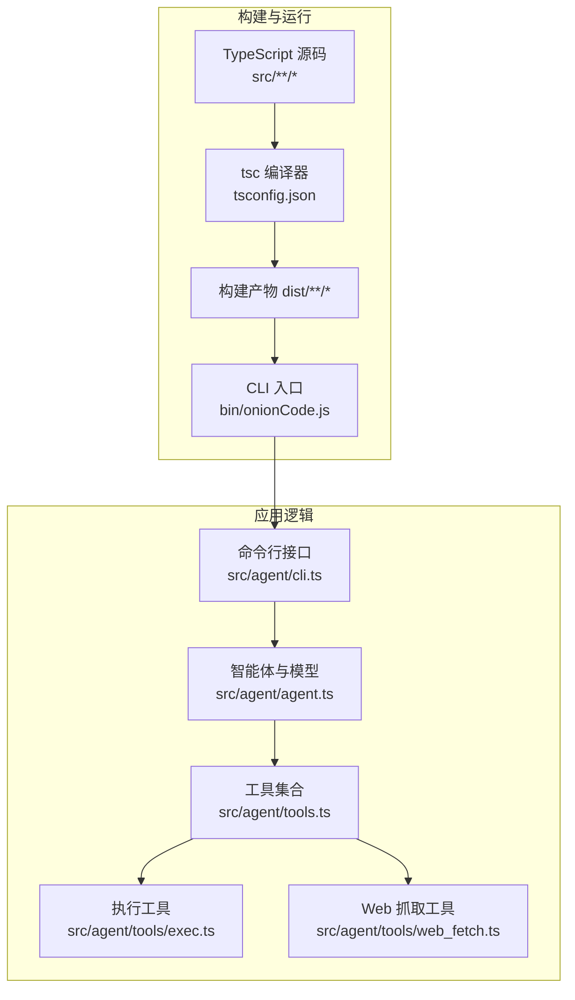
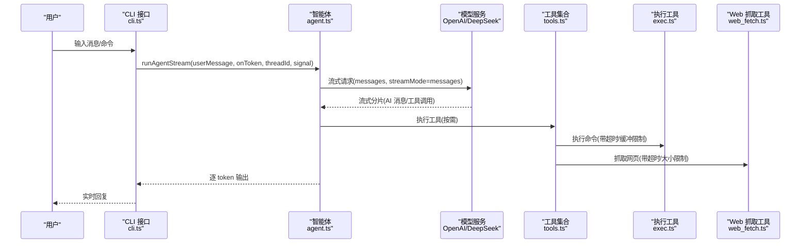
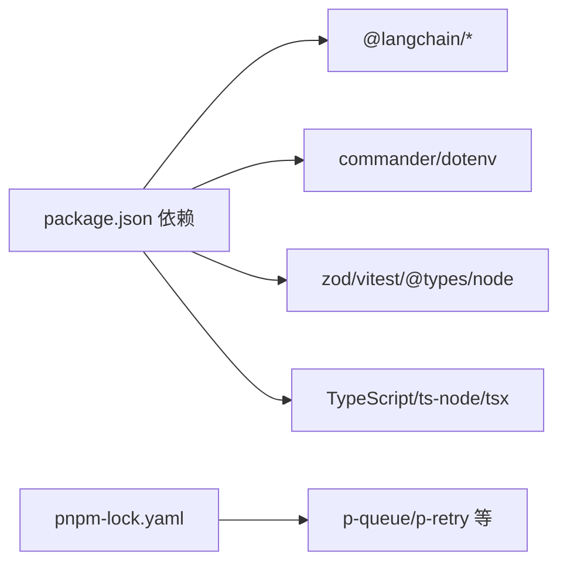

# 性能调优

<cite>
**本文引用的文件**
- [package.json](file://package.json)
- [tsconfig.json](file://tsconfig.json)
- [bin/onionCode.js](file://bin/onionCode.js)
- [src/agent/cli.ts](file://src/agent/cli.ts)
- [src/agent/agent.ts](file://src/agent/agent.ts)
- [src/agent/tools.ts](file://src/agent/tools.ts)
- [src/agent/tools/exec.ts](file://src/agent/tools/exec.ts)
- [src/agent/tools/web_fetch.ts](file://src/agent/tools/web_fetch.ts)
- [src/agent/skills/skill-creator/scripts/run_eval.py](file://src/agent/skills/skill-creator/scripts/run_eval.py)
- [src/agent/skills/skill-creator/eval-viewer/viewer.html](file://src/agent/skills/skill-creator/eval-viewer/viewer.html)
</cite>

## 目录
1. [简介](#简介)
2. [项目结构](#项目结构)
3. [核心组件](#核心组件)
4. [架构总览](#架构总览)
5. [详细组件分析](#详细组件分析)
6. [依赖关系分析](#依赖关系分析)
7. [性能考量与优化策略](#性能考量与优化策略)
8. [故障排查指南](#故障排查指南)
9. [结论](#结论)
10. [附录](#附录)

## 简介
本文件聚焦于本项目的性能调优实践，围绕 TypeScript 编译配置、内存使用、并发与缓存策略、响应时间与吞吐量优化、日志与调试对性能的影响、性能监控与基准测试方法，以及不同负载场景下的配置建议展开。文档在不直接展示源码的前提下，基于仓库现有实现进行系统性分析，并给出可落地的优化建议。

## 项目结构
该项目是一个 CLI AI Agent，采用 TypeScript 开发，使用 LangChain/LangGraph 作为智能体框架，结合多种工具（文件读写、执行命令、Web 搜索/抓取、脚本运行等）完成任务。构建产物输出到 dist 目录，CLI 入口位于 bin/onionCode.js，运行入口在 src/agent/cli.ts。

图表来源
- [tsconfig.json:1-20](file://tsconfig.json#L1-L20)
- [bin/onionCode.js:1-3](file://bin/onionCode.js#L1-L3)
- [src/agent/cli.ts:1-126](file://src/agent/cli.ts#L1-L126)
- [src/agent/agent.ts:1-98](file://src/agent/agent.ts#L1-L98)
- [src/agent/tools.ts:1-10](file://src/agent/tools.ts#L1-L10)
- [src/agent/tools/exec.ts:1-143](file://src/agent/tools/exec.ts#L1-L143)
- [src/agent/tools/web_fetch.ts:1-83](file://src/agent/tools/web_fetch.ts#L1-L83)

章节来源
- [package.json:1-38](file://package.json#L1-L38)
- [tsconfig.json:1-20](file://tsconfig.json#L1-L20)
- [bin/onionCode.js:1-3](file://bin/onionCode.js#L1-L3)
- [src/agent/cli.ts:1-126](file://src/agent/cli.ts#L1-L126)
- [src/agent/agent.ts:1-98](file://src/agent/agent.ts#L1-L98)
- [src/agent/tools.ts:1-10](file://src/agent/tools.ts#L1-L10)
- [src/agent/tools/exec.ts:1-143](file://src/agent/tools/exec.ts#L1-L143)
- [src/agent/tools/web_fetch.ts:1-83](file://src/agent/tools/web_fetch.ts#L1-L83)

## 核心组件
- 构建与运行
  - TypeScript 编译配置：目标环境、模块系统、严格模式、声明生成、类型路径等。
  - 构建脚本：tsc 编译 + 技能资源复制。
  - CLI 入口：bin/onionCode.js 直接加载 dist/agent/cli.js。
- 应用逻辑
  - CLI 接口：支持 ask 单轮问答与交互式聊天；内置错误格式化与中断控制。
  - 智能体与模型：LangGraph 智能体，OpenAI 模型（DeepSeek 兼容），启用流式输出；内存检查点用于会话续接。
  - 工具集：文件读写、执行命令、Web 搜索/抓取、脚本运行、技能加载等。

章节来源
- [package.json:11-16](file://package.json#L11-L16)
- [tsconfig.json:2-16](file://tsconfig.json#L2-L16)
- [bin/onionCode.js:1-3](file://bin/onionCode.js#L1-L3)
- [src/agent/cli.ts:40-62](file://src/agent/cli.ts#L40-L62)
- [src/agent/agent.ts:25-51](file://src/agent/agent.ts#L25-L51)
- [src/agent/tools.ts:1-10](file://src/agent/tools.ts#L1-L10)

## 架构总览
下图展示了 CLI、智能体与工具之间的交互流程，以及关键的性能相关点（流式输出、超时控制、缓冲限制、并发与缓存策略的建议位置）。

图表来源
- [src/agent/cli.ts:66-125](file://src/agent/cli.ts#L66-L125)
- [src/agent/agent.ts:61-97](file://src/agent/agent.ts#L61-L97)
- [src/agent/tools/exec.ts:111-133](file://src/agent/tools/exec.ts#L111-L133)
- [src/agent/tools/web_fetch.ts:20-73](file://src/agent/tools/web_fetch.ts#L20-L73)

## 详细组件分析

### TypeScript 编译配置与性能
- 关键编译选项对性能的影响
  - 目标与模块：ES2022 + CommonJS，适配现代 Node 运行时，减少转译开销。
  - 严格模式：提升类型安全，降低运行期错误导致的重试与回退成本。
  - esModuleInterop：改善模块互操作，避免额外的包装与转换。
  - skipLibCheck：跳过第三方库类型检查，显著缩短构建时间。
  - declaration：生成 d.ts，便于 IDE 与二次开发，但会增加构建时间。
  - resolveJsonModule：支持 JSON 导入，避免额外转换。
  - forceConsistentCasingInFileNames：避免大小写差异引发的文件系统争用。
  - 忽略弃用警告：ignoreDeprecations 有助于过渡期快速构建。
- 构建与产物
  - outDir=dist、rootDir=src，清晰的产物隔离。
  - include/exclude 控制编译范围，排除测试文件与 node_modules，减少编译负担。
- 建议
  - 生产构建开启最小化与摇树优化（如配合打包器），当前仅 tsc，可考虑引入打包器进一步压缩体积与依赖。
  - 对大型工具集或技能资源，可分离编译与资源复制，避免重复拷贝。

章节来源
- [tsconfig.json:2-16](file://tsconfig.json#L2-L16)
- [package.json:14](file://package.json#L14)

### CLI 与交互式会话
- 单轮问答与交互式聊天
  - ask 子命令：一次性请求，适合低延迟场景。
  - 交互式聊天：持续对话，使用线程标识续接历史，支持 ESC 中断。
- 性能要点
  - 流式输出：onToken 回调逐 token 写入，降低首字节延迟。
  - 中断控制：AbortController 响应 ESC，避免无谓的后续计算。
  - 错误格式化：统一错误提示，减少重复重试与无效请求。

章节来源
- [src/agent/cli.ts:40-62](file://src/agent/cli.ts#L40-L62)
- [src/agent/cli.ts:66-125](file://src/agent/cli.ts#L66-L125)

### 智能体与模型
- 模型配置
  - OpenAI 兼容（DeepSeek）：启用流式输出，降低等待时间。
  - 检查点：MemorySaver 支持会话续接，避免重复上下文传输。
- 性能要点
  - 流式模式：边生成边输出，显著改善感知延迟。
  - 会话复用：通过 thread_id 续接历史，减少上下文长度带来的延迟与费用。

章节来源
- [src/agent/agent.ts:25-51](file://src/agent/agent.ts#L25-L51)
- [src/agent/agent.ts:61-97](file://src/agent/agent.ts#L61-L97)

### 工具：执行命令与 Web 抓取
- 执行命令工具
  - 超时：默认 30 秒，防止长时间阻塞。
  - 输出缓冲：最大 1MB，避免内存暴涨。
  - 安全：多层黑名单与模式匹配，阻断高危命令与注入式调用。
- Web 抓取工具
  - 超时：默认 15 秒，避免慢响应拖累整体。
  - 响应大小限制：最大 512KB，防止大体积内容占用过多内存。
  - URL 校验：仅允许 http/https，减少无效请求。
- 性能要点
  - 超时与缓冲限制是保障稳定性的关键，避免单个工具成为性能瓶颈。
  - 安全检查在 IO 前置，减少恶意请求造成的资源浪费。

章节来源
- [src/agent/tools/exec.ts:111-133](file://src/agent/tools/exec.ts#L111-L133)
- [src/agent/tools/web_fetch.ts:4-5](file://src/agent/tools/web_fetch.ts#L4-L5)
- [src/agent/tools/web_fetch.ts:20-73](file://src/agent/tools/web_fetch.ts#L20-L73)

### 基准评估与可视化
- 评估脚本
  - 使用并发执行与聚合统计，计算通过率与平均耗时，辅助对比不同配置。
- 可视化页面
  - 动态渲染基准结果，按配置分组显示每轮与平均值，支持对比 Delta。
- 性能要点
  - 通过多轮运行与统计口径，识别配置变化对吞吐与稳定性的影响。
  - 建议在不同数据规模与并发下重复评估，确保结果稳健。

章节来源
- [src/agent/skills/skill-creator/scripts/run_eval.py:213-245](file://src/agent/skills/skill-creator/scripts/run_eval.py#L213-L245)
- [src/agent/skills/skill-creator/scripts/run_eval.py:45-78](file://src/agent/skills/skill-creator/scripts/run_eval.py#L45-L78)
- [src/agent/skills/skill-creator/eval-viewer/viewer.html:1114-1283](file://src/agent/skills/skill-creator/eval-viewer/viewer.html#L1114-L1283)

## 依赖关系分析
- 运行时依赖
  - LangChain 生态：@langchain/core、@langchain/langgraph、@langchain/openai、@langchain/tavily。
  - CLI 与配置：commander、dotenv。
  - 类型与测试：zod、vitest、@types/node。
- 构建与开发依赖
  - TypeScript、ts-node、tsx。
- 并发与重试
  - p-queue、p-retry 等在锁文件中出现，可用于外部并发队列与重试策略集成（当前未在主流程直接使用）。

图表来源
- [package.json:20-36](file://package.json#L20-L36)
- [pnpm-lock.yaml:651-684](file://pnpm-lock.yaml#L651-L684)

章节来源
- [package.json:20-36](file://package.json#L20-L36)
- [pnpm-lock.yaml:651-684](file://pnpm-lock.yaml#L651-L684)

## 性能考量与优化策略

### TypeScript 编译配置对性能的影响
- 目标与模块
  - ES2022 + CommonJS：减少转译与兼容性封装，提升启动速度与运行效率。
- 严格模式与类型检查
  - 严格模式提升类型安全，减少运行期异常导致的重试与回退。
  - skipLibCheck 显著缩短构建时间，适合大型依赖库。
- 声明文件与 JSON 模块
  - 生成 d.ts 有利于 IDE 与二次开发，但会增加构建时间；可在 CI 中按需开启。
  - resolveJsonModule 减少额外转换，提高导入性能。
- 构建范围控制
  - include/exclude 精准控制编译范围，避免测试与 node_modules 参与编译。

章节来源
- [tsconfig.json:2-16](file://tsconfig.json#L2-L16)

### 内存使用优化
- 工具侧限制
  - 执行命令：设置超时与输出缓冲上限，防止内存溢出。
  - Web 抓取：限制响应大小，避免大对象占用堆内存。
- 智能体侧优化
  - 使用 MemorySaver 检查点续接历史，避免每次请求携带完整上下文。
  - 合理设置会话线程，避免历史无限增长。
- 建议
  - 对长会话定期清理历史或拆分线程。
  - 对工具调用结果做及时消费与释放，避免累积。

章节来源
- [src/agent/tools/exec.ts:111-133](file://src/agent/tools/exec.ts#L111-L133)
- [src/agent/tools/web_fetch.ts:4-5](file://src/agent/tools/web_fetch.ts#L4-L5)
- [src/agent/agent.ts:22-23](file://src/agent/agent.ts#L22-L23)

### 并发处理配置
- 现状
  - 主流程为串行流式处理，工具调用在需要时执行，未见显式的并发队列或重试机制。
- 建议
  - 对外部 API（模型/搜索/抓取）引入并发队列与指数退避重试，平衡吞吐与稳定性。
  - 对 CPU 密集型工具（如脚本执行）限制并发数，避免资源争用。
  - 使用 AbortController 与超时组合，确保弱网或慢响应不会阻塞主线程。

章节来源
- [src/agent/agent.ts:69-94](file://src/agent/agent.ts#L69-L94)
- [src/agent/tools/web_fetch.ts:30-43](file://src/agent/tools/web_fetch.ts#L30-L43)
- [src/agent/tools/exec.ts:112-117](file://src/agent/tools/exec.ts#L112-L117)

### 缓存策略
- 现状
  - 会话历史通过 MemorySaver 持久化，避免重复上下文传输。
- 建议
  - 对频繁访问的外部资源（如技能模板、工具描述）增加本地缓存。
  - 对模型响应（在合规前提下）增加短期缓存，降低重复请求成本。
  - 缓存失效策略：基于 TTL 或 LRU，避免陈旧数据影响准确性。

章节来源
- [src/agent/agent.ts:22-23](file://src/agent/agent.ts#L22-L23)

### 响应时间优化
- 流式输出
  - 启用 streaming，边生成边输出，显著降低感知延迟。
- 超时与短路
  - 工具侧超时与大小限制，避免慢响应拖累整体。
- 中断控制
  - ESC 触发 AbortController，快速终止无意义的后续计算。

章节来源
- [src/agent/agent.ts:32-33](file://src/agent/agent.ts#L32-L33)
- [src/agent/cli.ts:84-106](file://src/agent/cli.ts#L84-L106)
- [src/agent/tools/exec.ts:112-117](file://src/agent/tools/exec.ts#L112-L117)
- [src/agent/tools/web_fetch.ts:30-43](file://src/agent/tools/web_fetch.ts#L30-L43)

### 吞吐量提升
- 并发与批处理
  - 将独立请求放入并发队列，结合指数退避与熔断，提升整体吞吐。
- 资源隔离
  - 对高风险工具（执行命令、脚本运行）单独限流，避免拖垮系统。
- 日志与调试
  - 在高吞吐场景下减少同步 I/O（如大量 console.log），必要时改为异步或采样。

章节来源
- [src/agent/tools/exec.ts:111-133](file://src/agent/tools/exec.ts#L111-L133)
- [src/agent/tools/web_fetch.ts:20-73](file://src/agent/tools/web_fetch.ts#L20-L73)

### 日志级别与调试选项的性能影响
- 现状
  - 工具调用处存在少量 console.log，用于追踪调用与参数。
- 建议
  - 引入结构化日志与可配置的日志级别（trace/debug/info/warn/error）。
  - 在生产环境默认 info 以上，仅在排障时临时降级到 debug。
  - 对高频事件采用采样或异步落盘，避免阻塞主流程。

章节来源
- [src/agent/tools/exec.ts:117](file://src/agent/tools/exec.ts#L117)
- [src/agent/tools/web_fetch.ts:34](file://src/agent/tools/web_fetch.ts#L34)

### 性能监控指标与基准测试
- 指标建议
  - 响应时间：P50/P90/P95，首字节时间，端到端时延。
  - 吞吐量：QPS、并发数、成功/失败比率。
  - 资源：CPU、内存、GC 次数与暂停时间、文件句柄数。
  - 外部依赖：模型请求延迟、错误率、重试次数。
- 基准测试
  - 使用评估脚本与可视化页面对比不同配置的通过率与平均耗时。
  - 在不同数据规模与并发强度下重复运行，取稳定区间统计。

章节来源
- [src/agent/skills/skill-creator/scripts/run_eval.py:213-245](file://src/agent/skills/skill-creator/scripts/run_eval.py#L213-L245)
- [src/agent/skills/skill-creator/eval-viewer/viewer.html:1114-1283](file://src/agent/skills/skill-creator/eval-viewer/viewer.html#L1114-L1283)

### 不同负载场景下的配置建议
- 低负载（单用户/低并发）
  - 保持默认超时与缓冲限制，启用流式输出。
  - 日志级别 info，保留必要调试信息。
- 中负载（多用户/中等并发）
  - 引入并发队列与重试，设置合理超时与背压。
  - 日志降级至 warn，采样记录关键事件。
- 高负载（大规模并发/长会话）
  - 严格限流与熔断，启用短期缓存与历史清理。
  - 日志降至 error，异步落盘，避免 I/O 阻塞。
- 稳定性优先
  - 为所有外部调用设置超时与最大重试次数，避免雪崩。
  - 对高风险工具单独隔离与限速。

## 故障排查指南
- 常见错误与定位
  - API Key/认证失败：检查 .env 中 OPENAI_API_KEY 与模型名称。
  - 额度不足/429：关注错误提示中的额度与速率限制。
  - 网络超时/DNS 失败：检查网络连通性与代理设置。
  - 工具被阻断：确认命令是否命中危险名单或注入模式。
- 调试建议
  - 临时提升日志级别，定位具体阶段（解析、工具调用、外部请求）。
  - 使用 AbortController 与超时组合验证慢点，逐步缩小范围。
  - 对工具调用结果进行采样记录，避免生产环境日志过多。

章节来源
- [src/agent/cli.ts:11-38](file://src/agent/cli.ts#L11-L38)
- [src/agent/tools/exec.ts:100-109](file://src/agent/tools/exec.ts#L100-L109)
- [src/agent/tools/web_fetch.ts:56-69](file://src/agent/tools/web_fetch.ts#L56-L69)

## 结论
本项目在流式输出、工具侧超时与缓冲限制方面已有良好基础，能够有效控制响应时间与资源占用。为进一步提升吞吐与稳定性，建议引入并发队列与重试、完善缓存策略、细化日志级别与采样、建立系统化的性能监控与基准测试体系，并针对不同负载场景制定差异化配置。通过这些措施，可在保证安全性与准确性的前提下，实现更优的性能表现。

## 附录
- 构建与运行
  - 开发：使用 ts-node 直接运行 CLI。
  - 生产：先 tsc 编译，再 node 运行 dist/agent/cli.js。
  - CLI 入口：bin/onionCode.js 加载 dist/agent/cli.js。
- 相关文件路径
  - 构建配置：tsconfig.json
  - 包管理与脚本：package.json
  - CLI 入口：bin/onionCode.js
  - 应用入口：src/agent/cli.ts
  - 智能体与模型：src/agent/agent.ts
  - 工具集合：src/agent/tools.ts
  - 执行工具：src/agent/tools/exec.ts
  - Web 抓取工具：src/agent/tools/web_fetch.ts
  - 基准评估脚本：src/agent/skills/skill-creator/scripts/run_eval.py
  - 基准可视化：src/agent/skills/skill-creator/eval-viewer/viewer.html

章节来源
- [package.json:11-16](file://package.json#L11-L16)
- [bin/onionCode.js:1-3](file://bin/onionCode.js#L1-L3)
- [src/agent/cli.ts:1-126](file://src/agent/cli.ts#L1-L126)
- [src/agent/agent.ts:1-98](file://src/agent/agent.ts#L1-L98)
- [src/agent/tools.ts:1-10](file://src/agent/tools.ts#L1-L10)
- [src/agent/tools/exec.ts:1-143](file://src/agent/tools/exec.ts#L1-L143)
- [src/agent/tools/web_fetch.ts:1-83](file://src/agent/tools/web_fetch.ts#L1-L83)
- [src/agent/skills/skill-creator/scripts/run_eval.py:213-245](file://src/agent/skills/skill-creator/scripts/run_eval.py#L213-L245)
- [src/agent/skills/skill-creator/eval-viewer/viewer.html:1114-1283](file://src/agent/skills/skill-creator/eval-viewer/viewer.html#L1114-L1283)