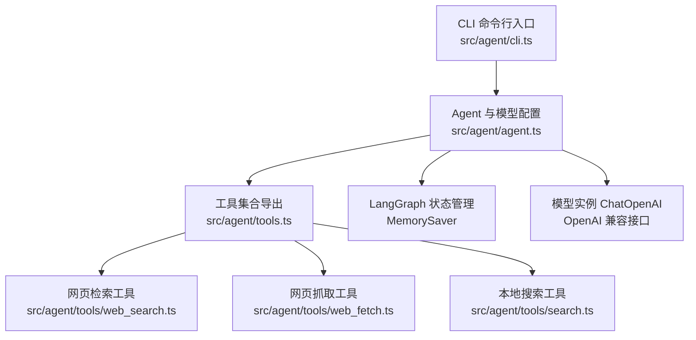
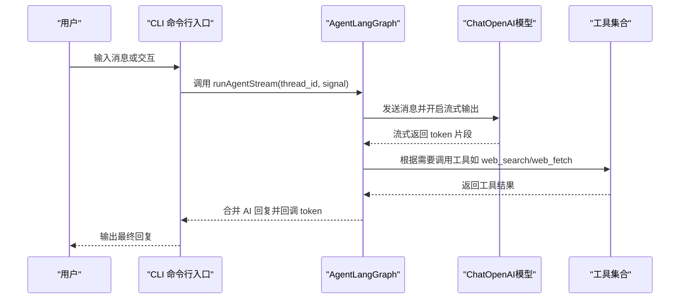
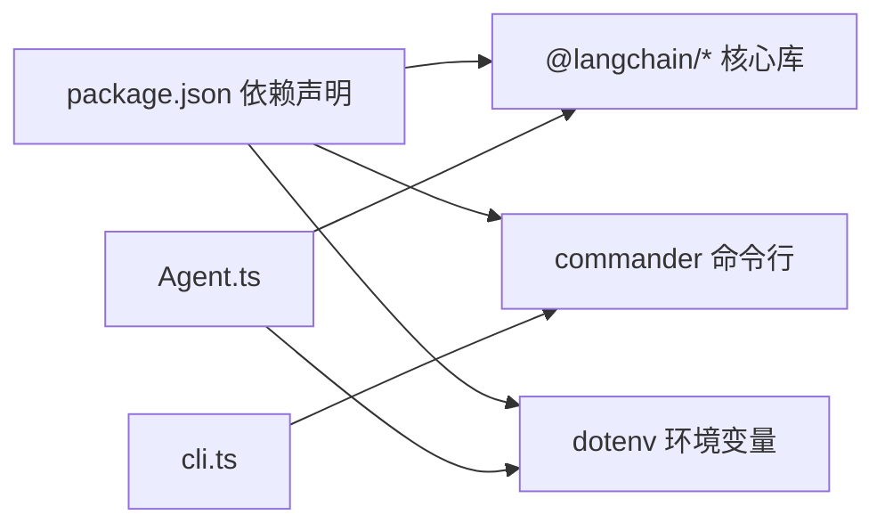

# 模型配置

<cite>
**本文引用的文件**
- [package.json](file://package.json)
- [agent.ts](file://src/agent/agent.ts)
- [cli.ts](file://src/agent/cli.ts)
- [tools.ts](file://src/agent/tools.ts)
- [web_search.ts](file://src/agent/tools/web_search.ts)
- [web_fetch.ts](file://src/agent/tools/web_fetch.ts)
- [search.ts](file://src/agent/tools/search.ts)
- [SKILL.md](file://src/agent/skills/skill-creator/SKILL.md)
</cite>

## 目录
1. [简介](#简介)
2. [项目结构](#项目结构)
3. [核心组件](#核心组件)
4. [架构总览](#架构总览)
5. [详细组件分析](#详细组件分析)
6. [依赖关系分析](#依赖关系分析)
7. [性能考虑](#性能考虑)
8. [故障排查指南](#故障排查指南)
9. [结论](#结论)
10. [附录](#附录)

## 简介
本文件聚焦于本仓库中的“模型配置”主题，系统性说明如何在基于 LangChain 的工作流中进行模型选择与参数配置，涵盖以下要点：
- LangChain 模型的配置选项与参数含义（如模型名称、API 密钥、基础 URL、流式输出等）
- 不同模型类型的配置方法（例如 GPT-4、GPT-3.5-turbo 等通用 OpenAI 兼容模型）
- 模型切换与性能调优参数（如温度、最大令牌数等）
- LangGraph 工作流的配置选项与状态管理（MemorySaver、thread_id）
- 最佳实践与性能优化建议
- 错误处理与重试机制的配置思路

说明：当前代码使用的是 OpenAI 兼容接口（通过 ChatOpenAI 与 OpenAI API 兼容服务端点），默认配置指向 DeepSeek 的 API 端点。因此，本文在描述 OpenAI 参数时，均以 OpenAI 兼容语义进行解释，并结合当前仓库的实际配置进行说明。

## 项目结构
本项目采用“命令行入口 → Agent → 工具集合”的分层结构，模型配置集中在 Agent 层，LangGraph 的状态管理通过 MemorySaver 实现，CLI 提供交互式体验与错误格式化。

图表来源
- [cli.ts:1-126](file://src/agent/cli.ts#L1-L126)
- [agent.ts:1-98](file://src/agent/agent.ts#L1-L98)
- [tools.ts:1-10](file://src/agent/tools.ts#L1-L10)
- [web_search.ts:1-41](file://src/agent/tools/web_search.ts#L1-L41)
- [web_fetch.ts:1-82](file://src/agent/tools/web_fetch.ts#L1-L82)
- [search.ts:1-24](file://src/agent/tools/search.ts#L1-L24)

章节来源
- [package.json:1-38](file://package.json#L1-L38)
- [agent.ts:1-98](file://src/agent/agent.ts#L1-L98)
- [cli.ts:1-126](file://src/agent/cli.ts#L1-L126)

## 核心组件
- 模型与工作流
  - 模型：通过 ChatOpenAI 创建，支持模型名、API Key、基础 URL、流式输出等配置
  - 工作流：使用 MemorySaver 进行状态持久化，通过 thread_id 实现多会话状态隔离
- 工具集
  - 包含多种工具（搜索、读写文件、执行脚本、网页检索、网页抓取、加载技能等），作为 Agent 的能力扩展
- CLI
  - 提供 ask 子命令与交互式聊天，内置针对常见错误的友好提示

章节来源
- [agent.ts:25-51](file://src/agent/agent.ts#L25-L51)
- [tools.ts:1-10](file://src/agent/tools.ts#L1-L10)
- [cli.ts:40-57](file://src/agent/cli.ts#L40-L57)

## 架构总览
下图展示了从 CLI 到 Agent、再到工具与模型的整体调用链路，以及 LangGraph 的状态管理位置。

图表来源
- [cli.ts:66-107](file://src/agent/cli.ts#L66-L107)
- [agent.ts:61-97](file://src/agent/agent.ts#L61-L97)

## 详细组件分析

### 模型配置详解（ChatOpenAI）
- 关键配置项
  - 模型名：通过环境变量 OPENAI_MODEL 指定，默认值为 deepseek-v4-flash
  - API Key：通过 OPENAI_API_KEY 指定
  - 基础 URL：通过 configuration.baseURL 指向 OpenAI 兼容服务端点（示例为 DeepSeek）
  - 流式输出：启用 streaming 以支持边生成边回调
- 配置位置与影响
  - 该配置位于 Agent 初始化阶段，决定后续所有对话使用的模型与服务端点
  - 若需切换到其他 OpenAI 兼容模型（如 gpt-4、gpt-3.5-turbo 等），仅需修改模型名与基础 URL 即可

章节来源
- [agent.ts:25-33](file://src/agent/agent.ts#L25-L33)

### LangGraph 工作流与状态管理
- 状态存储
  - 使用 MemorySaver 进行内存级检查点（checkpointer），用于保存与恢复对话上下文
- 会话隔离
  - 通过 configurable.thread_id 实现多会话状态隔离；相同 thread_id 将自动续接历史
- 流式输出
  - runAgentStream 中以 streamMode: "messages" 方式消费流式片段，逐个回调 token 给调用方

章节来源
- [agent.ts:22-23](file://src/agent/agent.ts#L22-L23)
- [agent.ts:67-72](file://src/agent/agent.ts#L67-L72)
- [agent.ts:61-97](file://src/agent/agent.ts#L61-L97)

### 工具与模型的关系
- 工具本身不直接持有模型配置，但会在 Agent 的调度下被调用，从而间接影响整体响应质量与成本
- 示例工具
  - 网页检索：依赖外部服务（Tavily），具备错误处理与超时控制
  - 网页抓取：对 URL 校验、超时、响应大小限制与常见网络错误进行处理
  - 本地搜索：简单示例，便于演示工具链路

章节来源
- [web_search.ts:16-40](file://src/agent/tools/web_search.ts#L16-L40)
- [web_fetch.ts:20-82](file://src/agent/tools/web_fetch.ts#L20-L82)
- [search.ts:4-23](file://src/agent/tools/search.ts#L4-L23)

### 模型切换与性能调优参数
- 切换方法
  - 修改 OPENAI_MODEL 以切换模型类型（如 gpt-4、gpt-3.5-turbo 等）
  - 修改 configuration.baseURL 以切换到不同的 OpenAI 兼容服务端点
- 性能调优参数（OpenAI 兼容语义）
  - 温度（temperature）：控制随机性与创造性，数值越低越稳定，越高越发散
  - 最大令牌数（max_tokens）：限制单次生成的最大长度，有助于控制成本与延迟
  - top_p：核采样概率质量，常与 temperature 配合使用
  - frequency_penalty / presence_penalty：惩罚重复词汇或引入新话题
  - stop：指定停止词或分隔符，避免生成冗余内容
- 注意事项
  - 上述参数在当前仓库的 ChatOpenAI 配置中未显式设置，可在初始化 ChatOpenAI 时传入对应字段以生效
  - 不同模型对上述参数的支持与默认值可能不同，建议结合具体服务端点的文档进行验证

章节来源
- [agent.ts:25-33](file://src/agent/agent.ts#L25-L33)

### LangGraph 工作流配置选项
- 检查点（Checkpointer）
  - MemorySaver：内存级持久化，适合单进程、短期会话
  - 如需跨进程或持久化存储，可替换为更高级的 Checkpointer（如 SQL 或 Redis）
- 状态键
  - configurable.thread_id：会话标识，相同 ID 自动续接历史
- 流式模式
  - streamMode: "messages"：按消息粒度流式输出，便于实时展示与中断控制

章节来源
- [agent.ts:22-23](file://src/agent/agent.ts#L22-L23)
- [agent.ts:67-72](file://src/agent/agent.ts#L67-L72)

### 错误处理与重试机制
- CLI 错误格式化
  - 针对内容安全拦截、API Key 无效、额度不足、超时等常见错误提供用户友好的提示
- 工具级错误处理
  - 网页检索：当缺少 API Key 时返回明确提示；异常捕获并返回错误信息
  - 网页抓取：对 URL 校验、超时、DNS 失败、连接拒绝/重置等进行分类处理
- 重试机制
  - 当前仓库未内置统一的重试策略；可在工具层或调用层增加指数退避重试逻辑（如对临时网络错误或 5xx 响应进行有限次数重试）

章节来源
- [cli.ts:10-38](file://src/agent/cli.ts#L10-L38)
- [web_search.ts:20-30](file://src/agent/tools/web_search.ts#L20-L30)
- [web_fetch.ts:56-69](file://src/agent/tools/web_fetch.ts#L56-L69)

## 依赖关系分析
- 语言与框架
  - @langchain/core、@langchain/langgraph、@langchain/openai、langchain：构建 Agent 与工作流的核心依赖
  - commander：命令行解析
  - dotenv：环境变量加载
- Python 生态（评估与技能生成脚本）
  - 仓库包含 Python 脚本用于技能评估与报告生成，与 Node 侧的模型配置无直接耦合，但体现了多语言协作的工作流

图表来源
- [package.json:20-29](file://package.json#L20-L29)
- [agent.ts:1-20](file://src/agent/agent.ts#L1-L20)
- [cli.ts:1-6](file://src/agent/cli.ts#L1-L6)

章节来源
- [package.json:1-38](file://package.json#L1-L38)

## 性能考虑
- 流式输出
  - 启用 streaming 可降低首 token 延迟，提升交互体验；注意在高并发场景下控制缓冲区与背压
- 会话管理
  - 使用 MemorySaver 时，长历史会话会占用内存；建议在必要时清理旧会话或采用更高效的 Checkpointer
- 工具调用
  - 对外部服务的调用应设置合理的超时与重试；对大响应进行大小限制，避免内存压力
- 模型参数
  - 适当降低 temperature 与 max_tokens 可显著降低延迟与成本；对高精度任务再适度提高
- 网络与端点
  - 选择低延迟、稳定的 OpenAI 兼容服务端点；必要时在客户端实现连接池与健康检查

## 故障排查指南
- 常见错误与定位
  - 内容安全拦截：提示内容触发安全策略，建议简化表述或更换措辞
  - API Key 无效：检查 OPENAI_API_KEY 是否正确设置
  - 额度不足/429：检查账户配额与用量，必要时升级套餐
  - 请求超时：检查网络连通性与代理设置，适当增大超时阈值
- 工具错误
  - 网页检索：缺少 TAVILY_API_KEY 时会返回明确提示；网络异常时返回错误信息
  - 网页抓取：对 URL 校验失败、超时、DNS 失败、连接异常等有明确分类提示
- 建议的改进
  - 在工具层增加指数退避重试与熔断保护
  - 在 CLI 层增加更细粒度的日志与调试开关

章节来源
- [cli.ts:10-38](file://src/agent/cli.ts#L10-L38)
- [web_search.ts:20-30](file://src/agent/tools/web_search.ts#L20-L30)
- [web_fetch.ts:56-69](file://src/agent/tools/web_fetch.ts#L56-L69)

## 结论
本仓库以 ChatOpenAI 为核心模型抽象，结合 LangGraph 的 MemorySaver 实现状态管理，形成简洁而可扩展的对话工作流。通过环境变量即可完成模型与端点切换，配合工具链与 CLI 的错误处理，能够满足大多数开发与生产场景的需求。若需进一步提升稳定性与性能，建议在工具层引入重试与限流，在 Agent 层根据业务需求微调温度与最大令牌数，并在需要时替换为更合适的 Checkpointer。

## 附录
- 环境变量参考
  - OPENAI_MODEL：模型名称（如 gpt-4、gpt-3.5-turbo、deepseek-v4-flash 等）
  - OPENAI_API_KEY：模型访问密钥
  - TAVILY_API_KEY：网页检索工具所需的第三方 API Key
- 技能与提示词
  - 技能文档（如技能创建器）中包含提示词与流程说明，可作为优化系统提示与工具调用策略的参考

章节来源
- [agent.ts:25-33](file://src/agent/agent.ts#L25-L33)
- [web_search.ts:5-14](file://src/agent/tools/web_search.ts#L5-L14)
- [SKILL.md](file://src/agent/skills/skill-creator/SKILL.md)