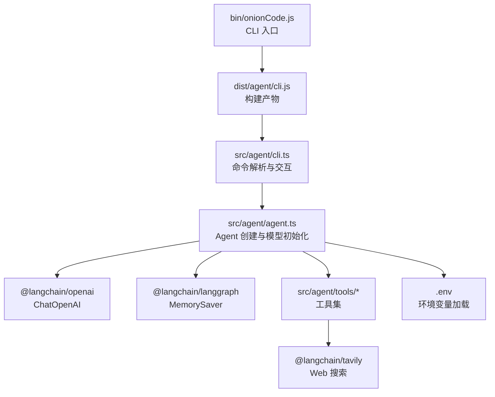
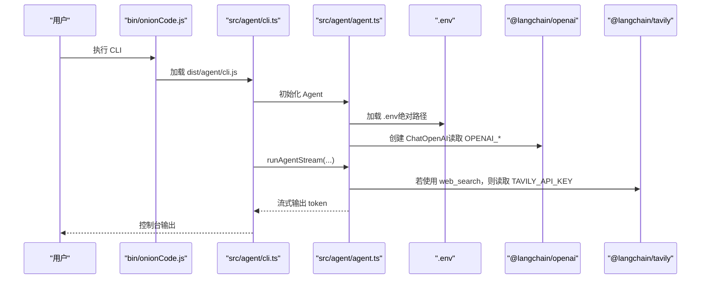
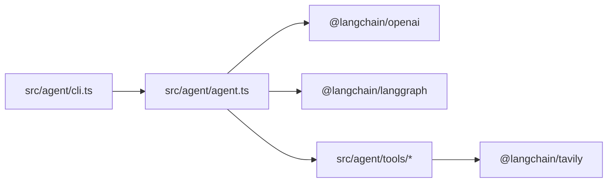

# 环境配置

<cite>
**本文引用的文件**
- [package.json](file://package.json)
- [tsconfig.json](file://tsconfig.json)
- [pnpm-lock.yaml](file://pnpm-lock.yaml)
- [.gitignore](file://.gitignore)
- [bin/onionCode.js](file://bin/onionCode.js)
- [src/agent/agent.ts](file://src/agent/agent.ts)
- [src/agent/cli.ts](file://src/agent/cli.ts)
- [src/agent/tools/web_search.ts](file://src/agent/tools/web_search.ts)
- [src/agent/tools/web_search.test.ts](file://src/agent/tools/web_search.test.ts)
</cite>

## 目录
1. [简介](#简介)
2. [项目结构](#项目结构)
3. [核心组件](#核心组件)
4. [架构总览](#架构总览)
5. [详细组件分析](#详细组件分析)
6. [依赖分析](#依赖分析)
7. [性能考虑](#性能考虑)
8. [故障排查指南](#故障排查指南)
9. [结论](#结论)
10. [附录](#附录)

## 简介
本文件系统性梳理本项目的环境配置与运行要求，覆盖以下方面：
- 运行时与编译器版本要求（Node.js、TypeScript）
- 依赖安装与锁定机制（pnpm）
- 环境变量与 .env 使用规范（OPENAI_API_KEY、OPENAI_MODEL、TAVILY_API_KEY 等）
- 开发与生产环境差异
- 构建与脚本流程
- 环境验证方法与常见问题定位

## 项目结构
本项目采用 TypeScript 编写，通过 tsc 编译到 dist 目录；CLI 入口位于 bin/onionCode.js，实际逻辑在 src/agent/cli.ts 中；模型与工具通过 LangChain 生态集成，支持 Web 搜索、文件读写、命令执行等能力。

图表来源
- [bin/onionCode.js:1-2](file://bin/onionCode.js#L1-L2)
- [src/agent/cli.ts:1-126](file://src/agent/cli.ts#L1-L126)
- [src/agent/agent.ts:1-98](file://src/agent/agent.ts#L1-L98)
- [src/agent/tools/web_search.ts:1-41](file://src/agent/tools/web_search.ts#L1-L41)

章节来源
- [package.json:1-38](file://package.json#L1-L38)
- [tsconfig.json:1-20](file://tsconfig.json#L1-L20)
- [bin/onionCode.js:1-2](file://bin/onionCode.js#L1-L2)

## 核心组件
- Node.js 运行时与引擎要求
  - @langchain/langgraph 对 Node.js 的最低版本要求为 18
  - @langchain/openai 对 Node.js 的最低版本要求为 20
  - @langchain/tavily 对 Node.js 的最低版本要求为 20
  - 推荐使用 Node.js 20+ 以满足所有依赖的最低要求
- TypeScript 编译配置
  - 目标：ES2022
  - 模块：CommonJS
  - 输出目录：dist
  - 入口目录：src
  - 类型声明：启用
- 依赖管理
  - 使用 pnpm 进行依赖安装与锁定
  - 依赖版本在 pnpm-lock.yaml 中固定

章节来源
- [pnpm-lock.yaml:266-286](file://pnpm-lock.yaml#L266-L286)
- [tsconfig.json:1-20](file://tsconfig.json#L1-L20)
- [package.json:20-36](file://package.json#L20-L36)

## 架构总览
下图展示 CLI 启动到 Agent 执行的关键流程，以及环境变量在其中的作用点。

图表来源
- [bin/onionCode.js:1-2](file://bin/onionCode.js#L1-L2)
- [src/agent/cli.ts:1-126](file://src/agent/cli.ts#L1-L126)
- [src/agent/agent.ts:19-33](file://src/agent/agent.ts#L19-L33)
- [src/agent/tools/web_search.ts:1-41](file://src/agent/tools/web_search.ts#L1-L41)

## 详细组件分析

### 环境变量与 .env 配置
- .env 加载策略
  - Agent 初始化阶段显式加载项目根目录下的 .env 文件，确保无论工作目录如何，均能正确读取配置
  - CLI 层不直接加载 .env，需依赖 Agent 初始化时的加载
- 关键环境变量
  - OPENAI_API_KEY：用于认证大模型服务
  - OPENAI_MODEL：模型名称，默认值在代码中有兜底
  - TAVILY_API_KEY：用于启用 Web 搜索工具
- 验证与回退
  - OPENAI_MODEL 不存在时使用默认值
  - Web 搜索工具在缺少 API Key 时返回明确错误提示
- .gitignore 规则
  - 将 .env 添加到忽略列表，避免敏感信息提交

章节来源
- [src/agent/agent.ts:19-33](file://src/agent/agent.ts#L19-L33)
- [src/agent/tools/web_search.ts:20-23](file://src/agent/tools/web_search.ts#L20-L23)
- [.gitignore:1-3](file://.gitignore#L1-L3)

### Node.js 版本与引擎要求
- 依赖对 Node.js 的最低版本要求如下：
  - @langchain/langgraph: >= 18
  - @langchain/openai: >= 20
  - @langchain/tavily: >= 20
- 建议使用 Node.js 20+ 以兼容所有依赖

章节来源
- [pnpm-lock.yaml:266-286](file://pnpm-lock.yaml#L266-L286)

### TypeScript 配置
- 目标语言版本：ES2022
- 模块系统：CommonJS
- 输出目录：dist
- 输入根目录：src
- 类型声明：生成
- 包含与排除规则：包含 src 下全部文件，排除 node_modules、dist 与测试文件

章节来源
- [tsconfig.json:1-20](file://tsconfig.json#L1-L20)

### 依赖安装与锁定
- 使用 pnpm 管理依赖与锁定版本
- 依赖清单与版本在 package.json 与 pnpm-lock.yaml 中体现

章节来源
- [package.json:20-36](file://package.json#L20-L36)
- [pnpm-lock.yaml:1-1291](file://pnpm-lock.yaml#L1-L1291)

### 构建与脚本
- 开发脚本
  - dev：使用 ts-node 直接运行 CLI 源码，便于调试
- 构建脚本
  - build：先 tsc 编译，再复制技能资源到 dist
- 运行脚本
  - start：直接运行 dist/agent/cli.js
- 测试脚本
  - test：使用 vitest 运行测试

章节来源
- [package.json:11-16](file://package.json#L11-L16)

### CLI 与 Agent 的环境耦合点
- CLI 仅负责命令解析与交互，Agent 初始化时完成 .env 加载与模型创建
- CLI 提供友好的错误格式化，帮助定位 API Key、配额、超时等问题

章节来源
- [src/agent/cli.ts:1-126](file://src/agent/cli.ts#L1-L126)
- [src/agent/agent.ts:19-33](file://src/agent/agent.ts#L19-L33)

### Web 搜索工具的环境依赖
- 该工具依赖 @langchain/tavily，需要 TAVILY_API_KEY
- 缺少 API Key 时返回明确错误提示
- 单元测试中模拟了 API Key 缺失场景

章节来源
- [src/agent/tools/web_search.ts:1-41](file://src/agent/tools/web_search.ts#L1-L41)
- [src/agent/tools/web_search.test.ts:10-16](file://src/agent/tools/web_search.test.ts#L10-L16)
- [src/agent/tools/web_search.test.ts:74-80](file://src/agent/tools/web_search.test.ts#L74-L80)

## 依赖分析
- 外部依赖与引擎要求
  - @langchain/langgraph：>= 18
  - @langchain/openai：>= 20
  - @langchain/tavily：>= 20
- 内部耦合
  - CLI 依赖 Agent
  - Agent 依赖 LangChain 组件与工具集
  - 工具集部分依赖外部服务（如 Tavily）

图表来源
- [src/agent/cli.ts:1-126](file://src/agent/cli.ts#L1-L126)
- [src/agent/agent.ts:1-98](file://src/agent/agent.ts#L1-L98)
- [src/agent/tools/web_search.ts:1-41](file://src/agent/tools/web_search.ts#L1-L41)

章节来源
- [pnpm-lock.yaml:266-286](file://pnpm-lock.yaml#L266-L286)

## 性能考虑
- 流式响应：Agent 支持流式输出，提升交互体验
- 本地构建：使用 tsc 编译，减少运行时编译开销
- 资源复制：构建时将技能资源复制至 dist，保证运行时可用

章节来源
- [src/agent/agent.ts:61-97](file://src/agent/agent.ts#L61-L97)
- [package.json:14](file://package.json#L14)

## 故障排查指南
- 症状：启动时报错“API Key 无效或未配置”
  - 检查 .env 是否存在且包含 OPENAI_API_KEY
  - 确认 OPENAI_MODEL 是否正确（若为空将使用默认值）
- 症状：Web 搜索报错“Tavily API key not found”
  - 在 .env 中添加 TAVILY_API_KEY
- 症状：运行时报 Node.js 版本不兼容
  - 升级 Node.js 至 20+
- 症状：构建失败或找不到模块
  - 使用 pnpm 安装依赖，并确保 pnpm-lock.yaml 一致
- 症状：CLI 无法找到入口
  - 先执行构建脚本，再运行 dist/agent/cli.js 或使用 start 脚本

章节来源
- [src/agent/cli.ts:11-38](file://src/agent/cli.ts#L11-L38)
- [src/agent/agent.ts:26-33](file://src/agent/agent.ts#L26-L33)
- [src/agent/tools/web_search.ts:20-23](file://src/agent/tools/web_search.ts#L20-L23)
- [pnpm-lock.yaml:266-286](file://pnpm-lock.yaml#L266-L286)

## 结论
- 本项目建议使用 Node.js 20+，并确保 pnpm 依赖完整
- .env 应在项目根目录提供，Agent 初始化时显式加载
- OPENAI_* 与 TAVILY_* 为关键环境变量，缺失会导致相应功能不可用
- 通过 dev/build/start/test 脚本完成开发、构建与运行

## 附录

### 环境变量清单与用途
- OPENAI_API_KEY：大模型服务认证
- OPENAI_MODEL：模型名称（为空时使用默认值）
- TAVILY_API_KEY：启用 Web 搜索工具
- LANGCHAIN_TRACING_V1：LangSmith/Tracing 相关（如需启用，请在 .env 中添加）

章节来源
- [src/agent/agent.ts:26-33](file://src/agent/agent.ts#L26-L33)
- [src/agent/tools/web_search.ts:20-23](file://src/agent/tools/web_search.ts#L20-L23)

### .env 使用方法与配置优先级
- 加载位置：Agent 初始化时从项目根目录显式加载 .env
- 优先级：.env 中的变量将覆盖系统环境变量中的同名项
- 建议：将 .env 作为本地开发的首选配置源，生产环境通过系统环境变量注入

章节来源
- [src/agent/agent.ts:19-20](file://src/agent/agent.ts#L19-L20)
- [.gitignore:3](file://.gitignore#L3)

### 开发与生产环境差异
- 开发环境
  - 使用 dev 脚本直接运行源码，便于调试
  - 通过 ts-node 执行，无需手动构建
- 生产环境
  - 先执行 build 脚本生成 dist
  - 使用 start 脚本运行构建产物
  - 通过系统环境变量提供 .env 中的敏感配置

章节来源
- [package.json:11-16](file://package.json#L11-L16)