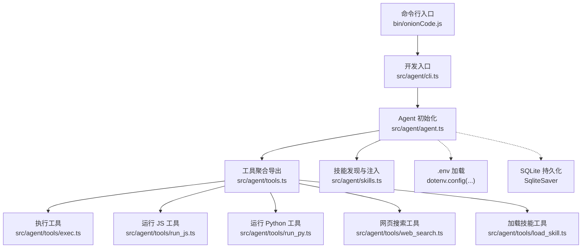
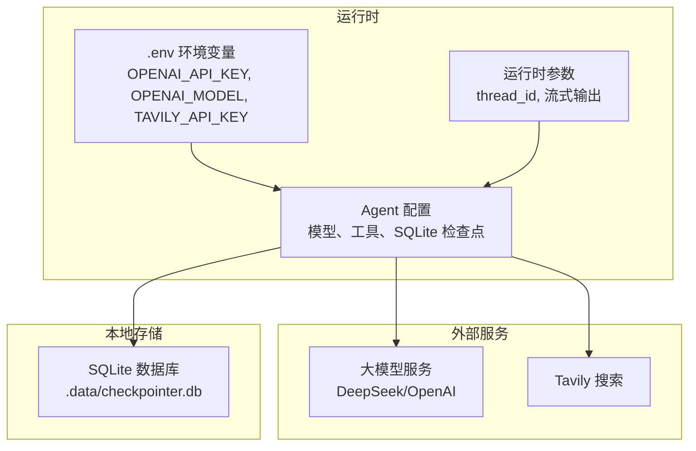
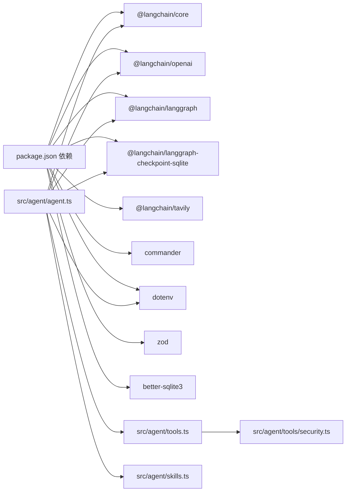

# 配置管理

<cite>
**本文档引用的文件**
- [package.json](file://package.json)
- [tsconfig.json](file://tsconfig.json)
- [bin/onionCode.js](file://bin/onionCode.js)
- [src/agent/cli.ts](file://src/agent/cli.ts)
- [src/agent/agent.ts](file://src/agent/agent.ts)
- [src/agent/tools.ts](file://src/agent/tools.ts)
- [src/agent/skills.ts](file://src/agent/skills.ts)
- [src/agent/tools/search.ts](file://src/agent/tools/search.ts)
- [src/agent/tools/web_search.ts](file://src/agent/tools/web_search.ts)
- [src/agent/tools/exec.ts](file://src/agent/tools/exec.ts)
- [src/agent/tools/run_js.ts](file://src/agent/tools/run_js.ts)
- [src/agent/tools/run_py.ts](file://src/agent/tools/run_py.ts)
- [src/agent/tools/load_skill.ts](file://src/agent/tools/load_skill.ts)
- [src/agent/tools/security.ts](file://src/agent/tools/security.ts)
- [pnpm-lock.yaml](file://pnpm-lock.yaml)
</cite>

## 目录
1. [简介](#简介)
2. [项目结构](#项目结构)
3. [核心组件](#核心组件)
4. [架构总览](#架构总览)
5. [详细组件分析](#详细组件分析)
6. [依赖分析](#依赖分析)
7. [性能考虑](#性能考虑)
8. [故障排查指南](#故障排查指南)
9. [结论](#结论)
10. [附录](#附录)

## 简介
本文件系统性梳理本项目的配置管理，涵盖以下方面：
- 配置来源与优先级：环境变量、模型与工具参数、SQLite持久化检查点配置
- 环境变量设置与默认值：OPENAI_API_KEY、OPENAI_MODEL、TAVILY_API_KEY 等
- 参数调优建议：模型参数、流式输出、超时与缓冲区限制
- 配置文件结构：.env 文件位置、SQLite检查点数据库、技能目录解析
- 不同使用场景的配置示例：开发、生产、测试
- 配置变更影响范围与重启要求
- 配置验证方法与常见问题处理

## 项目结构
本项目采用"命令行入口 -> Agent -> 工具/技能"的分层结构。配置主要集中在入口脚本、Agent 初始化与工具实现中。

**图表来源**
- [bin/onionCode.js:1-3](file://bin/onionCode.js#L1-L3)
- [src/agent/cli.ts:1-126](file://src/agent/cli.ts#L1-L126)
- [src/agent/agent.ts:1-142](file://src/agent/agent.ts#L1-L142)
- [src/agent/tools.ts:1-10](file://src/agent/tools.ts#L1-L10)
- [src/agent/skills.ts:1-139](file://src/agent/skills.ts#L1-L139)
- [src/agent/tools/exec.ts:1-143](file://src/agent/tools/exec.ts#L1-L143)
- [src/agent/tools/run_js.ts:1-90](file://src/agent/tools/run_js.ts#L1-L90)
- [src/agent/tools/run_py.ts:1-90](file://src/agent/tools/run_py.ts#L1-L90)
- [src/agent/tools/web_search.ts:1-41](file://src/agent/tools/web_search.ts#L1-L41)
- [src/agent/tools/load_skill.ts:1-34](file://src/agent/tools/load_skill.ts#L1-L34)

**章节来源**
- [bin/onionCode.js:1-3](file://bin/onionCode.js#L1-L3)
- [src/agent/cli.ts:1-126](file://src/agent/cli.ts#L1-L126)
- [src/agent/agent.ts:1-142](file://src/agent/agent.ts#L1-L142)
- [src/agent/tools.ts:1-10](file://src/agent/tools.ts#L1-L10)
- [src/agent/skills.ts:1-139](file://src/agent/skills.ts#L1-L139)

## 核心组件
- 命令行入口与错误格式化：负责解析命令、启动交互式聊天、格式化错误信息。
- Agent 初始化：加载 .env，初始化模型与SQLite持久化检查点，构建可工具化的智能体。
- 工具集：包含搜索、文件读写、执行命令、运行 JS/Python、网页搜索、技能加载等工具。
- 技能系统：自动发现并注入可用技能，动态扩展系统提示词。

**章节来源**
- [src/agent/cli.ts:1-126](file://src/agent/cli.ts#L1-L126)
- [src/agent/agent.ts:1-142](file://src/agent/agent.ts#L1-L142)
- [src/agent/tools.ts:1-10](file://src/agent/tools.ts#L1-L10)
- [src/agent/skills.ts:1-139](file://src/agent/skills.ts#L1-L139)

## 架构总览
下图展示配置在系统中的流向与作用域：

**图表来源**
- [src/agent/agent.ts:56-64](file://src/agent/agent.ts#L56-L64)
- [src/agent/tools/web_search.ts:5-31](file://src/agent/tools/web_search.ts#L5-L31)

## 详细组件分析

### 环境变量与默认值
- OPENAI_API_KEY：必填，用于认证大模型服务。
- OPENAI_MODEL：可选，默认值来自模型初始化逻辑；当前代码中默认模型名称为 deepseek-v4-flash。
- TAVILY_API_KEY：可选，用于启用网页搜索工具；若缺失，工具会返回相应错误提示。
- .env 加载位置：以项目根目录为基准加载 .env 文件，确保在不同工作目录下均能正确读取。

**章节来源**
- [src/agent/agent.ts:56-74](file://src/agent/agent.ts#L56-L74)
- [src/agent/tools/web_search.ts:5-31](file://src/agent/tools/web_search.ts#L5-L31)

### LangChain 模型配置
- 模型类：使用 ChatOpenAI 初始化，支持 base URL、模型名、API Key、流式输出等参数。
- SQLite持久化检查点：使用 SqliteSaver.fromConnString 创建持久化检查点，数据存储在 .data/checkpointer.db 文件中。
- 系统提示词：注入技能列表，增强 Agent 的能力边界。

**章节来源**
- [src/agent/agent.ts:66-92](file://src/agent/agent.ts#L66-L92)

### SQLite持久化配置
- 存储位置：检查点数据存储在项目根目录下的 .data/checkpointer.db 文件中。
- 自动创建：启动时会自动创建 .data 目录，确保数据库文件可以正常创建。
- 持久化机制：使用 @langchain/langgraph-checkpoint-sqlite 包提供的 SqliteSaver 实现，支持跨进程会话恢复。
- 线程ID管理：通过 thread_id 参数实现多会话隔离，相同 thread_id 的会话共享历史记录。

**章节来源**
- [src/agent/agent.ts:59-64](file://src/agent/agent.ts#L59-L64)
- [src/agent/agent.ts:102-111](file://src/agent/agent.ts#L102-L111)

### 工具参数与安全策略
- exec 工具
  - 行为：执行 shell 命令，带三层安全防护（危险命令黑名单、eval 注入模式、危险 API 检测）。
  - 超时与缓冲：执行超时约 30 秒，stdout/stderr 缓冲上限约 1MB。
- run_js 工具
  - 行为：将代码写入临时文件后通过 node 执行，带危险 API 检测。
  - 超时与缓冲：执行超时约 15 秒，stdout/stderr 缓冲上限约 512KB。
- run_py 工具
  - 行为：将代码写入临时文件后通过 python3 执行，带危险 API 检测。
  - 超时与缓冲：执行超时约 15 秒，stdout/stderr 缓冲上限约 512KB。
- web_search 工具
  - 行为：基于 TavilySearch 执行实时搜索；需要 TAVILY_API_KEY。
  - 参数：最大结果数、主题等（硬编码于客户端构造）。
- load_skill 工具
  - 行为：根据名称加载技能完整内容；技能目录通过 discoverSkills 动态定位。
- 其他工具
  - search：本地模拟搜索，便于演示与测试。
  - read_file/write_file：文件读写工具，受安全策略约束。

**章节来源**
- [src/agent/tools/exec.ts:66-143](file://src/agent/tools/exec.ts#L66-L143)
- [src/agent/tools/run_js.ts:22-90](file://src/agent/tools/run_js.ts#L22-L90)
- [src/agent/tools/run_py.ts:22-90](file://src/agent/tools/run_py.ts#L22-L90)
- [src/agent/tools/web_search.ts:16-41](file://src/agent/tools/web_search.ts#L16-L41)
- [src/agent/tools/load_skill.ts:5-34](file://src/agent/tools/load_skill.ts#L5-L34)
- [src/agent/tools/search.ts:4-24](file://src/agent/tools/search.ts#L4-L24)
- [src/agent/skills.ts:30-84](file://src/agent/skills.ts#L30-L84)

### 性能优化参数
- 流式输出：模型初始化开启 streaming，Agent 使用消息流模式消费 token，降低首字延迟。
- 超时与缓冲：工具侧对子进程执行设置了合理超时与缓冲上限，防止资源耗尽。
- SQLite持久化：使用 SqliteSaver 实现会话状态持久化，支持跨进程恢复，适合长期会话场景。
- 数据库优化：.data 目录自动创建，确保数据库文件的可靠存储。

**章节来源**
- [src/agent/agent.ts:73](file://src/agent/agent.ts#L73)
- [src/agent/agent.ts:59-64](file://src/agent/agent.ts#L59-L64)
- [src/agent/tools/exec.ts:112-117](file://src/agent/tools/exec.ts#L112-L117)
- [src/agent/tools/run_js.ts:46-51](file://src/agent/tools/run_js.ts#L46-L51)
- [src/agent/tools/run_py.ts:46-51](file://src/agent/tools/run_py.ts#L46-L51)

### 配置文件结构与加载
- .env 文件：位于项目根目录，通过 dotenv.config 指定绝对路径加载。
- SQLite数据库：检查点数据存储在 .data/checkpointer.db 文件中，启动时自动创建目录。
- 技能目录：优先在构建产物目录下查找；若不存在，则回退到源码目录，保证开发与生产一致性。
- TypeScript 编译配置：严格类型检查、CommonJS 输出、声明文件生成等。

**章节来源**
- [src/agent/agent.ts:56-57](file://src/agent/agent.ts#L56-L57)
- [src/agent/agent.ts:59-64](file://src/agent/agent.ts#L59-L64)
- [src/agent/skills.ts:30-47](file://src/agent/skills.ts#L30-L47)
- [tsconfig.json:1-20](file://tsconfig.json#L1-L20)

### 不同使用场景的配置示例
- 开发环境
  - 使用开发脚本启动，加载 .env 并启用流式输出。
  - SQLite检查点自动创建，无需手动配置数据库。
  - 推荐：保持默认模型与工具参数，便于快速迭代。
- 生产环境
  - 明确设置 OPENAI_API_KEY、OPENAI_MODEL、TAVILY_API_KEY。
  - SQLite数据库文件位于 .data 目录，建议配置适当的文件权限。
  - 建议：根据业务负载调整工具超时与缓冲上限，SQLite持久化支持跨进程会话恢复。
- 测试环境
  - 可使用本地 search 工具替代在线搜索，减少对外部服务依赖。
  - SQLite检查点支持测试用例的会话恢复，提升测试稳定性。

**章节来源**
- [package.json:13-17](file://package.json#L13-L17)
- [src/agent/tools/search.ts:4-24](file://src/agent/tools/search.ts#L4-L24)
- [src/agent/tools/web_search.ts:5-31](file://src/agent/tools/web_search.ts#L5-L31)
- [src/agent/agent.ts:59-64](file://src/agent/agent.ts#L59-L64)

### 配置变更的影响范围与重启要求
- 影响范围
  - 环境变量：Agent 初始化与工具加载均依赖 .env，修改后需重启进程使新值生效。
  - 模型参数：OPENAI_MODEL、baseURL 等直接影响推理行为，需重启 Agent。
  - SQLite检查点：数据库文件位置和权限变更需要重启以应用新配置。
  - 工具参数：超时与缓冲上限影响执行稳定性，需重启工具所在进程。
- 重启要求
  - 新增/删除技能：Agent 启动时注入系统提示词，需重启以重新发现与注入。
  - 更换检查点：切换持久化实现需重启以应用新存储。
  - 修改数据库路径：需要重启以重新连接新的 SQLite 数据库。

**章节来源**
- [src/agent/agent.ts:56-74](file://src/agent/agent.ts#L56-L74)
- [src/agent/agent.ts:59-64](file://src/agent/agent.ts#L59-L64)
- [src/agent/skills.ts:53-84](file://src/agent/skills.ts#L53-L84)

### 配置验证方法
- 环境变量验证
  - 检查 .env 是否存在且包含必需键（如 OPENAI_API_KEY、TAVILY_API_KEY）。
  - 在启动日志中确认 .env 路径与加载成功。
- SQLite数据库验证
  - 检查 .data 目录是否存在且可写。
  - 确认 checkpointer.db 文件已创建且可访问。
  - 验证会话数据可以正常持久化和恢复。
- 工具可用性验证
  - exec：确认系统 PATH 中存在所需命令与解释器。
  - run_js：确认 node --version 可用。
  - run_py：确认 python3 --version 可用。
- 模型连通性验证
  - 发送一条简短消息，观察是否能收到流式响应。
- 技能注入验证
  - 调用 load_skill 工具，确认技能内容可被正确加载。

**章节来源**
- [src/agent/agent.ts:56-57](file://src/agent/agent.ts#L56-L57)
- [src/agent/agent.ts:59-64](file://src/agent/agent.ts#L59-L64)
- [src/agent/tools/exec.ts:94-143](file://src/agent/tools/exec.ts#L94-L143)
- [src/agent/tools/run_js.ts:22-90](file://src/agent/tools/run_js.ts#L22-L90)
- [src/agent/tools/run_py.ts:22-90](file://src/agent/tools/run_py.ts#L22-L90)
- [src/agent/tools/load_skill.ts:5-34](file://src/agent/tools/load_skill.ts#L5-L34)

### 常见配置问题与解决方案
- API Key 无效或未配置
  - 现象：出现 401 或 Incorrect API key 相关错误。
  - 处理：检查 .env 中 OPENAI_API_KEY 是否正确设置。
- 额度不足或限流
  - 现象：出现 insufficient_quota 或 429。
  - 处理：检查账户余额与配额，降低并发或等待重试。
- 网络超时
  - 现象：ETIMEDOUT 或 timeout。
  - 处理：检查网络连通性，适当增加工具超时或减少一次性任务规模。
- 内容安全拦截
  - 现象：DeepSeek 内容安全审查拦截。
  - 处理：调整提问方式或简化查询，避免触发敏感内容。
- 工具执行失败
  - 现象：命令为空、超时、危险操作被阻断。
  - 处理：检查命令合法性、安装必要解释器、调整超时与缓冲上限。
- SQLite数据库问题
  - 现象：无法创建数据库文件或连接失败。
  - 处理：检查 .data 目录权限，确保有写入权限；确认 Node.js 版本兼容 better-sqlite3。
- 原生模块安装问题
  - 现象：better-sqlite3 安装失败或无法加载。
  - 处理：使用 pnpm 安装，确保 Node.js 版本匹配；检查系统架构兼容性。

**章节来源**
- [src/agent/cli.ts:11-38](file://src/agent/cli.ts#L11-L38)
- [src/agent/tools/exec.ts:94-143](file://src/agent/tools/exec.ts#L94-L143)
- [src/agent/tools/run_js.ts:22-90](file://src/agent/tools/run_js.ts#L22-L90)
- [src/agent/tools/run_py.ts:22-90](file://src/agent/tools/run_py.ts#L22-L90)
- [src/agent/agent.ts:59-64](file://src/agent/agent.ts#L59-L64)
- [package.json:44-48](file://package.json#L44-L48)

## 依赖分析
- 外部依赖
  - @langchain/core、@langchain/openai、@langchain/langgraph：智能体与模型集成。
  - @langchain/langgraph-checkpoint-sqlite：SQLite持久化检查点支持。
  - @langchain/tavily：网页搜索能力。
  - commander、dotenv：命令行与环境变量。
  - zod：工具参数校验。
  - better-sqlite3：原生SQLite数据库驱动（通过 pnpm onlyBuiltDependencies 配置）。
- 内部依赖
  - agent.ts 依赖 tools.ts 与 skills.ts；tools.ts 聚合各工具；security.ts 提供通用安全策略。

**图表来源**
- [package.json:21-34](file://package.json#L21-L34)
- [package.json:44-48](file://package.json#L44-L48)
- [src/agent/agent.ts:1-18](file://src/agent/agent.ts#L1-L18)
- [src/agent/tools.ts:1-10](file://src/agent/tools.ts#L1-L10)
- [src/agent/tools/security.ts:1-27](file://src/agent/tools/security.ts#L1-L27)

**章节来源**
- [package.json:21-34](file://package.json#L21-L34)
- [package.json:44-48](file://package.json#L44-L48)
- [src/agent/agent.ts:1-18](file://src/agent/agent.ts#L1-L18)
- [src/agent/tools.ts:1-10](file://src/agent/tools.ts#L1-L10)
- [src/agent/tools/security.ts:1-27](file://src/agent/tools/security.ts#L1-L27)

## 性能考虑
- 流式输出：开启 streaming 与消息流模式，有助于降低首字延迟，改善交互体验。
- 超时与缓冲：工具侧已设置超时与缓冲上限，避免长时间阻塞；可根据实际负载调优。
- SQLite持久化：使用 SqliteSaver 实现会话状态持久化，支持跨进程恢复，适合长期会话场景。
- 数据库性能：.data 目录自动创建，确保数据库文件的可靠存储；建议定期清理旧会话数据。
- 原生模块优化：better-sqlite3 作为原生模块提供高性能的SQLite访问，减少JavaScript到C++的转换开销。
- 并发与限流：对外部服务（如 Tavily、大模型）应控制并发，避免触发限流。

## 故障排查指南
- 环境变量
  - 确认 .env 路径与键名正确；在启动日志中查看加载信息。
- SQLite数据库
  - 检查 .data 目录是否存在且具有写入权限。
  - 确认 checkpointer.db 文件可以正常创建和访问。
  - 验证 Node.js 版本与 better-sqlite3 兼容性。
- 工具执行
  - 检查 PATH 中是否存在所需命令；确认危险操作被阻断属于预期行为。
- 模型与搜索
  - 检查 API Key 与网络连通性；关注额度与限流提示。
- 技能加载
  - 确认技能目录存在且包含合法的 SKILL.md；检查系统提示词注入是否成功。

**章节来源**
- [src/agent/agent.ts:56-57](file://src/agent/agent.ts#L56-L57)
- [src/agent/agent.ts:59-64](file://src/agent/agent.ts#L59-L64)
- [src/agent/tools/exec.ts:94-143](file://src/agent/tools/exec.ts#L94-L143)
- [src/agent/tools/web_search.ts:16-41](file://src/agent/tools/web_search.ts#L16-L41)
- [src/agent/skills.ts:53-84](file://src/agent/skills.ts#L53-L84)

## 结论
本项目的配置管理以 .env 为核心，结合 SQLite 持久化检查点机制与工具的安全策略，形成清晰可控的运行时配置体系。通过明确的默认值、严格的参数校验与合理的超时/缓冲设置，可在不同环境下稳定运行。新增的 SQLite 持久化功能提供了可靠的会话状态管理，支持跨进程恢复，特别适合生产环境的长期会话需求。建议在生产环境中显式配置关键参数，并根据业务需求调整工具超时与检查点策略。

## 附录
- 命令行入口
  - bin/onionCode.js：Node 可执行入口，直接加载构建产物。
- 开发与构建
  - package.json：定义开发脚本、构建脚本与测试脚本，包含 better-sqlite3 原生模块配置。
  - tsconfig.json：编译配置，严格类型检查与 CommonJS 输出。
- SQLite持久化配置
  - 数据库文件：.data/checkpointer.db
  - 自动创建：启动时自动创建 .data 目录
  - 持久化实现：@langchain/langgraph-checkpoint-sqlite

**章节来源**
- [bin/onionCode.js:1-3](file://bin/onionCode.js#L1-L3)
- [package.json:13-17](file://package.json#L13-L17)
- [package.json:44-48](file://package.json#L44-L48)
- [tsconfig.json:1-20](file://tsconfig.json#L1-L20)
- [src/agent/agent.ts:59-64](file://src/agent/agent.ts#L59-L64)