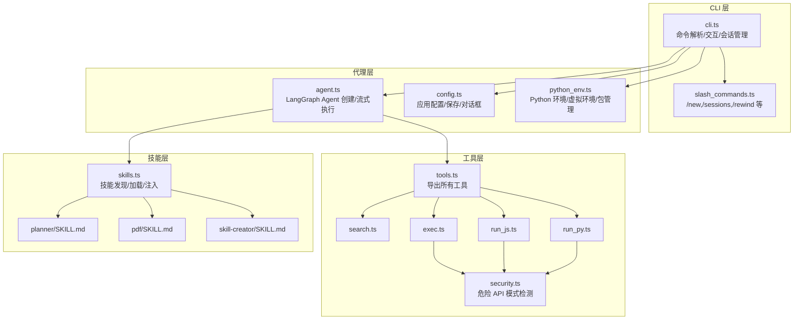
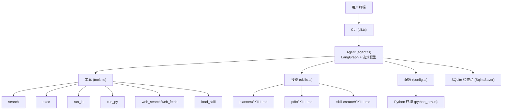
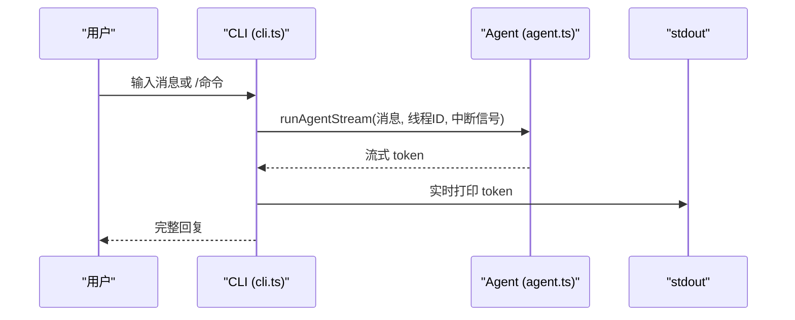
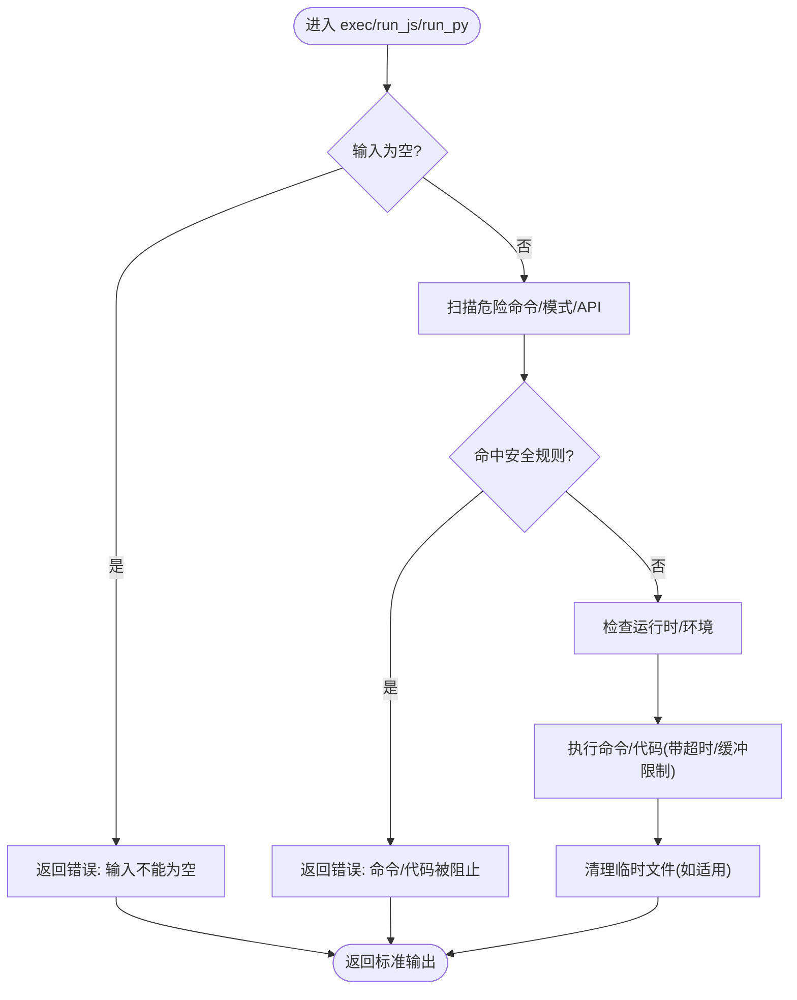
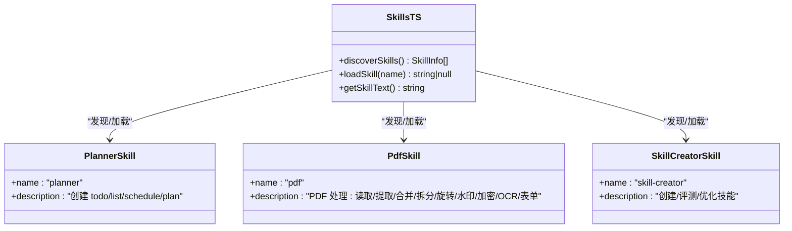
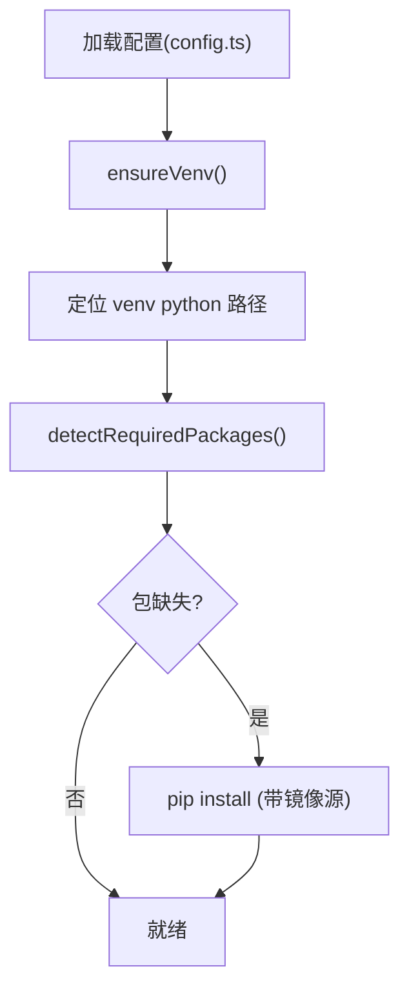
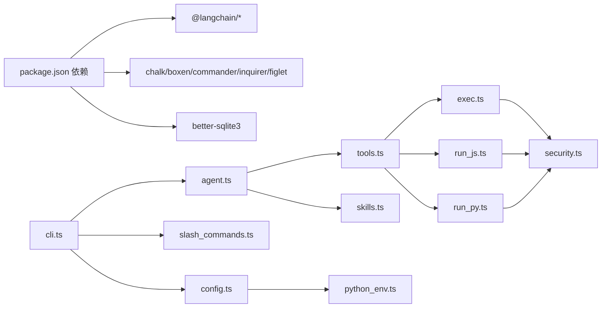

# 项目概述

<cite>
**本文档引用的文件**
- [package.json](file://package.json)
- [cli.ts](file://src/agent/cli.ts)
- [agent.ts](file://src/agent/agent.ts)
- [tools.ts](file://src/agent/tools.ts)
- [skills.ts](file://src/agent/skills.ts)
- [search.ts](file://src/agent/tools/search.ts)
- [exec.ts](file://src/agent/tools/exec.ts)
- [run_js.ts](file://src/agent/tools/run_js.ts)
- [run_py.ts](file://src/agent/tools/run_py.ts)
- [security.ts](file://src/agent/tools/security.ts)
- [config.ts](file://src/agent/config.ts)
- [python_env.ts](file://src/agent/python_env.ts)
- [slash_commands.ts](file://src/agent/slash_commands.ts)
- [SKILL.md（planner）](file://src/agent/skills/planner/SKILL.md)
- [SKILL.md（pdf）](file://src/agent/skills/pdf/SKILL.md)
- [SKILL.md（skill-creator）](file://src/agent/skills/skill-creator/SKILL.md)
</cite>

## 目录
1. [简介](#简介)
2. [项目结构](#项目结构)
3. [核心组件](#核心组件)
4. [架构总览](#架构总览)
5. [详细组件分析](#详细组件分析)
6. [依赖关系分析](#依赖关系分析)
7. [性能考量](#性能考量)
8. [故障排查指南](#故障排查指南)
9. [结论](#结论)
10. [附录](#附录)

## 简介
Onion Code 是一个基于 LangChain 的 CLI AI 代理工具，强调“工具调用 + 技能扩展”的工程化能力。它通过流式响应提供即时反馈，支持多语言代码执行与安全沙箱，具备可插拔的技能系统，能够按需加载并注入系统提示，实现“所思即所用”的智能工作流。项目既适合初学者快速上手，也为有经验的开发者提供了深入定制与扩展的空间。

- 核心价值定位
  - 工程化 AI 代理：将工具与技能组合，形成可复用、可评估、可迭代的工作流。
  - 流式体验：终端内实时输出，支持 ESC 中断，提升交互效率。
  - 安全可控：内置多层安全策略，阻断高危命令与危险 API 调用。
  - 可扩展技能：通过 SKILL.md 描述技能意图与边界，动态注入系统提示，支持脚本与参考资源打包。

- 主要应用场景
  - 开发辅助：编写/运行/调试代码、自动化脚本、数据处理与可视化。
  - 文档与知识：PDF 文本/表格提取、合并/拆分、表单填充、水印与加密。
  - 计划与任务：结构化任务清单、项目计划与日程安排。
  - 技能研发：创建、评测与优化自定义技能，构建面向领域的专家系统。

## 项目结构
项目采用“功能域 + 层次化”组织方式，核心位于 src/agent 下，包含 CLI、代理、工具、技能与配置等模块；技能资源独立存放于 skills 子目录，便于版本化与发布。

**图表来源**
- [cli.ts:1-186](file://src/agent/cli.ts#L1-L186)
- [agent.ts:1-142](file://src/agent/agent.ts#L1-L142)
- [tools.ts:1-10](file://src/agent/tools.ts#L1-L10)
- [skills.ts:1-139](file://src/agent/skills.ts#L1-L139)
- [SKILL.md（planner）:1-91](file://src/agent/skills/planner/SKILL.md#L1-L91)
- [SKILL.md（pdf）:1-315](file://src/agent/skills/pdf/SKILL.md#L1-L315)
- [SKILL.md（skill-creator）:1-486](file://src/agent/skills/skill-creator/SKILL.md#L1-L486)

**章节来源**
- [package.json:1-53](file://package.json#L1-L53)
- [cli.ts:1-186](file://src/agent/cli.ts#L1-L186)
- [agent.ts:1-142](file://src/agent/agent.ts#L1-L142)
- [tools.ts:1-10](file://src/agent/tools.ts#L1-L10)
- [skills.ts:1-139](file://src/agent/skills.ts#L1-L139)

## 核心组件
- CLI 与交互
  - 支持 ask 单轮问答与默认交互式聊天，ESC 可中断流式输出。
  - 提供 Slash 命令：/new 新建会话、/sessions 查看会话列表、/rewind 切换历史会话、/config 打开配置中心、/help 帮助、/exit 退出。
- LangGraph Agent
  - 使用流式模型与 SQLite 检查点实现状态持久化，支持递归限制与线程 ID 续会话。
  - 注入系统提示，包含角色设定与技能清单，确保工具与技能正确触发。
- 工具集
  - 搜索、文件读写、Shell 执行、JS/Python 代码执行、Web 搜索/抓取、技能加载。
  - 执行工具均内置安全校验，阻断高危命令与危险 API 调用。
- 技能系统
  - 通过 SKILL.md 的 YAML frontmatter 定义技能元数据，动态发现与注入系统提示。
  - 支持脚本与参考资源打包，按需加载，降低上下文成本。
- 配置与 Python 环境
  - 配置中心支持镜像源、自动安装与一次性初始化常用数据分析包。
  - Python 环境自动探测/创建虚拟环境，按需安装缺失包，保障代码执行稳定性。

**章节来源**
- [cli.ts:53-186](file://src/agent/cli.ts#L53-L186)
- [slash_commands.ts:1-92](file://src/agent/slash_commands.ts#L1-L92)
- [agent.ts:77-142](file://src/agent/agent.ts#L77-L142)
- [tools.ts:1-10](file://src/agent/tools.ts#L1-L10)
- [exec.ts:1-144](file://src/agent/tools/exec.ts#L1-L144)
- [run_js.ts:1-91](file://src/agent/tools/run_js.ts#L1-L91)
- [run_py.ts:1-96](file://src/agent/tools/run_py.ts#L1-L96)
- [security.ts:1-27](file://src/agent/tools/security.ts#L1-L27)
- [skills.ts:1-139](file://src/agent/skills.ts#L1-L139)
- [config.ts:1-146](file://src/agent/config.ts#L1-L146)
- [python_env.ts:1-223](file://src/agent/python_env.ts#L1-L223)

## 架构总览
Onion Code 的整体架构围绕“CLI -> Agent -> Tools/Skills -> 外部系统”展开，采用 LangGraph 实现状态机式的工具调用与技能编排，并通过 SQLite 检查点实现会话持久化。

**图表来源**
- [agent.ts:77-92](file://src/agent/agent.ts#L77-L92)
- [tools.ts:1-10](file://src/agent/tools.ts#L1-L10)
- [skills.ts:124-138](file://src/agent/skills.ts#L124-L138)
- [config.ts:54-69](file://src/agent/config.ts#L54-L69)
- [python_env.ts:161-170](file://src/agent/python_env.ts#L161-L170)

## 详细组件分析

### CLI 与会话管理
- 功能要点
  - ask 命令：单轮问答，直接输出流式结果。
  - 交互式聊天：支持 ESC 中断、线程 ID 续会话、Slash 命令入口。
  - 错误格式化：针对常见异常（认证、配额、超时、递归限制、安全拦截）提供友好提示。
- 交互流程

**图表来源**
- [cli.ts:59-70](file://src/agent/cli.ts#L59-L70)
- [cli.ts:116-145](file://src/agent/cli.ts#L116-L145)
- [agent.ts:102-141](file://src/agent/agent.ts#L102-L141)

**章节来源**
- [cli.ts:1-186](file://src/agent/cli.ts#L1-L186)
- [agent.ts:102-141](file://src/agent/agent.ts#L102-L141)

### LangGraph Agent 与系统提示
- Agent 特性
  - 使用流式 ChatOpenAI（或兼容 DeepSeek 接口）。
  - 工具集合：search、read_file、write_file、exec、run_js、run_py、web_search、web_fetch、load_skill。
  - 系统提示包含角色设定与技能清单，动态注入技能描述与路径。
  - SQLite 检查点：以 thread_id 维度持久化对话历史，支持跨轮次续会话。
- 触发机制
  - 通过系统提示与工具 schema 的约束，引导模型在复杂任务中调用工具与技能。
  - 递归限制与流式模式保证稳定与可观测性。

**章节来源**
- [agent.ts:20-54](file://src/agent/agent.ts#L20-L54)
- [agent.ts:77-92](file://src/agent/agent.ts#L77-L92)
- [agent.ts:102-141](file://src/agent/agent.ts#L102-L141)

### 工具链与安全
- 工具概览
  - search：轻量检索示例，演示工具调用。
  - exec：Shell 执行，内置三层安全防护（命令黑名单、eval 注入模式、危险 API）。
  - run_js/run_py：代码执行，写入系统临时文件，自动清理，阻断危险 API。
  - web_search/web_fetch：网络检索与抓取（依赖 LangChain Tavily）。
  - load_skill：动态加载技能内容，注入系统提示。
- 安全策略
  - 黑名单命令集覆盖 rm/cp/mv/sudo/chmod/kill 等高危操作。
  - eval 注入模式检测（node -e、python -c 等）。
  - 危险 API 模式检测（fs、child_process、shutil、os、subprocess 等）。

**图表来源**
- [exec.ts:95-144](file://src/agent/tools/exec.ts#L95-L144)
- [run_js.ts:23-91](file://src/agent/tools/run_js.ts#L23-L91)
- [run_py.ts:12-96](file://src/agent/tools/run_py.ts#L12-L96)
- [security.ts:1-27](file://src/agent/tools/security.ts#L1-L27)

**章节来源**
- [search.ts:1-25](file://src/agent/tools/search.ts#L1-L25)
- [exec.ts:1-144](file://src/agent/tools/exec.ts#L1-L144)
- [run_js.ts:1-91](file://src/agent/tools/run_js.ts#L1-L91)
- [run_py.ts:1-96](file://src/agent/tools/run_py.ts#L1-L96)
- [security.ts:1-27](file://src/agent/tools/security.ts#L1-L27)

### 技能系统与动态注入
- 发现与加载
  - discoverSkills：遍历 skills 目录，解析 SKILL.md frontmatter，返回技能清单。
  - loadSkill：按 name 定位并返回完整 SKILL.md 内容。
  - getSkillText：拼接技能清单文本，注入系统提示，指导 AI 如何加载技能。
- 技能示例
  - planner：结构化任务清单与日程安排，支持多种输出格式与优先级。
  - pdf：PDF 文本/表格提取、合并/拆分、旋转、水印、加密、OCR、表单填充等。
  - skill-creator：技能创建、评测、基准对比与描述优化的完整工作流。

**图表来源**
- [skills.ts:53-138](file://src/agent/skills.ts#L53-L138)
- [SKILL.md（planner）:1-91](file://src/agent/skills/planner/SKILL.md#L1-L91)
- [SKILL.md（pdf）:1-315](file://src/agent/skills/pdf/SKILL.md#L1-L315)
- [SKILL.md（skill-creator）:1-486](file://src/agent/skills/skill-creator/SKILL.md#L1-L486)

**章节来源**
- [skills.ts:1-139](file://src/agent/skills.ts#L1-L139)
- [SKILL.md（planner）:1-91](file://src/agent/skills/planner/SKILL.md#L1-L91)
- [SKILL.md（pdf）:1-315](file://src/agent/skills/pdf/SKILL.md#L1-L315)
- [SKILL.md（skill-creator）:1-486](file://src/agent/skills/skill-creator/SKILL.md#L1-L486)

### 配置与 Python 环境
- 配置中心
  - 支持设置 pip 镜像源、自动安装开关、一次性初始化常用数据分析包。
  - 保存到 .data/config.json，提供交互式问答。
- Python 环境
  - 自动探测 Python3，创建虚拟环境，安装缺失包。
  - 按代码中导入的库动态识别所需包，减少手动配置。

**图表来源**
- [config.ts:54-145](file://src/agent/config.ts#L54-L145)
- [python_env.ts:161-223](file://src/agent/python_env.ts#L161-L223)

**章节来源**
- [config.ts:1-146](file://src/agent/config.ts#L1-L146)
- [python_env.ts:1-223](file://src/agent/python_env.ts#L1-L223)

## 依赖关系分析
- 运行时依赖
  - LangChain 生态：@langchain/core、langchain、@langchain/openai、@langchain/langgraph、@langchain/langgraph-checkpoint-sqlite、@langchain/tavily。
  - 终端与交互：chalk、boxen、commander、inquirer、figlet。
  - 数据库：better-sqlite3。
- 开发与测试
  - TypeScript、ts-node、tsx、vitest。
- 关键耦合点
  - agent.ts 依赖 tools.ts 导出的所有工具。
  - tools/exec、run_js、run_py 共用 security.ts 的危险 API 检测。
  - skills.ts 与各 SKILL.md 资源存在逻辑耦合（文件结构约定）。
  - CLI 与 Agent 通过 runAgentStream 串联，与 Slash 命令交互。

**图表来源**
- [package.json:21-36](file://package.json#L21-L36)
- [agent.ts:1-18](file://src/agent/agent.ts#L1-L18)
- [tools.ts:1-10](file://src/agent/tools.ts#L1-L10)
- [exec.ts:1-5](file://src/agent/tools/exec.ts#L1-L5)
- [run_js.ts:1-8](file://src/agent/tools/run_js.ts#L1-L8)
- [run_py.ts:1-10](file://src/agent/tools/run_py.ts#L1-L10)
- [security.ts:1-27](file://src/agent/tools/security.ts#L1-L27)
- [skills.ts:1-3](file://src/agent/skills.ts#L1-L3)
- [cli.ts:1-9](file://src/agent/cli.ts#L1-L9)
- [slash_commands.ts:1-9](file://src/agent/slash_commands.ts#L1-L9)
- [config.ts:1-6](file://src/agent/config.ts#L1-L6)
- [python_env.ts:1-10](file://src/agent/python_env.ts#L1-L10)

**章节来源**
- [package.json:1-53](file://package.json#L1-L53)
- [agent.ts:1-18](file://src/agent/agent.ts#L1-L18)
- [tools.ts:1-10](file://src/agent/tools.ts#L1-L10)

## 性能考量
- 流式输出
  - 启用 streaming 并按 token 实时输出，降低首字延迟，提升交互体验。
- 会话持久化
  - SQLite 检查点按 thread_id 存储，避免重复计算，提高长对话稳定性。
- 工具与技能
  - 工具调用与技能加载按需进行，避免不必要的上下文膨胀。
- Python 环境
  - 虚拟环境与包缓存减少重复安装开销，按需安装提升启动速度。
- 安全前置
  - 在工具执行前进行严格扫描，避免长时间阻塞与资源浪费。

[本节为通用性能建议，不直接分析具体文件]

## 故障排查指南
- 常见错误与处理
  - 内容安全拦截：DeepSeek 安全审查触发，建议简化查询或更换表达方式。
  - API Key 无效/未配置：检查 .env 中 OPENAI_API_KEY，确认模型与 base URL 设置。
  - 额度不足/429：检查账户余额与配额，等待重试。
  - 递归限制：任务过于复杂，拆分为多个小步骤。
  - 网络超时：检查网络连通性与代理设置。
- 工具执行错误
  - exec：命令为空、命中黑名单/eval 注入/危险 API，返回错误信息。
  - run_js/run_py：Node/Python 不存在、代码包含危险 API、执行超时、返回 stderr/stdout 或错误消息。
- 技能加载
  - SKILL.md 缺失或格式不正确，导致无法注入；检查 frontmatter 与路径。
- 配置问题
  - 镜像源不可达或权限不足，导致包安装失败；检查 pip 配置与网络。

**章节来源**
- [cli.ts:16-51](file://src/agent/cli.ts#L16-L51)
- [exec.ts:95-144](file://src/agent/tools/exec.ts#L95-L144)
- [run_js.ts:23-91](file://src/agent/tools/run_js.ts#L23-L91)
- [run_py.ts:12-96](file://src/agent/tools/run_py.ts#L12-L96)
- [skills.ts:90-118](file://src/agent/skills.ts#L90-L118)
- [config.ts:122-145](file://src/agent/config.ts#L122-L145)

## 结论
Onion Code 通过 LangGraph 将工具与技能有机整合，提供可扩展、可评估、可迭代的 CLI AI 代理能力。其流式响应、安全沙箱与技能系统构成了工程化的智能工作流基础。对于初学者，CLI 与 Slash 命令降低了上手门槛；对于开发者，工具与技能的可插拔设计、配置中心与 Python 环境管理提供了强大的扩展空间。结合实际场景（开发辅助、文档处理、计划任务与技能研发），Onion Code 能够在终端中高效完成复杂任务。

[本节为总结性内容，不直接分析具体文件]

## 附录
- 实际使用场景示例（概念性说明）
  - 流式响应：在交互式聊天中，输入复杂任务后，终端实时显示逐步推理与工具调用过程，支持 ESC 中断。
  - 多模态技能：通过 pdf 技能对扫描版 PDF 进行 OCR，提取文本并导出表格，随后使用 planner 技能生成后续处理计划。
  - 安全工具调用：使用 run_js/run_py 执行受控代码，自动清理临时文件，阻断危险 API；exec 对高危命令与 eval 注入进行拦截。
  - 技能扩展：新增 SKILL.md，定义 name/description，Agent 自动发现并注入系统提示，用户通过 load_skill 工具加载完整技能内容。

[本节为概念性说明，不直接分析具体文件]