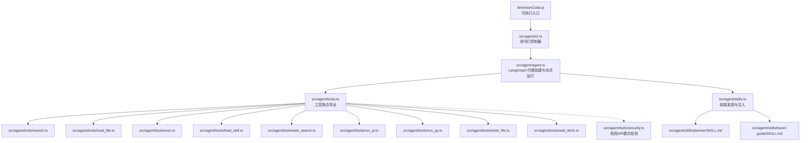
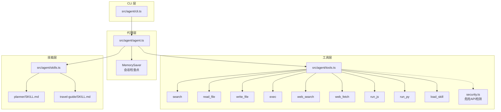
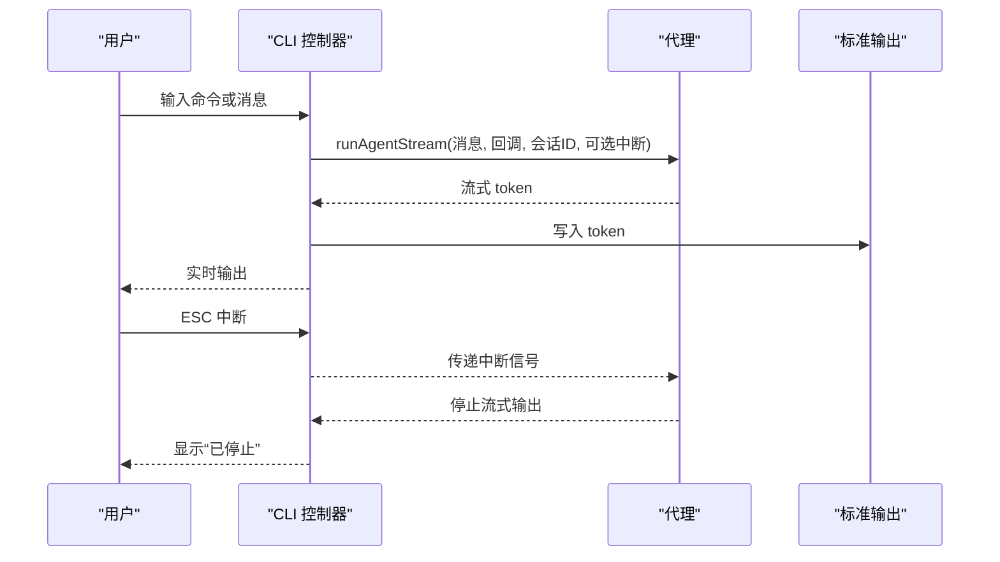
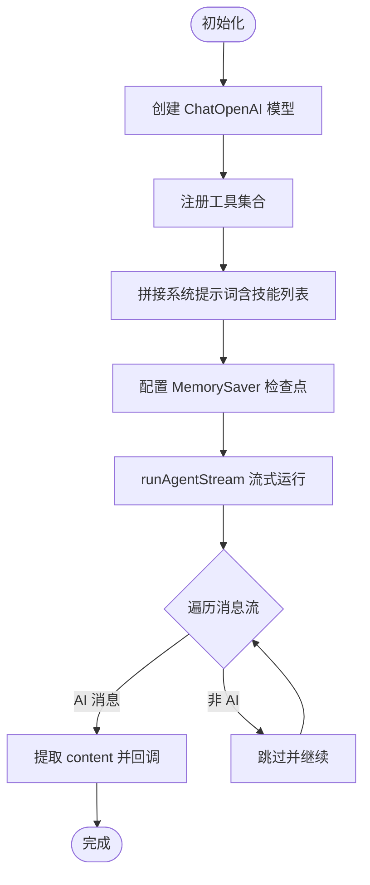
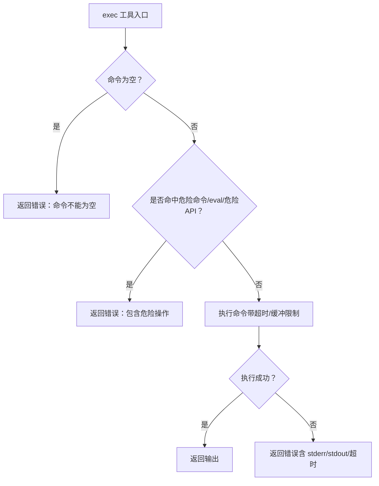
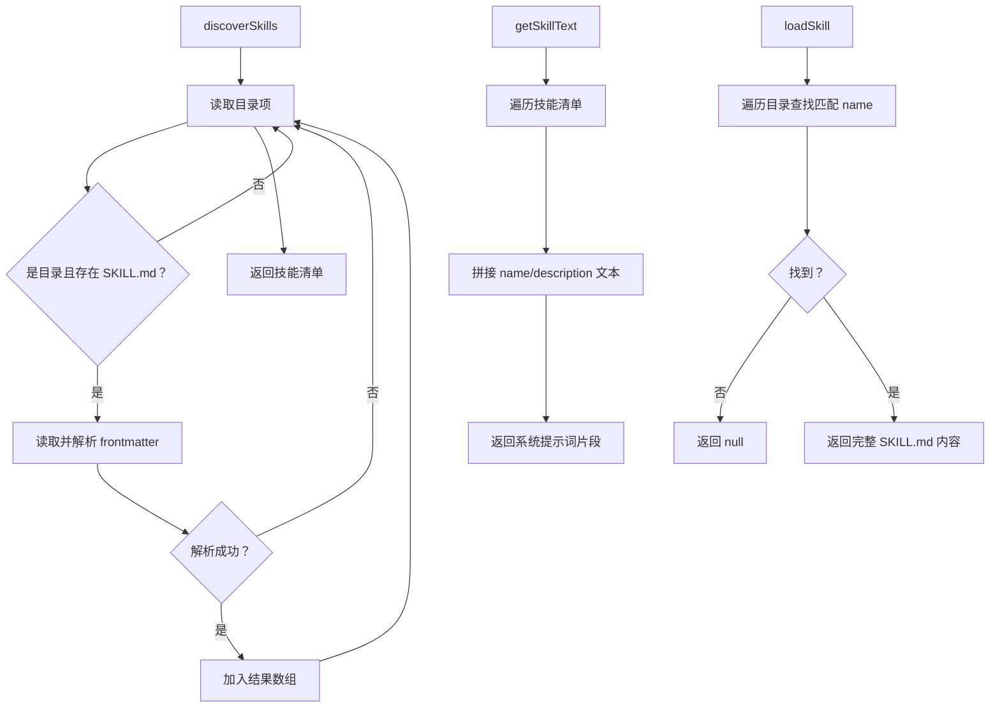
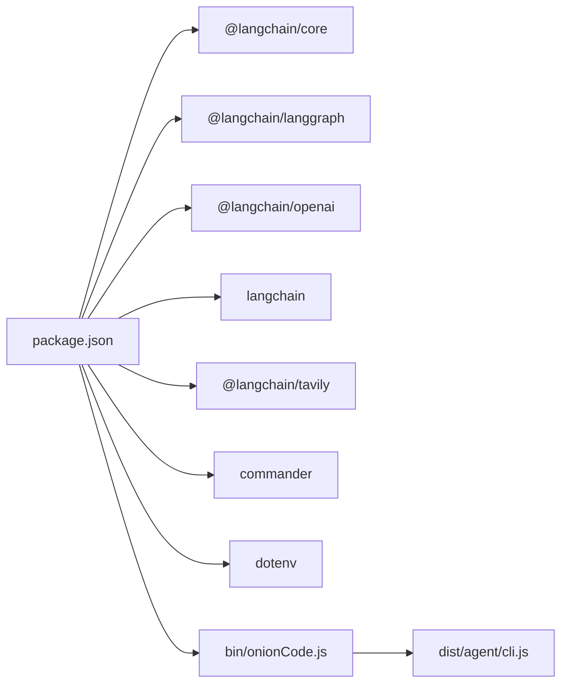

# 项目概述

<cite>
**本文引用的文件**
- [package.json](file://package.json)
- [bin/onionCode.js](file://bin/onionCode.js)
- [src/agent/cli.ts](file://src/agent/cli.ts)
- [src/agent/agent.ts](file://src/agent/agent.ts)
- [src/agent/tools.ts](file://src/agent/tools.ts)
- [src/agent/skills.ts](file://src/agent/skills.ts)
- [src/agent/tools/search.ts](file://src/agent/tools/search.ts)
- [src/agent/tools/read_file.ts](file://src/agent/tools/read_file.ts)
- [src/agent/tools/exec.ts](file://src/agent/tools/exec.ts)
- [src/agent/tools/load_skill.ts](file://src/agent/tools/load_skill.ts)
- [src/agent/tools/security.ts](file://src/agent/tools/security.ts)
- [src/agent/tools/web_search.ts](file://src/agent/tools/web_search.ts)
- [src/agent/tools/run_js.ts](file://src/agent/tools/run_js.ts)
- [src/agent/tools/run_py.ts](file://src/agent/tools/run_py.ts)
- [src/agent/tools/write_file.ts](file://src/agent/tools/write_file.ts)
- [src/agent/tools/web_fetch.ts](file://src/agent/tools/web_fetch.ts)
- [src/agent/skills/planner/SKILL.md](file://src/agent/skills/planner/SKILL.md)
- [src/agent/skills/travel-guide/SKILL.md](file://src/agent/skills/travel-guide/SKILL.md)
</cite>

## 目录
1. [简介](#简介)
2. [项目结构](#项目结构)
3. [核心组件](#核心组件)
4. [架构总览](#架构总览)
5. [详细组件分析](#详细组件分析)
6. [依赖分析](#依赖分析)
7. [性能考虑](#性能考虑)
8. [故障排除指南](#故障排除指南)
9. [结论](#结论)
10. [附录](#附录)

## 简介
Onion Code CLI AI 代理系统是一个面向命令行环境的智能体平台，基于 LangChain 生态构建，具备强大的工具调用能力与可扩展的“技能”体系。它通过统一的 CLI 接口提供两种交互模式：单轮问答与持续对话，并支持内存会话、流式输出、ESC 中断、错误分类提示等功能。系统内置多种工具，涵盖文件读写、终端命令执行、在线检索与网页抓取、脚本运行（JS/Python）、技能加载等，既能满足日常开发与办公自动化场景，又可通过“技能”机制实现领域化的专家级指导。

- 核心价值主张
  - 开箱即用：一键安装并通过 CLI 使用，无需复杂配置。
  - 工具完备：覆盖本地文件、系统命令、网络检索与执行、脚本运行等常用能力。
  - 安全可控：多层安全策略（路径白名单、危险命令/API黑名单、eval模式阻断、超时与缓冲限制）。
  - 可扩展技能：通过“技能”目录与 SKILL.md 前言元数据，动态注入系统提示词，实现领域化增强。
  - 流式体验：支持流式输出与中断，适合 CLI 场景下的即时反馈。

- 目标用户群体
  - 开发者与工程师：自动化脚本、文件处理、命令执行、在线查询、数据处理。
  - 办公人员：任务规划、行程安排、信息整理与报告生成。
  - 学习者与研究者：基于检索与网页抓取的信息收集与整理。

- 技术选型决策
  - LangChain 生态：采用 LangGraph 作为代理编排框架，结合 MemorySaver 实现轻量内存检查点；ChatOpenAI 作为推理模型，支持流式输出。
  - 工具封装：统一使用 Zod Schema 校验工具输入，提升健壮性与可维护性。
  - 安全策略：分层设计（命令名黑名单、eval模式、危险API模式），并配合超时与缓冲限制，降低风险面。
  - 技能体系：通过解析 SKILL.md 前言元数据，动态注入可用技能列表，提升系统灵活性。

- 与其他类似工具的差异化优势
  - CLI 优先：专注于命令行交互体验，提供 ESC 中断、流式输出、错误友好提示等。
  - 技能驱动：通过“技能”机制实现领域化增强，无需硬编码逻辑即可扩展能力边界。
  - 安全优先：在工具层面实施多维度安全策略，兼顾易用性与安全性。
  - 可观测性：工具调用日志与错误分类提示，便于排查与改进。

## 项目结构
项目采用“入口脚本 → CLI 控制器 → 代理与工具 → 技能体系”的分层组织方式，核心文件如下：

图表来源
- [bin/onionCode.js:1-3](file://bin/onionCode.js#L1-L3)
- [src/agent/cli.ts:1-126](file://src/agent/cli.ts#L1-L126)
- [src/agent/agent.ts:1-98](file://src/agent/agent.ts#L1-L98)
- [src/agent/tools.ts:1-10](file://src/agent/tools.ts#L1-L10)
- [src/agent/tools/search.ts:1-24](file://src/agent/tools/search.ts#L1-L24)
- [src/agent/tools/read_file.ts:1-41](file://src/agent/tools/read_file.ts#L1-L41)
- [src/agent/tools/exec.ts:1-143](file://src/agent/tools/exec.ts#L1-L143)
- [src/agent/tools/load_skill.ts:1-34](file://src/agent/tools/load_skill.ts#L1-L34)
- [src/agent/tools/web_search.ts:1-41](file://src/agent/tools/web_search.ts#L1-L41)
- [src/agent/tools/run_js.ts:1-90](file://src/agent/tools/run_js.ts#L1-L90)
- [src/agent/tools/run_py.ts:1-90](file://src/agent/tools/run_py.ts#L1-L90)
- [src/agent/tools/write_file.ts:1-55](file://src/agent/tools/write_file.ts#L1-L55)
- [src/agent/tools/web_fetch.ts:1-83](file://src/agent/tools/web_fetch.ts#L1-L83)
- [src/agent/tools/security.ts:1-27](file://src/agent/tools/security.ts#L1-L27)
- [src/agent/skills.ts:1-139](file://src/agent/skills.ts#L1-L139)
- [src/agent/skills/planner/SKILL.md:1-91](file://src/agent/skills/planner/SKILL.md#L1-L91)
- [src/agent/skills/travel-guide/SKILL.md:1-105](file://src/agent/skills/travel-guide/SKILL.md#L1-L105)

章节来源
- [package.json:1-38](file://package.json#L1-L38)
- [bin/onionCode.js:1-3](file://bin/onionCode.js#L1-L3)
- [src/agent/cli.ts:1-126](file://src/agent/cli.ts#L1-L126)
- [src/agent/agent.ts:1-98](file://src/agent/agent.ts#L1-L98)
- [src/agent/tools.ts:1-10](file://src/agent/tools.ts#L1-L10)
- [src/agent/skills.ts:1-139](file://src/agent/skills.ts#L1-L139)

## 核心组件
- CLI 入口与控制器
  - 可执行入口负责加载构建产物；CLI 控制器提供“ask 单轮问答”和“默认交互式聊天”两种模式，支持 ESC 中断、错误分类提示与流式输出。
- 代理与内存
  - 基于 LangGraph 创建代理，注册工具集合，启用 MemorySaver 实现会话记忆；通过流式接口逐 token 输出，支持线程标识续写历史。
- 工具集
  - 文件读写：安全路径校验与危险API检测。
  - 命令执行：危险命令黑名单、eval模式阻断、超时与缓冲限制。
  - 在线检索与抓取：Tavily 搜索与网页抓取，含超时与大小限制。
  - 脚本运行：JS/Python 临时文件执行，危险API检测与超时控制。
  - 技能加载：根据 SKILL.md 前言元数据发现与加载技能内容。
- 技能体系
  - 通过解析 SKILL.md 前言元数据，动态注入“可用技能”列表到系统提示词，支持领域化增强。

章节来源
- [bin/onionCode.js:1-3](file://bin/onionCode.js#L1-L3)
- [src/agent/cli.ts:1-126](file://src/agent/cli.ts#L1-L126)
- [src/agent/agent.ts:1-98](file://src/agent/agent.ts#L1-L98)
- [src/agent/tools.ts:1-10](file://src/agent/tools.ts#L1-L10)
- [src/agent/skills.ts:1-139](file://src/agent/skills.ts#L1-L139)

## 架构总览
系统采用“CLI → 代理 → 工具 → 技能”的分层架构，LangGraph 作为核心编排引擎，工具通过 LangChain 的工具抽象进行声明与调用，技能通过文件系统扫描与注入增强系统提示词。

图表来源
- [src/agent/cli.ts:1-126](file://src/agent/cli.ts#L1-L126)
- [src/agent/agent.ts:1-98](file://src/agent/agent.ts#L1-L98)
- [src/agent/tools.ts:1-10](file://src/agent/tools.ts#L1-L10)
- [src/agent/tools/security.ts:1-27](file://src/agent/tools/security.ts#L1-L27)
- [src/agent/skills.ts:1-139](file://src/agent/skills.ts#L1-L139)
- [src/agent/skills/planner/SKILL.md:1-91](file://src/agent/skills/planner/SKILL.md#L1-L91)
- [src/agent/skills/travel-guide/SKILL.md:1-105](file://src/agent/skills/travel-guide/SKILL.md#L1-L105)

## 详细组件分析

### CLI 控制器（命令行交互）
- 功能要点
  - 支持“ask <message...>”单轮问答与默认交互式聊天。
  - ESC 键中断流式输出，提供用户可中断的体验。
  - 错误分类提示：针对内容安全、认证失败、配额不足、网络超时等情况给出明确指引。
  - 流式输出：将代理返回的 token 逐个写入标准输出，保证即时反馈。
- 关键流程
  - 解析命令参数与子命令，进入相应分支。
  - 交互式聊天循环：读取用户输入，调用代理流式执行，处理异常与中断。
  - 单轮问答：直接调用代理流式执行并输出结果。

图表来源
- [src/agent/cli.ts:66-125](file://src/agent/cli.ts#L66-L125)
- [src/agent/agent.ts:61-97](file://src/agent/agent.ts#L61-L97)

章节来源
- [src/agent/cli.ts:1-126](file://src/agent/cli.ts#L1-L126)

### 代理与内存（LangGraph）
- 功能要点
  - 使用 ChatOpenAI 作为推理模型，支持自定义 base URL（示例 DeepSeek），开启流式输出。
  - 注册工具集合，包括搜索、文件读写、命令执行、在线检索/抓取、脚本运行、技能加载等。
  - MemorySaver 作为检查点，通过 thread_id 维护会话历史。
  - 提供 runAgentStream 方法，按消息流式消费 AI 输出，跳过非 AI 消息与工具调用片段。
- 关键流程
  - 初始化模型与检查点。
  - 创建代理并注入工具与系统提示词（含技能列表）。
  - 流式运行：遍历消息流，提取 content 并回调给 CLI。

图表来源
- [src/agent/agent.ts:26-51](file://src/agent/agent.ts#L26-L51)
- [src/agent/agent.ts:61-97](file://src/agent/agent.ts#L61-L97)

章节来源
- [src/agent/agent.ts:1-98](file://src/agent/agent.ts#L1-L98)

### 工具体系（安全与能力）
- 文件读写
  - 路径安全：仅允许当前工作目录内的相对路径，防止越界访问。
  - 内容安全：禁止危险API模式（来自 shared security 模块）。
- 命令执行
  - 命令名黑名单：覆盖 rm、mv、cp、sudo、chmod、kill 等高危命令。
  - eval 模式阻断：识别 node -e、python -c 等注入模式。
  - 危险API检测：共享模块扫描潜在破坏性调用。
  - 超时与缓冲限制：30 秒超时与最大输出缓冲，避免长时间占用。
- 在线检索与抓取
  - Tavily 搜索：需设置 TAVILY_API_KEY，限制结果数量与主题。
  - 网页抓取：URL 校验（仅 http/https）、超时与响应大小限制。
- 脚本运行（JS/Python）
  - 临时文件执行：规避命令行转义问题，执行后清理。
  - 危险API检测与超时控制：15 秒超时与缓冲限制。
- 技能加载
  - 发现与校验：先验证技能是否存在，再加载完整内容。
  - 友好错误：列出可用技能，便于用户选择。

图表来源
- [src/agent/tools/exec.ts:94-142](file://src/agent/tools/exec.ts#L94-L142)
- [src/agent/tools/security.ts:24-26](file://src/agent/tools/security.ts#L24-L26)

章节来源
- [src/agent/tools/read_file.ts:1-41](file://src/agent/tools/read_file.ts#L1-L41)
- [src/agent/tools/write_file.ts:1-55](file://src/agent/tools/write_file.ts#L1-L55)
- [src/agent/tools/exec.ts:1-143](file://src/agent/tools/exec.ts#L1-L143)
- [src/agent/tools/web_search.ts:1-41](file://src/agent/tools/web_search.ts#L1-L41)
- [src/agent/tools/web_fetch.ts:1-83](file://src/agent/tools/web_fetch.ts#L1-L83)
- [src/agent/tools/run_js.ts:1-90](file://src/agent/tools/run_js.ts#L1-L90)
- [src/agent/tools/run_py.ts:1-90](file://src/agent/tools/run_py.ts#L1-L90)
- [src/agent/tools/load_skill.ts:1-34](file://src/agent/tools/load_skill.ts#L1-L34)
- [src/agent/tools/security.ts:1-27](file://src/agent/tools/security.ts#L1-L27)

### 技能体系（动态增强）
- 功能要点
  - 发现：扫描 skills 目录，解析每个子目录的 SKILL.md 前言元数据（name/description）。
  - 注入：将可用技能列表拼接为系统提示词的一部分，供代理在对话中使用。
  - 加载：根据技能名加载完整内容，供代理在需要时调用工具加载。
- 关键流程
  - discoverSkills：遍历目录，读取 SKILL.md，解析 frontmatter，返回技能清单。
  - getSkillText：拼接技能列表文本，注入系统提示词。
  - loadSkill：按名称查找并返回完整内容。

图表来源
- [src/agent/skills.ts:53-84](file://src/agent/skills.ts#L53-L84)
- [src/agent/skills.ts:127-138](file://src/agent/skills.ts#L127-L138)
- [src/agent/skills.ts:91-119](file://src/agent/skills.ts#L91-L119)

章节来源
- [src/agent/skills.ts:1-139](file://src/agent/skills.ts#L1-L139)
- [src/agent/skills/planner/SKILL.md:1-91](file://src/agent/skills/planner/SKILL.md#L1-L91)
- [src/agent/skills/travel-guide/SKILL.md:1-105](file://src/agent/skills/travel-guide/SKILL.md#L1-L105)

## 依赖分析
- 运行时依赖
  - LangChain 生态：@langchain/core、@langchain/langgraph、@langchain/openai、langchain、@langchain/tavily。
  - CLI 与环境：commander（命令行解析）、dotenv（环境变量加载）。
- 开发依赖
  - TypeScript 编译与测试：typescript、ts-node、tsx、vitest。
- 二进制入口
  - package.json 的 bin 字段将可执行文件映射到 dist/agent/cli.js，实际由 bin/onionCode.js 载入。

图表来源
- [package.json:20-29](file://package.json#L20-L29)
- [package.json:8-10](file://package.json#L8-L10)
- [bin/onionCode.js:1-3](file://bin/onionCode.js#L1-L3)

章节来源
- [package.json:1-38](file://package.json#L1-L38)
- [bin/onionCode.js:1-3](file://bin/onionCode.js#L1-L3)

## 性能考虑
- 流式输出
  - 代理端启用 streaming，CLI 端逐 token 输出，降低首字延迟，提升交互体验。
- 超时与缓冲
  - 命令执行与脚本运行设置超时与最大缓冲，避免长时间占用与内存膨胀。
- 检查点与会话
  - MemorySaver 仅保存必要状态，避免重复计算与冗余存储。
- 工具调用开销
  - 文件读写与网络请求均有限制（大小、协议、超时），减少 IO 与网络抖动带来的影响。
- 建议
  - 对于大文件或长耗时任务，建议拆分为多步并结合技能与工具组合，避免单次调用超时。
  - 合理使用 ESC 中断，及时终止不必要任务。

## 故障排除指南
- 常见错误与处理
  - 内容安全拦截：提示“内容安全审查拦截”，建议换种问法或简化查询。
  - API Key/认证失败：提示检查 OPENAI_API_KEY 或账号状态。
  - 配额不足/429：提示检查账户余额与限额。
  - 网络超时：提示检查网络连接后重试。
  - 文件越界/目录错误：确保路径在当前工作目录内，且目标为文件。
  - 危险命令/eval/危险API：被安全策略拦截，建议改用安全替代方案。
  - Tavily API Key 缺失：提示设置 TAVILY_API_KEY。
  - URL 无效/过大/超时：检查 URL 协议与大小限制。
- 排查步骤
  - 确认环境变量已正确加载（OPENAI_API_KEY、TAVILY_API_KEY）。
  - 检查工作目录与文件路径，避免越界访问。
  - 查看工具调用日志（控制台打印）定位问题来源。
  - 使用 ask 单轮模式快速验证工具可用性。

章节来源
- [src/agent/cli.ts:11-38](file://src/agent/cli.ts#L11-L38)
- [src/agent/tools/read_file.ts:17-31](file://src/agent/tools/read_file.ts#L17-L31)
- [src/agent/tools/exec.ts:100-109](file://src/agent/tools/exec.ts#L100-L109)
- [src/agent/tools/web_search.ts:20-23](file://src/agent/tools/web_search.ts#L20-L23)
- [src/agent/tools/web_fetch.ts:26-28](file://src/agent/tools/web_fetch.ts#L26-L28)

## 结论
Onion Code CLI AI 代理系统通过 LangGraph 与工具链的有机结合，提供了在命令行环境下稳定、安全、可扩展的智能体体验。其多层安全策略、流式交互与技能体系，使其既能满足日常办公与开发自动化需求，又能通过领域化技能实现更专业的辅助能力。对于初学者，CLI 的简洁入口与错误提示降低了上手门槛；对于有经验的开发者，工具抽象、检查点与流式输出为二次开发与集成提供了坚实基础。

## 附录
- 安装与运行
  - 安装：使用包管理器安装后，可通过 onionCode 命令启动。
  - 开发调试：使用 dev 脚本直接运行源码；生产运行：使用 start 脚本运行构建产物。
  - 构建：build 脚本编译 TypeScript 并复制技能资源到 dist。
- 环境变量
  - OPENAI_API_KEY：推理模型密钥。
  - OPENAI_MODEL：模型名称（默认示例值）。
  - OPENAI_BASE_URL：推理模型基础地址（示例 DeepSeek）。
  - TAVILY_API_KEY：Tavily 搜索密钥（可选）。

章节来源
- [package.json:11-16](file://package.json#L11-L16)
- [src/agent/agent.ts:26-33](file://src/agent/agent.ts#L26-L33)
- [src/agent/web_search.ts:5-14](file://src/agent/web_search.ts#L5-L14)